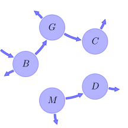
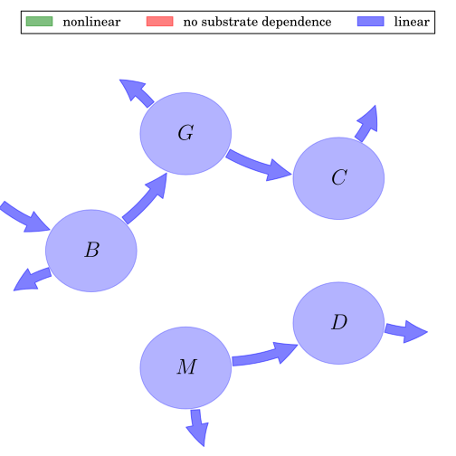

# General Overview

 

This report is the result of the use of the Python 3.4 package Sympy (for symbolic mathematics), as means to translate published models to a common language. It was created by Carlos Sierra (Orcid ID: 0000-0003-0009-4169) on 13/04/2016, and was last modified on _lm_.

## About the model
The model depicted in this document considers soil organic matter decomposition. It was originally described by @Parton1987SoilScienceSocietyofAmericaJournal.  

### Abstract
This is a fake model to produce a logo

### Keywords
differential equations, time variant

### Principles
mass balance, substrate dependence of decomposition, heterogeneity of speed of decay, internal transformations of organic matter, environmental variability effects

# State Variables
The following table contains the available information regarding this section:

Name|Description
:-----:|:-----
$B$|Bio
$G$|geo
$C$|chemistry
$M$|Model
$D$|Database

Table: Information on State Variables

# Decomposition Rates
The following table contains the available information regarding this section:

Name|Description|Type
:-----:|:-----|:-----:
$k_{1}$|decomposition rate of structural soil surface litter|parameter
$k_{2}$|decomposition rate of structural soil surface litter|parameter
$k_{3}$|decomposition rate of structural soil surface litter|parameter
$k_{4}$|decomposition rate of structural soil litter|parameter
$k_{5}$|decomposition rate of active soil organic matter|parameter

Table: Information on Decomposition Rates

# Input Components
The following table contains the available information regarding this section:

Name|Description|Type
:-----:|:-----|:-----:
$I_{1}$|organic matter input to surface|parameter
$I_{2}$|organic matter input to soil|parameter
$I_{3}$|organic matter input to soil|parameter
$I_{4}$|organic matter input to soil|parameter
$I_{5}$|organic matter input to soil|parameter

Table: Information on Input Components

# Components
The following table contains the available information regarding this section:

Name|Description|Expressions
:-----:|:-----|:-----:
$X$|carbon content|$X=\left[\begin{matrix}B\\G\\C\\D\\M\end{matrix}\right]$
$I$|input vector|$I=\left[\begin{matrix}I_{1}\\0\\0\\0\\0\end{matrix}\right]$
$A$|decomposition operator|$A=\left[\begin{matrix}- k_{1} & 0 & 0 & 0 & 0\\1 & - k_{2} & 0 & 0 & 0\\0 & 1 & - k_{3} & 0 & 0\\0 & 0 & 0 & - k_{4} & 1\\0 & 0 & 0 & 0 & - k_{5}\end{matrix}\right]$
$f_{s}$|the right hand side of the ode|$f_{s}=I+A\,X$

Table: Information on Components

## Pool model representation
<table><thead><tr><th></th><th>Flux description</th></tr></thead><tbody><tr><td align=center, style='vertical-align: middle'>
 

 **Figure 1:** *Pool model representation* 

</td><td align=left style='vertical-align: middle'>
#### Input fluxes
$B: I_{1}$  

#### Output fluxes
$B: B\cdot\left(k_{1} - 1\right)$  $G: G\cdot\left(k_{2} - 1\right)$  $C: C\cdot k_{3}$  $M: D\cdot k_{4}$  $D: M\cdot\left(k_{5} - 1\right)$  

#### Internal fluxes
$B > G: B$  $G > C: G$  $D > M: M$  </td></tr></tbody></table>
## The right hand side of the ODE
$\left[\begin{matrix}- B\cdot k_{1} + I_{1}\\B - G\cdot k_{2}\\- C\cdot k_{3} + G\\- D\cdot k_{4} + M\\- M\cdot k_{5}\end{matrix}\right]$

## The Jacobian (derivative of the ODE w.r.t. state variables)
$\left[\begin{matrix}- k_{1} & 0 & 0 & 0 & 0\\1 & - k_{2} & 0 & 0 & 0\\0 & 1 & - k_{3} & 0 & 0\\0 & 0 & 0 & - k_{4} & 1\\0 & 0 & 0 & 0 & - k_{5}\end{matrix}\right]$

## Steady state formulas
$B = \frac{I_{1}}{k_{1}}$  $G = \frac{I_{1}}{k_{1}\cdot k_{2}}$  $C = \frac{I_{1}}{k_{1}\cdot k_{2}\cdot k_{3}}$  $D = 0$  $M = 0$    

# References
