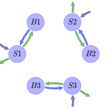
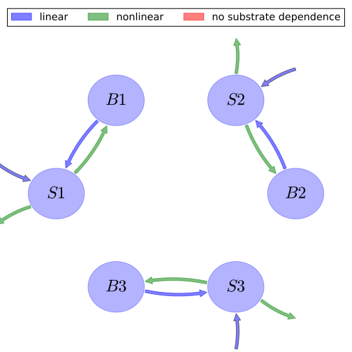

# General Overview

 

This report is the result of the use of the Python 3.4 package Sympy (for symbolic mathematics), as means to translate published models to a common language. It was created by Carlos Sierra (Orcid ID: 0000-0003-0009-4169) on 13/04/2016, and was last modified on _lm_.

## About the model
The model depicted in this document considers soil organic matter decomposition. It was originally described by @Wang2013EcologicalApplications.  

### Abstract
This is a simple model used to represent the flexibility of the General Model

### Principles
mass balance, substrate dependence of decomposition, heterogeneity of speed of decay, internal transformations of organic matter, substrate interactions

# State Variables
The following table contains the available information regarding this section:

Name|Description|Units
:-----:|:-----|:-----:
$S_{1}$|Substrate 1|$mgC g^{-1}\text{ soil}$
$B_{1}$|Microbial biomass guild 1|$mgC g^{-1}\text{ soil}$
$S_{2}$|Substrate 2|$mgC g^{-1}\text{ soil}$
$B_{2}$|microbial biomass guild 2|$mgC g^{-1}\text{ soil}$
$S_{3}$|Substrate 3|$mgC g^{-1}\text{ soil}$
$B_{3}$|Microbial biomass guild 3|$mgC g^{-1}\text{ soil}$

Table: Information on State Variables

# Parameters
The following table contains the available information regarding this section:

Name|Description|Type|Units
:-----:|:-----|:-----:|:-----:
$k_{s1}$|Decomposition rate of substrate 1|parameter|$m^{3} d^{-1} g^{-1}$
$k_{s2}$|Decomposition rate of substrate 2|parameter|$m^{3} d^{-1} g^{-1}$
$k_{s3}$|Decomposition rate of substrate 3|parameter|$m^{3} d^{-1} g^{-1}$
$k_{b1}$|Microbial decay rate guild 1|parameter|$d^{-1}$
$k_{b2}$|Microbial decay rate guild 2|parameter|$d^{-1}$
$k_{b3}$|Microbial decay rate guild 3|parameter|$d^{-1}$
$r_{1}$|respired C fraction 1|parameter|-
$r_{2}$|respired C fraction 2|parameter|-
$r_{3}$|respired C fraction 3|parameter|-
$K_{M1}$|Michaelis-Menten constant 1|parameter|$g m^{-3}$
$K_{M2}$|Michaelis-Menten constant 2|parameter|$g m^{-3}$
$K_{M3}$|Michaelis-Menten constant 3|parameter|$g m^{-3}$

Table: Information on Parameters

# Input Components
The following table contains the available information regarding this section:

Name|Description|Type|Units
:-----:|:-----|:-----:|:-----:
$I_{1}$|input to substrate 1|parameter|$g m^{-3} d^{-1}$
$I_{2}$|input to substrate 2|parameter|$g m^{-3} d^{-1}$
$I_{3}$|input to substrate 3|parameter|$g m^{-3} d^{-1}$

Table: Information on Input Components

# Components
The following table contains the available information regarding this section:

Name|Description|Expressions|key
:-----:|:-----|:-----:|:-----:
$C$|carbon content|$C=\left[\begin{matrix}S_{1}\\B_{1}\\S_{2}\\B_{2}\\S_{3}\\B_{3}\end{matrix}\right]$|state_vector
$I$|input vector|$I=\left[\begin{matrix}I_{1}\\0\\I_{2}\\0\\I_{3}\\0\end{matrix}\right]$|input_vector
$T$|transition operator|$T=\left[\begin{matrix}-1 & 1 & 0 & 0 & 0 & 0\\- r_{1} + 1 & -1 & 0 & 0 & 0 & 0\\0 & 0 & -1 & 1 & 0 & 0\\0 & 0 & - r_{2} + 1 & -1 & 0 & 0\\0 & 0 & 0 & 0 & -1 & 1\\0 & 0 & 0 & 0 & - r_{3} + 1 & -1\end{matrix}\right]$|trans_op
$N$|decomposition operator|$N=\left[\begin{matrix}\frac{B_{1}\cdot k_{s1}}{K_{M1} + S_{1}} & 0 & 0 & 0 & 0 & 0\\0 & k_{b1} & 0 & 0 & 0 & 0\\0 & 0 &\frac{B_{2}\cdot k_{s2}}{K_{M2} + S_{2}} & 0 & 0 & 0\\0 & 0 & 0 & k_{b2} & 0 & 0\\0 & 0 & 0 & 0 &\frac{B_{2}\cdot k_{s2}}{K_{M2} + S_{2}} & 0\\0 & 0 & 0 & 0 & 0 & k_{b3}\end{matrix}\right]$|decomp_op_nonlin
$f_{s}$|the right hand side of the ode|$f_{s}=I+T\cdot N\cdot C$|state_vector_derivative

Table: Information on Components

## Pool model representation
<table><thead><tr><th></th><th>Flux description</th></tr></thead><tbody><tr><td align=center, style='vertical-align: middle'>
 

 **Figure 1:** *Pool model representation* 

</td><td align=left style='vertical-align: middle'>
#### Input fluxes
$S1: I_{1}$  $S2: I_{2}$  $S3: I_{3}$  

#### Output fluxes
$S1: \frac{B_{1}\cdot S_{1}\cdot k_{s1}}{K_{M1} + S_{1}}\cdot r_{1}$  $S2: \frac{B_{2}\cdot S_{2}\cdot k_{s2}}{K_{M2} + S_{2}}\cdot r_{2}$  $S3: \frac{B_{2}\cdot S_{3}\cdot k_{s2}}{K_{M2} + S_{2}}\cdot r_{3}$  

#### Internal fluxes
$S1 > B1: -\frac{B_{1}\cdot S_{1}\cdot k_{s1}}{K_{M1} + S_{1}}\cdot\left(r_{1} - 1\right)$  $B1 > S1: B_{1}\cdot k_{b1}$  $S2 > B2: -\frac{B_{2}\cdot S_{2}\cdot k_{s2}}{K_{M2} + S_{2}}\cdot\left(r_{2} - 1\right)$  $B2 > S2: B_{2}\cdot k_{b2}$  $S3 > B3: -\frac{B_{2}\cdot S_{3}\cdot k_{s2}}{K_{M2} + S_{2}}\cdot\left(r_{3} - 1\right)$  $B3 > S3: B_{3}\cdot k_{b3}$  </td></tr></tbody></table>
## The right hand side of the ODE
$\left[\begin{matrix}-\frac{B_{1}\cdot S_{1}\cdot k_{s1}}{K_{M1} + S_{1}} + B_{1}\cdot k_{b1} + I_{1}\\\frac{B_{1}\cdot S_{1}\cdot k_{s1}}{K_{M1} + S_{1}}\cdot\left(- r_{1} + 1\right) - B_{1}\cdot k_{b1}\\-\frac{B_{2}\cdot S_{2}\cdot k_{s2}}{K_{M2} + S_{2}} + B_{2}\cdot k_{b2} + I_{2}\\\frac{B_{2}\cdot S_{2}\cdot k_{s2}}{K_{M2} + S_{2}}\cdot\left(- r_{2} + 1\right) - B_{2}\cdot k_{b2}\\-\frac{B_{2}\cdot S_{3}\cdot k_{s2}}{K_{M2} + S_{2}} + B_{3}\cdot k_{b3} + I_{3}\\\frac{B_{2}\cdot S_{3}\cdot k_{s2}}{K_{M2} + S_{2}}\cdot\left(- r_{3} + 1\right) - B_{3}\cdot k_{b3}\end{matrix}\right]$

## The Jacobian (derivative of the ODE w.r.t. state variables)
$\left[\begin{matrix}\frac{B_{1}\cdot S_{1}\cdot k_{s1}}{\left(K_{M1} + S_{1}\right)^{2}} -\frac{B_{1}\cdot k_{s1}}{K_{M1} + S_{1}} & -\frac{S_{1}\cdot k_{s1}}{K_{M1} + S_{1}} + k_{b1} & 0 & 0 & 0 & 0\\-\frac{B_{1}\cdot S_{1}\cdot k_{s1}}{\left(K_{M1} + S_{1}\right)^{2}}\cdot\left(- r_{1} + 1\right) +\frac{B_{1}\cdot k_{s1}}{K_{M1} + S_{1}}\cdot\left(- r_{1} + 1\right) &\frac{S_{1}\cdot k_{s1}}{K_{M1} + S_{1}}\cdot\left(- r_{1} + 1\right) - k_{b1} & 0 & 0 & 0 & 0\\0 & 0 &\frac{B_{2}\cdot S_{2}\cdot k_{s2}}{\left(K_{M2} + S_{2}\right)^{2}} -\frac{B_{2}\cdot k_{s2}}{K_{M2} + S_{2}} & -\frac{S_{2}\cdot k_{s2}}{K_{M2} + S_{2}} + k_{b2} & 0 & 0\\0 & 0 & -\frac{B_{2}\cdot S_{2}\cdot k_{s2}}{\left(K_{M2} + S_{2}\right)^{2}}\cdot\left(- r_{2} + 1\right) +\frac{B_{2}\cdot k_{s2}}{K_{M2} + S_{2}}\cdot\left(- r_{2} + 1\right) &\frac{S_{2}\cdot k_{s2}}{K_{M2} + S_{2}}\cdot\left(- r_{2} + 1\right) - k_{b2} & 0 & 0\\0 & 0 &\frac{B_{2}\cdot S_{3}\cdot k_{s2}}{\left(K_{M2} + S_{2}\right)^{2}} & -\frac{S_{3}\cdot k_{s2}}{K_{M2} + S_{2}} & -\frac{B_{2}\cdot k_{s2}}{K_{M2} + S_{2}} & k_{b3}\\0 & 0 & -\frac{B_{2}\cdot S_{3}\cdot k_{s2}}{\left(K_{M2} + S_{2}\right)^{2}}\cdot\left(- r_{3} + 1\right) &\frac{S_{3}\cdot k_{s2}}{K_{M2} + S_{2}}\cdot\left(- r_{3} + 1\right) &\frac{B_{2}\cdot k_{s2}}{K_{M2} + S_{2}}\cdot\left(- r_{3} + 1\right) & - k_{b3}\end{matrix}\right]$

# References
