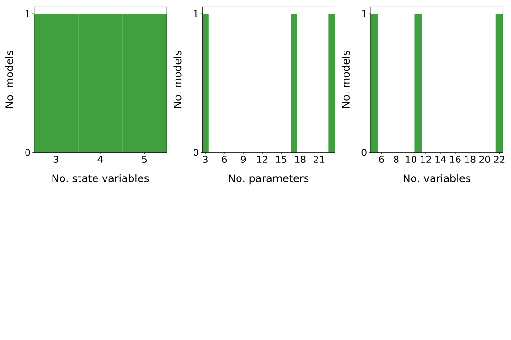
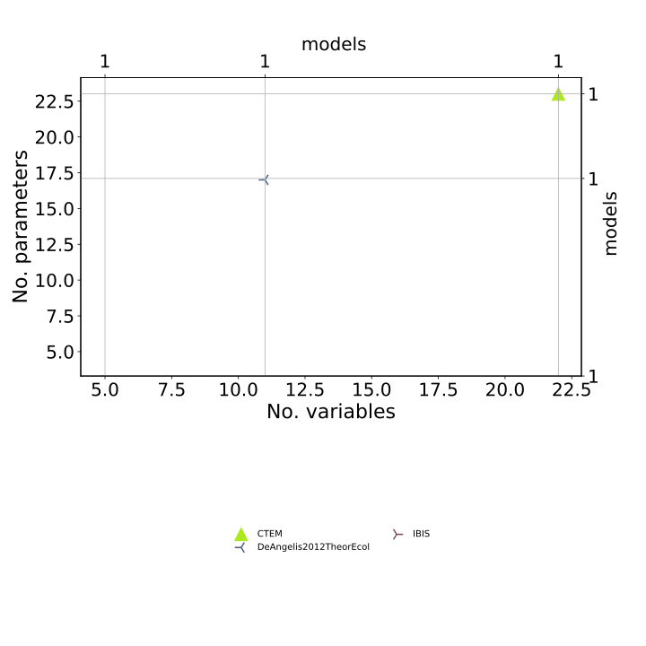
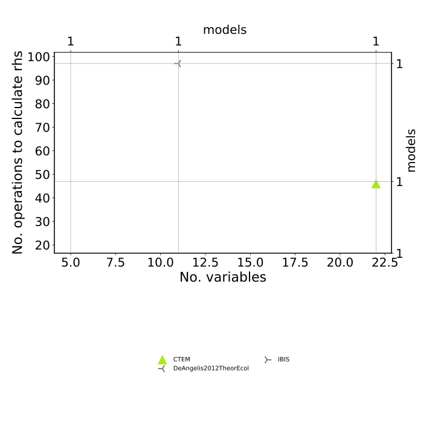
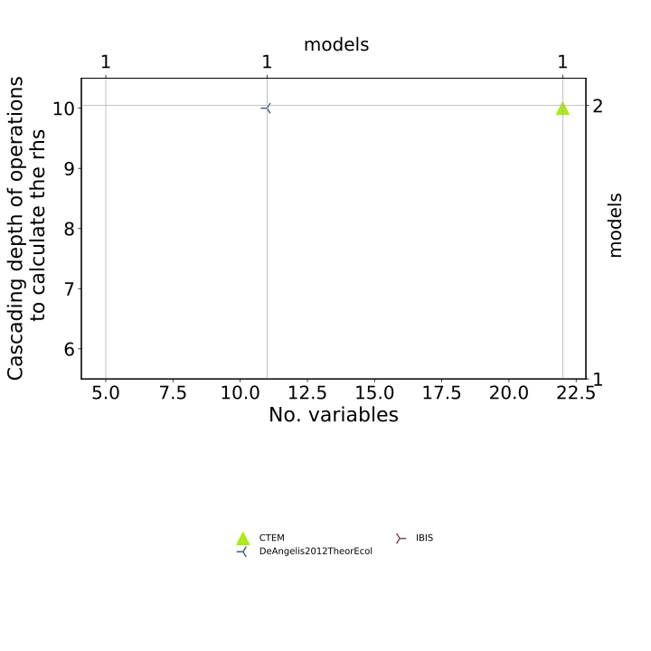
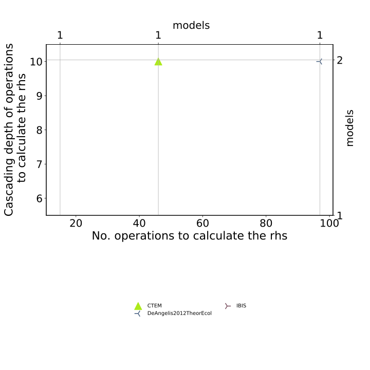
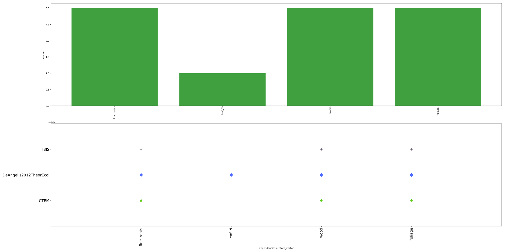
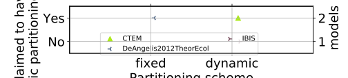
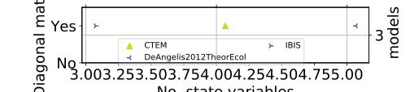

  
  
Model|# State variables|Partitioning of photosynthetic input|C exchange between compartments?|Structure|Source  
:-----|:-----|:-----|:-----:|:-----  
[CTEM](Arora2005GCB-1/Report.html)|$4$|dynamic|$\mathrm{True}$|$f_{v}=u+A\cdot x$|@Arora2005GlobalChangeBiology  
[DeAngelis2012TheorEcol](DeAngelis2012TheorEcol/Report.html)|$5$|fixed|$\mathrm{True}$|$f_{v}=u\cdot b+A\cdot x$|@DeAngelis2011TheoreticalEcology  
[IBIS](Castanho2013Biogeosciences/Report.html)|$3$|dynamic|$\mathrm{True}$|$f_{v}=u\cdot b+A\cdot x$|@Castanho2013Biogeosciences  
  Table: Summary of the models in the database of Carbon Allocation in Vegetation models  
  

 

 **Figure 1:** *Histograms,  variables* 

 

 **Figure 2:** *No. variables & parameters* 

 

 **Figure 3:** *No. variables & operations* 

 

 **Figure 4:** *No. variables & cascading depth of operations* 

 

 **Figure 5:** *No. variables & cascading depth of operations* 

 

 **Figure 6:** *Type of carbon partitioning scheme among pools and No.  operations* 

 

 **Figure 7:** *Type of carbon partitioning scheme among pools and claim to have a dynamic partitionings* 

 

 **Figure 8:** *Number of state variables and C cycling among compartments* 

 

 **Figure 6:** *Dependency plots of compartment variables* 

  
  
# Bibliography  
  
