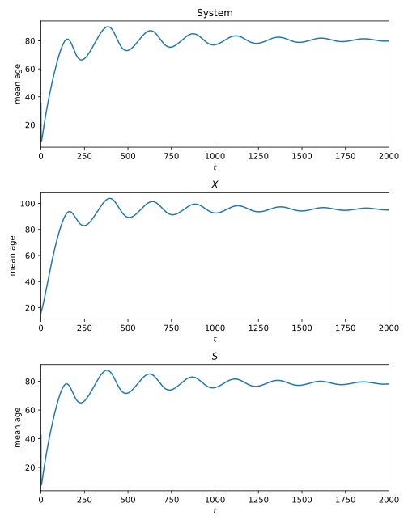
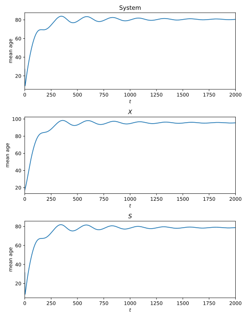
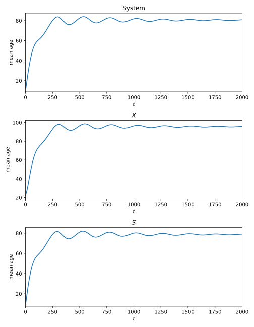

  
  
  
  
## Mean ages  
  

 

 **Model run 1 - mean ages:** *Initial values: Low, Parameter set: Set 1, Time step: 0.1* 

 

 **Model run 2 - mean ages:** *Initial values: Medium, Parameter set: Set 1, Time step: 0.1* 

 

 **Model run 3 - mean ages:** *Initial values: High, Parameter set: Set 1, Time step: 0.1* 

