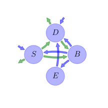
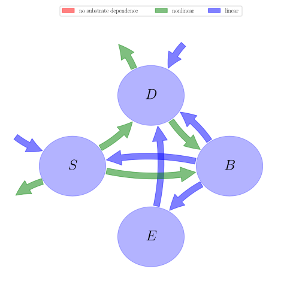

# General Overview

 

This report is the result of the use of the Python 3.4 package Sympy (for symbolic mathematics), as means to translate published models to a common language. It was created by Holger Metzler (Orcid ID: 0000-0002-8239-1601) on 17/03/2016, and was last modified on _lm_.

## About the model
The model depicted in this document considers soil organic matter decomposition. It was originally described by @Allison2010NatureGeoscience.  

### Further references
@Li2014Biogeochemistry: The notation here is adapted to the one in this paper. Temperature sensitivities for $V$, $V_{U}$, $K$, and $K_{U}$ follow the Arrhenius relationship.

### Abstract
Most ecosystem models predict that climate warming will stimulate microbial decomposition of soil carbon, producing a positive feedback to rising global temperatures. Although field experiments document an initial increase in the loss of CO$_{2}$ from soils in response to warming, in line with these predictions, the carbon dioxide loss from soils tends to decline to control levels within a few years. This attenuation response could result from changes in microbial physiological properties with increasing temperature, such as a decline in the fraction of assimilated carbon that is allocated to growth, termed carbon-use efficiency. Here we explore these mechanisms using a microbial-enzyme model to simulate the responses of soil carbon to warming by 5°C. We find that declines in microbial biomass and degradative enzymes can explain the observed attenuation of soil-carbon emissions in response to warming. Specifically, reduced carbon-use efficiency limits the biomass of microbial decomposers and mitigates the loss of soil carbon. However, microbial adaptation or a change in microbial communities could lead to an upward adjustment of the efficiency of carbon use, counteracting the decline in microbial biomass and accelerating soil-carbon loss. We conclude that the soil-carbon response to climate warming depends on the efficiency of soil microbes in using carbon.

### Keywords
differential equations, nonlinear, time variant, Michaelis-Menten

### Principles
mass balance, substrate dependence of decomposition, heterogeneity of speed of decay, internal transformations of organic matter, environmental variability effects, substrate interactions

# State Variables
The following table contains the available information regarding this section:

Name|Description|Units
:-----:|:-----|:-----:
$S$|soil organic carbon pool|$mgC cm^{-3}$
$D$|dissolved organic carbon pool|$mgC cm^{-3}$
$B$|microbial biomass pool|$mgC cm^{-3}$
$E$|enzyme pool|$mgC cm^{-3}$

Table: Information on State Variables

# Constants
The following table contains the available information regarding this section:

Name|Description|Expressions|Units
:-----:|:-----|:-----:|:-----:
$R$|ideal gas constant|$R=0.008314$|$kJ mol^{-1} K^{-1}$

Table: Information on Constants

# Parameters
The following table contains the available information regarding this section:

Name|Description|Type|Units
:-----:|:-----|:-----:|:-----:
$r_{B}$|microbial biomass turnover rate|parameter|$h^{-1}$
$r_{E}$|enzyme production rate|parameter|$h^{-1}$
$r_{L}$|enzyme loss rate|parameter|$h^{-1}$
$a_{BS}$|fraction of dead microbial biomass transferred to soil organic matter|parameter|-
$V_{Umax}$|reference for maximum rate of dissolved organic carbon uptake|parameter|$h^{-1}$
$V_{max}$|reference for maximum rate of soil organic carbon decomposition|parameter|$h^{-1}$
$E_{aU}$|activation energy to convert substrate into product|parameter|$kJ mol^{-1}$
$E_{a}$|activation energy for soil organic carbon decomposition|parameter|$kJ mol^{-1}$
$\epsilon_{0}$|base carbon uptake efficiency|parameter|-
$\epsilon_{s}$|carbon uptake efficieny slope|parameter|$°C^{-1}$
$K_{U0}$|base half saturation constant for carbon uptkae|parameter|$mg C cm^{-3}$
$K_{Us}$|half saturation constant slope for carbon uptake|parameter|$mg C cm^{-3} °C^{-1}$
$K_{0}$|base half saturation constant for soil organic carbon decomposition|parameter|$mg C cm^{-3}$
$K_{s}$|half saturation constant slope for soil organic carbon decomposition|parameter|$mg C cm^{-3} °C^{-1}$

Table: Information on Parameters

# Additional Variables
The following table contains the available information regarding this section:

Name|Description|Expressions|Type|Units
:-----:|:-----|:-----:|:-----:|:-----:
$t$|time|-|variable|$hr$
$T$|temperature|-|variable|$°C$
$V_{U}$|maximum dissolved organic carbon uptake rate|$V_{U}=V_{Umax}\cdot \operatorname{exp}\left(\frac{- E_{aU}}{R\cdot \left(T+273\right)}\right)$|variable|-
$V$|maximum decomosition rate of soil orgacic carbon|$V=V_{max}\cdot \operatorname{exp}\left(\frac{- E_{a}}{R\cdot \left(T+273\right)}\right)$|variable|-
$E_{C}$|carbon uptake efficiency|$E_{C}=\epsilon_{0}+\epsilon_{s}\cdot T$|variable|-
$K_{U}$|half saturation constant for carbon uptake|$K_{U}=K_{U0}+K_{Us}\cdot T$|variable|$mg C cm^{-3}$
$K$|half saturation constant for soil organic carbon decomposition|$K=K_{0}+K_{s}\cdot T$|variable|$mg C cm^{-3}$

Table: Information on Additional Variables

# Input Components
The following table contains the available information regarding this section:

Name|Description|Type|Units
:-----:|:-----|:-----:|:-----:
$I_{S}$|soil organic carbon input rate|parameter|$mg C cm^{-3} h^{-1}$
$I_{D}$|dissolved organic carbon input rate|parameter|$mg C cm^{-3} h^{-1}$

Table: Information on Input Components

# Components
The following table contains the available information regarding this section:

Name|Description|Expressions
:-----:|:-----|:-----:
$C$|carbon content|$C=\left[\begin{matrix}S\\D\\B\\E\end{matrix}\right]$
$I$|input vector|$I=\left[\begin{matrix}I_{S}\\I_{D}\\0\\0\end{matrix}\right]$
$T_{M}$|transition operator|$T_{M}=\left[\begin{matrix}-1 & 0 &\frac{a_{BS}\cdot r_{B}}{r_{B} + r_{E}} & 0\\1 & -1 &\frac{r_{B}\cdot\left(- a_{BS} + 1\right)}{r_{B} + r_{E}} & 1\\1 & E_{C} & -1 & 0\\0 & 0 &\frac{r_{E}}{r_{B} + r_{E}} & -1\end{matrix}\right]$
$N$|decomposition operator|$N=\left[\begin{matrix}\frac{E\cdot V}{K + S} & 0 & 0 & 0\\0 &\frac{B\cdot V_{U}}{D + K_{U}} & 0 & 0\\0 & 0 & r_{B} + r_{E} & 0\\0 & 0 & 0 & r_{L}\end{matrix}\right]$
$f_{s}$|the right hand side of the ode|$f_{s}=I+T_{M}\cdot N\cdot C$

Table: Information on Components

## Pool model representation
<table><thead><tr><th></th><th>Flux description</th></tr></thead><tbody><tr><td align=center, style='vertical-align: middle'>
 

 **Figure 1:** *Pool model representation* 

</td><td align=left style='vertical-align: middle'>
#### Input fluxes
$S: I_{S}$  $D: I_{D}$  

#### Output fluxes
$S: -\frac{E\cdot S\cdot V_{max}\cdot e^{-\frac{E_{a}}{0.008314\cdot T + 2.269722}}}{K_{0} + K_{s}\cdot T + S}$  $D: -\frac{B\cdot D\cdot V_{Umax}\cdot e^{-\frac{E_{aU}}{0.008314\cdot T + 2.269722}}}{D + K_{U0} + K_{Us}\cdot T}\cdot\left(T\cdot\epsilon_{s} +\epsilon_{0} - 1\right)$  

#### Internal fluxes
$S \rightarrow D: \frac{E\cdot S\cdot V_{max}\cdot e^{-\frac{E_{a}}{0.008314\cdot T + 2.269722}}}{K_{0} + K_{s}\cdot T + S}$  $S \rightarrow B: \frac{E\cdot S\cdot V_{max}\cdot e^{-\frac{E_{a}}{0.008314\cdot T + 2.269722}}}{K_{0} + K_{s}\cdot T + S}$  $D \rightarrow B: \frac{B\cdot D\cdot V_{Umax}\cdot e^{-\frac{E_{aU}}{0.008314\cdot T + 2.269722}}}{D + K_{U0} + K_{Us}\cdot T}\cdot\left(T\cdot\epsilon_{s} +\epsilon_{0}\right)$  $B \rightarrow S: B\cdot a_{BS}\cdot r_{B}$  $B \rightarrow D: B\cdot r_{B}\cdot\left(- a_{BS} + 1\right)$  $B \rightarrow E: B\cdot r_{E}$  $E \rightarrow D: E\cdot r_{L}$  </td></tr></tbody></table>
## The right hand side of the ODE
$\left[\begin{matrix}B\cdot a_{BS}\cdot r_{B} -\frac{E\cdot S\cdot V_{max}\cdot e^{-\frac{E_{a}}{0.008314\cdot T + 2.269722}}}{K_{0} + K_{s}\cdot T + S} + I_{S}\\-\frac{B\cdot D\cdot V_{Umax}\cdot e^{-\frac{E_{aU}}{0.008314\cdot T + 2.269722}}}{D + K_{U0} + K_{Us}\cdot T} + B\cdot r_{B}\cdot\left(- a_{BS} + 1\right) +\frac{E\cdot S\cdot V_{max}\cdot e^{-\frac{E_{a}}{0.008314\cdot T + 2.269722}}}{K_{0} + K_{s}\cdot T + S} + E\cdot r_{L} + I_{D}\\\frac{B\cdot D\cdot V_{Umax}\cdot e^{-\frac{E_{aU}}{0.008314\cdot T + 2.269722}}}{D + K_{U0} + K_{Us}\cdot T}\cdot\left(T\cdot\epsilon_{s} +\epsilon_{0}\right) + B\cdot\left(- r_{B} - r_{E}\right) +\frac{E\cdot S\cdot V_{max}\cdot e^{-\frac{E_{a}}{0.008314\cdot T + 2.269722}}}{K_{0} + K_{s}\cdot T + S}\\B\cdot r_{E} - E\cdot r_{L}\end{matrix}\right]$

## The Jacobian (derivative of the ODE w.r.t. state variables)
$\left[\begin{matrix}\frac{E\cdot S\cdot V_{max}\cdot e^{-\frac{E_{a}}{0.008314\cdot T + 2.269722}}}{\left(K_{0} + K_{s}\cdot T + S\right)^{2}} -\frac{E\cdot V_{max}\cdot e^{-\frac{E_{a}}{0.008314\cdot T + 2.269722}}}{K_{0} + K_{s}\cdot T + S} & 0 & a_{BS}\cdot r_{B} & -\frac{S\cdot V_{max}\cdot e^{-\frac{E_{a}}{0.008314\cdot T + 2.269722}}}{K_{0} + K_{s}\cdot T + S}\\-\frac{E\cdot S\cdot V_{max}\cdot e^{-\frac{E_{a}}{0.008314\cdot T + 2.269722}}}{\left(K_{0} + K_{s}\cdot T + S\right)^{2}} +\frac{E\cdot V_{max}\cdot e^{-\frac{E_{a}}{0.008314\cdot T + 2.269722}}}{K_{0} + K_{s}\cdot T + S} &\frac{B\cdot D\cdot V_{Umax}\cdot e^{-\frac{E_{aU}}{0.008314\cdot T + 2.269722}}}{\left(D + K_{U0} + K_{Us}\cdot T\right)^{2}} -\frac{B\cdot V_{Umax}\cdot e^{-\frac{E_{aU}}{0.008314\cdot T + 2.269722}}}{D + K_{U0} + K_{Us}\cdot T} & -\frac{D\cdot V_{Umax}\cdot e^{-\frac{E_{aU}}{0.008314\cdot T + 2.269722}}}{D + K_{U0} + K_{Us}\cdot T} + r_{B}\cdot\left(- a_{BS} + 1\right) &\frac{S\cdot V_{max}\cdot e^{-\frac{E_{a}}{0.008314\cdot T + 2.269722}}}{K_{0} + K_{s}\cdot T + S} + r_{L}\\-\frac{E\cdot S\cdot V_{max}\cdot e^{-\frac{E_{a}}{0.008314\cdot T + 2.269722}}}{\left(K_{0} + K_{s}\cdot T + S\right)^{2}} +\frac{E\cdot V_{max}\cdot e^{-\frac{E_{a}}{0.008314\cdot T + 2.269722}}}{K_{0} + K_{s}\cdot T + S} & -\frac{B\cdot D\cdot V_{Umax}\cdot e^{-\frac{E_{aU}}{0.008314\cdot T + 2.269722}}}{\left(D + K_{U0} + K_{Us}\cdot T\right)^{2}}\cdot\left(T\cdot\epsilon_{s} +\epsilon_{0}\right) +\frac{B\cdot V_{Umax}\cdot e^{-\frac{E_{aU}}{0.008314\cdot T + 2.269722}}}{D + K_{U0} + K_{Us}\cdot T}\cdot\left(T\cdot\epsilon_{s} +\epsilon_{0}\right) &\frac{D\cdot V_{Umax}\cdot e^{-\frac{E_{aU}}{0.008314\cdot T + 2.269722}}}{D + K_{U0} + K_{Us}\cdot T}\cdot\left(T\cdot\epsilon_{s} +\epsilon_{0}\right) - r_{B} - r_{E} &\frac{S\cdot V_{max}\cdot e^{-\frac{E_{a}}{0.008314\cdot T + 2.269722}}}{K_{0} + K_{s}\cdot T + S}\\0 & 0 & r_{E} & - r_{L}\end{matrix}\right]$

# References
