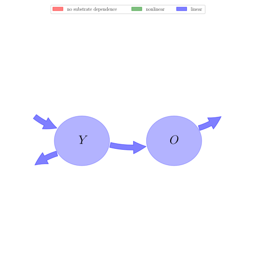

# General Overview

 

This report is the result of the use of the Python 3.4 package Sympy (for symbolic mathematics), as means to translate published models to a common language. It was created by Holger Metzler (Orcid ID: 0000-0002-8239-1601) on 09/03/2016, and was last modified on _lm_.

## About the model
The model depicted in this document considers soil organic matter decomposition. It was originally described by @Andren1997EcologicalApplications.  

### Abstract
A two-component model was devised, comprising young and old soil C, two decay constants, and parameters for litter input, ‘‘humification,’’ and external influences. Due to the model’s simplicity, the differential equations were solved analytically, and parameter optimizations can be made using generally available nonlinear regression programs. The calibration parameter values were derived from a 35-yr experiment with arable crops on a clay soil in central Sweden. We show how the model can be used for medium-term (30 yr) predictions of the effects of changed inputs, climate, initial pools, litter quality, etc., on soil carbon pools. Equations are provided for calculating steady-state pool sizes as well as model parameters from litter bag or $^{14}$C-labeled litter decomposition data. Strategies for model parameterization to different inputs, climatic regions, and soils, as well as the model’s relations to other model families, are briefly discussed.

### Keywords
differential equations, linear, time invariant, analytic

### Principles
mass balance, substrate dependence of decomposition, heterogeneity of speed of decay, internal transformations of organic matter, environmental variability effects

# State Variables
The following table contains the available information regarding this section:

Name|Description|Units|Values    Bare fallow|    +N +straw|    -N +straw|    -N -straw|    +N -straw|    Farmyard manure|    Sewage sludge
:-----:|:-----|:-----:|:-----:|:-----:|:-----:|:-----:|:-----:|:-----:|:-----:
$Y$|young pool of soil carbon|$kgCm^{-2}$|$0.3$|$0.3$|$0.3$|$0.3$|$0.3$|$0.3$|$0.3$
$O$|old pool of soil carbon|$kgCm^{-2}$|$3.96$|$4.11$|$4.05$|$3.99$|$4.02$|$3.99$|$4.14$

Table: Information on State Variables

# Decomposition Rates
The following table contains the available information regarding this section:

Name|Description|Type|Units|Values    Bare fallow|    +N +straw|    -N +straw|    -N -straw|    +N -straw|    Farmyard manure|    Sewage sludge
:-----:|:-----|:-----:|:-----:|:-----:|:-----:|:-----:|:-----:|:-----:|:-----:|:-----:
$k_{1}$|decomposition rate of young pool|parameter|$yr^{-1}$|$0.8$|$0.8$|$0.8$|$0.8$|$0.8$|$0.8$|$0.8$
$k_{2}$|decomposition rate of old pool|parameter|$yr^{-1}$|$0.00605$|$0.00605$|$0.00605$|$0.00605$|$0.00605$|$0.00605$|$0.00605$

Table: Information on Decomposition Rates

# Input Components
The following table contains the available information regarding this section:

Name|Description|Type|Units|Values    Bare fallow|    +N +straw|    -N +straw|    -N -straw|    +N -straw|    Farmyard manure|    Sewage sludge
:-----:|:-----|:-----:|:-----:|:-----:|:-----:|:-----:|:-----:|:-----:|:-----:|:-----:
$i$|mean annual carbon input|parameter|$kgC m^{-2}yr^{-1}$|$0$|$0.285$|$0.248$|$0.057$|$0.091$|$0.272$|$0.296$

Table: Information on Input Components

# Transfer Coefficient
The following table contains the available information regarding this section:

Name|Description|Type|Values    Bare fallow|    +N +straw|    -N +straw|    -N -straw|    +N -straw|    Farmyard manure|    Sewage sludge
:-----:|:-----|:-----:|:-----:|:-----:|:-----:|:-----:|:-----:|:-----:|:-----:
$h$|humification coefficient|parameter|$0.13$|$0.125$|$0.125$|$0.125$|$0.125$|$0.25$|$0.34$

Table: Information on Transfer Coefficient

# Environmental Coefficients
The following table contains the available information regarding this section:

Name|Description|Type|Values    Bare fallow|    +N +straw|    -N +straw|    -N -straw|    +N -straw|    Farmyard manure|    Sewage sludge
:-----:|:-----|:-----:|:-----:|:-----:|:-----:|:-----:|:-----:|:-----:|:-----:
$r$|climatic and edaphic factors|parameter|$1.32$|$1.0$|$1.22$|$1.17$|$1.07$|$1.1$|$0.97$

Table: Information on Environmental Coefficients

# Time Variable
The following table contains the available information regarding this section:

Name|Units|Values    Bare fallow|    +N +straw|    -N +straw|    -N -straw|    +N -straw|    Farmyard manure|    Sewage sludge
:-----:|:-----:|:-----:|:-----:|:-----:|:-----:|:-----:|:-----:|:-----:
$t$|$yr$|-|-|-|-|-|-|-

Table: Information on Time Variable

# Components
The following table contains the available information regarding this section:

Name|Description|Expressions
:-----:|:-----|:-----:
$C$|carbon content|$C=\left[\begin{matrix}Y\\O\end{matrix}\right]$
$I$|input vector|$I=\left[\begin{matrix}i\\0\end{matrix}\right]$
$\xi$|environmental effects multiplier|$\xi=r$
$T$|transition operator|$T=\left[\begin{matrix}-1 & 0\\h & -1\end{matrix}\right]$
$N$|decomposition operator|$N=\left[\begin{matrix}k_{1} & 0\\0 & k_{2}\end{matrix}\right]$
$f_{s}$|the right hand side of the ode|$f_{s}=I+\xi\cdot T\cdot N\cdot C$

Table: Information on Components

## Pool model representation
<table><thead><tr><th></th><th>Flux description</th></tr></thead><tbody><tr><td align=center, style='vertical-align: middle'>
 

 **Figure 1:** *Pool model representation* 

</td><td align=left style='vertical-align: middle'>
#### Input fluxes
$Y: i$  

#### Output fluxes
$Y: Y\cdot k_{1}\cdot r\cdot\left(- h + 1\right)$  $O: O\cdot k_{2}\cdot r$  

#### Internal fluxes
$Y \rightarrow O: Y\cdot h\cdot k_{1}\cdot r$  </td></tr></tbody></table>
## The right hand side of the ODE
$\left[\begin{matrix}- Y\cdot k_{1}\cdot r + i\\- O\cdot k_{2}\cdot r + Y\cdot h\cdot k_{1}\cdot r\end{matrix}\right]$

## The Jacobian (derivative of the ODE w.r.t. state variables)
$\left[\begin{matrix}- k_{1}\cdot r & 0\\h\cdot k_{1}\cdot r & - k_{2}\cdot r\end{matrix}\right]$

## Steady state formulas
$Y = \frac{i}{k_{1}\cdot r}$  $O = \frac{h\cdot i}{k_{2}\cdot r}$    

## Steady states (potentially incomplete), according jacobian eigenvalues, damping ratio

### Parameter set: Bare fallow
$Y: 0.0$, $O: 0.0$    $\lambda_{1}: -0.008$  $\lambda_{2}: -1.056$  

### Parameter set: +N +straw
$Y: 0.356$, $O: 5.888$    $\lambda_{1}: -0.006$  $\lambda_{2}: -0.800$  

### Parameter set: -N +straw
$Y: 0.254$, $O: 4.2$    $\lambda_{1}: -0.976$  $\lambda_{2}: -0.007$  

### Parameter set: -N -straw
$Y: 0.061$, $O: 1.007$    $\lambda_{1}: -0.936$  $\lambda_{2}: -0.007$  

### Parameter set: +N -straw
$Y: 0.106$, $O: 1.757$    $\lambda_{1}: -0.856$  $\lambda_{2}: -0.006$  

### Parameter set: Farmyard manure
$Y: 0.309$, $O: 10.218$    $\lambda_{1}: -0.880$  $\lambda_{2}: -0.007$  

### Parameter set: Sewage sludge
$Y: 0.381$, $O: 17.149$    $\lambda_{1}: -0.776$  $\lambda_{2}: -0.006$  

## Model simulations

 

 **Model run 1 - solutions:** *Initial values: Bare fallow, Parameter set: Bare fallow, Time step: 0.1* 

 

 **Model run 1 - phase planes:** *Initial values: Bare fallow, Parameter set: Bare fallow, Start: 0, End: 100, Time step: 0.1* 

 

 **Model run 1 - system-age-distributions:** *Initial values: Bare fallow, Parameter set: Bare fallow* 

 

 **Model run 2 - solutions:** *Initial values: +N +straw, Parameter set: +N +straw, Time step: 0.1* 

 

 **Model run 2 - phase planes:** *Initial values: +N +straw, Parameter set: +N +straw, Start: 0, End: 100, Time step: 0.1* 

 

 **Model run 2 - system-age-distributions:** *Initial values: +N +straw, Parameter set: +N +straw* 

 

 **Model run 3 - solutions:** *Initial values: -N +straw, Parameter set: -N +straw, Time step: 0.1* 

 

 **Model run 3 - phase planes:** *Initial values: -N +straw, Parameter set: -N +straw, Start: 0, End: 100, Time step: 0.1* 

 

 **Model run 3 - system-age-distributions:** *Initial values: -N +straw, Parameter set: -N +straw* 

 

 **Model run 4 - solutions:** *Initial values: -N -straw, Parameter set: -N -straw, Time step: 0.1* 

 

 **Model run 4 - phase planes:** *Initial values: -N -straw, Parameter set: -N -straw, Start: 0, End: 100, Time step: 0.1* 

 

 **Model run 4 - system-age-distributions:** *Initial values: -N -straw, Parameter set: -N -straw* 

 

 **Model run 5 - solutions:** *Initial values: +N -straw, Parameter set: +N -straw, Time step: 0.1* 

 

 **Model run 5 - phase planes:** *Initial values: +N -straw, Parameter set: +N -straw, Start: 0, End: 100, Time step: 0.1* 

 

 **Model run 5 - system-age-distributions:** *Initial values: +N -straw, Parameter set: +N -straw* 

 

 **Model run 6 - solutions:** *Initial values: Farmyard manure, Parameter set: Farmyard manure, Time step: 0.1* 

 

 **Model run 6 - phase planes:** *Initial values: Farmyard manure, Parameter set: Farmyard manure, Start: 0, End: 100, Time step: 0.1* 

 

 **Model run 6 - system-age-distributions:** *Initial values: Farmyard manure, Parameter set: Farmyard manure* 

 

 **Model run 7 - solutions:** *Initial values: Sewage sludge, Parameter set: Sewage sludge, Time step: 0.1* 

 

 **Model run 7 - phase planes:** *Initial values: Sewage sludge, Parameter set: Sewage sludge, Start: 0, End: 100, Time step: 0.1* 

 

 **Model run 7 - system-age-distributions:** *Initial values: Sewage sludge, Parameter set: Sewage sludge* 

# References
