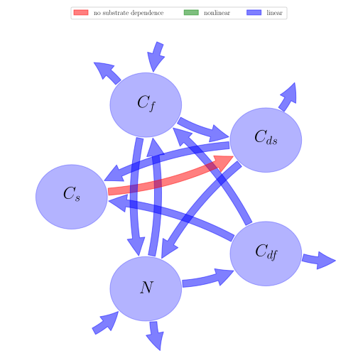

# General Overview

 

This report is the result of the use of the Python 3.4 package Sympy (for symbolic mathematics), as means to translate published models to a common language. It was created by Holger Metzler (Orcid ID: 0000-0002-8239-1601) on 22/03/2016, and was last modified on _lm_.

## About the model
The model depicted in this document considers soil organic matter decomposition. It was originally described by @Fontaine2005Ecologyletters.  

### Abstract
Soil organic matter (SOM) models are based on the equation $dC/dt = −kC$ which states that the decomposition rate of a particular carbon (C) pool is proportional to the size of the pool and the decomposition constant $k$. However, this equation does not adequately describe the decomposition of recalcitrant SOM compounds. We present an alternative theory of SOM dynamics in which SOM decay rate is controlled by the size and the diversity of microbe populations and by the supply of energy-rich litter compounds. We show that the SOM pool does not necessarily reach equilibrium and may increase continuously, which explains how SOM can accumulate over thousands of years. However, the simulated SOM accumulation involves the sequestration of available nutrients. How can plants persist? This question is explored with two models that couple the C cycle with a limiting nutrient. The first model considers a single type of microbe whereas the second includes two functional types in competition for energy and nutrient acquisition. The condition for plant persistence is the presence of these two competing microbial types.

### Keywords
differential equations, linear, time invariant, analytic

### Principles
substrate dependence of decomposition, heterogeneity of speed of decay, internal transformations of organic matter, substrate interactions

# State Variables
The following table contains the available information regarding this section:

Name|Description|Units
:-----:|:-----|:-----:
$C_{s}$|carbon stock in soil organic matter|$\text{quantitiy of carbon}$
$C_{f}$|carbon stock in fresh organic matter|$\text{quantitiy of carbon}$
$C_{ds}$|carbon stock in soil organic matter decomposers|$\text{quantitiy of carbon}$
$C_{df}$|carbon stock in fresh organic matter decomposers|$\text{quantitiy of carbon}$
$N$|mineral nitrogen pool ($N:C$ ratio always constant)|$\text{quantitiy of nitrogen}$

Table: Information on State Variables

# Decomposition Coefficients
The following table contains the available information regarding this section:

Name|Description|Type|Units
:-----:|:-----|:-----:|:-----:
$A$|decomposers consumption rate of SOM|parameter|$\text{time}^{-1}$
$r$|fraction of decomposer biomass released as CO$_2$|parameter|$\text{time}^{-1}$
$s$|decomposers production rate of soil organic matter|parameter|$\text{time}^{-1}$
$k$|rate of fresh organic matter decomposition under substrate limitation ($N$ excess)|parameter|$\text{time}^{-1}$
$y$|soil organic matter decomposer consumption rate of fresh organic matter under substrate limitations|parameter|$\text{time}^{-1}$

Table: Information on Decomposition Coefficients

# Additional Parameters
The following table contains the available information regarding this section:

Name|Description|Type|Units
:-----:|:-----|:-----:|:-----:
$\alpha$|$N:C$ ratio in soil organic matter and in decomposers|parameter|-
$\beta$|$N:C$ ratio in fresh organic matter|parameter|-
$i$|rate of mineral $N$ diffusion in soil|parameter|$\text{time}^{-1}$

Table: Information on Additional Parameters

# Input Components
The following table contains the available information regarding this section:

Name|Description|Type|Units
:-----:|:-----|:-----:|:-----:
$\Phi_{l}$|fresh organic matter carbon flux|parameter|$(\text{quantity of carbon})(\text{time}))^{-1}$
$\Phi_{i}$|nitrogen that flows into the ecosystem|parameter|$(\text{quantity of nitrogen})(\text{time}))^{-1}$
$\Phi_{o}$|nitrogen that flows out of the ecosystem|parameter|$(\text{quantity of nitrogen})(\text{time}))^{-1}$
$\Phi_{up}$|nitrogen flux associated with the nitrogen uptake by the plant cover|parameter|$(\text{quantity of nitrogen})(\text{time}))^{-1}$

Table: Information on Input Components

# Components
The following table contains the available information regarding this section:

Name|Description|Expressions|key
:-----:|:-----|:-----:|:-----:
$I$|input vector|$I=\left[\begin{matrix}0\\\Phi_{l}\\0\\0\\\Phi_{i} -\Phi_{o} -\Phi_{up}\end{matrix}\right]$|input_vector
$C$|carbon content|$C=\left[\begin{matrix}C_{s}\\C_{f}\\C_{ds}\\C_{df}\\N\end{matrix}\right]$|state_vector
$A_{GeM}$|decomposition operator|$A_{GeM}=\left[\begin{matrix}0 & 0 & - A + s & s & 0\\0 & - y & 0 & -\frac{\alpha\cdot r}{\alpha -\beta} & -\frac{i}{\alpha -\beta}\\0 & y & A - r - s & 0 & 0\\0 & 0 & 0 &\frac{\alpha\cdot r}{\alpha -\beta} - r - s &\frac{i}{\alpha -\beta}\\0 & y\cdot\left(-\alpha +\beta\right) &\alpha\cdot r & 0 & - i\end{matrix}\right]$|decomp_op_lin
$f_{s}$|the right hand side of the ode|$f_{s}=I+A_{GeM}\cdot C$|state_vector_derivative

Table: Information on Components

## Pool model representation
<table><thead><tr><th></th><th>Flux description</th></tr></thead><tbody><tr><td align=center, style='vertical-align: middle'>
 

 **Figure 1:** *Pool model representation* 

</td><td align=left style='vertical-align: middle'>
#### Input fluxes
$C_{f}: \Phi_{l}$  $N: \Phi_{i} -\Phi_{o} -\Phi_{up}$  

#### Output fluxes
$C_{f}: C_{f}\cdot y\cdot\left(\alpha -\beta\right)$  $C_{ds}: C_{ds}\cdot r\cdot\left(-\alpha + 1\right)$  $C_{df}: C_{df}\cdot r$  $N: N\cdot i$  

#### Internal fluxes
$C_{f} > C_{ds}: C_{f}\cdot y$  $C_{f} > N: C_{f}\cdot y\cdot\left(-\alpha +\beta\right)$  $C_{ds} > C_{s}: C_{ds}\cdot\left(- A + s\right)$  $C_{ds} > N: C_{ds}\cdot\alpha\cdot r$  $C_{df} > C_{s}: C_{df}\cdot s$  $C_{df} > C_{f}: -\frac{C_{df}\cdot\alpha\cdot r}{\alpha -\beta}$  $N > C_{f}: -\frac{N\cdot i}{\alpha -\beta}$  $N > C_{df}: \frac{N\cdot i}{\alpha -\beta}$  </td></tr></tbody></table>
## The right hand side of the ODE
$\left[\begin{matrix}C_{df}\cdot s + C_{ds}\cdot\left(- A + s\right)\\-\frac{C_{df}\cdot\alpha\cdot r}{\alpha -\beta} - C_{f}\cdot y -\frac{N\cdot i}{\alpha -\beta} +\Phi_{l}\\C_{ds}\cdot\left(A - r - s\right) + C_{f}\cdot y\\C_{df}\cdot\left(\frac{\alpha\cdot r}{\alpha -\beta} - r - s\right) +\frac{N\cdot i}{\alpha -\beta}\\C_{ds}\cdot\alpha\cdot r + C_{f}\cdot y\cdot\left(-\alpha +\beta\right) - N\cdot i +\Phi_{i} -\Phi_{o} -\Phi_{up}\end{matrix}\right]$

## The Jacobian (derivative of the ODE w.r.t. state variables)
$\left[\begin{matrix}0 & 0 & - A + s & s & 0\\0 & - y & 0 & -\frac{\alpha\cdot r}{\alpha -\beta} & -\frac{i}{\alpha -\beta}\\0 & y & A - r - s & 0 & 0\\0 & 0 & 0 &\frac{\alpha\cdot r}{\alpha -\beta} - r - s &\frac{i}{\alpha -\beta}\\0 & y\cdot\left(-\alpha +\beta\right) &\alpha\cdot r & 0 & - i\end{matrix}\right]$

# References
