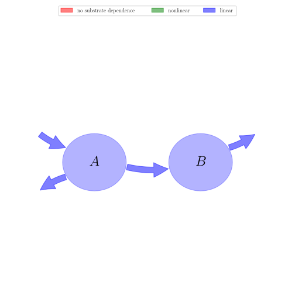

# General Overview

 

This report is the result of the use of the Python 3.4 package Sympy (for symbolic mathematics), as means to translate published models to a common language. It was created by Holger Metzler (Orcid ID: 0000-0002-8239-1601) on 09/03/2016, and was last modified on _lm_.

## About the model
The model depicted in this document considers soil organic matter decomposition. It was originally described by @Henin1945Annalesagronomiques.  

### Keywords
differential equations, linear, time invariant, analytic

### Principles
mass balance, substrate dependence of decomposition, heterogeneity of speed of decay, internal transformations of organic matter

# State Variables
The following table contains the available information regarding this section:

Name|Description|Units
:-----:|:-----|:-----:
$A$|labile pool|$MgC\cdot ha^{-1}$
$B$|stable pool|$MgC\cdot ha^{-1}$

Table: Information on State Variables

# Decomposition Rates
The following table contains the available information regarding this section:

Name|Description|Type|Units
:-----:|:-----|:-----:|:-----:
$\alpha$|annual decomposition rate of labile pool|parameter|$yr^{-1}$
$\beta$|annual decomposition rate of stable pool|parameter|$yr^{-1}$

Table: Information on Decomposition Rates

# Input Components
The following table contains the available information regarding this section:

Name|Description|Type|Units
:-----:|:-----|:-----:|:-----:
$m$|annual organic matter input|parameter|$MgC yr^{-1}$

Table: Information on Input Components

# Transfer Coefficients
The following table contains the available information regarding this section:

Name|Description|Type
:-----:|:-----|:-----:
$K$|isohumic coefficient|parameter

Table: Information on Transfer Coefficients

# Components
The following table contains the available information regarding this section:

Name|Description|Expressions
:-----:|:-----|:-----:
$C$|carbon content|$C=\left[\begin{matrix}A\\B\end{matrix}\right]$
$I$|input vector|$I=\left[\begin{matrix}m\\0\end{matrix}\right]$
$A_{GeM}$|decomposition operator|$A_{GeM}=\left[\begin{matrix}-\alpha & 0\\K\cdot\alpha & -\beta\end{matrix}\right]$
$f_{s}$|the right hand side of the ode|$f_{s}=I+A_{GeM}\cdot C$

Table: Information on Components

## Pool model representation
<table><thead><tr><th></th><th>Flux description</th></tr></thead><tbody><tr><td align=center, style='vertical-align: middle'>
 

 **Figure 1:** *Pool model representation* 

</td><td align=left style='vertical-align: middle'>
#### Input fluxes
$A: m$  

#### Output fluxes
$A: A\cdot\alpha\cdot\left(- K + 1\right)$  $B: B\cdot\beta$  

#### Internal fluxes
$A \rightarrow B: A\cdot K\cdot\alpha$  </td></tr></tbody></table>
## The right hand side of the ODE
$\left[\begin{matrix}- A\cdot\alpha + m\\A\cdot K\cdot\alpha - B\cdot\beta\end{matrix}\right]$

## The Jacobian (derivative of the ODE w.r.t. state variables)
$\left[\begin{matrix}-\alpha & 0\\K\cdot\alpha & -\beta\end{matrix}\right]$

## Steady state formulas
$A = \frac{m}{\alpha}$  $B = \frac{K}{\beta}\cdot m$    

# References
