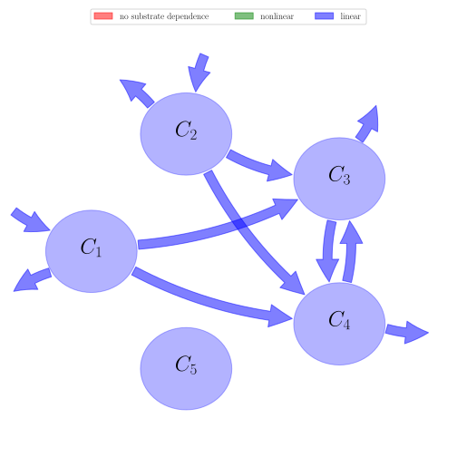

# General Overview

 

This report is the result of the use of the Python 3.4 package Sympy (for symbolic mathematics), as means to translate published models to a common language. It was created by Holger Metzler (Orcid ID: 0000-0002-8239-1601) on 10/03/2016, and was last modified on _lm_.

## About the model
The model depicted in this document considers soil organic matter decomposition. It was originally described by @Jenkinson1977SoilScience.  

### Abstract
Data are assembled from the Rothamsted classical field experiments on the effects of long-continued cropping and manuring on the amount of organic matter in soil, on the age of this soil organic matter, on the amount of microbial biomass in the soil, and on the rate at which plant residues decompose in these soils. These data were then fitted to a model in which soil organic matter was separated into five compartments: decomposable plant material (DPM, half-life 0.165 years); resistant plant material (RPM, 2.31 years); soil biomass (BIO, 1.69 years); physically stabilized organic matter (POM, 49.5 years) and chemically stabilized organic matter (COM, 1980 years). For unitary input of plant material (1 t fresh plant $C ha^{-1} year^{-1}$) under steady-state conditions, after 10,000 years, the model predicts that the soil will contain 0.01 t C in DPM, 0.47 t in RPM, 0.28 t in BIO, 11.3 t in POM, and 12.2 t in COM. The predicted radiocarbon age is 1240 years (equivalent age). The fit between predicted and measured data is sufficiently good to suggest that the model is a useful representation of the turnover of organic matter in cropped soils.

### Keywords
differential equations, linear, time variant

### Principles
mass balance, substrate dependence of decomposition, heterogeneity of speed of decay, internal transformations of organic matter, environmental variability effects

### Space Scale
plot, field, catchment, regional, national, global

### Available parameter values

Abbreviation|Description|Source
:-----|:-----|:-----
Set1|original values without effects of temperature and soil moisture|@Coleman1996

Table:  Information on given parameter sets

# State Variables
The following table contains the available information regarding this section:

Name|Description|Units
:-----:|:-----|:-----:
$C_{1}$|decomposable plant material pool (DPM)|$t C\cdot ha^{-1}$
$C_{2}$|resistant plant material pool (RPM)|$t C\cdot ha^{-1}$
$C_{3}$|microbial biomass pool (BIO)|$t C\cdot ha^{-1}$
$C_{4}$|humified organic matter pool (HUM)|$t C\cdot ha^{-1}$
$C_{5}$|inert organic matter pool (IOM)|$t C\cdot ha^{-1}$

Table: Information on State Variables

# Decomposition Rates
The following table contains the available information regarding this section:

Name|Description|Type|Units|Values    Set1
:-----:|:-----|:-----:|:-----:|:-----:
$k_{1}$|decomposition rate of DPM|parameter|$yr^{-1}$|$10$
$k_{2}$|decomposition rate of RPM|parameter|$yr^{-1}$|$0.3$
$k_{3}$|decomposition rate of BIO|parameter|$yr^{-1}$|$0.66$
$k_{4}$|decomposition rate of HUM|parameter|$yr^{-1}$|$0.02$

Table: Information on Decomposition Rates

# Additional Parameters
The following table contains the available information regarding this section:

Name|Description|Type|Values    Set1
:-----:|:-----|:-----:|:-----:
$pClay$|percentage of clay in mineral soil|parameter|$23.4$
$DR$|ratio of DPM to RPM|parameter|$1.44$

Table: Information on Additional Parameters

# Auxiliary Variables
The following table contains the available information regarding this section:

Name|Description|Expressions|Values    Set1
:-----:|:-----|:-----:|:-----:
$x$|CO$_{2}$ to (BIO+HUM) ratio|$x=1.67\cdot \left(1.85+1.6\cdot \operatorname{exp}\left(- 0.0786\cdot pClay\right)\right)$|-
$\gamma$|litter input partitioning coefficient|$\gamma=\frac{DR}{1+DR}$|-

Table: Information on Auxiliary Variables

# Input Components
The following table contains the available information regarding this section:

Name|Description|Type|Units|Values    Set1
:-----:|:-----|:-----:|:-----:|:-----:
$J$|mean annual carbon input|parameter|$t C ha^{-1}yr^{-1}$|$1.7$

Table: Information on Input Components

# Transfer Coefficients
The following table contains the available information regarding this section:

Name|Description|Expressions|Values    Set1
:-----:|:-----|:-----:|:-----:
$a$|flux coefficient to BIO|$a=\frac{0.46}{1+x}$|-
$b$|flux coefficient to HUM|$b=\frac{0.54}{1+x}$|-

Table: Information on Transfer Coefficients

# Environmental Coefficients
The following table contains the available information regarding this section:

Name|Description|Values    Set1
:-----:|:-----|:-----:
$f_{T}$|function of temperature|-
$f_{W}$|function of soil moisture|-

Table: Information on Environmental Coefficients

# Components
The following table contains the available information regarding this section:

Name|Description|Expressions
:-----:|:-----|:-----:
$C$|carbon content|$C=\left[\begin{matrix}C_{1}\\C_{2}\\C_{3}\\C_{4}\\C_{5}\end{matrix}\right]$
$I$|input vector|$I=\left[\begin{matrix}J\cdot\gamma\\J\cdot\left(-\gamma + 1\right)\\0\\0\\0\end{matrix}\right]$
$\xi$|environmental effects multiplier|$\xi=f_{T}\cdot f_{W}$
$A$|decomposition operator|$A=\left[\begin{matrix}- k_{1} & 0 & 0 & 0 & 0\\0 & - k_{2} & 0 & 0 & 0\\a\cdot k_{1} & a\cdot k_{2} & a\cdot k_{3} - k_{3} & a\cdot k_{4} & 0\\b\cdot k_{1} & b\cdot k_{2} & b\cdot k_{3} & b\cdot k_{4} - k_{4} & 0\\0 & 0 & 0 & 0 & 0\end{matrix}\right]$
$f_{s}$|the right hand side of the ode|$f_{s}=I+\xi\cdot A\cdot C$

Table: Information on Components

## Pool model representation
<table><thead><tr><th></th><th>Flux description</th></tr></thead><tbody><tr><td align=center, style='vertical-align: middle'>
 

 **Figure 1:** *Pool model representation* 

</td><td align=left style='vertical-align: middle'>
#### Input fluxes
$C_{1}: \frac{DR\cdot J}{DR + 1}$  $C_{2}: J\cdot\left(-\frac{DR}{DR + 1} + 1\right)$  

#### Output fluxes
$C_{1}: \frac{C_{1}\cdot f_{T}\cdot f_{W}\cdot k_{1}}{4.0895\cdot e^{0.0786\cdot pClay} + 2.672}\cdot\left(3.0895\cdot e^{0.0786\cdot pClay} + 2.672\right)$  $C_{2}: \frac{C_{2}\cdot f_{T}\cdot f_{W}\cdot k_{2}}{4.0895\cdot e^{0.0786\cdot pClay} + 2.672}\cdot\left(3.0895\cdot e^{0.0786\cdot pClay} + 2.672\right)$  $C_{3}: \frac{1.0\cdot C_{3}\cdot f_{T}\cdot f_{W}\cdot k_{3}}{4.0895\cdot e^{0.0786\cdot pClay} + 2.672}\cdot\left(3.0895\cdot e^{0.0786\cdot pClay} + 2.672\right)$  $C_{4}: \frac{1.0\cdot C_{4}\cdot f_{T}\cdot f_{W}\cdot k_{4}}{4.0895\cdot e^{0.0786\cdot pClay} + 2.672}\cdot\left(3.0895\cdot e^{0.0786\cdot pClay} + 2.672\right)$  

#### Internal fluxes
$C_{1} \rightarrow C_{3}: \frac{0.46\cdot C_{1}\cdot f_{T}\cdot f_{W}\cdot k_{1}\cdot e^{0.0786\cdot pClay}}{4.0895\cdot e^{0.0786\cdot pClay} + 2.672}$  $C_{1} \rightarrow C_{4}: \frac{0.54\cdot C_{1}\cdot f_{T}\cdot f_{W}\cdot k_{1}\cdot e^{0.0786\cdot pClay}}{4.0895\cdot e^{0.0786\cdot pClay} + 2.672}$  $C_{2} \rightarrow C_{3}: \frac{0.46\cdot C_{2}\cdot f_{T}\cdot f_{W}\cdot k_{2}\cdot e^{0.0786\cdot pClay}}{4.0895\cdot e^{0.0786\cdot pClay} + 2.672}$  $C_{2} \rightarrow C_{4}: \frac{0.54\cdot C_{2}\cdot f_{T}\cdot f_{W}\cdot k_{2}\cdot e^{0.0786\cdot pClay}}{4.0895\cdot e^{0.0786\cdot pClay} + 2.672}$  $C_{3} \rightarrow C_{4}: \frac{0.54\cdot C_{3}\cdot f_{T}\cdot f_{W}\cdot k_{3}\cdot e^{0.0786\cdot pClay}}{4.0895\cdot e^{0.0786\cdot pClay} + 2.672}$  $C_{4} \rightarrow C_{3}: \frac{0.46\cdot C_{4}\cdot f_{T}\cdot f_{W}\cdot k_{4}\cdot e^{0.0786\cdot pClay}}{4.0895\cdot e^{0.0786\cdot pClay} + 2.672}$  </td></tr></tbody></table>
## The right hand side of the ODE
$\left[\begin{matrix}- C_{1}\cdot f_{T}\cdot f_{W}\cdot k_{1} +\frac{DR\cdot J}{DR + 1}\\- C_{2}\cdot f_{T}\cdot f_{W}\cdot k_{2} + J\cdot\left(-\frac{DR}{DR + 1} + 1\right)\\\frac{0.46\cdot C_{1}\cdot f_{T}\cdot f_{W}\cdot k_{1}}{4.0895 + 2.672\cdot e^{- 0.0786\cdot pClay}} +\frac{0.46\cdot C_{2}\cdot f_{T}\cdot f_{W}\cdot k_{2}}{4.0895 + 2.672\cdot e^{- 0.0786\cdot pClay}} + C_{3}\cdot f_{T}\cdot f_{W}\cdot\left(- k_{3} +\frac{0.46\cdot k_{3}}{4.0895 + 2.672\cdot e^{- 0.0786\cdot pClay}}\right) +\frac{0.46\cdot C_{4}\cdot f_{T}\cdot f_{W}\cdot k_{4}}{4.0895 + 2.672\cdot e^{- 0.0786\cdot pClay}}\\\frac{0.54\cdot C_{1}\cdot f_{T}\cdot f_{W}\cdot k_{1}}{4.0895 + 2.672\cdot e^{- 0.0786\cdot pClay}} +\frac{0.54\cdot C_{2}\cdot f_{T}\cdot f_{W}\cdot k_{2}}{4.0895 + 2.672\cdot e^{- 0.0786\cdot pClay}} +\frac{0.54\cdot C_{3}\cdot f_{T}\cdot f_{W}\cdot k_{3}}{4.0895 + 2.672\cdot e^{- 0.0786\cdot pClay}} + C_{4}\cdot f_{T}\cdot f_{W}\cdot\left(- k_{4} +\frac{0.54\cdot k_{4}}{4.0895 + 2.672\cdot e^{- 0.0786\cdot pClay}}\right)\\0\end{matrix}\right]$

## The Jacobian (derivative of the ODE w.r.t. state variables)
$\left[\begin{matrix}- f_{T}\cdot f_{W}\cdot k_{1} & 0 & 0 & 0 & 0\\0 & - f_{T}\cdot f_{W}\cdot k_{2} & 0 & 0 & 0\\\frac{0.46\cdot f_{T}\cdot f_{W}\cdot k_{1}}{4.0895 + 2.672\cdot e^{- 0.0786\cdot pClay}} &\frac{0.46\cdot f_{T}\cdot f_{W}\cdot k_{2}}{4.0895 + 2.672\cdot e^{- 0.0786\cdot pClay}} & f_{T}\cdot f_{W}\cdot\left(- k_{3} +\frac{0.46\cdot k_{3}}{4.0895 + 2.672\cdot e^{- 0.0786\cdot pClay}}\right) &\frac{0.46\cdot f_{T}\cdot f_{W}\cdot k_{4}}{4.0895 + 2.672\cdot e^{- 0.0786\cdot pClay}} & 0\\\frac{0.54\cdot f_{T}\cdot f_{W}\cdot k_{1}}{4.0895 + 2.672\cdot e^{- 0.0786\cdot pClay}} &\frac{0.54\cdot f_{T}\cdot f_{W}\cdot k_{2}}{4.0895 + 2.672\cdot e^{- 0.0786\cdot pClay}} &\frac{0.54\cdot f_{T}\cdot f_{W}\cdot k_{3}}{4.0895 + 2.672\cdot e^{- 0.0786\cdot pClay}} & f_{T}\cdot f_{W}\cdot\left(- k_{4} +\frac{0.54\cdot k_{4}}{4.0895 + 2.672\cdot e^{- 0.0786\cdot pClay}}\right) & 0\\0 & 0 & 0 & 0 & 0\end{matrix}\right]$

## Steady state formulas
$C_{1} = \frac{DR\cdot J}{f_{T}\cdot f_{W}\cdot k_{1}\cdot\left(DR + 1.0\right)}$  $C_{2} = \frac{J}{f_{T}\cdot f_{W}\cdot k_{2}\cdot\left(DR + 1.0\right)}$  $C_{3} = \frac{5.50898203592814\cdot J\cdot\left(4.35845179839506\cdot 10^{18}\cdot e^{0.0786\cdot pClay} + 3.26027527396786\cdot 10^{19}\cdot e^{0.1572\cdot pClay} + 9.75003544221277\cdot 10^{19}\cdot e^{0.2358\cdot pClay} + 1.45709229508337\cdot 10^{20}\cdot e^{0.3144\cdot pClay} + 1.08814080708274\cdot 10^{20}\cdot e^{0.393\cdot pClay} + 3.24846079083974\cdot 10^{19}\cdot e^{0.4716\cdot pClay}\right)}{f_{T}\cdot f_{W}\cdot k_{3}\cdot\left(1.20455080421033\cdot 10^{21}\cdot e^{0.0786\cdot pClay} + 4.32631319287619\cdot 10^{21}\cdot e^{0.1572\cdot pClay} + 8.2702084578855\cdot 10^{21}\cdot e^{0.2358\cdot pClay} + 8.87329207447322\cdot 10^{21}\cdot e^{0.3144\cdot pClay} + 5.06562843927484\cdot 10^{21}\cdot e^{0.393\cdot pClay} + 1.20193049261071\cdot 10^{21}\cdot e^{0.4716\cdot pClay} + 1.39470457548642\cdot 10^{20}\right)}$  $C_{4} = \frac{6.46706586826347\cdot J\cdot\left(152615747584.0\cdot e^{0.0786\cdot pClay} + 700735890432.0\cdot e^{0.1572\cdot pClay} + 1072477329312.0\cdot e^{0.2358\cdot pClay} + 547142719339.0\cdot e^{0.3144\cdot pClay}\right)}{f_{T}\cdot f_{W}\cdot k_{4}\cdot\left(28070331154432.0\cdot e^{0.0786\cdot pClay} + 60246502483968.0\cdot e^{0.1572\cdot pClay} + 57190228203392.0\cdot e^{0.2358\cdot pClay} + 20244280615543.0\cdot e^{0.3144\cdot pClay} + 4883703922688.0\right)}$  $C_{5} = C_{5}$    

## Steady states (potentially incomplete), according jacobian eigenvalues, damping ratio

### Parameter set: Set1
$C_1: \frac{0.100327868852459}{f_{T}\cdot f_{W}}$, $C_2: \frac{2.3224043715847}{f_{T}\cdot f_{W}}$, $C_3: \frac{0.337161881627308}{f_{T}\cdot f_{W}}$, $C_4: \frac{13.061358109997}{f_{T}\cdot f_{W}}$, $C_5: C_{5}$    $\lambda_{1}: 0$  $\lambda_{2}: - 0.3\cdot f_{T}\cdot f_{W}$  $\lambda_{3}: - 10.0\cdot f_{T}\cdot f_{W}$  $\lambda_{4}: - 0.593\cdot f_{T}\cdot f_{W}$  $\lambda_{5}: - 0.01733\cdot f_{T}\cdot f_{W}$  

# References
