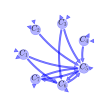
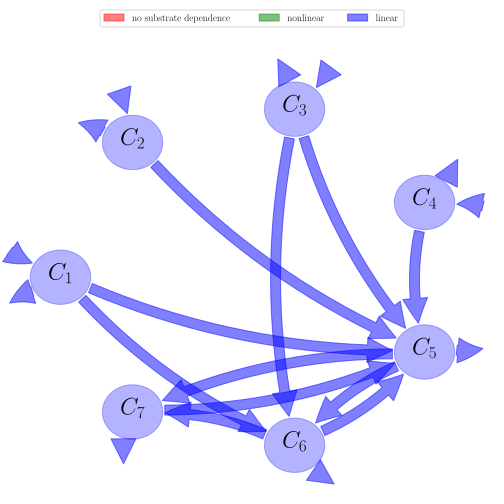

# General Overview

 

This report is the result of the use of the Python 3.4 package Sympy (for symbolic mathematics), as means to translate published models to a common language. It was created by Holger Metzler (Orcid ID: 0000-0002-8239-1601) on 10/03/2016, and was last modified on _lm_.

## About the model
The model depicted in this document considers soil organic matter decomposition. It was originally described by @Parton1987SoilSciSocAmJ.  

### Abstract
We analyzed climatic and textural controls of soil organic C and N for soils of the U.S. Great Plains. We used a model of soil organic matter (SOM) quantity and composition to simulate steady-state organic matter levels for 24 grassland locations in the Great Plains. The model was able to simulate the effects of climatic gradients on SOM and productivity. Soil texture was also a major control over organic matter dynamics. The model adequately predicted aboveground plant production and soil C and N levels across soil textures (sandy, medium, and fine); however, the model tended to overestimate soil C and N levels for fine textured soil by 10 to 15%. The impact of grazing on the system was simulated and showed that steady-state soil C and N levels were sensitive to the grazing intensity, with soil C and N levels decreasing with increased grazing rates. Regional trends in SOM can be predicted using four site-specific variables, temperature, moisture, soil texture, and plant lignin content. Nitrogen inputs must also be known. Grazing intensity during soil development is also a significant control over steady-state levels of SOM, and since few data are available on presettlement grazing, some uncertainty is inherent in the model predictions.

### Keywords
differential equations, time variant

### Principles
mass balance, substrate dependence of decomposition, heterogeneity of speed of decay, internal transformations of organic matter, environmental variability effects

### Available parameter values

Abbreviation|Description
:-----|:-----
Set 1|original values without effects of temperature and soil moisture

Table:  Information on given parameter sets

### Available initial values

Abbreviation|Description
:-----|:-----
IV 1|original values without effects of temperature and soil moisture

Table:  Information on given sets of initial values

# State Variables
The following table contains the available information regarding this section:

Name|Description|Values    IV 1
:-----:|:-----|:-----:
$C_{1}$|structural soil surface litter pool|$100$
$C_{2}$|metabolic soil surface litter pool|$200$
$C_{3}$|structural soil litter pool|-
$C_{4}$|metabolic soil litter pool|-
$C_{5}$|active soil organic matter pool|-
$C_{6}$|slow soil organic matter pool|-
$C_{7}$|passive soil organic matter pool|-

Table: Information on State Variables

# Maximum Decomposition Rates
The following table contains the available information regarding this section:

Name|Description|Type|Values    Set 1
:-----:|:-----|:-----:|:-----:
$K_{1}$|maximum decomposition rate of structural soil surface litter|parameter|$0.076$
$K_{2}$|maximum decomposition rate of metabolic soil surface litter|parameter|$0.28$
$K_{3}$|maximum decomposition rate of structural soil litter|parameter|$0.094$
$K_{4}$|maximum decomposition rate of metabolic soil litter|parameter|$0.35$
$K_{5}$|maximum decomposition rate of active soil organic matter|parameter|$0.14$
$K_{6}$|maximum decomposition rate of slow soil organic matter|parameter|$0.0038$
$K_{7}$|maximum decomposition rate of passive organic matter|parameter|$0.00013$

Table: Information on Maximum Decomposition Rates

# Decomposition Rates
The following table contains the available information regarding this section:

Name|Description|Expressions|Values    Set 1
:-----:|:-----|:-----:|:-----:
$k_{1}$|decomposition rate of structural soil surface litter|$k_{1}=K_{1}\cdot \operatorname{exp}\left(- 3\cdot Ls\right)$|-
$k_{3}$|decomposition rate of structural soil litter|$k_{3}=K_{3}\cdot \operatorname{exp}\left(- 3\cdot Ls\right)$|-
$k_{5}$|decomposition rate of active soil organic matter|$k_{5}=K_{5}\cdot \left(1-0.75\cdot Tx\right)$|-

Table: Information on Decomposition Rates

# Additional Parameters
The following table contains the available information regarding this section:

Name|Description|Type|Values    Set 1
:-----:|:-----|:-----:|:-----:
$LN$|lignin-to-nitrogen ratio|parameter|-
$Ls$|fraction of structural material that is lignin|parameter|-
$Tx$|silt and clay fraction of the soil|parameter|-
$A_{l}$|lignin fraction that is composed in structural pools (equals Ls?)|parameter|-

Table: Information on Additional Parameters

# Auxiliary Variables
The following table contains the available information regarding this section:

Name|Description|Expressions|Values    Set 1
:-----:|:-----|:-----:|:-----:
$E_{s}$|fraction of carbon lost as CO$_{2}$ when active soil organic matter is decomposed and stabilized into slow organic matter|$E_{s}=0.85-0.68\cdot Tx$|-
$F_{m}$|fraction of incoming metabolic litter|$F_{m}=0.85-0.018\cdot LN$|-
$F_{s}$|fraction of incoming structural litter|$F_{s}=1-F_{m}$|-

Table: Information on Auxiliary Variables

# Input Components
The following table contains the available information regarding this section:

Name|Description|Type|Values    Set 1
:-----:|:-----|:-----:|:-----:
$J_{1}$|organic matter input to surface|parameter|-
$J_{2}$|organic matter input to soil|parameter|-

Table: Information on Input Components

# Transfer Coefficients
The following table contains the available information regarding this section:

Name|Description|Expressions|Values    Set 1
:-----:|:-----|:-----:|:-----:
$\alpha_{51}$|flux coefficient from strucutral soil surface litter pool to active soil organic matter pool|$\alpha_{51}=0.55\cdot \left(1-A_{l}\right)$|-
$\alpha_{53}$|flux coefficient from strucutral soil litter pool to active soil organic matter pool|$\alpha_{53}=0.45\cdot \left(1-A_{l}\right)$|-
$\alpha_{61}$|flux coefficient from strucutral soil surface litter pool to slow soil organic matter pool|$\alpha_{61}=0.7\cdot A_{l}$|-
$\alpha_{63}$|flux coefficient from strucutral soil litter pool to slow soil organic matter pool|$\alpha_{63}=\alpha_{61}$|-
$\alpha_{65}$|flux coefficient from strucutral soil surface litter pool to slow soil organic matter pool|$\alpha_{65}=1-E_{s}-0.004$|-

Table: Information on Transfer Coefficients

# Environmental Coefficients
The following table contains the available information regarding this section:

Name|Description|Type|Values    Set 1
:-----:|:-----|:-----:|:-----:
$f_{T}$|function of temperature|variable|-
$f_{W}$|function of soil moisture|variable|-

Table: Information on Environmental Coefficients

# Components
The following table contains the available information regarding this section:

Name|Description|Expressions
:-----:|:-----|:-----:
$C$|carbon content|$C=\left[\begin{matrix}C_{1}\\C_{2}\\C_{3}\\C_{4}\\C_{5}\\C_{6}\\C_{7}\end{matrix}\right]$
$I$|input vector|$I=\left[\begin{matrix}F_{s}\cdot J_{1}\\F_{m}\cdot J_{1}\\F_{s}\cdot J_{2}\\F_{m}\cdot J_{2}\\0\\0\\0\end{matrix}\right]$
$\xi$|environmental effects multiplier (DEFAG)|$\xi=f_{T}\cdot f_{W}$
$A$|decomposition operator|$A=\left[\begin{matrix}- k_{1} & 0 & 0 & 0 & 0 & 0 & 0\\0 & - K_{2} & 0 & 0 & 0 & 0 & 0\\0 & 0 & - k_{3} & 0 & 0 & 0 & 0\\0 & 0 & 0 & - K_{4} & 0 & 0 & 0\\\alpha_{51}\cdot k_{1} & 0.45\cdot K_{2} &\alpha_{53}\cdot k_{3} & 0.45\cdot K_{4} & - k_{5} & 0.42\cdot K_{6} & 0.45\cdot K_{7}\\\alpha_{61}\cdot k_{1} & 0 &\alpha_{63}\cdot k_{3} & 0 &\alpha_{65}\cdot k_{5} & - K_{6} & 0\\0 & 0 & 0 & 0 & 0.004\cdot k_{5} & 0.03\cdot K_{6} & - K_{7}\end{matrix}\right]$
$f_{s}$|the right hand side of the ode|$f_{s}=I+\xi\cdot A\cdot C$

Table: Information on Components

## Pool model representation
<table><thead><tr><th></th><th>Flux description</th></tr></thead><tbody><tr><td align=center, style='vertical-align: middle'>
 

 **Figure 1:** *Pool model representation* 

</td><td align=left style='vertical-align: middle'>
#### Input fluxes
$C_{1}: J_{1}\cdot\left(0.018\cdot LN + 0.15\right)$  $C_{2}: J_{1}\cdot\left(- 0.018\cdot LN + 0.85\right)$  $C_{3}: J_{2}\cdot\left(0.018\cdot LN + 0.15\right)$  $C_{4}: J_{2}\cdot\left(- 0.018\cdot LN + 0.85\right)$  

#### Output fluxes
$C_{1}: - C_{1}\cdot K_{1}\cdot f_{T}\cdot f_{W}\cdot\left(0.15\cdot A_{l} - 0.45\right)\cdot e^{- 3\cdot Ls}$  $C_{2}: 0.55\cdot C_{2}\cdot K_{2}\cdot f_{T}\cdot f_{W}$  $C_{3}: - C_{3}\cdot K_{3}\cdot f_{T}\cdot f_{W}\cdot\left(0.25\cdot A_{l} - 0.55\right)\cdot e^{- 3\cdot Ls}$  $C_{4}: 0.55\cdot C_{4}\cdot K_{4}\cdot f_{T}\cdot f_{W}$  $C_{5}: C_{5}\cdot K_{5}\cdot f_{T}\cdot f_{W}\cdot\left(0.51\cdot Tx^{2} - 1.3175\cdot Tx + 0.85\right)$  $C_{6}: 0.55\cdot C_{6}\cdot K_{6}\cdot f_{T}\cdot f_{W}$  $C_{7}: 0.55\cdot C_{7}\cdot K_{7}\cdot f_{T}\cdot f_{W}$  

#### Internal fluxes
$C_{1} \rightarrow C_{5}: - 0.55\cdot C_{1}\cdot K_{1}\cdot f_{T}\cdot f_{W}\cdot\left(A_{l} - 1\right)\cdot e^{- 3\cdot Ls}$  $C_{1} \rightarrow C_{6}: 0.7\cdot A_{l}\cdot C_{1}\cdot K_{1}\cdot f_{T}\cdot f_{W}\cdot e^{- 3\cdot Ls}$  $C_{2} \rightarrow C_{5}: 0.45\cdot C_{2}\cdot K_{2}\cdot f_{T}\cdot f_{W}$  $C_{3} \rightarrow C_{5}: - 0.45\cdot C_{3}\cdot K_{3}\cdot f_{T}\cdot f_{W}\cdot\left(A_{l} - 1\right)\cdot e^{- 3\cdot Ls}$  $C_{3} \rightarrow C_{6}: 0.7\cdot A_{l}\cdot C_{3}\cdot K_{3}\cdot f_{T}\cdot f_{W}\cdot e^{- 3\cdot Ls}$  $C_{4} \rightarrow C_{5}: 0.45\cdot C_{4}\cdot K_{4}\cdot f_{T}\cdot f_{W}$  $C_{5} \rightarrow C_{6}: C_{5}\cdot K_{5}\cdot f_{T}\cdot f_{W}\cdot\left(- 0.51\cdot Tx^{2} + 0.5705\cdot Tx + 0.146\right)$  $C_{5} \rightarrow C_{7}: C_{5}\cdot K_{5}\cdot f_{T}\cdot f_{W}\cdot\left(- 0.003\cdot Tx + 0.004\right)$  $C_{6} \rightarrow C_{5}: 0.42\cdot C_{6}\cdot K_{6}\cdot f_{T}\cdot f_{W}$  $C_{6} \rightarrow C_{7}: 0.03\cdot C_{6}\cdot K_{6}\cdot f_{T}\cdot f_{W}$  $C_{7} \rightarrow C_{5}: 0.45\cdot C_{7}\cdot K_{7}\cdot f_{T}\cdot f_{W}$  </td></tr></tbody></table>
## The right hand side of the ODE
$\left[\begin{matrix}- C_{1}\cdot K_{1}\cdot f_{T}\cdot f_{W}\cdot e^{- 3\cdot Ls} + J_{1}\cdot\left(0.018\cdot LN + 0.15\right)\\- C_{2}\cdot K_{2}\cdot f_{T}\cdot f_{W} + J_{1}\cdot\left(- 0.018\cdot LN + 0.85\right)\\- C_{3}\cdot K_{3}\cdot f_{T}\cdot f_{W}\cdot e^{- 3\cdot Ls} + J_{2}\cdot\left(0.018\cdot LN + 0.15\right)\\- C_{4}\cdot K_{4}\cdot f_{T}\cdot f_{W} + J_{2}\cdot\left(- 0.018\cdot LN + 0.85\right)\\C_{1}\cdot K_{1}\cdot f_{T}\cdot f_{W}\cdot\left(- 0.55\cdot A_{l} + 0.55\right)\cdot e^{- 3\cdot Ls} + 0.45\cdot C_{2}\cdot K_{2}\cdot f_{T}\cdot f_{W} + C_{3}\cdot K_{3}\cdot f_{T}\cdot f_{W}\cdot\left(- 0.45\cdot A_{l} + 0.45\right)\cdot e^{- 3\cdot Ls} + 0.45\cdot C_{4}\cdot K_{4}\cdot f_{T}\cdot f_{W} - C_{5}\cdot K_{5}\cdot f_{T}\cdot f_{W}\cdot\left(- 0.75\cdot Tx + 1\right) + 0.42\cdot C_{6}\cdot K_{6}\cdot f_{T}\cdot f_{W} + 0.45\cdot C_{7}\cdot K_{7}\cdot f_{T}\cdot f_{W}\\0.7\cdot A_{l}\cdot C_{1}\cdot K_{1}\cdot f_{T}\cdot f_{W}\cdot e^{- 3\cdot Ls} + 0.7\cdot A_{l}\cdot C_{3}\cdot K_{3}\cdot f_{T}\cdot f_{W}\cdot e^{- 3\cdot Ls} + C_{5}\cdot K_{5}\cdot f_{T}\cdot f_{W}\cdot\left(- 0.75\cdot Tx + 1\right)\cdot\left(0.68\cdot Tx + 0.146\right) - C_{6}\cdot K_{6}\cdot f_{T}\cdot f_{W}\\0.004\cdot C_{5}\cdot K_{5}\cdot f_{T}\cdot f_{W}\cdot\left(- 0.75\cdot Tx + 1\right) + 0.03\cdot C_{6}\cdot K_{6}\cdot f_{T}\cdot f_{W} - C_{7}\cdot K_{7}\cdot f_{T}\cdot f_{W}\end{matrix}\right]$

## The Jacobian (derivative of the ODE w.r.t. state variables)
$\left[\begin{matrix}- K_{1}\cdot f_{T}\cdot f_{W}\cdot e^{- 3\cdot Ls} & 0 & 0 & 0 & 0 & 0 & 0\\0 & - K_{2}\cdot f_{T}\cdot f_{W} & 0 & 0 & 0 & 0 & 0\\0 & 0 & - K_{3}\cdot f_{T}\cdot f_{W}\cdot e^{- 3\cdot Ls} & 0 & 0 & 0 & 0\\0 & 0 & 0 & - K_{4}\cdot f_{T}\cdot f_{W} & 0 & 0 & 0\\K_{1}\cdot f_{T}\cdot f_{W}\cdot\left(- 0.55\cdot A_{l} + 0.55\right)\cdot e^{- 3\cdot Ls} & 0.45\cdot K_{2}\cdot f_{T}\cdot f_{W} & K_{3}\cdot f_{T}\cdot f_{W}\cdot\left(- 0.45\cdot A_{l} + 0.45\right)\cdot e^{- 3\cdot Ls} & 0.45\cdot K_{4}\cdot f_{T}\cdot f_{W} & - K_{5}\cdot f_{T}\cdot f_{W}\cdot\left(- 0.75\cdot Tx + 1\right) & 0.42\cdot K_{6}\cdot f_{T}\cdot f_{W} & 0.45\cdot K_{7}\cdot f_{T}\cdot f_{W}\\0.7\cdot A_{l}\cdot K_{1}\cdot f_{T}\cdot f_{W}\cdot e^{- 3\cdot Ls} & 0 & 0.7\cdot A_{l}\cdot K_{3}\cdot f_{T}\cdot f_{W}\cdot e^{- 3\cdot Ls} & 0 & K_{5}\cdot f_{T}\cdot f_{W}\cdot\left(- 0.75\cdot Tx + 1\right)\cdot\left(0.68\cdot Tx + 0.146\right) & - K_{6}\cdot f_{T}\cdot f_{W} & 0\\0 & 0 & 0 & 0 & 0.004\cdot K_{5}\cdot f_{T}\cdot f_{W}\cdot\left(- 0.75\cdot Tx + 1\right) & 0.03\cdot K_{6}\cdot f_{T}\cdot f_{W} & - K_{7}\cdot f_{T}\cdot f_{W}\end{matrix}\right]$

## Steady state formulas
$C_{1} = \frac{0.006\cdot J_{1}\cdot e^{3.0\cdot Ls}}{K_{1}\cdot f_{T}\cdot f_{W}}\cdot\left(3.0\cdot LN + 25.0\right)$  $C_{2} = -\frac{0.002\cdot J_{1}\cdot\left(9.0\cdot LN - 425.0\right)}{K_{2}\cdot f_{T}\cdot f_{W}}$  $C_{3} = \frac{0.006\cdot J_{2}\cdot e^{3.0\cdot Ls}}{K_{3}\cdot f_{T}\cdot f_{W}}\cdot\left(3.0\cdot LN + 25.0\right)$  $C_{4} = -\frac{0.002\cdot J_{2}\cdot\left(9.0\cdot LN - 425.0\right)}{K_{4}\cdot f_{T}\cdot f_{W}}$  $C_{5} = \frac{1}{K_{5}\cdot f_{T}\cdot f_{W}\cdot\left(884340.0\cdot Tx^{2} - 3983847.0\cdot Tx + 3739636.0\right)}\cdot\left(- 17751.6\cdot A_{l}\cdot J_{1}\cdot LN - 147930.0\cdot A_{l}\cdot J_{1} - 10551.6\cdot A_{l}\cdot J_{2}\cdot LN - 87930.0\cdot A_{l}\cdot J_{2} + 7200.0\cdot J_{1}\cdot LN + 1860000.0\cdot J_{1} + 1800000.0\cdot J_{2}\right)$  $C_{6} = \frac{1}{K_{6}\cdot f_{T}\cdot f_{W}\cdot\left(294780.0\cdot Tx - 934909.0\right)}\cdot\left(6732.0\cdot A_{l}\cdot J_{1}\cdot LN\cdot Tx - 11131.92\cdot A_{l}\cdot J_{1}\cdot LN + 56100.0\cdot A_{l}\cdot J_{1}\cdot Tx - 92766.0\cdot A_{l}\cdot J_{1} + 5508.0\cdot A_{l}\cdot J_{2}\cdot LN\cdot Tx - 11394.72\cdot A_{l}\cdot J_{2}\cdot LN + 45900.0\cdot A_{l}\cdot J_{2}\cdot Tx - 94956.0\cdot A_{l}\cdot J_{2} - 1224.0\cdot J_{1}\cdot LN\cdot Tx - 262.8\cdot J_{1}\cdot LN - 316200.0\cdot J_{1}\cdot Tx - 67890.0\cdot J_{1} - 306000.0\cdot J_{2}\cdot Tx - 65700.0\cdot J_{2}\right)$  $C_{7} = \frac{1}{K_{7}\cdot f_{T}\cdot f_{W}\cdot\left(294780.0\cdot Tx - 934909.0\right)}\cdot\left(201.96\cdot A_{l}\cdot J_{1}\cdot LN\cdot Tx - 316.206\cdot A_{l}\cdot J_{1}\cdot LN + 1683.0\cdot A_{l}\cdot J_{1}\cdot Tx - 2635.05\cdot A_{l}\cdot J_{1} + 165.24\cdot A_{l}\cdot J_{2}\cdot LN\cdot Tx - 331.29\cdot A_{l}\cdot J_{2}\cdot LN + 1377.0\cdot A_{l}\cdot J_{2}\cdot Tx - 2760.75\cdot A_{l}\cdot J_{2} - 36.72\cdot J_{1}\cdot LN\cdot Tx - 15.084\cdot J_{1}\cdot LN - 9486.0\cdot J_{1}\cdot Tx - 3896.7\cdot J_{1} - 9180.0\cdot J_{2}\cdot Tx - 3771.0\cdot J_{2}\right)$    

## Steady states (potentially incomplete), according jacobian eigenvalues, damping ratio

### Parameter set: Set 1
$C_1: \frac{0.0789473684210526\cdot J_{1}}{f_{T}\cdot f_{W}}\cdot\left(3.0\cdot LN + 25.0\right)\cdot e^{3.0\cdot Ls}$, $C_2: -\frac{0.00714285714285714\cdot J_{1}}{f_{T}\cdot f_{W}}\cdot\left(9.0\cdot LN - 425.0\right)$, $C_3: \frac{0.0638297872340425\cdot J_{2}}{f_{T}\cdot f_{W}}\cdot\left(3.0\cdot LN + 25.0\right)\cdot e^{3.0\cdot Ls}$, $C_4: -\frac{0.00571428571428571\cdot J_{2}}{f_{T}\cdot f_{W}}\cdot\left(9.0\cdot LN - 425.0\right)$, $C_5: -\frac{1}{f_{T}\cdot f_{W}\cdot\left(884340.0\cdot Tx^{2} - 3983847.0\cdot Tx + 3739636.0\right)}\cdot\left(126797.142857143\cdot A_{l}\cdot J_{1}\cdot LN + 1056642.85714286\cdot A_{l}\cdot J_{1} + 75368.5714285714\cdot A_{l}\cdot J_{2}\cdot LN + 628071.428571429\cdot A_{l}\cdot J_{2} - 51428.5714285714\cdot J_{1}\cdot LN - 13285714.2857143\cdot J_{1} - 12857142.8571429\cdot J_{2}\right)$, $C_6: \frac{1}{f_{T}\cdot f_{W}\cdot\left(294780.0\cdot Tx - 934909.0\right)}\cdot\left(1771578.94736842\cdot A_{l}\cdot J_{1}\cdot LN\cdot Tx - 2929452.63157895\cdot A_{l}\cdot J_{1}\cdot LN + 14763157.8947368\cdot A_{l}\cdot J_{1}\cdot Tx - 24412105.2631579\cdot A_{l}\cdot J_{1} + 1449473.68421053\cdot A_{l}\cdot J_{2}\cdot LN\cdot Tx - 2998610.52631579\cdot A_{l}\cdot J_{2}\cdot LN + 12078947.3684211\cdot A_{l}\cdot J_{2}\cdot Tx - 24988421.0526316\cdot A_{l}\cdot J_{2} - 322105.263157895\cdot J_{1}\cdot LN\cdot Tx - 69157.8947368421\cdot J_{1}\cdot LN - 83210526.3157895\cdot J_{1}\cdot Tx - 17865789.4736842\cdot J_{1} - 80526315.7894737\cdot J_{2}\cdot Tx - 17289473.6842105\cdot J_{2}\right)$, $C_7: \frac{1}{f_{T}\cdot f_{W}\cdot\left(294780.0\cdot Tx - 934909.0\right)}\cdot\left(1553538.46153846\cdot A_{l}\cdot J_{1}\cdot LN\cdot Tx - 2432353.84615385\cdot A_{l}\cdot J_{1}\cdot LN + 12946153.8461538\cdot A_{l}\cdot J_{1}\cdot Tx - 20269615.3846154\cdot A_{l}\cdot J_{1} + 1271076.92307692\cdot A_{l}\cdot J_{2}\cdot LN\cdot Tx - 2548384.61538462\cdot A_{l}\cdot J_{2}\cdot LN + 10592307.6923077\cdot A_{l}\cdot J_{2}\cdot Tx - 21236538.4615385\cdot A_{l}\cdot J_{2} - 282461.538461538\cdot J_{1}\cdot LN\cdot Tx - 116030.769230769\cdot J_{1}\cdot LN - 72969230.7692308\cdot J_{1}\cdot Tx - 29974615.3846154\cdot J_{1} - 70615384.6153846\cdot J_{2}\cdot Tx - 29007692.3076923\cdot J_{2}\right)$    $\lambda_{1}: 0.035\cdot Tx\cdot f_{T}\cdot f_{W} - 0.04798\cdot f_{T}\cdot f_{W} -\frac{- 0.000114\cdot Tx^{2}\cdot f_{T}^{2}\cdot f_{W}^{2} + 0.0005401\cdot Tx\cdot f_{T}^{2}\cdot f_{W}^{2} - 0.000518\cdot f_{T}^{2}\cdot f_{W}^{2} + 0.3333\cdot\left(- 0.105\cdot Tx\cdot f_{T}\cdot f_{W} + 0.1439\cdot f_{T}\cdot f_{W}\right)^{2}}{\left(2.064\cdot 10^{-7}\cdot Tx^{2}\cdot f_{T}^{3}\cdot f_{W}^{3} - 9.299\cdot 10^{-7}\cdot Tx\cdot f_{T}^{3}\cdot f_{W}^{3} + 8.729\cdot 10^{-7}\cdot f_{T}^{3}\cdot f_{W}^{3} - 0.5\cdot\left(- 0.945\cdot Tx\cdot f_{T}\cdot f_{W} + 1.295\cdot f_{T}\cdot f_{W}\right)\cdot\left(0.000114\cdot Tx^{2}\cdot f_{T}^{2}\cdot f_{W}^{2} - 0.0005401\cdot Tx\cdot f_{T}^{2}\cdot f_{W}^{2} + 0.000518\cdot f_{T}^{2}\cdot f_{W}^{2}\right) +\left(- 0.105\cdot Tx\cdot f_{T}\cdot f_{W} + 0.1439\cdot f_{T}\cdot f_{W}\right)^{3} + 0.5\cdot\left(- 4.0\cdot\left(- 0.0003419\cdot Tx^{2}\cdot f_{T}^{2}\cdot f_{W}^{2} + 0.00162\cdot Tx\cdot f_{T}^{2}\cdot f_{W}^{2} - 0.001554\cdot f_{T}^{2}\cdot f_{W}^{2} +\left(- 0.105\cdot Tx\cdot f_{T}\cdot f_{W} + 0.1439\cdot f_{T}\cdot f_{W}\right)^{2}\right)^{3} +\left(4.128\cdot 10^{-7}\cdot Tx^{2}\cdot f_{T}^{3}\cdot f_{W}^{3} - 1.86\cdot 10^{-6}\cdot Tx\cdot f_{T}^{3}\cdot f_{W}^{3} + 1.746\cdot 10^{-6}\cdot f_{T}^{3}\cdot f_{W}^{3} -\left(- 0.945\cdot Tx\cdot f_{T}\cdot f_{W} + 1.295\cdot f_{T}\cdot f_{W}\right)\cdot\left(0.000114\cdot Tx^{2}\cdot f_{T}^{2}\cdot f_{W}^{2} - 0.0005401\cdot Tx\cdot f_{T}^{2}\cdot f_{W}^{2} + 0.000518\cdot f_{T}^{2}\cdot f_{W}^{2}\right) + 2.0\cdot\left(- 0.105\cdot Tx\cdot f_{T}\cdot f_{W} + 0.1439\cdot f_{T}\cdot f_{W}\right)^{3}\right)^{2}\right)^{0.5}\right)^{0.3333}} - 0.3333\cdot\left(2.064\cdot 10^{-7}\cdot Tx^{2}\cdot f_{T}^{3}\cdot f_{W}^{3} - 9.299\cdot 10^{-7}\cdot Tx\cdot f_{T}^{3}\cdot f_{W}^{3} + 8.729\cdot 10^{-7}\cdot f_{T}^{3}\cdot f_{W}^{3} - 0.5\cdot\left(- 0.945\cdot Tx\cdot f_{T}\cdot f_{W} + 1.295\cdot f_{T}\cdot f_{W}\right)\cdot\left(0.000114\cdot Tx^{2}\cdot f_{T}^{2}\cdot f_{W}^{2} - 0.0005401\cdot Tx\cdot f_{T}^{2}\cdot f_{W}^{2} + 0.000518\cdot f_{T}^{2}\cdot f_{W}^{2}\right) +\left(- 0.105\cdot Tx\cdot f_{T}\cdot f_{W} + 0.1439\cdot f_{T}\cdot f_{W}\right)^{3} + 0.5\cdot\left(- 4.0\cdot\left(- 0.0003419\cdot Tx^{2}\cdot f_{T}^{2}\cdot f_{W}^{2} + 0.00162\cdot Tx\cdot f_{T}^{2}\cdot f_{W}^{2} - 0.001554\cdot f_{T}^{2}\cdot f_{W}^{2} +\left(- 0.105\cdot Tx\cdot f_{T}\cdot f_{W} + 0.1439\cdot f_{T}\cdot f_{W}\right)^{2}\right)^{3} +\left(4.128\cdot 10^{-7}\cdot Tx^{2}\cdot f_{T}^{3}\cdot f_{W}^{3} - 1.86\cdot 10^{-6}\cdot Tx\cdot f_{T}^{3}\cdot f_{W}^{3} + 1.746\cdot 10^{-6}\cdot f_{T}^{3}\cdot f_{W}^{3} -\left(- 0.945\cdot Tx\cdot f_{T}\cdot f_{W} + 1.295\cdot f_{T}\cdot f_{W}\right)\cdot\left(0.000114\cdot Tx^{2}\cdot f_{T}^{2}\cdot f_{W}^{2} - 0.0005401\cdot Tx\cdot f_{T}^{2}\cdot f_{W}^{2} + 0.000518\cdot f_{T}^{2}\cdot f_{W}^{2}\right) + 2.0\cdot\left(- 0.105\cdot Tx\cdot f_{T}\cdot f_{W} + 0.1439\cdot f_{T}\cdot f_{W}\right)^{3}\right)^{2}\right)^{0.5}\right)^{0.3333}$  $\lambda_{2}: - 0.35\cdot f_{T}\cdot f_{W}$  $\lambda_{3}: - 0.094\cdot f_{T}\cdot f_{W}\cdot e^{- 3\cdot Ls}$  $\lambda_{4}: - 0.076\cdot f_{T}\cdot f_{W}\cdot e^{- 3\cdot Ls}$  $\lambda_{5}: 0.035\cdot Tx\cdot f_{T}\cdot f_{W} - 0.04798\cdot f_{T}\cdot f_{W} +\frac{\left(0.1667 - 0.2887\cdot i\right)\cdot\left(- 0.0003419\cdot Tx^{2}\cdot f_{T}^{2}\cdot f_{W}^{2} + 0.00162\cdot Tx\cdot f_{T}^{2}\cdot f_{W}^{2} - 0.001554\cdot f_{T}^{2}\cdot f_{W}^{2} +\left(- 0.105\cdot Tx\cdot f_{T}\cdot f_{W} + 0.1439\cdot f_{T}\cdot f_{W}\right)^{2}\right)}{\left(2.064\cdot 10^{-7}\cdot Tx^{2}\cdot f_{T}^{3}\cdot f_{W}^{3} - 9.299\cdot 10^{-7}\cdot Tx\cdot f_{T}^{3}\cdot f_{W}^{3} + 8.729\cdot 10^{-7}\cdot f_{T}^{3}\cdot f_{W}^{3} - 0.5\cdot\left(- 0.945\cdot Tx\cdot f_{T}\cdot f_{W} + 1.295\cdot f_{T}\cdot f_{W}\right)\cdot\left(0.000114\cdot Tx^{2}\cdot f_{T}^{2}\cdot f_{W}^{2} - 0.0005401\cdot Tx\cdot f_{T}^{2}\cdot f_{W}^{2} + 0.000518\cdot f_{T}^{2}\cdot f_{W}^{2}\right) +\left(- 0.105\cdot Tx\cdot f_{T}\cdot f_{W} + 0.1439\cdot f_{T}\cdot f_{W}\right)^{3} + 0.5\cdot\left(- 4.0\cdot\left(- 0.0003419\cdot Tx^{2}\cdot f_{T}^{2}\cdot f_{W}^{2} + 0.00162\cdot Tx\cdot f_{T}^{2}\cdot f_{W}^{2} - 0.001554\cdot f_{T}^{2}\cdot f_{W}^{2} +\left(- 0.105\cdot Tx\cdot f_{T}\cdot f_{W} + 0.1439\cdot f_{T}\cdot f_{W}\right)^{2}\right)^{3} +\left(4.128\cdot 10^{-7}\cdot Tx^{2}\cdot f_{T}^{3}\cdot f_{W}^{3} - 1.86\cdot 10^{-6}\cdot Tx\cdot f_{T}^{3}\cdot f_{W}^{3} + 1.746\cdot 10^{-6}\cdot f_{T}^{3}\cdot f_{W}^{3} -\left(- 0.945\cdot Tx\cdot f_{T}\cdot f_{W} + 1.295\cdot f_{T}\cdot f_{W}\right)\cdot\left(0.000114\cdot Tx^{2}\cdot f_{T}^{2}\cdot f_{W}^{2} - 0.0005401\cdot Tx\cdot f_{T}^{2}\cdot f_{W}^{2} + 0.000518\cdot f_{T}^{2}\cdot f_{W}^{2}\right) + 2.0\cdot\left(- 0.105\cdot Tx\cdot f_{T}\cdot f_{W} + 0.1439\cdot f_{T}\cdot f_{W}\right)^{3}\right)^{2}\right)^{0.5}\right)^{0.3333}} +\left(0.1667 + 0.2887\cdot i\right)\cdot\left(2.064\cdot 10^{-7}\cdot Tx^{2}\cdot f_{T}^{3}\cdot f_{W}^{3} - 9.299\cdot 10^{-7}\cdot Tx\cdot f_{T}^{3}\cdot f_{W}^{3} + 8.729\cdot 10^{-7}\cdot f_{T}^{3}\cdot f_{W}^{3} - 0.5\cdot\left(- 0.945\cdot Tx\cdot f_{T}\cdot f_{W} + 1.295\cdot f_{T}\cdot f_{W}\right)\cdot\left(0.000114\cdot Tx^{2}\cdot f_{T}^{2}\cdot f_{W}^{2} - 0.0005401\cdot Tx\cdot f_{T}^{2}\cdot f_{W}^{2} + 0.000518\cdot f_{T}^{2}\cdot f_{W}^{2}\right) +\left(- 0.105\cdot Tx\cdot f_{T}\cdot f_{W} + 0.1439\cdot f_{T}\cdot f_{W}\right)^{3} + 0.5\cdot\left(- 4.0\cdot\left(- 0.0003419\cdot Tx^{2}\cdot f_{T}^{2}\cdot f_{W}^{2} + 0.00162\cdot Tx\cdot f_{T}^{2}\cdot f_{W}^{2} - 0.001554\cdot f_{T}^{2}\cdot f_{W}^{2} +\left(- 0.105\cdot Tx\cdot f_{T}\cdot f_{W} + 0.1439\cdot f_{T}\cdot f_{W}\right)^{2}\right)^{3} +\left(4.128\cdot 10^{-7}\cdot Tx^{2}\cdot f_{T}^{3}\cdot f_{W}^{3} - 1.86\cdot 10^{-6}\cdot Tx\cdot f_{T}^{3}\cdot f_{W}^{3} + 1.746\cdot 10^{-6}\cdot f_{T}^{3}\cdot f_{W}^{3} -\left(- 0.945\cdot Tx\cdot f_{T}\cdot f_{W} + 1.295\cdot f_{T}\cdot f_{W}\right)\cdot\left(0.000114\cdot Tx^{2}\cdot f_{T}^{2}\cdot f_{W}^{2} - 0.0005401\cdot Tx\cdot f_{T}^{2}\cdot f_{W}^{2} + 0.000518\cdot f_{T}^{2}\cdot f_{W}^{2}\right) + 2.0\cdot\left(- 0.105\cdot Tx\cdot f_{T}\cdot f_{W} + 0.1439\cdot f_{T}\cdot f_{W}\right)^{3}\right)^{2}\right)^{0.5}\right)^{0.3333}$  $\lambda_{6}: - 0.28\cdot f_{T}\cdot f_{W}$  $\lambda_{7}: 0.035\cdot Tx\cdot f_{T}\cdot f_{W} - 0.04798\cdot f_{T}\cdot f_{W} +\frac{\left(0.1667 + 0.2887\cdot i\right)\cdot\left(- 0.0003419\cdot Tx^{2}\cdot f_{T}^{2}\cdot f_{W}^{2} + 0.00162\cdot Tx\cdot f_{T}^{2}\cdot f_{W}^{2} - 0.001554\cdot f_{T}^{2}\cdot f_{W}^{2} +\left(- 0.105\cdot Tx\cdot f_{T}\cdot f_{W} + 0.1439\cdot f_{T}\cdot f_{W}\right)^{2}\right)}{\left(2.064\cdot 10^{-7}\cdot Tx^{2}\cdot f_{T}^{3}\cdot f_{W}^{3} - 9.299\cdot 10^{-7}\cdot Tx\cdot f_{T}^{3}\cdot f_{W}^{3} + 8.729\cdot 10^{-7}\cdot f_{T}^{3}\cdot f_{W}^{3} - 0.5\cdot\left(- 0.945\cdot Tx\cdot f_{T}\cdot f_{W} + 1.295\cdot f_{T}\cdot f_{W}\right)\cdot\left(0.000114\cdot Tx^{2}\cdot f_{T}^{2}\cdot f_{W}^{2} - 0.0005401\cdot Tx\cdot f_{T}^{2}\cdot f_{W}^{2} + 0.000518\cdot f_{T}^{2}\cdot f_{W}^{2}\right) +\left(- 0.105\cdot Tx\cdot f_{T}\cdot f_{W} + 0.1439\cdot f_{T}\cdot f_{W}\right)^{3} + 0.5\cdot\left(- 4.0\cdot\left(- 0.0003419\cdot Tx^{2}\cdot f_{T}^{2}\cdot f_{W}^{2} + 0.00162\cdot Tx\cdot f_{T}^{2}\cdot f_{W}^{2} - 0.001554\cdot f_{T}^{2}\cdot f_{W}^{2} +\left(- 0.105\cdot Tx\cdot f_{T}\cdot f_{W} + 0.1439\cdot f_{T}\cdot f_{W}\right)^{2}\right)^{3} +\left(4.128\cdot 10^{-7}\cdot Tx^{2}\cdot f_{T}^{3}\cdot f_{W}^{3} - 1.86\cdot 10^{-6}\cdot Tx\cdot f_{T}^{3}\cdot f_{W}^{3} + 1.746\cdot 10^{-6}\cdot f_{T}^{3}\cdot f_{W}^{3} -\left(- 0.945\cdot Tx\cdot f_{T}\cdot f_{W} + 1.295\cdot f_{T}\cdot f_{W}\right)\cdot\left(0.000114\cdot Tx^{2}\cdot f_{T}^{2}\cdot f_{W}^{2} - 0.0005401\cdot Tx\cdot f_{T}^{2}\cdot f_{W}^{2} + 0.000518\cdot f_{T}^{2}\cdot f_{W}^{2}\right) + 2.0\cdot\left(- 0.105\cdot Tx\cdot f_{T}\cdot f_{W} + 0.1439\cdot f_{T}\cdot f_{W}\right)^{3}\right)^{2}\right)^{0.5}\right)^{0.3333}} +\left(0.1667 - 0.2887\cdot i\right)\cdot\left(2.064\cdot 10^{-7}\cdot Tx^{2}\cdot f_{T}^{3}\cdot f_{W}^{3} - 9.299\cdot 10^{-7}\cdot Tx\cdot f_{T}^{3}\cdot f_{W}^{3} + 8.729\cdot 10^{-7}\cdot f_{T}^{3}\cdot f_{W}^{3} - 0.5\cdot\left(- 0.945\cdot Tx\cdot f_{T}\cdot f_{W} + 1.295\cdot f_{T}\cdot f_{W}\right)\cdot\left(0.000114\cdot Tx^{2}\cdot f_{T}^{2}\cdot f_{W}^{2} - 0.0005401\cdot Tx\cdot f_{T}^{2}\cdot f_{W}^{2} + 0.000518\cdot f_{T}^{2}\cdot f_{W}^{2}\right) +\left(- 0.105\cdot Tx\cdot f_{T}\cdot f_{W} + 0.1439\cdot f_{T}\cdot f_{W}\right)^{3} + 0.5\cdot\left(- 4.0\cdot\left(- 0.0003419\cdot Tx^{2}\cdot f_{T}^{2}\cdot f_{W}^{2} + 0.00162\cdot Tx\cdot f_{T}^{2}\cdot f_{W}^{2} - 0.001554\cdot f_{T}^{2}\cdot f_{W}^{2} +\left(- 0.105\cdot Tx\cdot f_{T}\cdot f_{W} + 0.1439\cdot f_{T}\cdot f_{W}\right)^{2}\right)^{3} +\left(4.128\cdot 10^{-7}\cdot Tx^{2}\cdot f_{T}^{3}\cdot f_{W}^{3} - 1.86\cdot 10^{-6}\cdot Tx\cdot f_{T}^{3}\cdot f_{W}^{3} + 1.746\cdot 10^{-6}\cdot f_{T}^{3}\cdot f_{W}^{3} -\left(- 0.945\cdot Tx\cdot f_{T}\cdot f_{W} + 1.295\cdot f_{T}\cdot f_{W}\right)\cdot\left(0.000114\cdot Tx^{2}\cdot f_{T}^{2}\cdot f_{W}^{2} - 0.0005401\cdot Tx\cdot f_{T}^{2}\cdot f_{W}^{2} + 0.000518\cdot f_{T}^{2}\cdot f_{W}^{2}\right) + 2.0\cdot\left(- 0.105\cdot Tx\cdot f_{T}\cdot f_{W} + 0.1439\cdot f_{T}\cdot f_{W}\right)^{3}\right)^{2}\right)^{0.5}\right)^{0.3333}$  

# References
