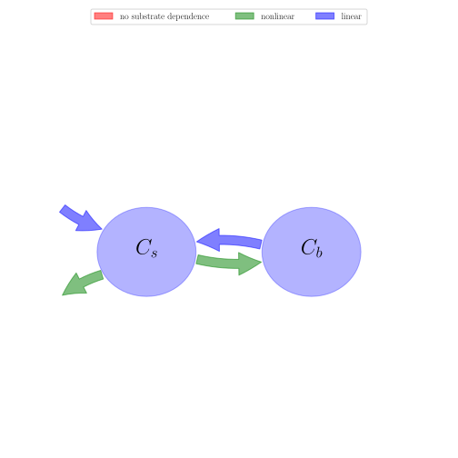

# General Overview

 

This report is the result of the use of the Python 3.4 package Sympy (for symbolic mathematics), as means to translate published models to a common language. It was created by Holger Metzler (Orcid ID: 0000-0002-8239-1601) on 18/01/2018, and was last modified on _lm_.

## About the model
The model depicted in this document considers soil organic matter decomposition. It was originally described by @Wang2014BG.  

### Abstract
r"A number of nonlinear models have recently been proposed for simulating soil carbon decomposition. Their predictions of soil carbon responses to fresh litter input and warming differ significantly from conventional linear models. Using both stability analysis and numerical simulations, we showed that two of those nonlinear models (a two-pool model and a three-pool model) exhibit damped oscillatory re-sponses to small perturbations. Stability analysis showed the frequency of oscillation is proportional to $\sqrt{(\varepsilon^{-1}-1)\,K_{s/V_s}}$ in the two-pool model, and to $\sqrt{(\varepsilon^{-1}-1)\,K_{l/V_l}}$ in the three-pool model, where $\varepsilon$ is microbial growth efficiency, $K_{s}$ and $K_{l}$ are the half saturation constants of soil and litter carbon, respectively, and $V_{s}$ and $V_{l}$ are the maximal rates of carbon decomposition per unit of microbial biomass for soil and litter carbon, respectively. For both models, the oscillation has a period of between 5 and 15 years depending on other parameter values, and has smaller amplitude at soil temperatures between 0 and 15 C. In addition, the equilibrium pool sizes of litter or soil carbon are insensitive to carbon inputs in the nonlinear model, but are proportional to carbon input in the conventional linear model. Under warming, the microbial biomass and litter carbon pools simulated by the nonlinear models can increase or decrease, depending whether $\varepsilon$ varies with temperature. In contrast, the conventional linear models always simulate a decrease in both microbial and litter carbon pools with warming. Based on the evidence available, we concluded that the oscillatory behavior and insensitivity of soil carbon to carbon input are notable features in these nonlinear models that are somewhat unrealistic. We recommend that a better model for capturing the soil carbon dynamics over decadal to centennial timescales would combine the sensitivity of the conventional models to carbon influx with the flexible response to warming of the nonlinear model."

### Keywords
differential equations, nonlinear, time invariant

### Principles
mass balance, substrate dependence of decomposition, heterogeneity of speed of decay, internal transformations of organic matter, substrate interaction

# State Variables
The following table contains the available information regarding this section:

Name|Description|Units
:-----:|:-----|:-----:
$C_{s}$|soil organic matter|$g C m^{-2}$
$C_{b}$|microbial biomass|$g C m^{-2}$

Table: Information on State Variables

# Additional Parameters
The following table contains the available information regarding this section:

Name|Description|Type|Units
:-----:|:-----|:-----:|:-----:
$\epsilon$|microbial growth efficiency|parameter|-
$V_{s}$|maximum rate of soil carbon assimilation per unit microbial biomass per year|parameter|$year^{-1}$
$K_{s}$|half-saturation constant for soil carbon assimilation by microbial biomass|parameter|$g C m^{-2}$

Table: Information on Additional Parameters

# Decomposition Rates
The following table contains the available information regarding this section:

Name|Description|Expressions|Type|Units
:-----:|:-----|:-----:|:-----:|:-----:
$\lambda$|soil organic matter decomposition rate|$\lambda=\frac{C_{b}\cdot V_{s}}{C_{s}+K_{s}}$|-|-
$\mu_{b}$|turnover rate of microbial biomass per year|-|parameter|$year^{-1}$

Table: Information on Decomposition Rates

# Input Components
The following table contains the available information regarding this section:

Name|Description|Type|Units
:-----:|:-----|:-----:|:-----:
$F_{NPP}$|carbon influx into soil|parameter|$g C m^{-2} year^{-1}$

Table: Information on Input Components

# Components
The following table contains the available information regarding this section:

Name|Description|Expressions
:-----:|:-----|:-----:
$C$|carbon content|$C=\left[\begin{matrix}C_{s}\\C_{b}\end{matrix}\right]$
$I$|input vector|$I=\left[\begin{matrix}F_{NPP}\\0\end{matrix}\right]$
$A$|decomposition operator|$A=\left[\begin{matrix}-\lambda &\mu_{b}\\\epsilon\cdot\lambda & -\mu_{b}\end{matrix}\right]$
$f_{s}$|the right hand side of the ode|$f_{s}=I+A\cdot C$

Table: Information on Components

## Pool model representation
<table><thead><tr><th></th><th>Flux description</th></tr></thead><tbody><tr><td align=center, style='vertical-align: middle'>
 

 **Figure 1:** *Pool model representation* 

</td><td align=left style='vertical-align: middle'>
#### Input fluxes
$C_{s}: F_{NPP}$  

#### Output fluxes
$C_{s}: -\frac{C_{b}\cdot C_{s}\cdot V_{s}}{C_{s} + K_{s}}\cdot\left(\epsilon - 1\right)$  

#### Internal fluxes
$C_{s} \rightarrow C_{b}: \frac{C_{b}\cdot C_{s}\cdot V_{s}}{C_{s} + K_{s}}\cdot\epsilon$  $C_{b} \rightarrow C_{s}: C_{b}\cdot\mu_{b}$  </td></tr></tbody></table>
## The right hand side of the ODE
$\left[\begin{matrix}-\frac{C_{b}\cdot C_{s}\cdot V_{s}}{C_{s} + K_{s}} + C_{b}\cdot\mu_{b} + F_{NPP}\\\frac{C_{b}\cdot C_{s}\cdot V_{s}}{C_{s} + K_{s}}\cdot\epsilon - C_{b}\cdot\mu_{b}\end{matrix}\right]$

## The Jacobian (derivative of the ODE w.r.t. state variables)
$\left[\begin{matrix}\frac{C_{b}\cdot C_{s}\cdot V_{s}}{\left(C_{s} + K_{s}\right)^{2}} -\frac{C_{b}\cdot V_{s}}{C_{s} + K_{s}} & -\frac{C_{s}\cdot V_{s}}{C_{s} + K_{s}} +\mu_{b}\\-\frac{C_{b}\cdot C_{s}\cdot V_{s}}{\left(C_{s} + K_{s}\right)^{2}}\cdot\epsilon +\frac{C_{b}\cdot V_{s}\cdot\epsilon}{C_{s} + K_{s}} &\frac{C_{s}\cdot V_{s}\cdot\epsilon}{C_{s} + K_{s}} -\mu_{b}\end{matrix}\right]$

## Steady state formulas
$C_{s} = \frac{K_{s}\cdot\mu_{b}}{V_{s}\cdot\epsilon -\mu_{b}}$  $C_{b} = -\frac{F_{NPP}\cdot\epsilon}{\mu_{b}\cdot\left(\epsilon - 1\right)}$    

# References
