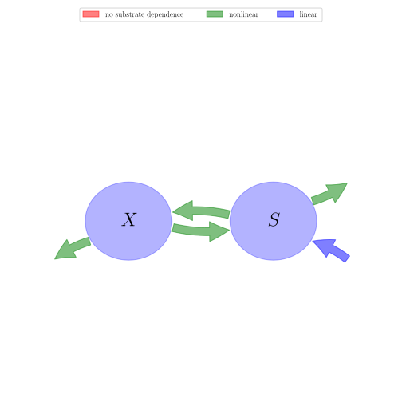
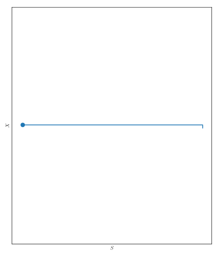
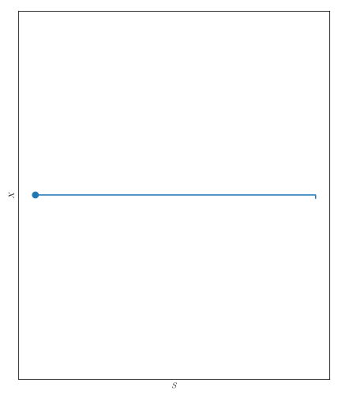

# General Overview

 

This report is the result of the use of the Python 3.4 package Sympy (for symbolic mathematics), as means to translate published models to a common language. It was created by Holger Metzler (Orcid ID: 0000-0002-8239-1601) on 15/03/2016, and was last modified on _lm_.

## About the model
The model depicted in this document considers soil organic matter decomposition. It was originally described by @Zelenev2000MicrobialEcology.  

### Abstract
Previously, we discovered the phenomenon of wavelike spatial distributions of bacterial populations and total organic carbon (TOC) along wheat roots. We hypothesized that the principal mechanism underlying this phenomenon is a cycle of growth, death, autolysis, and regrowth of bacteria in response to a moving substrate source (root tip). The aims of this research were (i) to create a simulation model describing wavelike patterns of microbial populations in the rhizosphere, and (ii) to investigate by simulation the conditions leading to these patterns. After transformation of observed spatial data to presumed temporal data based on root growth rates, a simulation model was constructed with the Runge-Kutta integration method to simulate the dynamics of colony-forming bacterial biomass, with growth and death rates depending on substrate content so that the rate curves crossed over at a substrate concentration within the range of substrate availability in the model. This model was named "BACWAVE," standing for "bacterial waves." Cyclic dynamics of bacteria were generated by the model that were translated into traveling spatial waves along a moving nutrient source. Parameter values were estimated from calculated initial substrate concentrations and observed microbial distributions along wheat roots by an iterative optimization method. The kinetic parameter estimates fell in the range of values reported in the literature. Calculated microbial biomass values produced spatial fluctuations similar to those obtained for experimental biomass data derived from colony forming units. Concentrations of readily utilizable substrate calculated from biomass dynamics did not mimic measured concentrations of TOC, which consist not only of substrate but also various polymers and humic acids. In conclusion, a moving pulse of nutrients resulting in cycles of growth and death of microorganisms can indeed explain the observed phenomenon of moving microbial waves along roots. This is the first report of wavelike dynamics of microorganisms in soil along a root resulting from the interaction of a single organism group with its substrate.

### Keywords
differential equations, nonlinear, time variant

### Principles
mass balance, substrate dependence of decomposition, heterogeneity of speed of decay, internal transformations of organic matter, substrate interactions

### Available parameter values

Abbreviation|Description
:-----|:-----
Set 1|original values from linked model (no nitrogen cycle considered in this model here)

Table:  Information on given parameter sets

### Available initial values

Abbreviation|Description
:-----|:-----
Low|standard version of BACWAVE, optimized to simulate bacterial biomass along wheat roots
Medium|standard version of BACWAVE, optimized to simulate bacterial biomass along wheat roots
High|standard version of BACWAVE, optimized to simulate bacterial biomass along wheat roots

Table:  Information on given sets of initial values

# State Variables
The following table contains the available information regarding this section:

Name|Description|Units|Low|Medium|Values    High
:-----:|:-----|:-----:|:-----:|:-----:|:-----:
$X$|microbial biomass pool|$\mu gC cm^{-3}$|$0.5$|$1.0$|$1.5$
$S$|substrate pool|$\mu gC cm^{-3}$|$1.5$|$2.5$|$4.0$

Table: Information on State Variables

# Parameters
The following table contains the available information regarding this section:

Name|Description|Type|Units|Values    Set 1
:-----:|:-----|:-----:|:-----:|:-----:
$\mu_{max}$|maximal relative growth rate of bacteria|parameter|$hr^{-1}$|$0.063$
$D_{max}$|maximal relative death rate of bacteria|parameter|$hr^{-1}$|$0.26$
$K_{s}$|substrate constant for growth|parameter|$\mu gC cm^{-3}$|$3.0$
$K_{d}$|substrate constant for death of bacteria|parameter|$\mu gC cm^{-3}$|$14.5$
$K_{r}$|fraction of dead biomass recycling to substrate|parameter|-|$0.4$
$\theta$|soil water content|parameter|$ml\text{ solution }cm^{-3}\text{ soil}$|$0.23$
$Y$|yield coefficient for bacteria|parameter|-|$0.44$
$ExuM$|maximal exudation rate|parameter|$\mu gC hr^{-1}cm^{-3}$|$8$
$ExuT$|time constant for exudation, responsible for duration of exudation|parameter|$hr^{-1}$|$0.8$
$BGF$|constant bakground flux of substrate|parameter|$\mu g C cm^{-3}hr^{-1}$|$0.15$

Table: Information on Parameters

# Additional Variables
The following table contains the available information regarding this section:

Name|Description|Expressions|key|Type|Units|Values    Set 1
:-----:|:-----|:-----:|:-----:|:-----:|:-----:|:-----:
$t$|time|-|time_symbol|variable|$hr$|-
$\mu_{S}$|relative growth rate of bacteria (dependent on substrate concentration)|$\mu_{S}=\frac{\mu_{max}\cdot S}{K_{s}\cdot \theta+S}$|-|variable|$hr^{-1}$|-
$Exu$|exudation rate (dependent on time)|$Exu=ExuM\cdot \operatorname{exp}\left(- ExuT\cdot t\right)$|-|variable|$hr^{-1}$|-

Table: Information on Additional Variables

# Components
The following table contains the available information regarding this section:

Name|Description|Expressions|Values    key
:-----:|:-----|:-----:|:-----:
$C$|carbon content|$C=\left[\begin{matrix}X\\S\end{matrix}\right]$|state_vector
$I$|input vector|$I=\left[\begin{matrix}0\\BGF + Exu\end{matrix}\right]$|input_vector
$T$|transition operator|$T=\left[\begin{matrix}-1 & Y\\K_{r} & -1\end{matrix}\right]$|trans_op
$N$|decomposition operator|$N=\left[\begin{matrix}\frac{D_{max}\cdot K_{d}}{K_{d} +\frac{S}{\theta}} & 0\\0 &\frac{X\cdot\mu_{max}}{Y\cdot\left(K_{s}\cdot\theta + S\right)}\end{matrix}\right]$|decomp_op_nonlin
$f_{s}$|the right hand side of the ode|$f_{s}=I+T\cdot N\cdot C$|state_vector_derivative

Table: Information on Components

## Pool model representation
<table><thead><tr><th></th><th>Flux description</th></tr></thead><tbody><tr><td align=center, style='vertical-align: middle'>
 

 **Figure 1:** *Pool model representation* 

</td><td align=left style='vertical-align: middle'>
#### Input fluxes
$S: BGF + ExuM\cdot e^{- ExuT\cdot t}$  

#### Output fluxes
$X: -\frac{D_{max}\cdot K_{d}\cdot X\cdot\theta}{K_{d}\cdot\theta + S}\cdot\left(K_{r} - 1\right)$  $S: -\frac{S\cdot X\cdot\mu_{max}\cdot\left(Y - 1\right)}{Y\cdot\left(K_{s}\cdot\theta + S\right)}$  

#### Internal fluxes
$X > S: \frac{D_{max}\cdot K_{d}\cdot K_{r}\cdot X\cdot\theta}{K_{d}\cdot\theta + S}$  $S > X: \frac{S\cdot X\cdot\mu_{max}}{K_{s}\cdot\theta + S}$  </td></tr></tbody></table>
## The right hand side of the ODE
$\left[\begin{matrix}-\frac{D_{max}\cdot K_{d}\cdot X}{K_{d} +\frac{S}{\theta}} +\frac{S\cdot X\cdot\mu_{max}}{K_{s}\cdot\theta + S}\\BGF +\frac{D_{max}\cdot K_{d}\cdot K_{r}}{K_{d} +\frac{S}{\theta}}\cdot X + ExuM\cdot e^{- ExuT\cdot t} -\frac{S\cdot X\cdot\mu_{max}}{Y\cdot\left(K_{s}\cdot\theta + S\right)}\end{matrix}\right]$

## The Jacobian (derivative of the ODE w.r.t. state variables)
$\left[\begin{matrix}-\frac{D_{max}\cdot K_{d}}{K_{d} +\frac{S}{\theta}} +\frac{S\cdot\mu_{max}}{K_{s}\cdot\theta + S} &\frac{D_{max}\cdot K_{d}\cdot X}{\theta\cdot\left(K_{d} +\frac{S}{\theta}\right)^{2}} -\frac{S\cdot X\cdot\mu_{max}}{\left(K_{s}\cdot\theta + S\right)^{2}} +\frac{X\cdot\mu_{max}}{K_{s}\cdot\theta + S}\\\frac{D_{max}\cdot K_{d}\cdot K_{r}}{K_{d} +\frac{S}{\theta}} -\frac{S\cdot\mu_{max}}{Y\cdot\left(K_{s}\cdot\theta + S\right)} & -\frac{D_{max}\cdot K_{d}\cdot K_{r}\cdot X}{\theta\cdot\left(K_{d} +\frac{S}{\theta}\right)^{2}} +\frac{S\cdot X\cdot\mu_{max}}{Y\cdot\left(K_{s}\cdot\theta + S\right)^{2}} -\frac{X\cdot\mu_{max}}{Y\cdot\left(K_{s}\cdot\theta + S\right)}\end{matrix}\right]$

## Model simulations

 

 **Model run 1 - solutions:** *Initial values: Low, Parameter set: Set 1, Time step: 0.1* 

 

 **Model run 1 - phase planes:** *Initial values: Low, Parameter set: Set 1, Start: 0, End: 2000, Time step: 0.1* 

 

 **Model run 1 - system-age-distributions:** *Initial values: Low, Parameter set: Set 1, Start: 0, End: 2000, Time step: 0.1* 

 

 **Model run 2 - solutions:** *Initial values: Medium, Parameter set: Set 1, Time step: 0.1* 

 

 **Model run 2 - phase planes:** *Initial values: Medium, Parameter set: Set 1, Start: 0, End: 2000, Time step: 0.1* 

 

 **Model run 2 - system-age-distributions:** *Initial values: Medium, Parameter set: Set 1, Start: 0, End: 2000, Time step: 0.1* 

 

 **Model run 3 - solutions:** *Initial values: High, Parameter set: Set 1, Time step: 0.1* 

 

 **Model run 3 - phase planes:** *Initial values: High, Parameter set: Set 1, Start: 0, End: 2000, Time step: 0.1* 

 

 **Model run 3 - system-age-distributions:** *Initial values: High, Parameter set: Set 1, Start: 0, End: 2000, Time step: 0.1* 

# References
