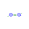
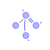
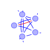
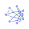
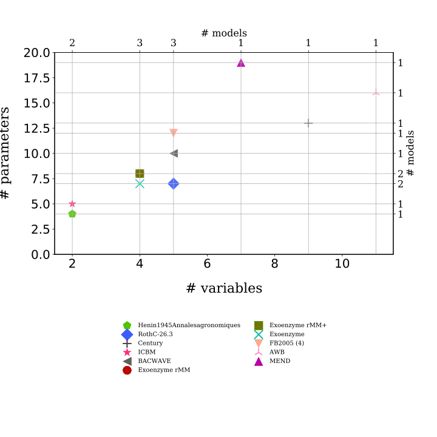

# Overview of the models

<table>
<thead><tr class="header">
<th></th><th align="left">Model</th>
<th align="center"># Variables</th>
<th align="center"># Parameters</th>
<th align="center"># Constants</th>
<th align="center">Structure</th>
<th align="center">Right hand side of ODE</th>
<th align="left">Source</th>
</tr>
</thead>
<tbody>
<tr class="even">
<td align="left"> </td><td align="left"><a href="Henin1945Annalesagronomiques-S0001/Report.html" target="_blank">Henin1945Annalesagronomiques</a></td>
<td align="center" onclick="ausklappen('comp_table_0');ausklappen('rhs_0')">2</td>
<td align="center" onclick="ausklappen('comp_table_0');ausklappen('rhs_0')">4</td>
<td align="center" onclick="ausklappen('comp_table_0');ausklappen('rhs_0')"></td>
<td align="center" onclick="ausklappen('comp_table_0');ausklappen('rhs_0')">$f_{s}=I+A_{GeM}\,C$

<table>
<tr class="header">
<th align="center">Component</th>
<th align="left">Description</th>
<th align="center">Expressions</th>
</tr>
</thead>
<tbody>
<tr>
<td align="center">$C$</td>
<td align="left">carbon content</td>
<td align="center">$C=\left[\begin{matrix}A\\B\end{matrix}\right]$</td>
</tr>
<tr>
<td align="center">$I$</td>
<td align="left">input vector</td>
<td align="center">$I=\left[\begin{matrix}m\\0\end{matrix}\right]$</td>
</tr>
<tr>
<td align="center">$A_{GeM}$</td>
<td align="left">decomposition operator</td>
<td align="center">$A_{GeM}=\left[\begin{matrix}-\alpha & 0\\K\cdot\alpha & -\beta\end{matrix}\right]$</td>
</tr>
<tr>
<td align="center">$f_{s}$</td>
<td align="left">the right hand side of the ode</td>
<td align="center">$f_{s}=I+A_{GeM}\,C$</td>
</tr>
</tbody>
</table>
</td>

<td align="center" style="vertical-align:middle" onclick="ausklappen('comp_table_0');ausklappen('rhs_0')">
$\left[\begin{matrix}- A\cdot\alpha + m\\A\cdot K\cdot\alpha - B\cdot\beta\end{matrix}\right]$
</td>
<td align="left" onclick="ausklappen('comp_table_0');ausklappen('rhs_0')">@Henin1945Annalesagronomiques</td>
</tr>
<tbody>
<tr class="odd">
<td align="left"> </td><td align="left"><a href="Jenkinson1977SoilScience-S0003/Report.html" target="_blank">RothC-26.3</a></td>
<td align="center" onclick="ausklappen('comp_table_1');ausklappen('rhs_1')">5</td>
<td align="center" onclick="ausklappen('comp_table_1');ausklappen('rhs_1')">7</td>
<td align="center" onclick="ausklappen('comp_table_1');ausklappen('rhs_1')"></td>
<td align="center" onclick="ausklappen('comp_table_1');ausklappen('rhs_1')">$f_{s}=I+\xi\,A\,C$

<table>
<tr class="header">
<th align="center">Component</th>
<th align="left">Description</th>
<th align="center">Expressions</th>
</tr>
</thead>
<tbody>
<tr>
<td align="center">$C$</td>
<td align="left">carbon content</td>
<td align="center">$C=\left[\begin{matrix}C_{1}\\C_{2}\\C_{3}\\C_{4}\\C_{5}\end{matrix}\right]$</td>
</tr>
<tr>
<td align="center">$I$</td>
<td align="left">input vector</td>
<td align="center">$I=\left[\begin{matrix}J\cdot\gamma\\J\cdot\left(-\gamma + 1\right)\\0\\0\\0\end{matrix}\right]$</td>
</tr>
<tr>
<td align="center">$\xi$</td>
<td align="left">environmental effects multiplier</td>
<td align="center">$\xi=f_{T}\,f_{W}$</td>
</tr>
<tr>
<td align="center">$A$</td>
<td align="left">decomposition operator</td>
<td align="center">$A=\left[\begin{matrix}- k_{1} & 0 & 0 & 0 & 0\\0 & - k_{2} & 0 & 0 & 0\\a\cdot k_{1} & a\cdot k_{2} & a\cdot k_{3} - k_{3} & a\cdot k_{4} & 0\\b\cdot k_{1} & b\cdot k_{2} & b\cdot k_{3} & b\cdot k_{4} - k_{4} & 0\\0 & 0 & 0 & 0 & 0\end{matrix}\right]$</td>
</tr>
<tr>
<td align="center">$f_{s}$</td>
<td align="left">the right hand side of the ode</td>
<td align="center">$f_{s}=I+\xi\,A\,C$</td>
</tr>
</tbody>
</table>
</td>

<td align="center" style="vertical-align:middle" onclick="ausklappen('comp_table_1');ausklappen('rhs_1')">
$\left[\begin{matrix}- C_{1}\cdot f_{T}\cdot f_{W}\cdot k_{1} +\frac{DR\cdot J}{DR + 1}\\- C_{2}\cdot f_{T}\cdot f_{W}\cdot k_{2} + J\cdot\left(-\frac{DR}{DR + 1} + 1\right)\\\frac{0.46\cdot C_{1}\cdot f_{T}\cdot f_{W}\cdot k_{1}}{4.0895 + 2.672\cdot e^{- 0.0786\cdot pClay}} +\frac{0.46\cdot C_{2}\cdot f_{T}\cdot f_{W}\cdot k_{2}}{4.0895 + 2.672\cdot e^{- 0.0786\cdot pClay}} + C_{3}\cdot f_{T}\cdot f_{W}\cdot\left(- k_{3} +\frac{0.46\cdot k_{3}}{4.0895 + 2.672\cdot e^{- 0.0786\cdot pClay}}\right) +\frac{0.46\cdot C_{4}\cdot f_{T}\cdot f_{W}\cdot k_{4}}{4.0895 + 2.672\cdot e^{- 0.0786\cdot pClay}}\\\frac{0.54\cdot C_{1}\cdot f_{T}\cdot f_{W}\cdot k_{1}}{4.0895 + 2.672\cdot e^{- 0.0786\cdot pClay}} +\frac{0.54\cdot C_{2}\cdot f_{T}\cdot f_{W}\cdot k_{2}}{4.0895 + 2.672\cdot e^{- 0.0786\cdot pClay}} +\frac{0.54\cdot C_{3}\cdot f_{T}\cdot f_{W}\cdot k_{3}}{4.0895 + 2.672\cdot e^{- 0.0786\cdot pClay}} + C_{4}\cdot f_{T}\cdot f_{W}\cdot\left(- k_{4} +\frac{0.54\cdot k_{4}}{4.0895 + 2.672\cdot e^{- 0.0786\cdot pClay}}\right)\\0\end{matrix}\right]$
</td>
<td align="left" onclick="ausklappen('comp_table_1');ausklappen('rhs_1')">@Jenkinson1977SoilScience</td>
</tr>
<tbody>
<tr class="even">
<td align="left"> </td><td align="left"><a href="Parton1987SoilSciSocAmJ-S0004/Report.html" target="_blank">Century</a></td>
<td align="center" onclick="ausklappen('comp_table_2');ausklappen('rhs_2')">9</td>
<td align="center" onclick="ausklappen('comp_table_2');ausklappen('rhs_2')">13</td>
<td align="center" onclick="ausklappen('comp_table_2');ausklappen('rhs_2')"></td>
<td align="center" onclick="ausklappen('comp_table_2');ausklappen('rhs_2')">$f_{s}=I+\xi\,A\,C$

<table>
<tr class="header">
<th align="center">Component</th>
<th align="left">Description</th>
<th align="center">Expressions</th>
</tr>
</thead>
<tbody>
<tr>
<td align="center">$C$</td>
<td align="left">carbon content</td>
<td align="center">$C=\left[\begin{matrix}C_{1}\\C_{2}\\C_{3}\\C_{4}\\C_{5}\\C_{6}\\C_{7}\end{matrix}\right]$</td>
</tr>
<tr>
<td align="center">$I$</td>
<td align="left">input vector</td>
<td align="center">$I=\left[\begin{matrix}F_{s}\cdot J_{1}\\F_{m}\cdot J_{1}\\F_{s}\cdot J_{2}\\F_{m}\cdot J_{2}\\0\\0\\0\end{matrix}\right]$</td>
</tr>
<tr>
<td align="center">$\xi$</td>
<td align="left">environmental effects multiplier (DEFAG)</td>
<td align="center">$\xi=f_{T}\,f_{W}$</td>
</tr>
<tr>
<td align="center">$A$</td>
<td align="left">decomposition operator</td>
<td align="center">$A=\left[\begin{matrix}- k_{1} & 0 & 0 & 0 & 0 & 0 & 0\\0 & - K_{2} & 0 & 0 & 0 & 0 & 0\\0 & 0 & - k_{3} & 0 & 0 & 0 & 0\\0 & 0 & 0 & - K_{4} & 0 & 0 & 0\\\alpha_{51}\cdot k_{1} & 0.45\cdot K_{2} &\alpha_{53}\cdot k_{3} & 0.45\cdot K_{4} & - k_{5} & 0.42\cdot K_{6} & 0.45\cdot K_{7}\\\alpha_{61}\cdot k_{1} & 0 &\alpha_{63}\cdot k_{3} & 0 &\alpha_{65}\cdot k_{5} & - K_{6} & 0\\0 & 0 & 0 & 0 & 0.004\cdot k_{5} & 0.03\cdot K_{6} & - K_{7}\end{matrix}\right]$</td>
</tr>
<tr>
<td align="center">$f_{s}$</td>
<td align="left">the right hand side of the ode</td>
<td align="center">$f_{s}=I+\xi\,A\,C$</td>
</tr>
</tbody>
</table>
</td>

<td align="center" style="vertical-align:middle" onclick="ausklappen('comp_table_2');ausklappen('rhs_2')">
$\left[\begin{matrix}- C_{1}\cdot K_{1}\cdot f_{T}\cdot f_{W}\cdot e^{- 3\cdot Ls} + J_{1}\cdot\left(0.018\cdot LN + 0.15\right)\\- C_{2}\cdot K_{2}\cdot f_{T}\cdot f_{W} + J_{1}\cdot\left(- 0.018\cdot LN + 0.85\right)\\- C_{3}\cdot K_{3}\cdot f_{T}\cdot f_{W}\cdot e^{- 3\cdot Ls} + J_{2}\cdot\left(0.018\cdot LN + 0.15\right)\\- C_{4}\cdot K_{4}\cdot f_{T}\cdot f_{W} + J_{2}\cdot\left(- 0.018\cdot LN + 0.85\right)\\C_{1}\cdot K_{1}\cdot f_{T}\cdot f_{W}\cdot\left(- 0.55\cdot A_{l} + 0.55\right)\cdot e^{- 3\cdot Ls} + 0.45\cdot C_{2}\cdot K_{2}\cdot f_{T}\cdot f_{W} + C_{3}\cdot K_{3}\cdot f_{T}\cdot f_{W}\cdot\left(- 0.45\cdot A_{l} + 0.45\right)\cdot e^{- 3\cdot Ls} + 0.45\cdot C_{4}\cdot K_{4}\cdot f_{T}\cdot f_{W} - C_{5}\cdot K_{5}\cdot f_{T}\cdot f_{W}\cdot\left(- 0.75\cdot Tx + 1\right) + 0.42\cdot C_{6}\cdot K_{6}\cdot f_{T}\cdot f_{W} + 0.45\cdot C_{7}\cdot K_{7}\cdot f_{T}\cdot f_{W}\\0.7\cdot A_{l}\cdot C_{1}\cdot K_{1}\cdot f_{T}\cdot f_{W}\cdot e^{- 3\cdot Ls} + 0.7\cdot A_{l}\cdot C_{3}\cdot K_{3}\cdot f_{T}\cdot f_{W}\cdot e^{- 3\cdot Ls} + C_{5}\cdot K_{5}\cdot f_{T}\cdot f_{W}\cdot\left(- 0.75\cdot Tx + 1\right)\cdot\left(0.68\cdot Tx + 0.146\right) - C_{6}\cdot K_{6}\cdot f_{T}\cdot f_{W}\\0.004\cdot C_{5}\cdot K_{5}\cdot f_{T}\cdot f_{W}\cdot\left(- 0.75\cdot Tx + 1\right) + 0.03\cdot C_{6}\cdot K_{6}\cdot f_{T}\cdot f_{W} - C_{7}\cdot K_{7}\cdot f_{T}\cdot f_{W}\end{matrix}\right]$
</td>
<td align="left" onclick="ausklappen('comp_table_2');ausklappen('rhs_2')">@Parton1987SoilSciSocAmJ</td>
</tr>
<tbody>
<tr class="odd">
<td align="left"> </td><td align="left"><a href="Andren1997EcologicalApplications-S0002/Report.html" target="_blank">ICBM</a></td>
<td align="center" onclick="ausklappen('comp_table_3');ausklappen('rhs_3')">2</td>
<td align="center" onclick="ausklappen('comp_table_3');ausklappen('rhs_3')">5</td>
<td align="center" onclick="ausklappen('comp_table_3');ausklappen('rhs_3')"></td>
<td align="center" onclick="ausklappen('comp_table_3');ausklappen('rhs_3')">$f_{s}=I+\xi\,T\,N\,C$

<table>
<tr class="header">
<th align="center">Component</th>
<th align="left">Description</th>
<th align="center">Expressions</th>
</tr>
</thead>
<tbody>
<tr>
<td align="center">$C$</td>
<td align="left">carbon content</td>
<td align="center">$C=\left[\begin{matrix}Y\\O\end{matrix}\right]$</td>
</tr>
<tr>
<td align="center">$I$</td>
<td align="left">input vector</td>
<td align="center">$I=\left[\begin{matrix}i\\0\end{matrix}\right]$</td>
</tr>
<tr>
<td align="center">$\xi$</td>
<td align="left">environmental effects multiplier</td>
<td align="center">$\xi=r$</td>
</tr>
<tr>
<td align="center">$T$</td>
<td align="left">transition operator</td>
<td align="center">$T=\left[\begin{matrix}-1 & 0\\h & -1\end{matrix}\right]$</td>
</tr>
<tr>
<td align="center">$N$</td>
<td align="left">decomposition operator</td>
<td align="center">$N=\left[\begin{matrix}k_{1} & 0\\0 & k_{2}\end{matrix}\right]$</td>
</tr>
<tr>
<td align="center">$f_{s}$</td>
<td align="left">the right hand side of the ode</td>
<td align="center">$f_{s}=I+\xi\,T\,N\,C$</td>
</tr>
</tbody>
</table>
</td>

<td align="center" style="vertical-align:middle" onclick="ausklappen('comp_table_3');ausklappen('rhs_3')">
$\left[\begin{matrix}- Y\cdot k_{1}\cdot r + i\\- O\cdot k_{2}\cdot r + Y\cdot h\cdot k_{1}\cdot r\end{matrix}\right]$
</td>
<td align="left" onclick="ausklappen('comp_table_3');ausklappen('rhs_3')">@Andren1997EcologicalApplications</td>
</tr>
<tbody>
<tr class="even">
<td align="left"> </td><td align="left"><a href="Zelenev2000MicrobialEcology-S0008/Report.html" target="_blank">BACWAVE</a></td>
<td align="center" onclick="ausklappen('comp_table_4');ausklappen('rhs_4')">5</td>
<td align="center" onclick="ausklappen('comp_table_4');ausklappen('rhs_4')">10</td>
<td align="center" onclick="ausklappen('comp_table_4');ausklappen('rhs_4')"></td>
<td align="center" onclick="ausklappen('comp_table_4');ausklappen('rhs_4')">$f_{s}=I+T\,N\,C$

<table>
<tr class="header">
<th align="center">Component</th>
<th align="left">Description</th>
<th align="center">Expressions</th>
</tr>
</thead>
<tbody>
<tr>
<td align="center">$C$</td>
<td align="left">carbon content</td>
<td align="center">$C=\left[\begin{matrix}X\\S\end{matrix}\right]$</td>
</tr>
<tr>
<td align="center">$I$</td>
<td align="left">input vector</td>
<td align="center">$I=\left[\begin{matrix}0\\BGF + Exu\end{matrix}\right]$</td>
</tr>
<tr>
<td align="center">$T$</td>
<td align="left">transition operator</td>
<td align="center">$T=\left[\begin{matrix}-1 & Y\\K_{r} & -1\end{matrix}\right]$</td>
</tr>
<tr>
<td align="center">$N$</td>
<td align="left">decomposition operator</td>
<td align="center">$N=\left[\begin{matrix}\frac{D_{max}\cdot K_{d}}{K_{d} +\frac{S}{\theta}} & 0\\0 &\frac{X\cdot\mu_{max}}{Y\cdot\left(K_{s}\cdot\theta + S\right)}\end{matrix}\right]$</td>
</tr>
<tr>
<td align="center">$f_{s}$</td>
<td align="left">the right hand side of the ode</td>
<td align="center">$f_{s}=I+T\,N\,C$</td>
</tr>
</tbody>
</table>
</td>

<td align="center" style="vertical-align:middle" onclick="ausklappen('comp_table_4');ausklappen('rhs_4')">
$\left[\begin{matrix}-\frac{D_{max}\cdot K_{d}\cdot X}{K_{d} +\frac{S}{\theta}} +\frac{S\cdot X\cdot\mu_{max}}{K_{s}\cdot\theta + S}\\BGF +\frac{D_{max}\cdot K_{d}\cdot K_{r}}{K_{d} +\frac{S}{\theta}}\cdot X + ExuM\cdot e^{- ExuT\cdot t} -\frac{S\cdot X\cdot\mu_{max}}{Y\cdot\left(K_{s}\cdot\theta + S\right)}\end{matrix}\right]$
</td>
<td align="left" onclick="ausklappen('comp_table_4');ausklappen('rhs_4')">@Zelenev2000MicrobialEcology</td>
</tr>
<tbody>
<tr class="odd">
<td align="left"> </td><td align="left"><a href="Schimel2003SoilBiologyandBiochemistry-S0006/Report.html" target="_blank">Exoenzyme rMM</a></td>
<td align="center" onclick="ausklappen('comp_table_5');ausklappen('rhs_5')">4</td>
<td align="center" onclick="ausklappen('comp_table_5');ausklappen('rhs_5')">8</td>
<td align="center" onclick="ausklappen('comp_table_5');ausklappen('rhs_5')"></td>
<td align="center" onclick="ausklappen('comp_table_5');ausklappen('rhs_5')">$f_{s}=T\,N\,C$

<table>
<tr class="header">
<th align="center">Component</th>
<th align="left">Description</th>
<th align="center">Expressions</th>
</tr>
</thead>
<tbody>
<tr>
<td align="center">$C$</td>
<td align="left">carbon content</td>
<td align="center">$C=\left[\begin{matrix}S\\D\\M\\E\end{matrix}\right]$</td>
</tr>
<tr>
<td align="center">$T$</td>
<td align="left">transition operator</td>
<td align="center">$T=\left[\begin{matrix}-1 & 0 & 0 & 0\\1 & -1 &\frac{K_{r}\cdot k_{t}}{SUE\cdot k_{m} + k_{t}} & 0\\0 & - K_{e} + SUE & -1 & 0\\0 & K_{e} & 0 & -1\end{matrix}\right]$</td>
</tr>
<tr>
<td align="center">$N$</td>
<td align="left">decomposition operator</td>
<td align="center">$N=\left[\begin{matrix}\frac{D_{C}}{S} & 0 & 0 & 0\\0 & 1 & 0 & 0\\0 & 0 & SUE\cdot k_{m} + k_{t} & 0\\0 & 0 & 0 & k_{l}\end{matrix}\right]$</td>
</tr>
<tr>
<td align="center">$f_{s}$</td>
<td align="left">the right hand side of the ode</td>
<td align="center">$f_{s}=T\,N\,C$</td>
</tr>
</tbody>
</table>
</td>

<td align="center" style="vertical-align:middle" onclick="ausklappen('comp_table_5');ausklappen('rhs_5')">
$\left[\begin{matrix}-\frac{E\cdot k_{d}}{E + K_{es}}\\- D +\frac{E\cdot k_{d}}{E + K_{es}} + K_{r}\cdot M\cdot k_{t}\\D\cdot\left(- K_{e} + SUE\right) + M\cdot\left(- SUE\cdot k_{m} - k_{t}\right)\\D\cdot K_{e} - E\cdot k_{l}\end{matrix}\right]$
</td>
<td align="left" onclick="ausklappen('comp_table_5');ausklappen('rhs_5')">@Schimel2003SoilBiologyandBiochemistry</td>
</tr>
<tbody>
<tr class="even">
<td align="left"> </td><td align="left"><a href="Schimel2003SoilBiologyandBiochemistry-S0007/Report.html" target="_blank">Exoenzyme rMM+</a></td>
<td align="center" onclick="ausklappen('comp_table_6');ausklappen('rhs_6')">4</td>
<td align="center" onclick="ausklappen('comp_table_6');ausklappen('rhs_6')">8</td>
<td align="center" onclick="ausklappen('comp_table_6');ausklappen('rhs_6')"></td>
<td align="center" onclick="ausklappen('comp_table_6');ausklappen('rhs_6')">$f_{s}=T\,N\,C$

<table>
<tr class="header">
<th align="center">Component</th>
<th align="left">Description</th>
<th align="center">Expressions</th>
</tr>
</thead>
<tbody>
<tr>
<td align="center">$C$</td>
<td align="left">carbon content</td>
<td align="center">$C=\left[\begin{matrix}S\\D\\M\\E\end{matrix}\right]$</td>
</tr>
<tr>
<td align="center">$T$</td>
<td align="left">transition operator</td>
<td align="center">$T=\left[\begin{matrix}-1 & 0 & 0 & 0\\1 & -1 &\frac{K_{r}\cdot k_{t}}{SUE\cdot k_{m} + k_{t}} & 0\\0 & - K_{e} + SUE & -1 & 0\\0 & K_{e} & 0 & -1\end{matrix}\right]$</td>
</tr>
<tr>
<td align="center">$N$</td>
<td align="left">decomposition operator</td>
<td align="center">$N=\left[\begin{matrix}D_{C} & 0 & 0 & 0\\0 & 1 & 0 & 0\\0 & 0 & SUE\cdot k_{m} + k_{t} & 0\\0 & 0 & 0 & k_{l}\end{matrix}\right]$</td>
</tr>
<tr>
<td align="center">$f_{s}$</td>
<td align="left">the right hand side of the ode</td>
<td align="center">$f_{s}=T\,N\,C$</td>
</tr>
</tbody>
</table>
</td>

<td align="center" style="vertical-align:middle" onclick="ausklappen('comp_table_6');ausklappen('rhs_6')">
$\left[\begin{matrix}-\frac{E\cdot S\cdot k_{d}}{E + K_{es}}\\- D +\frac{E\cdot S\cdot k_{d}}{E + K_{es}} + K_{r}\cdot M\cdot k_{t}\\D\cdot\left(- K_{e} + SUE\right) + M\cdot\left(- SUE\cdot k_{m} - k_{t}\right)\\D\cdot K_{e} - E\cdot k_{l}\end{matrix}\right]$
</td>
<td align="left" onclick="ausklappen('comp_table_6');ausklappen('rhs_6')">@Schimel2003SoilBiologyandBiochemistry</td>
</tr>
<tbody>
<tr class="odd">
<td align="left"> </td><td align="left"><a href="Schimel2003SoilBiologyandBiochemistry-S0005/Report.html" target="_blank">Exoenzyme</a></td>
<td align="center" onclick="ausklappen('comp_table_7');ausklappen('rhs_7')">4</td>
<td align="center" onclick="ausklappen('comp_table_7');ausklappen('rhs_7')">7</td>
<td align="center" onclick="ausklappen('comp_table_7');ausklappen('rhs_7')"></td>
<td align="center" onclick="ausklappen('comp_table_7');ausklappen('rhs_7')">$f_{s}=T\,N\,C$

<table>
<tr class="header">
<th align="center">Component</th>
<th align="left">Description</th>
<th align="center">Expressions</th>
</tr>
</thead>
<tbody>
<tr>
<td align="center">$C$</td>
<td align="left">carbon content</td>
<td align="center">$C=\left[\begin{matrix}S\\D\\M\\E\end{matrix}\right]$</td>
</tr>
<tr>
<td align="center">$T$</td>
<td align="left">transition operator</td>
<td align="center">$T=\left[\begin{matrix}-1 & 0 & 0 & 0\\1 & -1 &\frac{K_{r}\cdot k_{t}}{SUE\cdot k_{m} + k_{t}} & 0\\0 & - K_{e} + SUE & -1 & 0\\0 & K_{e} & 0 & -1\end{matrix}\right]$</td>
</tr>
<tr>
<td align="center">$N$</td>
<td align="left">decomposition operator</td>
<td align="center">$N=\left[\begin{matrix}\frac{E}{S}\cdot k_{d} & 0 & 0 & 0\\0 & 1 & 0 & 0\\0 & 0 & SUE\cdot k_{m} + k_{t} & 0\\0 & 0 & 0 & k_{l}\end{matrix}\right]$</td>
</tr>
<tr>
<td align="center">$f_{s}$</td>
<td align="left">the right hand side of the ode</td>
<td align="center">$f_{s}=T\,N\,C$</td>
</tr>
</tbody>
</table>
</td>

<td align="center" style="vertical-align:middle" onclick="ausklappen('comp_table_7');ausklappen('rhs_7')">
$\left[\begin{matrix}- E\cdot k_{d}\\- D + E\cdot k_{d} + K_{r}\cdot M\cdot k_{t}\\D\cdot\left(- K_{e} + SUE\right) + M\cdot\left(- SUE\cdot k_{m} - k_{t}\right)\\D\cdot K_{e} - E\cdot k_{l}\end{matrix}\right]$
</td>
<td align="left" onclick="ausklappen('comp_table_7');ausklappen('rhs_7')">@Schimel2003SoilBiologyandBiochemistry</td>
</tr>
<tbody>
<tr class="even">
<td align="left"> </td><td align="left"><a href="Fontaine2005Ecologyletters-S0016/Report.html" target="_blank">FB2005 (4)</a></td>
<td align="center" onclick="ausklappen('comp_table_8');ausklappen('rhs_8')">5</td>
<td align="center" onclick="ausklappen('comp_table_8');ausklappen('rhs_8')">12</td>
<td align="center" onclick="ausklappen('comp_table_8');ausklappen('rhs_8')"></td>
<td align="center" onclick="ausklappen('comp_table_8');ausklappen('rhs_8')">$f_{s}=I+A_{GM}\,C$

<table>
<tr class="header">
<th align="center">Component</th>
<th align="left">Description</th>
<th align="center">Expressions</th>
</tr>
</thead>
<tbody>
<tr>
<td align="center">$I$</td>
<td align="left">input vector</td>
<td align="center">$I=\left[\begin{matrix}0\\\Phi_{l}\\0\\0\\\Phi_{i} -\Phi_{o} -\Phi_{up}\end{matrix}\right]$</td>
</tr>
<tr>
<td align="center">$C$</td>
<td align="left">carbon content</td>
<td align="center">$C=\left[\begin{matrix}C_{s}\\C_{f}\\C_{ds}\\C_{df}\\N\end{matrix}\right]$</td>
</tr>
<tr>
<td align="center">$A_{GM}$</td>
<td align="left">decomposition operator</td>
<td align="center">$A_{GM}=\left[\begin{matrix}-\frac{A}{C_{s}}\cdot C_{ds} & 0 & s & s & 0\\0 & - y & 0 & -\frac{\alpha\cdot r}{\alpha -\beta} & -\frac{i}{\alpha -\beta}\\\frac{A}{C_{s}}\cdot C_{ds} & y & - r - s & 0 & 0\\0 & 0 & 0 &\frac{\alpha\cdot r}{\alpha -\beta} - r - s &\frac{i}{\alpha -\beta}\\0 & y\cdot\left(-\alpha +\beta\right) &\alpha\cdot r & 0 & - i\end{matrix}\right]$</td>
</tr>
<tr>
<td align="center">$f_{s}$</td>
<td align="left">the right hand side of the ode</td>
<td align="center">$f_{s}=I+A_{GM}\,C$</td>
</tr>
</tbody>
</table>
</td>

<td align="center" style="vertical-align:middle" onclick="ausklappen('comp_table_8');ausklappen('rhs_8')">
$\left[\begin{matrix}- A\cdot C_{ds} + C_{df}\cdot s + C_{ds}\cdot s\\-\frac{C_{df}\cdot\alpha\cdot r}{\alpha -\beta} - C_{f}\cdot y -\frac{N\cdot i}{\alpha -\beta} +\Phi_{l}\\A\cdot C_{ds} + C_{ds}\cdot\left(- r - s\right) + C_{f}\cdot y\\C_{df}\cdot\left(\frac{\alpha\cdot r}{\alpha -\beta} - r - s\right) +\frac{N\cdot i}{\alpha -\beta}\\C_{ds}\cdot\alpha\cdot r + C_{f}\cdot y\cdot\left(-\alpha +\beta\right) - N\cdot i +\Phi_{i} -\Phi_{o} -\Phi_{up}\end{matrix}\right]$
</td>
<td align="left" onclick="ausklappen('comp_table_8');ausklappen('rhs_8')">@Fontaine2005Ecologyletters</td>
</tr>
<tbody>
<tr class="odd">
<td align="left"> </td><td align="left"><a href="Allison2010NatureGeoscience-S0009/Report.html" target="_blank">AWB</a></td>
<td align="center" onclick="ausklappen('comp_table_9');ausklappen('rhs_9')">11</td>
<td align="center" onclick="ausklappen('comp_table_9');ausklappen('rhs_9')">16</td>
<td align="center" onclick="ausklappen('comp_table_9');ausklappen('rhs_9')"></td>
<td align="center" onclick="ausklappen('comp_table_9');ausklappen('rhs_9')">$f_{s}=I+T_{M}\,N\,C$

<table>
<tr class="header">
<th align="center">Component</th>
<th align="left">Description</th>
<th align="center">Expressions</th>
</tr>
</thead>
<tbody>
<tr>
<td align="center">$C$</td>
<td align="left">carbon content</td>
<td align="center">$C=\left[\begin{matrix}S\\D\\B\\E\end{matrix}\right]$</td>
</tr>
<tr>
<td align="center">$I$</td>
<td align="left">input vector</td>
<td align="center">$I=\left[\begin{matrix}I_{S}\\I_{D}\\0\\0\end{matrix}\right]$</td>
</tr>
<tr>
<td align="center">$T_{M}$</td>
<td align="left">transition operator</td>
<td align="center">$T_{M}=\left[\begin{matrix}-1 & 0 &\frac{a_{BS}\cdot r_{B}}{r_{B} + r_{E}} & 0\\1 & -1 &\frac{r_{B}\cdot\left(- a_{BS} + 1\right)}{r_{B} + r_{E}} & 1\\1 & E_{C} & -1 & 0\\0 & 0 &\frac{r_{E}}{r_{B} + r_{E}} & -1\end{matrix}\right]$</td>
</tr>
<tr>
<td align="center">$N$</td>
<td align="left">decomposition operator</td>
<td align="center">$N=\left[\begin{matrix}\frac{E\cdot V}{K + S} & 0 & 0 & 0\\0 &\frac{B\cdot V_{U}}{D + K_{U}} & 0 & 0\\0 & 0 & r_{B} + r_{E} & 0\\0 & 0 & 0 & r_{L}\end{matrix}\right]$</td>
</tr>
<tr>
<td align="center">$f_{s}$</td>
<td align="left">the right hand side of the ode</td>
<td align="center">$f_{s}=I+T_{M}\,N\,C$</td>
</tr>
</tbody>
</table>
</td>

<td align="center" style="vertical-align:middle" onclick="ausklappen('comp_table_9');ausklappen('rhs_9')">
$\left[\begin{matrix}B\cdot a_{BS}\cdot r_{B} -\frac{E\cdot S\cdot V_{max}\cdot e^{-\frac{E_{a}}{0.008314\cdot T + 2.269722}}}{K_{0} + K_{s}\cdot T + S} + I_{S}\\-\frac{B\cdot D\cdot V_{Umax}\cdot e^{-\frac{E_{aU}}{0.008314\cdot T + 2.269722}}}{D + K_{U0} + K_{Us}\cdot T} + B\cdot r_{B}\cdot\left(- a_{BS} + 1\right) +\frac{E\cdot S\cdot V_{max}\cdot e^{-\frac{E_{a}}{0.008314\cdot T + 2.269722}}}{K_{0} + K_{s}\cdot T + S} + E\cdot r_{L} + I_{D}\\\frac{B\cdot D\cdot V_{Umax}\cdot e^{-\frac{E_{aU}}{0.008314\cdot T + 2.269722}}}{D + K_{U0} + K_{Us}\cdot T}\cdot\left(T\cdot\epsilon_{s} +\epsilon_{0}\right) + B\cdot\left(- r_{B} - r_{E}\right) +\frac{E\cdot S\cdot V_{max}\cdot e^{-\frac{E_{a}}{0.008314\cdot T + 2.269722}}}{K_{0} + K_{s}\cdot T + S}\\B\cdot r_{E} - E\cdot r_{L}\end{matrix}\right]$
</td>
<td align="left" onclick="ausklappen('comp_table_9');ausklappen('rhs_9')">@Allison2010NatureGeoscience</td>
</tr>
<tbody>
<tr class="even">
<td align="left"> </td><td align="left"><a href="Wang2013EcologicalApplications-S0010/Report.html" target="_blank">MEND</a></td>
<td align="center" onclick="ausklappen('comp_table_10');ausklappen('rhs_10')">7</td>
<td align="center" onclick="ausklappen('comp_table_10');ausklappen('rhs_10')">19</td>
<td align="center" onclick="ausklappen('comp_table_10');ausklappen('rhs_10')"></td>
<td align="center" onclick="ausklappen('comp_table_10');ausklappen('rhs_10')">$f_{s}=I+T\,N\,C$

<table>
<tr class="header">
<th align="center">Component</th>
<th align="left">Description</th>
<th align="center">Expressions</th>
</tr>
</thead>
<tbody>
<tr>
<td align="center">$C$</td>
<td align="left">carbon content</td>
<td align="center">$C=\left[\begin{matrix}P\\M\\Q\\B\\D\\EP\\EM\end{matrix}\right]$</td>
</tr>
<tr>
<td align="center">$I$</td>
<td align="left">input vector</td>
<td align="center">$I=\left[\begin{matrix}I_{P}\\0\\0\\0\\I_{D}\\0\\0\end{matrix}\right]$</td>
</tr>
<tr>
<td align="center">$T$</td>
<td align="left">transition operator</td>
<td align="center">$T=\left[\begin{matrix}-1 & 0 & 0 &\frac{F_{E}}{F_{E} + F_{R}}\cdot\left(- g_{D} + 1\right)\cdot\left(- p_{EM} - p_{EP} + 1\right) & 0 & 0 & 0\\- f_{D} + 1 & -1 & 0 & 0 & 0 & 0 & 0\\0 & 0 & -1 & 0 &\frac{F_{A}}{F_{A} + F_{U}} & 0 & 0\\0 & 0 & 0 & -1 &\frac{F_{U}}{F_{A} + F_{U}} & 0 & 0\\f_{D} & 1 & 1 &\frac{F_{E}\cdot g_{D}}{F_{E} + F_{R}}\cdot\left(- p_{EM} - p_{EP} + 1\right) & -1 & 1 & 1\\0 & 0 & 0 &\frac{F_{E}\cdot p_{EP}}{F_{E} + F_{R}} & 0 & -1 & 0\\0 & 0 & 0 &\frac{F_{E}\cdot p_{EM}}{F_{E} + F_{R}} & 0 & 0 & -1\end{matrix}\right]$</td>
</tr>
<tr>
<td align="center">$N$</td>
<td align="left">decomposition operator</td>
<td align="center">$N=\left[\begin{matrix}\frac{EP\cdot V_{P}}{K_{P} + P} & 0 & 0 & 0 & 0 & 0 & 0\\0 &\frac{EM\cdot V_{M}}{K_{M} + M} & 0 & 0 & 0 & 0 & 0\\0 & 0 &\frac{K_{des}}{Q_{max}} & 0 & 0 & 0 & 0\\0 & 0 & 0 & F_{E} + F_{R} & 0 & 0 & 0\\0 & 0 & 0 & 0 & F_{A} + F_{U} & 0 & 0\\0 & 0 & 0 & 0 & 0 & r_{EP} & 0\\0 & 0 & 0 & 0 & 0 & 0 & r_{EM}\end{matrix}\right]$</td>
</tr>
<tr>
<td align="center">$f_{s}$</td>
<td align="left">the right hand side of the ode</td>
<td align="center">$f_{s}=I+T\,N\,C$</td>
</tr>
</tbody>
</table>
</td>

<td align="center" style="vertical-align:middle" onclick="ausklappen('comp_table_10');ausklappen('rhs_10')">
$\left[\begin{matrix}B\cdot m_{R}\cdot\left(- g_{D} + 1\right)\cdot\left(- p_{EM} - p_{EP} + 1\right) -\frac{EP\cdot P\cdot V_{P}}{K_{P} + P} + I_{P}\\-\frac{EM\cdot M\cdot V_{M}}{K_{M} + M} +\frac{EP\cdot P\cdot V_{P}}{K_{P} + P}\cdot\left(- f_{D} + 1\right)\\D\cdot K_{ads}\cdot\left(-\frac{Q}{Q_{max}} + 1\right) -\frac{K_{des}}{Q_{max}}\cdot Q\\\frac{B\cdot D\cdot\left(V_{D} + m_{R}\right)}{E_{C}\cdot\left(D + K_{D}\right)} + B\cdot\left(-\frac{D}{D + K_{D}}\cdot\left(-1 +\frac{1}{E_{C}}\right)\cdot\left(V_{D} + m_{R}\right) - m_{R}\right)\\B\cdot g_{D}\cdot m_{R}\cdot\left(- p_{EM} - p_{EP} + 1\right) + D\cdot\left(-\frac{B\cdot\left(V_{D} + m_{R}\right)}{E_{C}\cdot\left(D + K_{D}\right)} - K_{ads}\cdot\left(-\frac{Q}{Q_{max}} + 1\right)\right) +\frac{EM\cdot M\cdot V_{M}}{K_{M} + M} + EM\cdot r_{EM} +\frac{EP\cdot P\cdot V_{P}}{K_{P} + P}\cdot f_{D} + EP\cdot r_{EP} + I_{D} +\frac{K_{des}}{Q_{max}}\cdot Q\\B\cdot m_{R}\cdot p_{EP} - EP\cdot r_{EP}\\B\cdot m_{R}\cdot p_{EM} - EM\cdot r_{EM}\end{matrix}\right]$
</td>
<td align="left" onclick="ausklappen('comp_table_10');ausklappen('rhs_10')">@Wang2013EcologicalApplications</td>
</tr>
</tbody>
</table>

# Figures

 

 **Figure 1:** *Histograms, # variables* 

 

 **Figure 4:** *# variables & parameters* 

 

 **Figure 4b:** *# variables & # operations* 

 

 **Figure 5:** *# variables & cascading depth of operations* 

 

 **Figure 6:** *cascading depth and # operations* 

# Bibliography
