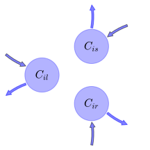
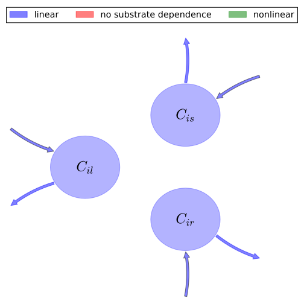

# General Overview

 

This report is the result of the use of the Python 3.4 package Sympy (for symbolic mathematics), as means to translate published models to a common language. It was created by Verónika Ceballos-Núñez (Orcid ID: 0000-0002-0046-1160) on 22/3/2016, and was last modified on _lm_.

## About the model
The model depicted in this document considers carbon allocation with a process based approach. It was originally described by @Castanho2013Biogeosciences.  

### Abstract
Dynamic vegetation models forced with spatially homogeneous biophysical parameters are capable of producing average productivity and biomass values for the Amazon basin forest biome that are close to the observed estimates, but these models are unable to reproduce observed spatial variability. Recent observational studies have shown substantial regional spatial variability of above-ground productivity and biomass across the Amazon basin, which is believed to be primarily driven by a combination of soil physical and chemical properties. In this study, spatial heterogeneity of vegetation properties is added to the Integrated Biosphere Simulator (IBIS) land surface model, and the simulated productivity and biomass of the Amazon basin are compared to observations from undisturbed forest. The maximum RuBiCo carboxylation capacity (Vcmax) and the woody biomass residence time (τw) were found to be the most important properties determining the modeled spatial variation of above-ground woody net primary productivity and biomass, respectively. Spatial heterogeneity of these properties may lead to simulated spatial variability of 1.8 times in the woody net primary productivity (NPPw) and 2.8 times in the woody above-ground biomass (AGBw). The coefficient of correlation between the modeled and observed woody productivity improved from 0.10 with homogeneous parameters to 0.73 with spatially heterogeneous parameters, while the coefficient of correlation between the simulated and observed woody above-ground biomass improved from 0.33 to 0.88. The results from our analyses with the IBIS dynamic vegetation model demonstrated that using single values for key ecological parameters in the tropical forest biome severely limits simulation accuracy. Clearer understanding of the biophysical mechanisms that drive the spatial variability of carbon allocation, τw and Vcmax is necessary to achieve further improvements to simulation accuracy. © 2013 Author(s).

### Space Scale
Amazon region

# State Variables
The following table contains the available information regarding this section:

Variable|Description|key
:-----:|:-----|:-----:
$C_{il}$|Carbon in leaves of plant functional type (PFT) i|foliage
$C_{is}$|Carbon in transport tissue (mainly stems) of PFT$_i$|wood
$C_{ir}$|Carbon in fine roots of PFT$_i$|fine_roots

Table: Information on State Variables

# Photosynthetic Parameters
The following table contains the available information regarding this section:

Variable|Description|key|Type
:-----:|:-----|:-----:|:-----:
$NPP_{i}$|Net Primary Production for PFT$_i$|NPP|variable

Table: Information on Photosynthetic Parameters

# Allocation Coefficients
The following table contains the available information regarding this section:

Variable|Description|Expressions|key
:-----:|:-----|:-----:|:-----:
$a_{il}$|Fraction of annual NPP allocated to leaves for PFT$_i$|$a_{il}=- 0.0025\cdot S+0.44$|part_foliage
$a_{ir}$|Fraction of annual NPP allocated to roots for PFT$_i$|$a_{ir}=0.0039\cdot S+0.137$|part_roots
$a_{is}$|Fraction of annual NPP allocated to stem for PFT$_i$|$a_{is}=1-a_{il}-a_{ir}$|part_wood

Table: Information on Allocation Coefficients

# Cycling Rates
The following table contains the available information regarding this section:

Variable|Description|key|Type
:-----:|:-----|:-----:|:-----:
$\tau_{il}$|Residence time of carbon in leaves for PFT$_i$|cyc_foliage|parameter
$\tau_{is}$|Residence time of carbon in stem for PFT$_i$|cyc_wood|parameter
$\tau_{ir}$|Residence time of carbon in roots for PFT$_i$|cyc_roots|parameter

Table: Information on Cycling Rates

# Additional Variables
The following table contains the available information regarding this section:

Variable|Description|key|Type|Units
:-----:|:-----|:-----:|:-----:|:-----:
$S$|Percent sand in soil|soil|variable|$percentage$

Table: Information on Additional Variables

# Components
The following table contains the available information regarding this section:

Variable|Description|Expressions|key
:-----:|:-----|:-----:|:-----:
$x$|vector of states for vegetation|$x=\left[\begin{matrix}C_{il}\\C_{is}\\C_{ir}\end{matrix}\right]$|state_vector
$u$|scalar function of photosynthetic inputs|$u=NPP_{i}$|scalar_func_phot
$b$|vector of partitioning coefficients of photosynthetically fixed carbon|$b=\left[\begin{matrix}a_{il}\\a_{is}\\a_{ir}\end{matrix}\right]$|part_coeff
$A$|matrix of turnover (cycling) rates|$A=\left[\begin{matrix}-\frac{1}{\tau_{il}} & 0 & 0\\0 & -\frac{1}{\tau_{is}} & 0\\0 & 0 & -\frac{1}{\tau_{ir}}\end{matrix}\right]$|cyc_matrix
$f_{v}$|the righthandside of the ode|$f_{v}=u\cdot b+A\cdot x$|state_vector_derivative

Table: Information on Components

## Pool model representation
<table><thead><tr><th></th><th>Flux description</th></tr></thead><tbody><tr><td align=center, style='vertical-align: middle'>
 

 **Figure 1:** *Pool model representation* 

</td><td align=left style='vertical-align: middle'>
#### Input fluxes
$C_{il}: NPP_{i}\cdot\left(- 0.0025\cdot S + 0.44\right)$  $C_{is}: NPP_{i}\cdot\left(- 0.0014\cdot S + 0.423\right)$  $C_{ir}: NPP_{i}\cdot\left(0.0039\cdot S + 0.137\right)$  

#### Output fluxes
$C_{il}: \frac{C_{il}}{\tau_{il}}$  $C_{is}: \frac{C_{is}}{\tau_{is}}$  $C_{ir}: \frac{C_{ir}}{\tau_{ir}}$  </td></tr></tbody></table>
## The right hand side of the ODE
$\left[\begin{matrix}-\frac{C_{il}}{\tau_{il}} + NPP_{i}\cdot\left(- 0.0025\cdot S + 0.44\right)\\-\frac{C_{is}}{\tau_{is}} + NPP_{i}\cdot\left(- 0.0014\cdot S + 0.423\right)\\-\frac{C_{ir}}{\tau_{ir}} + NPP_{i}\cdot\left(0.0039\cdot S + 0.137\right)\end{matrix}\right]$

## The Jacobian (derivative of the ODE w.r.t. state variables)
$\left[\begin{matrix}-\frac{1}{\tau_{il}} & 0 & 0\\0 & -\frac{1}{\tau_{is}} & 0\\0 & 0 & -\frac{1}{\tau_{ir}}\end{matrix}\right]$

# References
