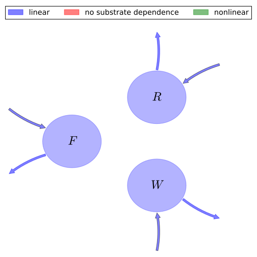

# General Overview

 

This report is the result of the use of the Python 3.4 package Sympy (for symbolic mathematics), as means to translate published models to a common language. It was created by Verónika Ceballos-Núñez (Orcid ID: 0000-0002-0046-1160) on 27/1/2016, and was last modified on _lm_.

## About the model
The model depicted in this document considers carbon allocation with a process based approach. It was originally described by @Comins1993Ecological_Applications.  

### Abstract
Established process-based models of forest biomass production in relation to atmospheric CO$_2$ concentration (McMurtrie 1991) and soil carbon/nutrient dynamics (Parton et al. 1987) are integrated to derive the "Generic Decomposition and Yield" model (G'DAY). The model is used to describe how photosynthesis and nutritional factors interact to determine the productivity of forests growing under nitrogen-limited conditions. A simulated instantaneous doubling of atmospheric CO$_2$ concentration leads to a growth response that is initially large (27% above productivity at current CO$_2$) but declines to <10% elevation within 5 yr. The decline occurs because increases in photosynthetic carbon gain at elevated CO$_2$ are not matched by increases in nutrient supply. Lower foliar N concentrations at elevated CO$_2$ have two countervailing effects on forest production: decreased rates of N cycling between vegetation and soils (with negative consequences for productivity), and reduced rates of N loss through gaseous emission, fire, and leaching. Theoretical analysis reveals that there is an enduring response to CO$_2$ enrichment, but that the magnitude of the long-term equilibrium response is extremely sensitive to the assumed rate of gaseous emission resulting from mineralization of nitrogen. Theory developed to analyze G'DAY is applicable to other published production-decomposition models describing the partitioning of soil carbon among compartments with widely differing decay-time constants.

### Space Scale
global

# State Variables
The following table contains the available information regarding this section:

Variable|Description|key|Units
:-----:|:-----|:-----:|:-----:
$F$|Foliage carbon content per unit ground area at equilibrium|foliage|$Mg/ha$
$R$|Root carbon|fine_roots|$Mg/ha$
$W$|Carbon in woody tissue|wood|$Mg/ha$

Table: Information on State Variables

# Photosynthetic Parameters
The following table contains the available information regarding this section:

Variable|Description|key|Type|Units
:-----:|:-----|:-----:|:-----:|:-----:
$G$|Net rate of plant carbon production|NPP|variable|$Mg\cdot ha^{-1}\cdot yr^{-1}$

Table: Information on Photosynthetic Parameters

# Partitioning coefficients
The following table contains the available information regarding this section:

Variable|Description|key|Type
:-----:|:-----|:-----:|:-----:
$\eta_{f}$|Allocation fraction to foliar biomass|part_foliage|parameter
$\eta_{r}$|Allocation fraction to roots biomass|part_roots|parameter
$\eta_{w}$|Allocation fraction to wood (in stem, branches and large structurl roots) biomass|part_wood|parameter

Table: Information on Partitioning coefficients

# Cycling Rates
The following table contains the available information regarding this section:

Variable|Description|key|Type|Units
:-----:|:-----|:-----:|:-----:|:-----:
$\gamma_{f}$|Foliage senescence rate|cyc_foliage|parameter|$yr^{-1}$
$\gamma_{r}$|Roots senescence rate|cyc_roots|parameter|$yr^{-1}$
$\gamma_{w}$|Wood senescence rate|cyc_wood|parameter|$yr^{-1}$

Table: Information on Cycling Rates

# Components
The following table contains the available information regarding this section:

Variable|Description|Expressions|key
:-----:|:-----|:-----:|:-----:
$x$|vector of states for vegetation|$x=\left[\begin{matrix}F\\R\\W\end{matrix}\right]$|state_vector
$u$|scalar function of photosynthetic inputs|$u=G$|scalar_func_phot
$b$|vector of partitioning coefficients of photosynthetically fixed carbon|$b=\left[\begin{matrix}\eta_{f}\\\eta_{r}\\\eta_{w}\end{matrix}\right]$|part_coeff
$A$|matrix of senescence (cycling) rates|$A=\left[\begin{matrix}-\gamma_{f} & 0 & 0\\0 & -\gamma_{r} & 0\\0 & 0 & -\gamma_{w}\end{matrix}\right]$|cyc_matrix
$f_{v}$|the righthandside of the ode|$f_{v}=u\cdot b+A\cdot x$|state_vector_derivative

Table: Information on Components

## Pool model representation
<table><thead><tr><th></th><th>Flux description</th></tr></thead><tbody><tr><td align=center, style='vertical-align: middle'>
 

 **Figure 1:** *Pool model representation* 

</td><td align=left style='vertical-align: middle'>
#### Input fluxes
$F: G\cdot\eta_{f}$  $R: G\cdot\eta_{r}$  $W: G\cdot\eta_{w}$  

#### Output fluxes
$F: F\cdot\gamma_{f}$  $R: R\cdot\gamma_{r}$  $W: W\cdot\gamma_{w}$  </td></tr></tbody></table>
## The right hand side of the ODE
$\left[\begin{matrix}- F\cdot\gamma_{f} + G\cdot\eta_{f}\\G\cdot\eta_{r} - R\cdot\gamma_{r}\\G\cdot\eta_{w} - W\cdot\gamma_{w}\end{matrix}\right]$

## The Jacobian (derivative of the ODE w.r.t. state variables)
$\left[\begin{matrix}-\gamma_{f} & 0 & 0\\0 & -\gamma_{r} & 0\\0 & 0 & -\gamma_{w}\end{matrix}\right]$

# References
