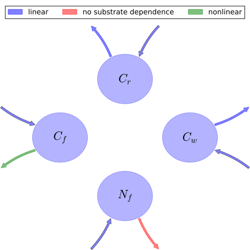

# General Overview

 

This report is the result of the use of the Python 3.4 package Sympy (for symbolic mathematics), as means to translate published models to a common language. It was created by Verónika Ceballos-Núñez (Orcid ID: 0000-0002-0046-1160) on 15/3/2016, and was last modified on _lm_.

## About the model
The model depicted in this document considers carbon allocation with a process based approach. It was originally described by @DeAngelis2012TheoreticalEcology.  

### Abstract
We use modeling to determine the optimal relative plant carbon\n      allocations between foliage, fine roots, anti-herbivore\n      defense, and reproduction to maximize reproductive output. The\n      model treats these plant components and the herbivore\n      compartment as variables. Herbivory is assumed to be purely\n      folivory. Key external factors include nutrient availability,\n      degree of shading, and intensity of herbivory. Three\n      alternative functional responses are used for herbivory, two of\n      which are variations on donor-dependent herbivore (models 1a\n      and 1b) and one of which is a Lotka–Volterra type of\n      interaction (model 2). All three were modified to include the\n      negative effect of chemical defenses on the herbivore. Analysis\n      showed that, for all three models, two stable equilibria could\n      occur, which differs from most common functional responses when\n      no plant defense component is included. Optimal strategies of\n      carbon allocation were defined as the maximum biomass of\n      reproductive propagules produced per unit time, and found to\n      vary with changes in external factors. Increased intensity of\n      herbivory always led to an increase in the fractional\n      allocation of carbon to defense. Decreases in available\n      limiting nutrient generally led to increasing importance of\n      defense. Decreases in available light had little effect on\n      defense but led to increased allocation to foliage. Decreases\n      in limiting nutrient and available light led to decreases in\n      allocation to reproduction in models 1a and 1b but not model 2.\n      Increases in allocation to plant defense were usually\n      accompanied by shifts in carbon allocation away from fine\n      roots, possibly because higher plant defense reduced the loss\n      of nutrients to herbivory.\n

### Space Scale
global

### Available parameter values

Abbreviation|Source
:-----|:-----
Original dataset of the publication|@DeAngelis2012TheoreticalEcology

Table:  Information on given parameter sets

# State Variables
The following table contains the available information regarding this section:

Variable|Description|key|Units
:-----:|:-----|:-----:|:-----:
$C_{f}$|Foliage carbon content per unit ground area at equilibrium|foliage|$g\cdot m^{-2}$
$C_{r}$|Fine root carbon|fine_roots|$g\cdot m^{-2}$
$C_{w}$|Carbon in woody tissue|wood|$g\cdot m^{-2}$
$N_{f}$|Nitrogen in foliage|-|$g\cdot m^{-2}$
$N_{pore}$|Soil pore water nutrient pool|-|$gN\cdot g^{-1}water$

Table: Information on State Variables

# Additional Variables
The following table contains the available information regarding this section:

Variable|Description|Expressions|Type|Units|Values    Original dataset of the publication
:-----:|:-----|:-----:|:-----:|:-----:|:-----:
$F_{i}$|Herbivore functional response|-|variable|$gN\cdot m^{-2}\cdot day^{-1}$|-
$N_{r}$|Nitrogen in roots|-|variable|-|-
$v_{f}$|N:C ratio in foliage|$v_{f}=\frac{N_{f}}{C_{f}}$|variable|-|-
$v_{r}$|N:C ratio in fine roots|$v_{r}=\frac{N_{r}}{C_{r}}$|parameter|-|$0.002$
$N_{w}$|Nitrogen in wood|-|variable|-|-
$v_{w}$|N:C ratio in wood|$v_{w}=\frac{N_{w}}{C_{w}}$|parameter|-|$5.0\cdot 10^{-5}$
$v_{m}$|N:C ratio for reproductive propagules|-|parameter|-|$0.005$

Table: Information on Additional Variables

# Photosynthetic Parameters
The following table contains the available information regarding this section:

Variable|Description|Expressions|key|Type|Units|Values    Original dataset of the publication
:-----:|:-----|:-----:|:-----:|:-----:|:-----:|:-----:
$G_{0}$|Maximum possible primary production, assuming all light is captured and photosynthesizing material (foliage) is operating optimally.|-|-|parameter|-|$30$
$b_{f}$|Converts carbon per square meter to LAI|-|-|parameter|-|$0.004$
$k_{f}$|Foliage light-extinction (Beer-Lambert law) coefficient|-|-|parameter|-|$0.2$
$v_{0}$|Half-saturation constant for the effect of foliar nitrogen concentration on primary production|-|-|parameter|-|$0.02$
$G$|Net carbon production or growth per unit time|$G=G_{0}\cdot \left(1-\operatorname{exp}\left(- k_{f}\cdot b_{f}\cdot C_{f}\right)\right)\cdot \frac{v_{f}}{v_{0}+v_{f}}$|NPP|variable|$gC\cdot m^{-2}\cdot day^{-1}$|-

Table: Information on Photosynthetic Parameters

# Nutrient Uptake
The following table contains the available information regarding this section:

Variable|Description|Expressions|Type|Units|Values    Original dataset of the publication
:-----:|:-----|:-----:|:-----:|:-----:|:-----:
$g_{N}$|Maximum possible nutrient uptake rate|-|-|-|$15$
$k_{N}$|Half-saturation constant for uptake of soil porewater N|-|-|-|$5$
$k_{r}$|Coefficient analogous to k$_f$|-|-|-|$0.15$
$b_{r}$|Coefficient of fine root length per unit C|-|-|-|$0.001$
$U$|Nutrient uptake rate of plant available nutrient. Saturated response of uptake to soil porewater concentration is assumed|$U=\frac{g_{N}\cdot N_{pore}}{k_{N}+N_{pore}}\cdot \left(1-\operatorname{exp}\left(- k_{r}\cdot b_{r}\cdot C_{r}\right)\right)$|variable|$gN\cdot m^{-2}\cdot day^{-1}$|-

Table: Information on Nutrient Uptake

# Allocation fractions
The following table contains the available information regarding this section:

Variable|Description|Expressions|key|Type|Values    Original dataset of the publication
:-----:|:-----|:-----:|:-----:|:-----:|:-----:
$s_{f}$|Allocation ratio of wood to foliage|-|-|parameter|$0.5$
$s_{r}$|Allocation ratio of wood to fine roots|-|-|parameter|$0.5$
$\eta_{f}$|Allocation fraction to foliar biomass|-|part_foliage|parameter|-
$\eta_{r}$|Allocation fraction to roots biomass|-|part_roots|parameter|-
$\eta_{w}$|Allocation fraction to wood (in stem, branches and large structurl roots) biomass|$\eta_{w}=s_{f}\cdot \eta_{f}+s_{r}\cdot \eta_{r}$|part_reproduction|parameter|-
$\eta_{m}$|Allocation fraction to reproduction|-|part_reproduction|parameter|-
$\eta_{d}$|Allocation fraction to plant defense|$\eta_{d}=1-\left(\eta_{f}+\eta_{r}+\eta_{w}+\eta_{m}\right)$|part_defense|parameter|-

Table: Information on Allocation fractions

# Cycling Rates
The following table contains the available information regarding this section:

Variable|Description|key|Type|Units|Values    Original dataset of the publication
:-----:|:-----|:-----:|:-----:|:-----:|:-----:
$\gamma_{f}$|Foliage senescence rate|cyc_foliage|parameter|$day^{-1}$|$0.005$
$\gamma_{r}$|Roots senescence rate|cyc_roots|parameter|$day^{-1}$|$0.01$
$\gamma_{w}$|Wood senescence rate|cyc_wood|parameter|$day^{-1}$|$0.001$

Table: Information on Cycling Rates

# Components
The following table contains the available information regarding this section:

Variable|Description|Expressions|Values    key
:-----:|:-----|:-----:|:-----:
$x$|vector of states for vegetation|$x=\left[\begin{matrix}C_{f}\\C_{r}\\C_{w}\\N_{f}\end{matrix}\right]$|state_vector
$u$|scalar function of photosynthetic inputs|$u=G$|scalar_func_phot
$b$|vector of partitioning coefficients of photosynthetically fixed carbon|$b=\left[\begin{matrix}\eta_{f}\\\eta_{r}\\\eta_{w}\\-\eta_{m}\cdot v_{m} -\eta_{r}\cdot v_{r} -\eta_{w}\cdot v_{w} +\frac{U}{G}\end{matrix}\right]$|part_coeff
$A$|matrix of senescence (cycling) rates|$A=\left[\begin{matrix}-\frac{F_{i}}{N_{f}} -\gamma_{f} & 0 & 0 & 0\\0 & -\gamma_{r} & 0 & 0\\0 & 0 & -\gamma_{w} & 0\\0 & 0 & 0 & -\frac{F_{i}}{N_{f}} -\gamma_{f}\end{matrix}\right]$|cyc_matrix
$f_{v}$|the righthandside of the ode|$f_{v}=u\cdot b+A\cdot x$|state_vector_derivative

Table: Information on Components

## Pool model representation
<table><thead><tr><th></th><th>Flux description</th></tr></thead><tbody><tr><td align=center, style='vertical-align: middle'>
 

 **Figure 1:** *Pool model representation* 

</td><td align=left style='vertical-align: middle'>
#### Input fluxes
$C_{f}: \frac{G_{0}\cdot N_{f}\cdot\eta_{f}}{C_{f}\cdot\left(v_{0} +\frac{N_{f}}{C_{f}}\right)}\cdot\left(1 - e^{- C_{f}\cdot b_{f}\cdot k_{f}}\right)$  $C_{r}: \frac{G_{0}\cdot N_{f}\cdot\eta_{r}}{C_{f}\cdot\left(v_{0} +\frac{N_{f}}{C_{f}}\right)}\cdot\left(1 - e^{- C_{f}\cdot b_{f}\cdot k_{f}}\right)$  $C_{w}: \frac{G_{0}\cdot N_{f}}{C_{f}\cdot\left(v_{0} +\frac{N_{f}}{C_{f}}\right)}\cdot\left(1 - e^{- C_{f}\cdot b_{f}\cdot k_{f}}\right)\cdot\left(\eta_{f}\cdot s_{f} +\eta_{r}\cdot s_{r}\right)$  $N_{f}: \frac{G_{0}\cdot N_{f}}{C_{f}\cdot\left(v_{0} +\frac{N_{f}}{C_{f}}\right)}\cdot\left(1 - e^{- C_{f}\cdot b_{f}\cdot k_{f}}\right)\cdot\left(\frac{C_{f}\cdot N_{pore}\cdot g_{N}\cdot\left(1 - e^{- C_{r}\cdot b_{r}\cdot k_{r}}\right)\cdot\left(v_{0} +\frac{N_{f}}{C_{f}}\right)}{G_{0}\cdot N_{f}\cdot\left(1 - e^{- C_{f}\cdot b_{f}\cdot k_{f}}\right)\cdot\left(N_{pore} + k_{N}\right)} -\eta_{m}\cdot v_{m} -\frac{N_{w}}{C_{w}}\cdot\left(\eta_{f}\cdot s_{f} +\eta_{r}\cdot s_{r}\right) -\frac{N_{r}}{C_{r}}\cdot\eta_{r}\right)$  

#### Output fluxes
$C_{f}: \frac{C_{f}}{N_{f}}\cdot\left(F_{i} + N_{f}\cdot\gamma_{f}\right)$  $C_{r}: C_{r}\cdot\gamma_{r}$  $C_{w}: C_{w}\cdot\gamma_{w}$  $N_{f}: F_{i} + N_{f}\cdot\gamma_{f}$  </td></tr></tbody></table>
## The right hand side of the ODE
$\left[\begin{matrix}C_{f}\cdot\left(-\frac{F_{i}}{N_{f}} -\gamma_{f}\right) +\frac{G_{0}\cdot N_{f}\cdot\eta_{f}}{C_{f}\cdot\left(v_{0} +\frac{N_{f}}{C_{f}}\right)}\cdot\left(1 - e^{- C_{f}\cdot b_{f}\cdot k_{f}}\right)\\- C_{r}\cdot\gamma_{r} +\frac{G_{0}\cdot N_{f}\cdot\eta_{r}}{C_{f}\cdot\left(v_{0} +\frac{N_{f}}{C_{f}}\right)}\cdot\left(1 - e^{- C_{f}\cdot b_{f}\cdot k_{f}}\right)\\- C_{w}\cdot\gamma_{w} +\frac{G_{0}\cdot N_{f}}{C_{f}\cdot\left(v_{0} +\frac{N_{f}}{C_{f}}\right)}\cdot\left(1 - e^{- C_{f}\cdot b_{f}\cdot k_{f}}\right)\cdot\left(\eta_{f}\cdot s_{f} +\eta_{r}\cdot s_{r}\right)\\N_{f}\cdot\left(-\frac{F_{i}}{N_{f}} -\gamma_{f}\right) +\frac{G_{0}\cdot N_{f}}{C_{f}\cdot\left(v_{0} +\frac{N_{f}}{C_{f}}\right)}\cdot\left(1 - e^{- C_{f}\cdot b_{f}\cdot k_{f}}\right)\cdot\left(\frac{C_{f}\cdot N_{pore}\cdot g_{N}\cdot\left(1 - e^{- C_{r}\cdot b_{r}\cdot k_{r}}\right)\cdot\left(v_{0} +\frac{N_{f}}{C_{f}}\right)}{G_{0}\cdot N_{f}\cdot\left(1 - e^{- C_{f}\cdot b_{f}\cdot k_{f}}\right)\cdot\left(N_{pore} + k_{N}\right)} -\eta_{m}\cdot v_{m} -\frac{N_{w}}{C_{w}}\cdot\left(\eta_{f}\cdot s_{f} +\eta_{r}\cdot s_{r}\right) -\frac{N_{r}}{C_{r}}\cdot\eta_{r}\right)\end{matrix}\right]$

## The Jacobian (derivative of the ODE w.r.t. state variables)
$\left[\begin{matrix}-\frac{F_{i}}{N_{f}} -\gamma_{f} +\frac{G_{0}\cdot N_{f}\cdot b_{f}\cdot\eta_{f}\cdot k_{f}}{C_{f}\cdot\left(v_{0} +\frac{N_{f}}{C_{f}}\right)}\cdot e^{- C_{f}\cdot b_{f}\cdot k_{f}} -\frac{G_{0}\cdot N_{f}\cdot\eta_{f}}{C_{f}^{2}\cdot\left(v_{0} +\frac{N_{f}}{C_{f}}\right)}\cdot\left(1 - e^{- C_{f}\cdot b_{f}\cdot k_{f}}\right) +\frac{G_{0}\cdot N_{f}^{2}\cdot\eta_{f}}{C_{f}^{3}\cdot\left(v_{0} +\frac{N_{f}}{C_{f}}\right)^{2}}\cdot\left(1 - e^{- C_{f}\cdot b_{f}\cdot k_{f}}\right) & 0 & 0 &\frac{C_{f}}{N_{f}^{2}}\cdot F_{i} +\frac{G_{0}\cdot\eta_{f}}{C_{f}\cdot\left(v_{0} +\frac{N_{f}}{C_{f}}\right)}\cdot\left(1 - e^{- C_{f}\cdot b_{f}\cdot k_{f}}\right) -\frac{G_{0}\cdot N_{f}\cdot\eta_{f}}{C_{f}^{2}\cdot\left(v_{0} +\frac{N_{f}}{C_{f}}\right)^{2}}\cdot\left(1 - e^{- C_{f}\cdot b_{f}\cdot k_{f}}\right)\\\frac{G_{0}\cdot N_{f}\cdot b_{f}\cdot\eta_{r}\cdot k_{f}}{C_{f}\cdot\left(v_{0} +\frac{N_{f}}{C_{f}}\right)}\cdot e^{- C_{f}\cdot b_{f}\cdot k_{f}} -\frac{G_{0}\cdot N_{f}\cdot\eta_{r}}{C_{f}^{2}\cdot\left(v_{0} +\frac{N_{f}}{C_{f}}\right)}\cdot\left(1 - e^{- C_{f}\cdot b_{f}\cdot k_{f}}\right) +\frac{G_{0}\cdot N_{f}^{2}\cdot\eta_{r}}{C_{f}^{3}\cdot\left(v_{0} +\frac{N_{f}}{C_{f}}\right)^{2}}\cdot\left(1 - e^{- C_{f}\cdot b_{f}\cdot k_{f}}\right) & -\gamma_{r} & 0 &\frac{G_{0}\cdot\eta_{r}}{C_{f}\cdot\left(v_{0} +\frac{N_{f}}{C_{f}}\right)}\cdot\left(1 - e^{- C_{f}\cdot b_{f}\cdot k_{f}}\right) -\frac{G_{0}\cdot N_{f}\cdot\eta_{r}}{C_{f}^{2}\cdot\left(v_{0} +\frac{N_{f}}{C_{f}}\right)^{2}}\cdot\left(1 - e^{- C_{f}\cdot b_{f}\cdot k_{f}}\right)\\\frac{G_{0}\cdot N_{f}\cdot b_{f}\cdot k_{f}}{C_{f}\cdot\left(v_{0} +\frac{N_{f}}{C_{f}}\right)}\cdot\left(\eta_{f}\cdot s_{f} +\eta_{r}\cdot s_{r}\right)\cdot e^{- C_{f}\cdot b_{f}\cdot k_{f}} -\frac{G_{0}\cdot N_{f}}{C_{f}^{2}\cdot\left(v_{0} +\frac{N_{f}}{C_{f}}\right)}\cdot\left(1 - e^{- C_{f}\cdot b_{f}\cdot k_{f}}\right)\cdot\left(\eta_{f}\cdot s_{f} +\eta_{r}\cdot s_{r}\right) +\frac{G_{0}\cdot N_{f}^{2}}{C_{f}^{3}\cdot\left(v_{0} +\frac{N_{f}}{C_{f}}\right)^{2}}\cdot\left(1 - e^{- C_{f}\cdot b_{f}\cdot k_{f}}\right)\cdot\left(\eta_{f}\cdot s_{f} +\eta_{r}\cdot s_{r}\right) & 0 & -\gamma_{w} &\frac{G_{0}}{C_{f}\cdot\left(v_{0} +\frac{N_{f}}{C_{f}}\right)}\cdot\left(1 - e^{- C_{f}\cdot b_{f}\cdot k_{f}}\right)\cdot\left(\eta_{f}\cdot s_{f} +\eta_{r}\cdot s_{r}\right) -\frac{G_{0}\cdot N_{f}}{C_{f}^{2}\cdot\left(v_{0} +\frac{N_{f}}{C_{f}}\right)^{2}}\cdot\left(1 - e^{- C_{f}\cdot b_{f}\cdot k_{f}}\right)\cdot\left(\eta_{f}\cdot s_{f} +\eta_{r}\cdot s_{r}\right)\\\frac{G_{0}\cdot N_{f}\cdot b_{f}\cdot k_{f}}{C_{f}\cdot\left(v_{0} +\frac{N_{f}}{C_{f}}\right)}\cdot\left(\frac{C_{f}\cdot N_{pore}\cdot g_{N}\cdot\left(1 - e^{- C_{r}\cdot b_{r}\cdot k_{r}}\right)\cdot\left(v_{0} +\frac{N_{f}}{C_{f}}\right)}{G_{0}\cdot N_{f}\cdot\left(1 - e^{- C_{f}\cdot b_{f}\cdot k_{f}}\right)\cdot\left(N_{pore} + k_{N}\right)} -\eta_{m}\cdot v_{m} -\frac{N_{w}}{C_{w}}\cdot\left(\eta_{f}\cdot s_{f} +\eta_{r}\cdot s_{r}\right) -\frac{N_{r}}{C_{r}}\cdot\eta_{r}\right)\cdot e^{- C_{f}\cdot b_{f}\cdot k_{f}} +\frac{G_{0}\cdot N_{f}}{C_{f}\cdot\left(v_{0} +\frac{N_{f}}{C_{f}}\right)}\cdot\left(1 - e^{- C_{f}\cdot b_{f}\cdot k_{f}}\right)\cdot\left(-\frac{C_{f}\cdot N_{pore}\cdot b_{f}\cdot g_{N}\cdot k_{f}\cdot\left(1 - e^{- C_{r}\cdot b_{r}\cdot k_{r}}\right)\cdot\left(v_{0} +\frac{N_{f}}{C_{f}}\right)\cdot e^{- C_{f}\cdot b_{f}\cdot k_{f}}}{G_{0}\cdot N_{f}\cdot\left(1 - e^{- C_{f}\cdot b_{f}\cdot k_{f}}\right)^{2}\cdot\left(N_{pore} + k_{N}\right)} +\frac{N_{pore}\cdot g_{N}\cdot\left(1 - e^{- C_{r}\cdot b_{r}\cdot k_{r}}\right)\cdot\left(v_{0} +\frac{N_{f}}{C_{f}}\right)}{G_{0}\cdot N_{f}\cdot\left(1 - e^{- C_{f}\cdot b_{f}\cdot k_{f}}\right)\cdot\left(N_{pore} + k_{N}\right)} -\frac{N_{pore}\cdot g_{N}\cdot\left(1 - e^{- C_{r}\cdot b_{r}\cdot k_{r}}\right)}{C_{f}\cdot G_{0}\cdot\left(1 - e^{- C_{f}\cdot b_{f}\cdot k_{f}}\right)\cdot\left(N_{pore} + k_{N}\right)}\right) -\frac{G_{0}\cdot N_{f}}{C_{f}^{2}\cdot\left(v_{0} +\frac{N_{f}}{C_{f}}\right)}\cdot\left(1 - e^{- C_{f}\cdot b_{f}\cdot k_{f}}\right)\cdot\left(\frac{C_{f}\cdot N_{pore}\cdot g_{N}\cdot\left(1 - e^{- C_{r}\cdot b_{r}\cdot k_{r}}\right)\cdot\left(v_{0} +\frac{N_{f}}{C_{f}}\right)}{G_{0}\cdot N_{f}\cdot\left(1 - e^{- C_{f}\cdot b_{f}\cdot k_{f}}\right)\cdot\left(N_{pore} + k_{N}\right)} -\eta_{m}\cdot v_{m} -\frac{N_{w}}{C_{w}}\cdot\left(\eta_{f}\cdot s_{f} +\eta_{r}\cdot s_{r}\right) -\frac{N_{r}}{C_{r}}\cdot\eta_{r}\right) +\frac{G_{0}\cdot N_{f}^{2}}{C_{f}^{3}\cdot\left(v_{0} +\frac{N_{f}}{C_{f}}\right)^{2}}\cdot\left(1 - e^{- C_{f}\cdot b_{f}\cdot k_{f}}\right)\cdot\left(\frac{C_{f}\cdot N_{pore}\cdot g_{N}\cdot\left(1 - e^{- C_{r}\cdot b_{r}\cdot k_{r}}\right)\cdot\left(v_{0} +\frac{N_{f}}{C_{f}}\right)}{G_{0}\cdot N_{f}\cdot\left(1 - e^{- C_{f}\cdot b_{f}\cdot k_{f}}\right)\cdot\left(N_{pore} + k_{N}\right)} -\eta_{m}\cdot v_{m} -\frac{N_{w}}{C_{w}}\cdot\left(\eta_{f}\cdot s_{f} +\eta_{r}\cdot s_{r}\right) -\frac{N_{r}}{C_{r}}\cdot\eta_{r}\right) &\frac{G_{0}\cdot N_{f}}{C_{f}\cdot\left(v_{0} +\frac{N_{f}}{C_{f}}\right)}\cdot\left(1 - e^{- C_{f}\cdot b_{f}\cdot k_{f}}\right)\cdot\left(\frac{C_{f}\cdot N_{pore}\cdot b_{r}\cdot g_{N}\cdot k_{r}\cdot\left(v_{0} +\frac{N_{f}}{C_{f}}\right)\cdot e^{- C_{r}\cdot b_{r}\cdot k_{r}}}{G_{0}\cdot N_{f}\cdot\left(1 - e^{- C_{f}\cdot b_{f}\cdot k_{f}}\right)\cdot\left(N_{pore} + k_{N}\right)} +\frac{N_{r}}{C_{r}^{2}}\cdot\eta_{r}\right) &\frac{G_{0}\cdot N_{f}\cdot N_{w}}{C_{f}\cdot C_{w}^{2}\cdot\left(v_{0} +\frac{N_{f}}{C_{f}}\right)}\cdot\left(1 - e^{- C_{f}\cdot b_{f}\cdot k_{f}}\right)\cdot\left(\eta_{f}\cdot s_{f} +\eta_{r}\cdot s_{r}\right) & -\gamma_{f} +\frac{G_{0}\cdot N_{f}}{C_{f}\cdot\left(v_{0} +\frac{N_{f}}{C_{f}}\right)}\cdot\left(1 - e^{- C_{f}\cdot b_{f}\cdot k_{f}}\right)\cdot\left(-\frac{C_{f}\cdot N_{pore}\cdot g_{N}\cdot\left(1 - e^{- C_{r}\cdot b_{r}\cdot k_{r}}\right)\cdot\left(v_{0} +\frac{N_{f}}{C_{f}}\right)}{G_{0}\cdot N_{f}^{2}\cdot\left(1 - e^{- C_{f}\cdot b_{f}\cdot k_{f}}\right)\cdot\left(N_{pore} + k_{N}\right)} +\frac{N_{pore}\cdot g_{N}\cdot\left(1 - e^{- C_{r}\cdot b_{r}\cdot k_{r}}\right)}{G_{0}\cdot N_{f}\cdot\left(1 - e^{- C_{f}\cdot b_{f}\cdot k_{f}}\right)\cdot\left(N_{pore} + k_{N}\right)}\right) +\frac{G_{0}}{C_{f}\cdot\left(v_{0} +\frac{N_{f}}{C_{f}}\right)}\cdot\left(1 - e^{- C_{f}\cdot b_{f}\cdot k_{f}}\right)\cdot\left(\frac{C_{f}\cdot N_{pore}\cdot g_{N}\cdot\left(1 - e^{- C_{r}\cdot b_{r}\cdot k_{r}}\right)\cdot\left(v_{0} +\frac{N_{f}}{C_{f}}\right)}{G_{0}\cdot N_{f}\cdot\left(1 - e^{- C_{f}\cdot b_{f}\cdot k_{f}}\right)\cdot\left(N_{pore} + k_{N}\right)} -\eta_{m}\cdot v_{m} -\frac{N_{w}}{C_{w}}\cdot\left(\eta_{f}\cdot s_{f} +\eta_{r}\cdot s_{r}\right) -\frac{N_{r}}{C_{r}}\cdot\eta_{r}\right) -\frac{G_{0}\cdot N_{f}}{C_{f}^{2}\cdot\left(v_{0} +\frac{N_{f}}{C_{f}}\right)^{2}}\cdot\left(1 - e^{- C_{f}\cdot b_{f}\cdot k_{f}}\right)\cdot\left(\frac{C_{f}\cdot N_{pore}\cdot g_{N}\cdot\left(1 - e^{- C_{r}\cdot b_{r}\cdot k_{r}}\right)\cdot\left(v_{0} +\frac{N_{f}}{C_{f}}\right)}{G_{0}\cdot N_{f}\cdot\left(1 - e^{- C_{f}\cdot b_{f}\cdot k_{f}}\right)\cdot\left(N_{pore} + k_{N}\right)} -\eta_{m}\cdot v_{m} -\frac{N_{w}}{C_{w}}\cdot\left(\eta_{f}\cdot s_{f} +\eta_{r}\cdot s_{r}\right) -\frac{N_{r}}{C_{r}}\cdot\eta_{r}\right)\end{matrix}\right]$

# References
