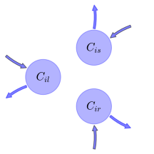
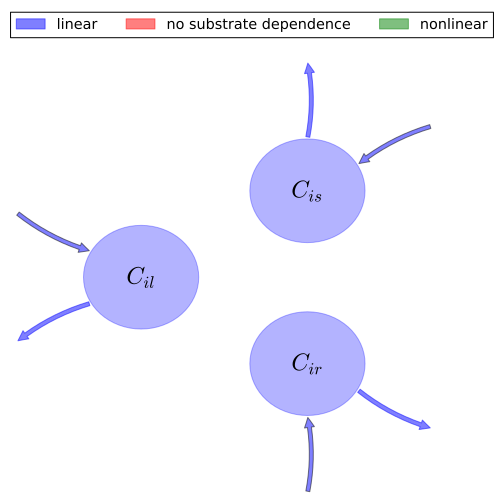

# General Overview

 

This report is the result of the use of the Python 3.4 package Sympy (for symbolic mathematics), as means to translate published models to a common language. It was created by Verónika Ceballos-Núñez (Orcid ID: 0000-0002-0046-1160) on 26/1/2016, and was last modified on _lm_.

## About the model
The model depicted in this document considers carbon allocation with a process based approach. It was originally described by @Foley1996GlobalBiogeochemicalCycles.  

### Abstract
Here we present a new terrestrial biosphere model (the Integrated Biosphere Simulator - IBIS) which demonstrates how land surface biophysics, terrestrial carbon fluxes, and global vegetation dynamics can be represented in a single, physically consistent modeling framework. In order to integrate a wide range of biophysical, physiological, and ecological processes, the model is designed around a hicrarchical, modular structure and uses a common state description throughout. First, a coupled simulation of the surface water, energy, and carbon fluxes is performed on hourly timesteps and is integrated over the year to estimate the annual water and carbon balance. Next, the annual carbon balance is used to predict changes in the leaf area index and biomass for each of nine plant functional types, which compete for light and water using different ecological strategies. The resulting patterns of annual evapotranspiration, runoff, and net primary productivity are in good agreement with observations. In addition, the model simulates patterns of vegetation dynamics that qualitatively agree with features of the natural process of secondary succession. Comparison of the model's inferred near- equilibrium vegetation categories with a potential natural vegetation map shows a fair degree of agreement. This integrated modeling framework provides a means of simulating hoth rapid biophysical processes and long-term ecosystem dynamics that can be directly incorporated within atmospheric models.

### Space Scale
global

### Available parameter values

Abbreviation|Source
:-----|:-----
Tropical evergreen trees|@Foley1996GlobalBiogeochemicalCycles

Table:  Information on given parameter sets

# State Variables
The following table contains the available information regarding this section:

Variable|Description|Values    key
:-----:|:-----|:-----:
$C_{il}$|Carbon in leaves of plant functional type (PFT) i|foliage
$C_{is}$|Carbon in transport tissue (mainly stems) of PFT$_i$|wood
$C_{ir}$|Carbon in fine roots of PFT$_i$|fine_roots

Table: Information on State Variables

# Photosynthetic Parameters
The following table contains the available information regarding this section:

Variable|Description|key|Type|Values    Tropical evergreen trees
:-----:|:-----|:-----:|:-----:|:-----:
$NPP_{i}$|Net Primary Production for PFT$_i$|NPP|variable|-

Table: Information on Photosynthetic Parameters

# Allocation Coefficients
The following table contains the available information regarding this section:

Variable|Description|key|Type|Values    Tropical evergreen trees
:-----:|:-----|:-----:|:-----:|:-----:
$a_{il}$|Fraction of annual NPP allocated to leaves for PFT$_i$|part_foliage|parameter|$0.25$
$a_{is}$|Fraction of annual NPP allocated to stem for PFT$_i$|part_wood|parameter|$0.5$
$a_{ir}$|Fraction of annual NPP allocated to roots for PFT$_i$|part_roots|parameter|$0.25$

Table: Information on Allocation Coefficients

# Cycling Rates
The following table contains the available information regarding this section:

Variable|Description|key|Type|Values    Tropical evergreen trees
:-----:|:-----|:-----:|:-----:|:-----:
$\tau_{il}$|Residence time of carbon in leaves for PFT$_i$|cyc_foliage|parameter|-
$\tau_{is}$|Residence time of carbon in stem for PFT$_i$|cyc_wood|parameter|-
$\tau_{ir}$|Residence time of carbon in roots for PFT$_i$|cyc_roots|parameter|-

Table: Information on Cycling Rates

# Components
The following table contains the available information regarding this section:

Variable|Description|Expressions|Values    key
:-----:|:-----|:-----:|:-----:
$x$|vector of states for vegetation|$x=\left[\begin{matrix}C_{il}\\C_{is}\\C_{ir}\end{matrix}\right]$|state_vector
$u$|scalar function of photosynthetic inputs|$u=NPP_{i}$|scalar_func_phot
$b$|vector of partitioning coefficients of photosynthetically fixed carbon|$b=\left[\begin{matrix}a_{il}\\a_{is}\\a_{ir}\end{matrix}\right]$|part_coeff
$A$|matrix of turnover (cycling) rates|$A=\left[\begin{matrix}-\frac{1}{\tau_{il}} & 0 & 0\\0 & -\frac{1}{\tau_{is}} & 0\\0 & 0 & -\frac{1}{\tau_{ir}}\end{matrix}\right]$|cyc_matrix
$f_{v}$|the righthandside of the ode|$f_{v}=u\cdot b+A\cdot x$|state_vector_derivative

Table: Information on Components

## Pool model representation
<table><thead><tr><th></th><th>Flux description</th></tr></thead><tbody><tr><td align=center, style='vertical-align: middle'>
 

 **Figure 1:** *Pool model representation* 

</td><td align=left style='vertical-align: middle'>
#### Input fluxes
$C_{il}: NPP_{i}\cdot a_{il}$  $C_{is}: NPP_{i}\cdot a_{is}$  $C_{ir}: NPP_{i}\cdot a_{ir}$  

#### Output fluxes
$C_{il}: \frac{C_{il}}{\tau_{il}}$  $C_{is}: \frac{C_{is}}{\tau_{is}}$  $C_{ir}: \frac{C_{ir}}{\tau_{ir}}$  </td></tr></tbody></table>
## The right hand side of the ODE
$\left[\begin{matrix}-\frac{C_{il}}{\tau_{il}} + NPP_{i}\cdot a_{il}\\-\frac{C_{is}}{\tau_{is}} + NPP_{i}\cdot a_{is}\\-\frac{C_{ir}}{\tau_{ir}} + NPP_{i}\cdot a_{ir}\end{matrix}\right]$

## The Jacobian (derivative of the ODE w.r.t. state variables)
$\left[\begin{matrix}-\frac{1}{\tau_{il}} & 0 & 0\\0 & -\frac{1}{\tau_{is}} & 0\\0 & 0 & -\frac{1}{\tau_{ir}}\end{matrix}\right]$

# References
