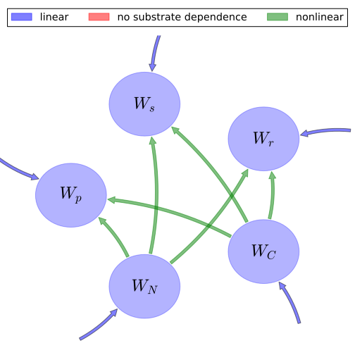

# General Overview

 

This report is the result of the use of the Python 3.4 package Sympy (for symbolic mathematics), as means to translate published models to a common language. It was created by Verónika Ceballos-Núñez (Orcid ID: 0000-0002-0046-1160) on 29/7/2015, and was last modified on _lm_.

## About the model
The model depicted in this document considers carbon allocation with a process based approach. It was originally described by @Hilbert1991Annals_of_Botany.  

### Abstract
A model is developed that considers the allocation of carbon and nitrogen substrates to a protein compartment in the shoots, shoot structural components, and root biomass. Inclusion of a shoot-protein compartment allows variation in shoot-specific activity to be modelled as a function of leaf nitrogen concentration. Allocation to the biomass compartments is controlled by two partitioning variables that are defined by explicitly using the balanced activity hypothesis. The model produces balanced activity where the shoot-specific activity, as well as root and shoot biomass, vary in response to the above-ground (light and CO$_2$) and below-ground (nitrogen) environments. The predicted patterns of both root: shoot ratio and leaf nitrogen concentration in response to environmental resource availability are qualitatively consistent with general trends observed in plants.

### Space Scale
global

### Available parameter values

Abbreviation|Source
:-----|:-----
Original dataset of the publication|@Hilbert1991Annals_of_Botany

Table:  Information on given parameter sets

# State Variables
The following table contains the available information regarding this section:

Variable|Description|Values    key
:-----:|:-----|:-----:
$W_{p}$|Mass of leaf proteins|foliage
$W_{s}$|Mass of leaf structural components|foliage
$W_{r}$|Mass of roots|fine_roots
$W_{C}$|Substrate carbon|-
$W_{N}$|Substrate nitrogen|-

Table: Information on State Variables

# Additional Variables
The following table contains the available information regarding this section:

Variable|Description|Expressions|Type|Units|Values    Original dataset of the publication
:-----:|:-----|:-----:|:-----:|:-----:|:-----:
$W_{g}$|Plant biomass|$W_{g}=W_{p}+W_{s}+W_{r}$|variable|-|-
$\kappa$|growth rate coefficient|-|parameter|-|-
$\sigma_{c}$|photosynthetic rate per unit leaf|-|parameter|-|-
$\sigma_{r}$|specific root activity|-|variable|$[g N (g root)^{-1} d^{-1}]$|-
$h_{max}$|leaf max. thickness|-|parameter|$[m]$|-
$h_{half}$|$h_0.5$ leaf half thickness|-|parameter|-|-
$I$|photon flux density|-|variable|$[\mu mol\, m^{-2}\,s^{-1}]$|-
$\rho$|leaf density|-|variable|-|-
$f_{C}$|proportion of carbon|-|parameter|-|-
$f_{N}$|proportion of nitrogen|-|parameter|-|-
$B$|target whole plant nitrogen:carbon ratio|-|parameter|-|-
$f_{cp}$|proportion of carbon in leaf proteins|-|parameter|-|-
$f_{cs}$|proportion of carbon in leaf structural components|-|parameter|-|-
$f_{cr}$|proportion of carbon in roots|-|parameter|-|-
$f_{np}$|proportion of nitrogen in leaf proteins|-|parameter|-|-
$f_{ns}$|proportion of nitrogen in leaf structural components|-|parameter|-|-
$f_{nr}$|proportion of nitrogen in roots|-|parameter|-|-
$C$|Substrate carbon concentration|$C=\frac{W_{C}}{W_{g}}$|variable|-|-
$N$|Substrate nitrogen concentration|$N=\frac{W_{N}}{W_{g}}$|variable|-|-
$h$|-|$h=\frac{h_{max}\cdot I}{h_{half}+I}$|variable|-|-
$A$|Area|$A=\frac{W_{s}}{\rho}\cdot h$|variable|-|-
$P$|-|$P=\frac{f_{C}\cdot \sigma_{r}\cdot W_{r}}{f_{N}}\cdot \sigma_{c}\cdot A$|variable|-|-
$Q$|-|$Q=\frac{f_{N}}{B\cdot f_{C}}$|parameter|-|-

Table: Information on Additional Variables

# Allocation Coefficients
The following table contains the available information regarding this section:

Variable|Expressions|Type|Values    Original dataset of the publication
:-----:|:-----:|:-----:|:-----:
$\lambda_{p}$|$\lambda_{p}=\frac{P}{1+P+Q}$|variable|$\frac{1}{3}$
$\lambda_{s}$|$\lambda_{s}=\frac{Q}{1+P+Q}$|variable|$\frac{1}{3}$
$\lambda_{r}$|$\lambda_{r}=\frac{1}{1+P+Q}$|variable|$\frac{1}{3}$

Table: Information on Allocation Coefficients

# Auxiliary Variables
The following table contains the available information regarding this section:

Variable|Description|Entry Author Orcid|Expressions|Values    Original dataset of the publication
:-----:|:-----|:-----:|:-----:|:-----:
$O_{C}$|output share of $W_C$|0000-0002-8239-1601|$O_{C}=f_{cp}\cdot \lambda_{p}\cdot W_{p}+f_{cs}\cdot \lambda_{s}\cdot W_{s}+f_{cr}\cdot \lambda_{r}\cdot W_{r}$|-
$O_{N}$|output share of $W_N$|0000-0002-8239-1601|$O_{N}=f_{np}\cdot \lambda_{p}\cdot W_{p}+f_{ns}\cdot \lambda_{s}\cdot W_{s}+f_{nr}\cdot \lambda_{r}\cdot W_{r}$|-

Table: Information on Auxiliary Variables

# Components
The following table contains the available information regarding this section:

Variable|Description|Entry Author Orcid|Expressions|Values    key
:-----:|:-----|:-----:|:-----:|:-----:
$x$|vector of states for vegetation|0000-0002-8239-1601|$x=\left[\begin{matrix}W_{p}\\W_{s}\\W_{r}\\W_{C}\\W_{N}\end{matrix}\right]$|state_vector
$Inp$|external inputs through photosysthesis and roots|0000-0002-8239-1601|$Inp=\left[\begin{matrix}C\cdot N\cdot W_{p}\cdot\kappa\cdot\lambda_{p}\cdot\left(- f_{cp} - f_{np} + 1\right)\\C\cdot N\cdot W_{s}\cdot\kappa\cdot\lambda_{s}\cdot\left(- f_{cs} - f_{ns} + 1\right)\\C\cdot N\cdot W_{r}\cdot\kappa\cdot\lambda_{r}\cdot\left(- f_{cr} - f_{nr} + 1\right)\\A\cdot\sigma_{c}\\W_{r}\cdot\sigma_{r}\end{matrix}\right]$|input_vector
$T$|-|0000-0002-8239-1601|$T=\left[\begin{matrix}-1 & 0 & 0 &\frac{W_{p}}{O_{C}}\cdot f_{cp}\cdot\lambda_{p} &\frac{W_{p}}{O_{N}}\cdot f_{np}\cdot\lambda_{p}\\0 & -1 & 0 &\frac{W_{s}}{O_{C}}\cdot f_{cs}\cdot\lambda_{s} &\frac{W_{s}}{O_{N}}\cdot f_{ns}\cdot\lambda_{s}\\0 & 0 & -1 &\frac{W_{r}}{O_{C}}\cdot f_{cr}\cdot\lambda_{r} &\frac{W_{r}}{O_{N}}\cdot f_{nr}\cdot\lambda_{r}\\0 & 0 & 0 & -1 & 0\\0 & 0 & 0 & 0 & -1\end{matrix}\right]$|trans_op
$N_{gm}$|-|0000-0002-8239-1601|$N_{gm}=\left[\begin{matrix}0 & 0 & 0 & 0 & 0\\0 & 0 & 0 & 0 & 0\\0 & 0 & 0 & 0 & 0\\0 & 0 & 0 &\frac{N}{W_{g}}\cdot O_{C}\cdot\kappa & 0\\0 & 0 & 0 & 0 &\frac{C}{W_{g}}\cdot O_{N}\cdot\kappa\end{matrix}\right]$|cyc_op_nonlin
$f_{v}$|the righthandside of the ode|0000-0002-8239-1601|$f_{v}=Inp+T\cdot N_{gm}\cdot x$|state_vector_derivative

Table: Information on Components

## Pool model representation
<table><thead><tr><th></th><th>Flux description</th></tr></thead><tbody><tr><td align=center, style='vertical-align: middle'>
 

 **Figure 1:** *Pool model representation* 

</td><td align=left style='vertical-align: middle'>
#### Input fluxes
$W_{p}: \frac{I\cdot W_{C}\cdot W_{N}\cdot W_{p}\cdot W_{r}\cdot W_{s}\cdot f_{C}\cdot h_{max}\cdot\kappa\cdot\sigma_{c}\cdot\sigma_{r}\cdot\left(- f_{cp} - f_{np} + 1\right)}{f_{N}\cdot\rho\cdot\left(I + h_{half}\right)\cdot\left(W_{p} + W_{r} + W_{s}\right)^{2}\cdot\left(\frac{I\cdot W_{r}\cdot W_{s}\cdot f_{C}\cdot h_{max}\cdot\sigma_{c}\cdot\sigma_{r}}{f_{N}\cdot\rho\cdot\left(I + h_{half}\right)} + 1 +\frac{f_{N}}{B\cdot f_{C}}\right)}$  $W_{s}: \frac{W_{C}\cdot W_{N}\cdot W_{s}\cdot f_{N}\cdot\kappa\cdot\left(- f_{cs} - f_{ns} + 1\right)}{B\cdot f_{C}\cdot\left(W_{p} + W_{r} + W_{s}\right)^{2}\cdot\left(\frac{I\cdot W_{r}\cdot W_{s}\cdot f_{C}\cdot h_{max}\cdot\sigma_{c}\cdot\sigma_{r}}{f_{N}\cdot\rho\cdot\left(I + h_{half}\right)} + 1 +\frac{f_{N}}{B\cdot f_{C}}\right)}$  $W_{r}: \frac{W_{C}\cdot W_{N}\cdot W_{r}\cdot\kappa\cdot\left(- f_{cr} - f_{nr} + 1\right)}{\left(W_{p} + W_{r} + W_{s}\right)^{2}\cdot\left(\frac{I\cdot W_{r}\cdot W_{s}\cdot f_{C}\cdot h_{max}\cdot\sigma_{c}\cdot\sigma_{r}}{f_{N}\cdot\rho\cdot\left(I + h_{half}\right)} + 1 +\frac{f_{N}}{B\cdot f_{C}}\right)}$  $W_{C}: \frac{I\cdot W_{s}\cdot h_{max}\cdot\sigma_{c}}{\rho\cdot\left(I + h_{half}\right)}$  $W_{N}: W_{r}\cdot\sigma_{r}$  

#### Internal fluxes
$W_{C} > W_{p}: \frac{B\cdot I\cdot W_{C}\cdot W_{N}\cdot W_{p}\cdot W_{r}\cdot W_{s}\cdot f_{C}^{2}\cdot f_{cp}\cdot h_{max}\cdot\kappa\cdot\sigma_{c}\cdot\sigma_{r}}{\left(W_{p} + W_{r} + W_{s}\right)^{2}\cdot\left(B\cdot I\cdot W_{r}\cdot W_{s}\cdot f_{C}^{2}\cdot h_{max}\cdot\sigma_{c}\cdot\sigma_{r} + B\cdot f_{C}\cdot f_{N}\cdot\rho\cdot\left(I + h_{half}\right) + f_{N}^{2}\cdot\rho\cdot\left(I + h_{half}\right)\right)}$  $W_{C} > W_{s}: \frac{W_{C}\cdot W_{N}\cdot W_{s}\cdot f_{N}^{2}\cdot f_{cs}\cdot\kappa\cdot\rho\cdot\left(I + h_{half}\right)}{\left(W_{p} + W_{r} + W_{s}\right)^{2}\cdot\left(B\cdot I\cdot W_{r}\cdot W_{s}\cdot f_{C}^{2}\cdot h_{max}\cdot\sigma_{c}\cdot\sigma_{r} + B\cdot f_{C}\cdot f_{N}\cdot\rho\cdot\left(I + h_{half}\right) + f_{N}^{2}\cdot\rho\cdot\left(I + h_{half}\right)\right)}$  $W_{C} > W_{r}: \frac{B\cdot W_{C}\cdot W_{N}\cdot W_{r}\cdot f_{C}\cdot f_{N}\cdot f_{cr}\cdot\kappa\cdot\rho\cdot\left(I + h_{half}\right)}{\left(W_{p} + W_{r} + W_{s}\right)^{2}\cdot\left(B\cdot I\cdot W_{r}\cdot W_{s}\cdot f_{C}^{2}\cdot h_{max}\cdot\sigma_{c}\cdot\sigma_{r} + B\cdot f_{C}\cdot f_{N}\cdot\rho\cdot\left(I + h_{half}\right) + f_{N}^{2}\cdot\rho\cdot\left(I + h_{half}\right)\right)}$  $W_{N} > W_{p}: \frac{B\cdot I\cdot W_{C}\cdot W_{N}\cdot W_{p}\cdot W_{r}\cdot W_{s}\cdot f_{C}^{2}\cdot f_{np}\cdot h_{max}\cdot\kappa\cdot\sigma_{c}\cdot\sigma_{r}}{\left(W_{p} + W_{r} + W_{s}\right)^{2}\cdot\left(B\cdot I\cdot W_{r}\cdot W_{s}\cdot f_{C}^{2}\cdot h_{max}\cdot\sigma_{c}\cdot\sigma_{r} + B\cdot f_{C}\cdot f_{N}\cdot\rho\cdot\left(I + h_{half}\right) + f_{N}^{2}\cdot\rho\cdot\left(I + h_{half}\right)\right)}$  $W_{N} > W_{s}: \frac{W_{C}\cdot W_{N}\cdot W_{s}\cdot f_{N}^{2}\cdot f_{ns}\cdot\kappa\cdot\rho\cdot\left(I + h_{half}\right)}{\left(W_{p} + W_{r} + W_{s}\right)^{2}\cdot\left(B\cdot I\cdot W_{r}\cdot W_{s}\cdot f_{C}^{2}\cdot h_{max}\cdot\sigma_{c}\cdot\sigma_{r} + B\cdot f_{C}\cdot f_{N}\cdot\rho\cdot\left(I + h_{half}\right) + f_{N}^{2}\cdot\rho\cdot\left(I + h_{half}\right)\right)}$  $W_{N} > W_{r}: \frac{B\cdot W_{C}\cdot W_{N}\cdot W_{r}\cdot f_{C}\cdot f_{N}\cdot f_{nr}\cdot\kappa\cdot\rho\cdot\left(I + h_{half}\right)}{\left(W_{p} + W_{r} + W_{s}\right)^{2}\cdot\left(B\cdot I\cdot W_{r}\cdot W_{s}\cdot f_{C}^{2}\cdot h_{max}\cdot\sigma_{c}\cdot\sigma_{r} + B\cdot f_{C}\cdot f_{N}\cdot\rho\cdot\left(I + h_{half}\right) + f_{N}^{2}\cdot\rho\cdot\left(I + h_{half}\right)\right)}$  </td></tr></tbody></table>
## The right hand side of the ODE
$\left[\begin{matrix}\frac{I\cdot W_{C}\cdot W_{N}\cdot W_{p}\cdot W_{r}\cdot W_{s}\cdot f_{C}\cdot f_{cp}\cdot h_{max}\cdot\kappa\cdot\sigma_{c}\cdot\sigma_{r}}{f_{N}\cdot\rho\cdot\left(I + h_{half}\right)\cdot\left(W_{p} + W_{r} + W_{s}\right)^{2}\cdot\left(\frac{I\cdot W_{r}\cdot W_{s}\cdot f_{C}\cdot h_{max}\cdot\sigma_{c}\cdot\sigma_{r}}{f_{N}\cdot\rho\cdot\left(I + h_{half}\right)} + 1 +\frac{f_{N}}{B\cdot f_{C}}\right)} +\frac{I\cdot W_{C}\cdot W_{N}\cdot W_{p}\cdot W_{r}\cdot W_{s}\cdot f_{C}\cdot f_{np}\cdot h_{max}\cdot\kappa\cdot\sigma_{c}\cdot\sigma_{r}}{f_{N}\cdot\rho\cdot\left(I + h_{half}\right)\cdot\left(W_{p} + W_{r} + W_{s}\right)^{2}\cdot\left(\frac{I\cdot W_{r}\cdot W_{s}\cdot f_{C}\cdot h_{max}\cdot\sigma_{c}\cdot\sigma_{r}}{f_{N}\cdot\rho\cdot\left(I + h_{half}\right)} + 1 +\frac{f_{N}}{B\cdot f_{C}}\right)} +\frac{I\cdot W_{C}\cdot W_{N}\cdot W_{p}\cdot W_{r}\cdot W_{s}\cdot f_{C}\cdot h_{max}\cdot\kappa\cdot\sigma_{c}\cdot\sigma_{r}\cdot\left(- f_{cp} - f_{np} + 1\right)}{f_{N}\cdot\rho\cdot\left(I + h_{half}\right)\cdot\left(W_{p} + W_{r} + W_{s}\right)^{2}\cdot\left(\frac{I\cdot W_{r}\cdot W_{s}\cdot f_{C}\cdot h_{max}\cdot\sigma_{c}\cdot\sigma_{r}}{f_{N}\cdot\rho\cdot\left(I + h_{half}\right)} + 1 +\frac{f_{N}}{B\cdot f_{C}}\right)}\\\frac{W_{C}\cdot W_{N}\cdot W_{s}\cdot f_{N}\cdot f_{cs}\cdot\kappa}{B\cdot f_{C}\cdot\left(W_{p} + W_{r} + W_{s}\right)^{2}\cdot\left(\frac{I\cdot W_{r}\cdot W_{s}\cdot f_{C}\cdot h_{max}\cdot\sigma_{c}\cdot\sigma_{r}}{f_{N}\cdot\rho\cdot\left(I + h_{half}\right)} + 1 +\frac{f_{N}}{B\cdot f_{C}}\right)} +\frac{W_{C}\cdot W_{N}\cdot W_{s}\cdot f_{N}\cdot f_{ns}\cdot\kappa}{B\cdot f_{C}\cdot\left(W_{p} + W_{r} + W_{s}\right)^{2}\cdot\left(\frac{I\cdot W_{r}\cdot W_{s}\cdot f_{C}\cdot h_{max}\cdot\sigma_{c}\cdot\sigma_{r}}{f_{N}\cdot\rho\cdot\left(I + h_{half}\right)} + 1 +\frac{f_{N}}{B\cdot f_{C}}\right)} +\frac{W_{C}\cdot W_{N}\cdot W_{s}\cdot f_{N}\cdot\kappa\cdot\left(- f_{cs} - f_{ns} + 1\right)}{B\cdot f_{C}\cdot\left(W_{p} + W_{r} + W_{s}\right)^{2}\cdot\left(\frac{I\cdot W_{r}\cdot W_{s}\cdot f_{C}\cdot h_{max}\cdot\sigma_{c}\cdot\sigma_{r}}{f_{N}\cdot\rho\cdot\left(I + h_{half}\right)} + 1 +\frac{f_{N}}{B\cdot f_{C}}\right)}\\\frac{W_{C}\cdot W_{N}\cdot W_{r}\cdot f_{cr}\cdot\kappa}{\left(W_{p} + W_{r} + W_{s}\right)^{2}\cdot\left(\frac{I\cdot W_{r}\cdot W_{s}\cdot f_{C}\cdot h_{max}\cdot\sigma_{c}\cdot\sigma_{r}}{f_{N}\cdot\rho\cdot\left(I + h_{half}\right)} + 1 +\frac{f_{N}}{B\cdot f_{C}}\right)} +\frac{W_{C}\cdot W_{N}\cdot W_{r}\cdot f_{nr}\cdot\kappa}{\left(W_{p} + W_{r} + W_{s}\right)^{2}\cdot\left(\frac{I\cdot W_{r}\cdot W_{s}\cdot f_{C}\cdot h_{max}\cdot\sigma_{c}\cdot\sigma_{r}}{f_{N}\cdot\rho\cdot\left(I + h_{half}\right)} + 1 +\frac{f_{N}}{B\cdot f_{C}}\right)} +\frac{W_{C}\cdot W_{N}\cdot W_{r}\cdot\kappa\cdot\left(- f_{cr} - f_{nr} + 1\right)}{\left(W_{p} + W_{r} + W_{s}\right)^{2}\cdot\left(\frac{I\cdot W_{r}\cdot W_{s}\cdot f_{C}\cdot h_{max}\cdot\sigma_{c}\cdot\sigma_{r}}{f_{N}\cdot\rho\cdot\left(I + h_{half}\right)} + 1 +\frac{f_{N}}{B\cdot f_{C}}\right)}\\\frac{I\cdot W_{s}\cdot h_{max}\cdot\sigma_{c}}{\rho\cdot\left(I + h_{half}\right)} -\frac{W_{C}\cdot W_{N}\cdot\kappa}{\left(W_{p} + W_{r} + W_{s}\right)^{2}}\cdot\left(\frac{I\cdot W_{p}\cdot W_{r}\cdot W_{s}\cdot f_{C}\cdot f_{cp}\cdot h_{max}\cdot\sigma_{c}\cdot\sigma_{r}}{f_{N}\cdot\rho\cdot\left(I + h_{half}\right)\cdot\left(\frac{I\cdot W_{r}\cdot W_{s}\cdot f_{C}\cdot h_{max}\cdot\sigma_{c}\cdot\sigma_{r}}{f_{N}\cdot\rho\cdot\left(I + h_{half}\right)} + 1 +\frac{f_{N}}{B\cdot f_{C}}\right)} +\frac{W_{r}\cdot f_{cr}}{\frac{I\cdot W_{r}\cdot W_{s}\cdot f_{C}\cdot h_{max}\cdot\sigma_{c}\cdot\sigma_{r}}{f_{N}\cdot\rho\cdot\left(I + h_{half}\right)} + 1 +\frac{f_{N}}{B\cdot f_{C}}} +\frac{W_{s}\cdot f_{N}\cdot f_{cs}}{B\cdot f_{C}\cdot\left(\frac{I\cdot W_{r}\cdot W_{s}\cdot f_{C}\cdot h_{max}\cdot\sigma_{c}\cdot\sigma_{r}}{f_{N}\cdot\rho\cdot\left(I + h_{half}\right)} + 1 +\frac{f_{N}}{B\cdot f_{C}}\right)}\right)\\-\frac{W_{C}\cdot W_{N}\cdot\kappa}{\left(W_{p} + W_{r} + W_{s}\right)^{2}}\cdot\left(\frac{I\cdot W_{p}\cdot W_{r}\cdot W_{s}\cdot f_{C}\cdot f_{np}\cdot h_{max}\cdot\sigma_{c}\cdot\sigma_{r}}{f_{N}\cdot\rho\cdot\left(I + h_{half}\right)\cdot\left(\frac{I\cdot W_{r}\cdot W_{s}\cdot f_{C}\cdot h_{max}\cdot\sigma_{c}\cdot\sigma_{r}}{f_{N}\cdot\rho\cdot\left(I + h_{half}\right)} + 1 +\frac{f_{N}}{B\cdot f_{C}}\right)} +\frac{W_{r}\cdot f_{nr}}{\frac{I\cdot W_{r}\cdot W_{s}\cdot f_{C}\cdot h_{max}\cdot\sigma_{c}\cdot\sigma_{r}}{f_{N}\cdot\rho\cdot\left(I + h_{half}\right)} + 1 +\frac{f_{N}}{B\cdot f_{C}}} +\frac{W_{s}\cdot f_{N}\cdot f_{ns}}{B\cdot f_{C}\cdot\left(\frac{I\cdot W_{r}\cdot W_{s}\cdot f_{C}\cdot h_{max}\cdot\sigma_{c}\cdot\sigma_{r}}{f_{N}\cdot\rho\cdot\left(I + h_{half}\right)} + 1 +\frac{f_{N}}{B\cdot f_{C}}\right)}\right) + W_{r}\cdot\sigma_{r}\end{matrix}\right]$

## The Jacobian (derivative of the ODE w.r.t. state variables)
$\left[\begin{matrix}-\frac{2\cdot I\cdot W_{C}\cdot W_{N}\cdot W_{p}\cdot W_{r}\cdot W_{s}\cdot f_{C}\cdot f_{cp}\cdot h_{max}\cdot\kappa\cdot\sigma_{c}\cdot\sigma_{r}}{f_{N}\cdot\rho\cdot\left(I + h_{half}\right)\cdot\left(W_{p} + W_{r} + W_{s}\right)^{3}\cdot\left(\frac{I\cdot W_{r}\cdot W_{s}\cdot f_{C}\cdot h_{max}\cdot\sigma_{c}\cdot\sigma_{r}}{f_{N}\cdot\rho\cdot\left(I + h_{half}\right)} + 1 +\frac{f_{N}}{B\cdot f_{C}}\right)} -\frac{2\cdot I\cdot W_{C}\cdot W_{N}\cdot W_{p}\cdot W_{r}\cdot W_{s}\cdot f_{C}\cdot f_{np}\cdot h_{max}\cdot\kappa\cdot\sigma_{c}\cdot\sigma_{r}}{f_{N}\cdot\rho\cdot\left(I + h_{half}\right)\cdot\left(W_{p} + W_{r} + W_{s}\right)^{3}\cdot\left(\frac{I\cdot W_{r}\cdot W_{s}\cdot f_{C}\cdot h_{max}\cdot\sigma_{c}\cdot\sigma_{r}}{f_{N}\cdot\rho\cdot\left(I + h_{half}\right)} + 1 +\frac{f_{N}}{B\cdot f_{C}}\right)} -\frac{2\cdot I\cdot W_{C}\cdot W_{N}\cdot W_{p}\cdot W_{r}\cdot W_{s}\cdot f_{C}\cdot h_{max}\cdot\kappa\cdot\sigma_{c}\cdot\sigma_{r}\cdot\left(- f_{cp} - f_{np} + 1\right)}{f_{N}\cdot\rho\cdot\left(I + h_{half}\right)\cdot\left(W_{p} + W_{r} + W_{s}\right)^{3}\cdot\left(\frac{I\cdot W_{r}\cdot W_{s}\cdot f_{C}\cdot h_{max}\cdot\sigma_{c}\cdot\sigma_{r}}{f_{N}\cdot\rho\cdot\left(I + h_{half}\right)} + 1 +\frac{f_{N}}{B\cdot f_{C}}\right)} +\frac{I\cdot W_{C}\cdot W_{N}\cdot W_{r}\cdot W_{s}\cdot f_{C}\cdot f_{cp}\cdot h_{max}\cdot\kappa\cdot\sigma_{c}\cdot\sigma_{r}}{f_{N}\cdot\rho\cdot\left(I + h_{half}\right)\cdot\left(W_{p} + W_{r} + W_{s}\right)^{2}\cdot\left(\frac{I\cdot W_{r}\cdot W_{s}\cdot f_{C}\cdot h_{max}\cdot\sigma_{c}\cdot\sigma_{r}}{f_{N}\cdot\rho\cdot\left(I + h_{half}\right)} + 1 +\frac{f_{N}}{B\cdot f_{C}}\right)} +\frac{I\cdot W_{C}\cdot W_{N}\cdot W_{r}\cdot W_{s}\cdot f_{C}\cdot f_{np}\cdot h_{max}\cdot\kappa\cdot\sigma_{c}\cdot\sigma_{r}}{f_{N}\cdot\rho\cdot\left(I + h_{half}\right)\cdot\left(W_{p} + W_{r} + W_{s}\right)^{2}\cdot\left(\frac{I\cdot W_{r}\cdot W_{s}\cdot f_{C}\cdot h_{max}\cdot\sigma_{c}\cdot\sigma_{r}}{f_{N}\cdot\rho\cdot\left(I + h_{half}\right)} + 1 +\frac{f_{N}}{B\cdot f_{C}}\right)} +\frac{I\cdot W_{C}\cdot W_{N}\cdot W_{r}\cdot W_{s}\cdot f_{C}\cdot h_{max}\cdot\kappa\cdot\sigma_{c}\cdot\sigma_{r}\cdot\left(- f_{cp} - f_{np} + 1\right)}{f_{N}\cdot\rho\cdot\left(I + h_{half}\right)\cdot\left(W_{p} + W_{r} + W_{s}\right)^{2}\cdot\left(\frac{I\cdot W_{r}\cdot W_{s}\cdot f_{C}\cdot h_{max}\cdot\sigma_{c}\cdot\sigma_{r}}{f_{N}\cdot\rho\cdot\left(I + h_{half}\right)} + 1 +\frac{f_{N}}{B\cdot f_{C}}\right)} & -\frac{I^{2}\cdot W_{C}\cdot W_{N}\cdot W_{p}\cdot W_{r}^{2}\cdot W_{s}\cdot f_{C}^{2}\cdot f_{cp}\cdot h_{max}^{2}\cdot\kappa\cdot\sigma_{c}^{2}\cdot\sigma_{r}^{2}}{f_{N}^{2}\cdot\rho^{2}\cdot\left(I + h_{half}\right)^{2}\cdot\left(W_{p} + W_{r} + W_{s}\right)^{2}\cdot\left(\frac{I\cdot W_{r}\cdot W_{s}\cdot f_{C}\cdot h_{max}\cdot\sigma_{c}\cdot\sigma_{r}}{f_{N}\cdot\rho\cdot\left(I + h_{half}\right)} + 1 +\frac{f_{N}}{B\cdot f_{C}}\right)^{2}} -\frac{I^{2}\cdot W_{C}\cdot W_{N}\cdot W_{p}\cdot W_{r}^{2}\cdot W_{s}\cdot f_{C}^{2}\cdot f_{np}\cdot h_{max}^{2}\cdot\kappa\cdot\sigma_{c}^{2}\cdot\sigma_{r}^{2}}{f_{N}^{2}\cdot\rho^{2}\cdot\left(I + h_{half}\right)^{2}\cdot\left(W_{p} + W_{r} + W_{s}\right)^{2}\cdot\left(\frac{I\cdot W_{r}\cdot W_{s}\cdot f_{C}\cdot h_{max}\cdot\sigma_{c}\cdot\sigma_{r}}{f_{N}\cdot\rho\cdot\left(I + h_{half}\right)} + 1 +\frac{f_{N}}{B\cdot f_{C}}\right)^{2}} -\frac{I^{2}\cdot W_{C}\cdot W_{N}\cdot W_{p}\cdot W_{r}^{2}\cdot W_{s}\cdot f_{C}^{2}\cdot h_{max}^{2}\cdot\kappa\cdot\sigma_{c}^{2}\cdot\sigma_{r}^{2}\cdot\left(- f_{cp} - f_{np} + 1\right)}{f_{N}^{2}\cdot\rho^{2}\cdot\left(I + h_{half}\right)^{2}\cdot\left(W_{p} + W_{r} + W_{s}\right)^{2}\cdot\left(\frac{I\cdot W_{r}\cdot W_{s}\cdot f_{C}\cdot h_{max}\cdot\sigma_{c}\cdot\sigma_{r}}{f_{N}\cdot\rho\cdot\left(I + h_{half}\right)} + 1 +\frac{f_{N}}{B\cdot f_{C}}\right)^{2}} -\frac{2\cdot I\cdot W_{C}\cdot W_{N}\cdot W_{p}\cdot W_{r}\cdot W_{s}\cdot f_{C}\cdot f_{cp}\cdot h_{max}\cdot\kappa\cdot\sigma_{c}\cdot\sigma_{r}}{f_{N}\cdot\rho\cdot\left(I + h_{half}\right)\cdot\left(W_{p} + W_{r} + W_{s}\right)^{3}\cdot\left(\frac{I\cdot W_{r}\cdot W_{s}\cdot f_{C}\cdot h_{max}\cdot\sigma_{c}\cdot\sigma_{r}}{f_{N}\cdot\rho\cdot\left(I + h_{half}\right)} + 1 +\frac{f_{N}}{B\cdot f_{C}}\right)} -\frac{2\cdot I\cdot W_{C}\cdot W_{N}\cdot W_{p}\cdot W_{r}\cdot W_{s}\cdot f_{C}\cdot f_{np}\cdot h_{max}\cdot\kappa\cdot\sigma_{c}\cdot\sigma_{r}}{f_{N}\cdot\rho\cdot\left(I + h_{half}\right)\cdot\left(W_{p} + W_{r} + W_{s}\right)^{3}\cdot\left(\frac{I\cdot W_{r}\cdot W_{s}\cdot f_{C}\cdot h_{max}\cdot\sigma_{c}\cdot\sigma_{r}}{f_{N}\cdot\rho\cdot\left(I + h_{half}\right)} + 1 +\frac{f_{N}}{B\cdot f_{C}}\right)} -\frac{2\cdot I\cdot W_{C}\cdot W_{N}\cdot W_{p}\cdot W_{r}\cdot W_{s}\cdot f_{C}\cdot h_{max}\cdot\kappa\cdot\sigma_{c}\cdot\sigma_{r}\cdot\left(- f_{cp} - f_{np} + 1\right)}{f_{N}\cdot\rho\cdot\left(I + h_{half}\right)\cdot\left(W_{p} + W_{r} + W_{s}\right)^{3}\cdot\left(\frac{I\cdot W_{r}\cdot W_{s}\cdot f_{C}\cdot h_{max}\cdot\sigma_{c}\cdot\sigma_{r}}{f_{N}\cdot\rho\cdot\left(I + h_{half}\right)} + 1 +\frac{f_{N}}{B\cdot f_{C}}\right)} +\frac{I\cdot W_{C}\cdot W_{N}\cdot W_{p}\cdot W_{r}\cdot f_{C}\cdot f_{cp}\cdot h_{max}\cdot\kappa\cdot\sigma_{c}\cdot\sigma_{r}}{f_{N}\cdot\rho\cdot\left(I + h_{half}\right)\cdot\left(W_{p} + W_{r} + W_{s}\right)^{2}\cdot\left(\frac{I\cdot W_{r}\cdot W_{s}\cdot f_{C}\cdot h_{max}\cdot\sigma_{c}\cdot\sigma_{r}}{f_{N}\cdot\rho\cdot\left(I + h_{half}\right)} + 1 +\frac{f_{N}}{B\cdot f_{C}}\right)} +\frac{I\cdot W_{C}\cdot W_{N}\cdot W_{p}\cdot W_{r}\cdot f_{C}\cdot f_{np}\cdot h_{max}\cdot\kappa\cdot\sigma_{c}\cdot\sigma_{r}}{f_{N}\cdot\rho\cdot\left(I + h_{half}\right)\cdot\left(W_{p} + W_{r} + W_{s}\right)^{2}\cdot\left(\frac{I\cdot W_{r}\cdot W_{s}\cdot f_{C}\cdot h_{max}\cdot\sigma_{c}\cdot\sigma_{r}}{f_{N}\cdot\rho\cdot\left(I + h_{half}\right)} + 1 +\frac{f_{N}}{B\cdot f_{C}}\right)} +\frac{I\cdot W_{C}\cdot W_{N}\cdot W_{p}\cdot W_{r}\cdot f_{C}\cdot h_{max}\cdot\kappa\cdot\sigma_{c}\cdot\sigma_{r}\cdot\left(- f_{cp} - f_{np} + 1\right)}{f_{N}\cdot\rho\cdot\left(I + h_{half}\right)\cdot\left(W_{p} + W_{r} + W_{s}\right)^{2}\cdot\left(\frac{I\cdot W_{r}\cdot W_{s}\cdot f_{C}\cdot h_{max}\cdot\sigma_{c}\cdot\sigma_{r}}{f_{N}\cdot\rho\cdot\left(I + h_{half}\right)} + 1 +\frac{f_{N}}{B\cdot f_{C}}\right)} & -\frac{I^{2}\cdot W_{C}\cdot W_{N}\cdot W_{p}\cdot W_{r}\cdot W_{s}^{2}\cdot f_{C}^{2}\cdot f_{cp}\cdot h_{max}^{2}\cdot\kappa\cdot\sigma_{c}^{2}\cdot\sigma_{r}^{2}}{f_{N}^{2}\cdot\rho^{2}\cdot\left(I + h_{half}\right)^{2}\cdot\left(W_{p} + W_{r} + W_{s}\right)^{2}\cdot\left(\frac{I\cdot W_{r}\cdot W_{s}\cdot f_{C}\cdot h_{max}\cdot\sigma_{c}\cdot\sigma_{r}}{f_{N}\cdot\rho\cdot\left(I + h_{half}\right)} + 1 +\frac{f_{N}}{B\cdot f_{C}}\right)^{2}} -\frac{I^{2}\cdot W_{C}\cdot W_{N}\cdot W_{p}\cdot W_{r}\cdot W_{s}^{2}\cdot f_{C}^{2}\cdot f_{np}\cdot h_{max}^{2}\cdot\kappa\cdot\sigma_{c}^{2}\cdot\sigma_{r}^{2}}{f_{N}^{2}\cdot\rho^{2}\cdot\left(I + h_{half}\right)^{2}\cdot\left(W_{p} + W_{r} + W_{s}\right)^{2}\cdot\left(\frac{I\cdot W_{r}\cdot W_{s}\cdot f_{C}\cdot h_{max}\cdot\sigma_{c}\cdot\sigma_{r}}{f_{N}\cdot\rho\cdot\left(I + h_{half}\right)} + 1 +\frac{f_{N}}{B\cdot f_{C}}\right)^{2}} -\frac{I^{2}\cdot W_{C}\cdot W_{N}\cdot W_{p}\cdot W_{r}\cdot W_{s}^{2}\cdot f_{C}^{2}\cdot h_{max}^{2}\cdot\kappa\cdot\sigma_{c}^{2}\cdot\sigma_{r}^{2}\cdot\left(- f_{cp} - f_{np} + 1\right)}{f_{N}^{2}\cdot\rho^{2}\cdot\left(I + h_{half}\right)^{2}\cdot\left(W_{p} + W_{r} + W_{s}\right)^{2}\cdot\left(\frac{I\cdot W_{r}\cdot W_{s}\cdot f_{C}\cdot h_{max}\cdot\sigma_{c}\cdot\sigma_{r}}{f_{N}\cdot\rho\cdot\left(I + h_{half}\right)} + 1 +\frac{f_{N}}{B\cdot f_{C}}\right)^{2}} -\frac{2\cdot I\cdot W_{C}\cdot W_{N}\cdot W_{p}\cdot W_{r}\cdot W_{s}\cdot f_{C}\cdot f_{cp}\cdot h_{max}\cdot\kappa\cdot\sigma_{c}\cdot\sigma_{r}}{f_{N}\cdot\rho\cdot\left(I + h_{half}\right)\cdot\left(W_{p} + W_{r} + W_{s}\right)^{3}\cdot\left(\frac{I\cdot W_{r}\cdot W_{s}\cdot f_{C}\cdot h_{max}\cdot\sigma_{c}\cdot\sigma_{r}}{f_{N}\cdot\rho\cdot\left(I + h_{half}\right)} + 1 +\frac{f_{N}}{B\cdot f_{C}}\right)} -\frac{2\cdot I\cdot W_{C}\cdot W_{N}\cdot W_{p}\cdot W_{r}\cdot W_{s}\cdot f_{C}\cdot f_{np}\cdot h_{max}\cdot\kappa\cdot\sigma_{c}\cdot\sigma_{r}}{f_{N}\cdot\rho\cdot\left(I + h_{half}\right)\cdot\left(W_{p} + W_{r} + W_{s}\right)^{3}\cdot\left(\frac{I\cdot W_{r}\cdot W_{s}\cdot f_{C}\cdot h_{max}\cdot\sigma_{c}\cdot\sigma_{r}}{f_{N}\cdot\rho\cdot\left(I + h_{half}\right)} + 1 +\frac{f_{N}}{B\cdot f_{C}}\right)} -\frac{2\cdot I\cdot W_{C}\cdot W_{N}\cdot W_{p}\cdot W_{r}\cdot W_{s}\cdot f_{C}\cdot h_{max}\cdot\kappa\cdot\sigma_{c}\cdot\sigma_{r}\cdot\left(- f_{cp} - f_{np} + 1\right)}{f_{N}\cdot\rho\cdot\left(I + h_{half}\right)\cdot\left(W_{p} + W_{r} + W_{s}\right)^{3}\cdot\left(\frac{I\cdot W_{r}\cdot W_{s}\cdot f_{C}\cdot h_{max}\cdot\sigma_{c}\cdot\sigma_{r}}{f_{N}\cdot\rho\cdot\left(I + h_{half}\right)} + 1 +\frac{f_{N}}{B\cdot f_{C}}\right)} +\frac{I\cdot W_{C}\cdot W_{N}\cdot W_{p}\cdot W_{s}\cdot f_{C}\cdot f_{cp}\cdot h_{max}\cdot\kappa\cdot\sigma_{c}\cdot\sigma_{r}}{f_{N}\cdot\rho\cdot\left(I + h_{half}\right)\cdot\left(W_{p} + W_{r} + W_{s}\right)^{2}\cdot\left(\frac{I\cdot W_{r}\cdot W_{s}\cdot f_{C}\cdot h_{max}\cdot\sigma_{c}\cdot\sigma_{r}}{f_{N}\cdot\rho\cdot\left(I + h_{half}\right)} + 1 +\frac{f_{N}}{B\cdot f_{C}}\right)} +\frac{I\cdot W_{C}\cdot W_{N}\cdot W_{p}\cdot W_{s}\cdot f_{C}\cdot f_{np}\cdot h_{max}\cdot\kappa\cdot\sigma_{c}\cdot\sigma_{r}}{f_{N}\cdot\rho\cdot\left(I + h_{half}\right)\cdot\left(W_{p} + W_{r} + W_{s}\right)^{2}\cdot\left(\frac{I\cdot W_{r}\cdot W_{s}\cdot f_{C}\cdot h_{max}\cdot\sigma_{c}\cdot\sigma_{r}}{f_{N}\cdot\rho\cdot\left(I + h_{half}\right)} + 1 +\frac{f_{N}}{B\cdot f_{C}}\right)} +\frac{I\cdot W_{C}\cdot W_{N}\cdot W_{p}\cdot W_{s}\cdot f_{C}\cdot h_{max}\cdot\kappa\cdot\sigma_{c}\cdot\sigma_{r}\cdot\left(- f_{cp} - f_{np} + 1\right)}{f_{N}\cdot\rho\cdot\left(I + h_{half}\right)\cdot\left(W_{p} + W_{r} + W_{s}\right)^{2}\cdot\left(\frac{I\cdot W_{r}\cdot W_{s}\cdot f_{C}\cdot h_{max}\cdot\sigma_{c}\cdot\sigma_{r}}{f_{N}\cdot\rho\cdot\left(I + h_{half}\right)} + 1 +\frac{f_{N}}{B\cdot f_{C}}\right)} &\frac{I\cdot W_{N}\cdot W_{p}\cdot W_{r}\cdot W_{s}\cdot f_{C}\cdot f_{cp}\cdot h_{max}\cdot\kappa\cdot\sigma_{c}\cdot\sigma_{r}}{f_{N}\cdot\rho\cdot\left(I + h_{half}\right)\cdot\left(W_{p} + W_{r} + W_{s}\right)^{2}\cdot\left(\frac{I\cdot W_{r}\cdot W_{s}\cdot f_{C}\cdot h_{max}\cdot\sigma_{c}\cdot\sigma_{r}}{f_{N}\cdot\rho\cdot\left(I + h_{half}\right)} + 1 +\frac{f_{N}}{B\cdot f_{C}}\right)} +\frac{I\cdot W_{N}\cdot W_{p}\cdot W_{r}\cdot W_{s}\cdot f_{C}\cdot f_{np}\cdot h_{max}\cdot\kappa\cdot\sigma_{c}\cdot\sigma_{r}}{f_{N}\cdot\rho\cdot\left(I + h_{half}\right)\cdot\left(W_{p} + W_{r} + W_{s}\right)^{2}\cdot\left(\frac{I\cdot W_{r}\cdot W_{s}\cdot f_{C}\cdot h_{max}\cdot\sigma_{c}\cdot\sigma_{r}}{f_{N}\cdot\rho\cdot\left(I + h_{half}\right)} + 1 +\frac{f_{N}}{B\cdot f_{C}}\right)} +\frac{I\cdot W_{N}\cdot W_{p}\cdot W_{r}\cdot W_{s}\cdot f_{C}\cdot h_{max}\cdot\kappa\cdot\sigma_{c}\cdot\sigma_{r}\cdot\left(- f_{cp} - f_{np} + 1\right)}{f_{N}\cdot\rho\cdot\left(I + h_{half}\right)\cdot\left(W_{p} + W_{r} + W_{s}\right)^{2}\cdot\left(\frac{I\cdot W_{r}\cdot W_{s}\cdot f_{C}\cdot h_{max}\cdot\sigma_{c}\cdot\sigma_{r}}{f_{N}\cdot\rho\cdot\left(I + h_{half}\right)} + 1 +\frac{f_{N}}{B\cdot f_{C}}\right)} &\frac{I\cdot W_{C}\cdot W_{p}\cdot W_{r}\cdot W_{s}\cdot f_{C}\cdot f_{cp}\cdot h_{max}\cdot\kappa\cdot\sigma_{c}\cdot\sigma_{r}}{f_{N}\cdot\rho\cdot\left(I + h_{half}\right)\cdot\left(W_{p} + W_{r} + W_{s}\right)^{2}\cdot\left(\frac{I\cdot W_{r}\cdot W_{s}\cdot f_{C}\cdot h_{max}\cdot\sigma_{c}\cdot\sigma_{r}}{f_{N}\cdot\rho\cdot\left(I + h_{half}\right)} + 1 +\frac{f_{N}}{B\cdot f_{C}}\right)} +\frac{I\cdot W_{C}\cdot W_{p}\cdot W_{r}\cdot W_{s}\cdot f_{C}\cdot f_{np}\cdot h_{max}\cdot\kappa\cdot\sigma_{c}\cdot\sigma_{r}}{f_{N}\cdot\rho\cdot\left(I + h_{half}\right)\cdot\left(W_{p} + W_{r} + W_{s}\right)^{2}\cdot\left(\frac{I\cdot W_{r}\cdot W_{s}\cdot f_{C}\cdot h_{max}\cdot\sigma_{c}\cdot\sigma_{r}}{f_{N}\cdot\rho\cdot\left(I + h_{half}\right)} + 1 +\frac{f_{N}}{B\cdot f_{C}}\right)} +\frac{I\cdot W_{C}\cdot W_{p}\cdot W_{r}\cdot W_{s}\cdot f_{C}\cdot h_{max}\cdot\kappa\cdot\sigma_{c}\cdot\sigma_{r}\cdot\left(- f_{cp} - f_{np} + 1\right)}{f_{N}\cdot\rho\cdot\left(I + h_{half}\right)\cdot\left(W_{p} + W_{r} + W_{s}\right)^{2}\cdot\left(\frac{I\cdot W_{r}\cdot W_{s}\cdot f_{C}\cdot h_{max}\cdot\sigma_{c}\cdot\sigma_{r}}{f_{N}\cdot\rho\cdot\left(I + h_{half}\right)} + 1 +\frac{f_{N}}{B\cdot f_{C}}\right)}\\-\frac{2\cdot W_{C}\cdot W_{N}\cdot W_{s}\cdot f_{N}\cdot f_{cs}\cdot\kappa}{B\cdot f_{C}\cdot\left(W_{p} + W_{r} + W_{s}\right)^{3}\cdot\left(\frac{I\cdot W_{r}\cdot W_{s}\cdot f_{C}\cdot h_{max}\cdot\sigma_{c}\cdot\sigma_{r}}{f_{N}\cdot\rho\cdot\left(I + h_{half}\right)} + 1 +\frac{f_{N}}{B\cdot f_{C}}\right)} -\frac{2\cdot W_{C}\cdot W_{N}\cdot W_{s}\cdot f_{N}\cdot f_{ns}\cdot\kappa}{B\cdot f_{C}\cdot\left(W_{p} + W_{r} + W_{s}\right)^{3}\cdot\left(\frac{I\cdot W_{r}\cdot W_{s}\cdot f_{C}\cdot h_{max}\cdot\sigma_{c}\cdot\sigma_{r}}{f_{N}\cdot\rho\cdot\left(I + h_{half}\right)} + 1 +\frac{f_{N}}{B\cdot f_{C}}\right)} -\frac{2\cdot W_{C}\cdot W_{N}\cdot W_{s}\cdot f_{N}\cdot\kappa\cdot\left(- f_{cs} - f_{ns} + 1\right)}{B\cdot f_{C}\cdot\left(W_{p} + W_{r} + W_{s}\right)^{3}\cdot\left(\frac{I\cdot W_{r}\cdot W_{s}\cdot f_{C}\cdot h_{max}\cdot\sigma_{c}\cdot\sigma_{r}}{f_{N}\cdot\rho\cdot\left(I + h_{half}\right)} + 1 +\frac{f_{N}}{B\cdot f_{C}}\right)} & -\frac{I\cdot W_{C}\cdot W_{N}\cdot W_{r}\cdot W_{s}\cdot f_{cs}\cdot h_{max}\cdot\kappa\cdot\sigma_{c}\cdot\sigma_{r}}{B\cdot\rho\cdot\left(I + h_{half}\right)\cdot\left(W_{p} + W_{r} + W_{s}\right)^{2}\cdot\left(\frac{I\cdot W_{r}\cdot W_{s}\cdot f_{C}\cdot h_{max}\cdot\sigma_{c}\cdot\sigma_{r}}{f_{N}\cdot\rho\cdot\left(I + h_{half}\right)} + 1 +\frac{f_{N}}{B\cdot f_{C}}\right)^{2}} -\frac{I\cdot W_{C}\cdot W_{N}\cdot W_{r}\cdot W_{s}\cdot f_{ns}\cdot h_{max}\cdot\kappa\cdot\sigma_{c}\cdot\sigma_{r}}{B\cdot\rho\cdot\left(I + h_{half}\right)\cdot\left(W_{p} + W_{r} + W_{s}\right)^{2}\cdot\left(\frac{I\cdot W_{r}\cdot W_{s}\cdot f_{C}\cdot h_{max}\cdot\sigma_{c}\cdot\sigma_{r}}{f_{N}\cdot\rho\cdot\left(I + h_{half}\right)} + 1 +\frac{f_{N}}{B\cdot f_{C}}\right)^{2}} -\frac{I\cdot W_{C}\cdot W_{N}\cdot W_{r}\cdot W_{s}\cdot h_{max}\cdot\kappa\cdot\sigma_{c}\cdot\sigma_{r}\cdot\left(- f_{cs} - f_{ns} + 1\right)}{B\cdot\rho\cdot\left(I + h_{half}\right)\cdot\left(W_{p} + W_{r} + W_{s}\right)^{2}\cdot\left(\frac{I\cdot W_{r}\cdot W_{s}\cdot f_{C}\cdot h_{max}\cdot\sigma_{c}\cdot\sigma_{r}}{f_{N}\cdot\rho\cdot\left(I + h_{half}\right)} + 1 +\frac{f_{N}}{B\cdot f_{C}}\right)^{2}} -\frac{2\cdot W_{C}\cdot W_{N}\cdot W_{s}\cdot f_{N}\cdot f_{cs}\cdot\kappa}{B\cdot f_{C}\cdot\left(W_{p} + W_{r} + W_{s}\right)^{3}\cdot\left(\frac{I\cdot W_{r}\cdot W_{s}\cdot f_{C}\cdot h_{max}\cdot\sigma_{c}\cdot\sigma_{r}}{f_{N}\cdot\rho\cdot\left(I + h_{half}\right)} + 1 +\frac{f_{N}}{B\cdot f_{C}}\right)} -\frac{2\cdot W_{C}\cdot W_{N}\cdot W_{s}\cdot f_{N}\cdot f_{ns}\cdot\kappa}{B\cdot f_{C}\cdot\left(W_{p} + W_{r} + W_{s}\right)^{3}\cdot\left(\frac{I\cdot W_{r}\cdot W_{s}\cdot f_{C}\cdot h_{max}\cdot\sigma_{c}\cdot\sigma_{r}}{f_{N}\cdot\rho\cdot\left(I + h_{half}\right)} + 1 +\frac{f_{N}}{B\cdot f_{C}}\right)} -\frac{2\cdot W_{C}\cdot W_{N}\cdot W_{s}\cdot f_{N}\cdot\kappa\cdot\left(- f_{cs} - f_{ns} + 1\right)}{B\cdot f_{C}\cdot\left(W_{p} + W_{r} + W_{s}\right)^{3}\cdot\left(\frac{I\cdot W_{r}\cdot W_{s}\cdot f_{C}\cdot h_{max}\cdot\sigma_{c}\cdot\sigma_{r}}{f_{N}\cdot\rho\cdot\left(I + h_{half}\right)} + 1 +\frac{f_{N}}{B\cdot f_{C}}\right)} +\frac{W_{C}\cdot W_{N}\cdot f_{N}\cdot f_{cs}\cdot\kappa}{B\cdot f_{C}\cdot\left(W_{p} + W_{r} + W_{s}\right)^{2}\cdot\left(\frac{I\cdot W_{r}\cdot W_{s}\cdot f_{C}\cdot h_{max}\cdot\sigma_{c}\cdot\sigma_{r}}{f_{N}\cdot\rho\cdot\left(I + h_{half}\right)} + 1 +\frac{f_{N}}{B\cdot f_{C}}\right)} +\frac{W_{C}\cdot W_{N}\cdot f_{N}\cdot f_{ns}\cdot\kappa}{B\cdot f_{C}\cdot\left(W_{p} + W_{r} + W_{s}\right)^{2}\cdot\left(\frac{I\cdot W_{r}\cdot W_{s}\cdot f_{C}\cdot h_{max}\cdot\sigma_{c}\cdot\sigma_{r}}{f_{N}\cdot\rho\cdot\left(I + h_{half}\right)} + 1 +\frac{f_{N}}{B\cdot f_{C}}\right)} +\frac{W_{C}\cdot W_{N}\cdot f_{N}\cdot\kappa\cdot\left(- f_{cs} - f_{ns} + 1\right)}{B\cdot f_{C}\cdot\left(W_{p} + W_{r} + W_{s}\right)^{2}\cdot\left(\frac{I\cdot W_{r}\cdot W_{s}\cdot f_{C}\cdot h_{max}\cdot\sigma_{c}\cdot\sigma_{r}}{f_{N}\cdot\rho\cdot\left(I + h_{half}\right)} + 1 +\frac{f_{N}}{B\cdot f_{C}}\right)} & -\frac{I\cdot W_{C}\cdot W_{N}\cdot W_{s}^{2}\cdot f_{cs}\cdot h_{max}\cdot\kappa\cdot\sigma_{c}\cdot\sigma_{r}}{B\cdot\rho\cdot\left(I + h_{half}\right)\cdot\left(W_{p} + W_{r} + W_{s}\right)^{2}\cdot\left(\frac{I\cdot W_{r}\cdot W_{s}\cdot f_{C}\cdot h_{max}\cdot\sigma_{c}\cdot\sigma_{r}}{f_{N}\cdot\rho\cdot\left(I + h_{half}\right)} + 1 +\frac{f_{N}}{B\cdot f_{C}}\right)^{2}} -\frac{I\cdot W_{C}\cdot W_{N}\cdot W_{s}^{2}\cdot f_{ns}\cdot h_{max}\cdot\kappa\cdot\sigma_{c}\cdot\sigma_{r}}{B\cdot\rho\cdot\left(I + h_{half}\right)\cdot\left(W_{p} + W_{r} + W_{s}\right)^{2}\cdot\left(\frac{I\cdot W_{r}\cdot W_{s}\cdot f_{C}\cdot h_{max}\cdot\sigma_{c}\cdot\sigma_{r}}{f_{N}\cdot\rho\cdot\left(I + h_{half}\right)} + 1 +\frac{f_{N}}{B\cdot f_{C}}\right)^{2}} -\frac{I\cdot W_{C}\cdot W_{N}\cdot W_{s}^{2}\cdot h_{max}\cdot\kappa\cdot\sigma_{c}\cdot\sigma_{r}\cdot\left(- f_{cs} - f_{ns} + 1\right)}{B\cdot\rho\cdot\left(I + h_{half}\right)\cdot\left(W_{p} + W_{r} + W_{s}\right)^{2}\cdot\left(\frac{I\cdot W_{r}\cdot W_{s}\cdot f_{C}\cdot h_{max}\cdot\sigma_{c}\cdot\sigma_{r}}{f_{N}\cdot\rho\cdot\left(I + h_{half}\right)} + 1 +\frac{f_{N}}{B\cdot f_{C}}\right)^{2}} -\frac{2\cdot W_{C}\cdot W_{N}\cdot W_{s}\cdot f_{N}\cdot f_{cs}\cdot\kappa}{B\cdot f_{C}\cdot\left(W_{p} + W_{r} + W_{s}\right)^{3}\cdot\left(\frac{I\cdot W_{r}\cdot W_{s}\cdot f_{C}\cdot h_{max}\cdot\sigma_{c}\cdot\sigma_{r}}{f_{N}\cdot\rho\cdot\left(I + h_{half}\right)} + 1 +\frac{f_{N}}{B\cdot f_{C}}\right)} -\frac{2\cdot W_{C}\cdot W_{N}\cdot W_{s}\cdot f_{N}\cdot f_{ns}\cdot\kappa}{B\cdot f_{C}\cdot\left(W_{p} + W_{r} + W_{s}\right)^{3}\cdot\left(\frac{I\cdot W_{r}\cdot W_{s}\cdot f_{C}\cdot h_{max}\cdot\sigma_{c}\cdot\sigma_{r}}{f_{N}\cdot\rho\cdot\left(I + h_{half}\right)} + 1 +\frac{f_{N}}{B\cdot f_{C}}\right)} -\frac{2\cdot W_{C}\cdot W_{N}\cdot W_{s}\cdot f_{N}\cdot\kappa\cdot\left(- f_{cs} - f_{ns} + 1\right)}{B\cdot f_{C}\cdot\left(W_{p} + W_{r} + W_{s}\right)^{3}\cdot\left(\frac{I\cdot W_{r}\cdot W_{s}\cdot f_{C}\cdot h_{max}\cdot\sigma_{c}\cdot\sigma_{r}}{f_{N}\cdot\rho\cdot\left(I + h_{half}\right)} + 1 +\frac{f_{N}}{B\cdot f_{C}}\right)} &\frac{W_{N}\cdot W_{s}\cdot f_{N}\cdot f_{cs}\cdot\kappa}{B\cdot f_{C}\cdot\left(W_{p} + W_{r} + W_{s}\right)^{2}\cdot\left(\frac{I\cdot W_{r}\cdot W_{s}\cdot f_{C}\cdot h_{max}\cdot\sigma_{c}\cdot\sigma_{r}}{f_{N}\cdot\rho\cdot\left(I + h_{half}\right)} + 1 +\frac{f_{N}}{B\cdot f_{C}}\right)} +\frac{W_{N}\cdot W_{s}\cdot f_{N}\cdot f_{ns}\cdot\kappa}{B\cdot f_{C}\cdot\left(W_{p} + W_{r} + W_{s}\right)^{2}\cdot\left(\frac{I\cdot W_{r}\cdot W_{s}\cdot f_{C}\cdot h_{max}\cdot\sigma_{c}\cdot\sigma_{r}}{f_{N}\cdot\rho\cdot\left(I + h_{half}\right)} + 1 +\frac{f_{N}}{B\cdot f_{C}}\right)} +\frac{W_{N}\cdot W_{s}\cdot f_{N}\cdot\kappa\cdot\left(- f_{cs} - f_{ns} + 1\right)}{B\cdot f_{C}\cdot\left(W_{p} + W_{r} + W_{s}\right)^{2}\cdot\left(\frac{I\cdot W_{r}\cdot W_{s}\cdot f_{C}\cdot h_{max}\cdot\sigma_{c}\cdot\sigma_{r}}{f_{N}\cdot\rho\cdot\left(I + h_{half}\right)} + 1 +\frac{f_{N}}{B\cdot f_{C}}\right)} &\frac{W_{C}\cdot W_{s}\cdot f_{N}\cdot f_{cs}\cdot\kappa}{B\cdot f_{C}\cdot\left(W_{p} + W_{r} + W_{s}\right)^{2}\cdot\left(\frac{I\cdot W_{r}\cdot W_{s}\cdot f_{C}\cdot h_{max}\cdot\sigma_{c}\cdot\sigma_{r}}{f_{N}\cdot\rho\cdot\left(I + h_{half}\right)} + 1 +\frac{f_{N}}{B\cdot f_{C}}\right)} +\frac{W_{C}\cdot W_{s}\cdot f_{N}\cdot f_{ns}\cdot\kappa}{B\cdot f_{C}\cdot\left(W_{p} + W_{r} + W_{s}\right)^{2}\cdot\left(\frac{I\cdot W_{r}\cdot W_{s}\cdot f_{C}\cdot h_{max}\cdot\sigma_{c}\cdot\sigma_{r}}{f_{N}\cdot\rho\cdot\left(I + h_{half}\right)} + 1 +\frac{f_{N}}{B\cdot f_{C}}\right)} +\frac{W_{C}\cdot W_{s}\cdot f_{N}\cdot\kappa\cdot\left(- f_{cs} - f_{ns} + 1\right)}{B\cdot f_{C}\cdot\left(W_{p} + W_{r} + W_{s}\right)^{2}\cdot\left(\frac{I\cdot W_{r}\cdot W_{s}\cdot f_{C}\cdot h_{max}\cdot\sigma_{c}\cdot\sigma_{r}}{f_{N}\cdot\rho\cdot\left(I + h_{half}\right)} + 1 +\frac{f_{N}}{B\cdot f_{C}}\right)}\\-\frac{2\cdot W_{C}\cdot W_{N}\cdot W_{r}\cdot f_{cr}\cdot\kappa}{\left(W_{p} + W_{r} + W_{s}\right)^{3}\cdot\left(\frac{I\cdot W_{r}\cdot W_{s}\cdot f_{C}\cdot h_{max}\cdot\sigma_{c}\cdot\sigma_{r}}{f_{N}\cdot\rho\cdot\left(I + h_{half}\right)} + 1 +\frac{f_{N}}{B\cdot f_{C}}\right)} -\frac{2\cdot W_{C}\cdot W_{N}\cdot W_{r}\cdot f_{nr}\cdot\kappa}{\left(W_{p} + W_{r} + W_{s}\right)^{3}\cdot\left(\frac{I\cdot W_{r}\cdot W_{s}\cdot f_{C}\cdot h_{max}\cdot\sigma_{c}\cdot\sigma_{r}}{f_{N}\cdot\rho\cdot\left(I + h_{half}\right)} + 1 +\frac{f_{N}}{B\cdot f_{C}}\right)} -\frac{2\cdot W_{C}\cdot W_{N}\cdot W_{r}\cdot\kappa\cdot\left(- f_{cr} - f_{nr} + 1\right)}{\left(W_{p} + W_{r} + W_{s}\right)^{3}\cdot\left(\frac{I\cdot W_{r}\cdot W_{s}\cdot f_{C}\cdot h_{max}\cdot\sigma_{c}\cdot\sigma_{r}}{f_{N}\cdot\rho\cdot\left(I + h_{half}\right)} + 1 +\frac{f_{N}}{B\cdot f_{C}}\right)} & -\frac{I\cdot W_{C}\cdot W_{N}\cdot W_{r}^{2}\cdot f_{C}\cdot f_{cr}\cdot h_{max}\cdot\kappa\cdot\sigma_{c}\cdot\sigma_{r}}{f_{N}\cdot\rho\cdot\left(I + h_{half}\right)\cdot\left(W_{p} + W_{r} + W_{s}\right)^{2}\cdot\left(\frac{I\cdot W_{r}\cdot W_{s}\cdot f_{C}\cdot h_{max}\cdot\sigma_{c}\cdot\sigma_{r}}{f_{N}\cdot\rho\cdot\left(I + h_{half}\right)} + 1 +\frac{f_{N}}{B\cdot f_{C}}\right)^{2}} -\frac{I\cdot W_{C}\cdot W_{N}\cdot W_{r}^{2}\cdot f_{C}\cdot f_{nr}\cdot h_{max}\cdot\kappa\cdot\sigma_{c}\cdot\sigma_{r}}{f_{N}\cdot\rho\cdot\left(I + h_{half}\right)\cdot\left(W_{p} + W_{r} + W_{s}\right)^{2}\cdot\left(\frac{I\cdot W_{r}\cdot W_{s}\cdot f_{C}\cdot h_{max}\cdot\sigma_{c}\cdot\sigma_{r}}{f_{N}\cdot\rho\cdot\left(I + h_{half}\right)} + 1 +\frac{f_{N}}{B\cdot f_{C}}\right)^{2}} -\frac{I\cdot W_{C}\cdot W_{N}\cdot W_{r}^{2}\cdot f_{C}\cdot h_{max}\cdot\kappa\cdot\sigma_{c}\cdot\sigma_{r}\cdot\left(- f_{cr} - f_{nr} + 1\right)}{f_{N}\cdot\rho\cdot\left(I + h_{half}\right)\cdot\left(W_{p} + W_{r} + W_{s}\right)^{2}\cdot\left(\frac{I\cdot W_{r}\cdot W_{s}\cdot f_{C}\cdot h_{max}\cdot\sigma_{c}\cdot\sigma_{r}}{f_{N}\cdot\rho\cdot\left(I + h_{half}\right)} + 1 +\frac{f_{N}}{B\cdot f_{C}}\right)^{2}} -\frac{2\cdot W_{C}\cdot W_{N}\cdot W_{r}\cdot f_{cr}\cdot\kappa}{\left(W_{p} + W_{r} + W_{s}\right)^{3}\cdot\left(\frac{I\cdot W_{r}\cdot W_{s}\cdot f_{C}\cdot h_{max}\cdot\sigma_{c}\cdot\sigma_{r}}{f_{N}\cdot\rho\cdot\left(I + h_{half}\right)} + 1 +\frac{f_{N}}{B\cdot f_{C}}\right)} -\frac{2\cdot W_{C}\cdot W_{N}\cdot W_{r}\cdot f_{nr}\cdot\kappa}{\left(W_{p} + W_{r} + W_{s}\right)^{3}\cdot\left(\frac{I\cdot W_{r}\cdot W_{s}\cdot f_{C}\cdot h_{max}\cdot\sigma_{c}\cdot\sigma_{r}}{f_{N}\cdot\rho\cdot\left(I + h_{half}\right)} + 1 +\frac{f_{N}}{B\cdot f_{C}}\right)} -\frac{2\cdot W_{C}\cdot W_{N}\cdot W_{r}\cdot\kappa\cdot\left(- f_{cr} - f_{nr} + 1\right)}{\left(W_{p} + W_{r} + W_{s}\right)^{3}\cdot\left(\frac{I\cdot W_{r}\cdot W_{s}\cdot f_{C}\cdot h_{max}\cdot\sigma_{c}\cdot\sigma_{r}}{f_{N}\cdot\rho\cdot\left(I + h_{half}\right)} + 1 +\frac{f_{N}}{B\cdot f_{C}}\right)} & -\frac{I\cdot W_{C}\cdot W_{N}\cdot W_{r}\cdot W_{s}\cdot f_{C}\cdot f_{cr}\cdot h_{max}\cdot\kappa\cdot\sigma_{c}\cdot\sigma_{r}}{f_{N}\cdot\rho\cdot\left(I + h_{half}\right)\cdot\left(W_{p} + W_{r} + W_{s}\right)^{2}\cdot\left(\frac{I\cdot W_{r}\cdot W_{s}\cdot f_{C}\cdot h_{max}\cdot\sigma_{c}\cdot\sigma_{r}}{f_{N}\cdot\rho\cdot\left(I + h_{half}\right)} + 1 +\frac{f_{N}}{B\cdot f_{C}}\right)^{2}} -\frac{I\cdot W_{C}\cdot W_{N}\cdot W_{r}\cdot W_{s}\cdot f_{C}\cdot f_{nr}\cdot h_{max}\cdot\kappa\cdot\sigma_{c}\cdot\sigma_{r}}{f_{N}\cdot\rho\cdot\left(I + h_{half}\right)\cdot\left(W_{p} + W_{r} + W_{s}\right)^{2}\cdot\left(\frac{I\cdot W_{r}\cdot W_{s}\cdot f_{C}\cdot h_{max}\cdot\sigma_{c}\cdot\sigma_{r}}{f_{N}\cdot\rho\cdot\left(I + h_{half}\right)} + 1 +\frac{f_{N}}{B\cdot f_{C}}\right)^{2}} -\frac{I\cdot W_{C}\cdot W_{N}\cdot W_{r}\cdot W_{s}\cdot f_{C}\cdot h_{max}\cdot\kappa\cdot\sigma_{c}\cdot\sigma_{r}\cdot\left(- f_{cr} - f_{nr} + 1\right)}{f_{N}\cdot\rho\cdot\left(I + h_{half}\right)\cdot\left(W_{p} + W_{r} + W_{s}\right)^{2}\cdot\left(\frac{I\cdot W_{r}\cdot W_{s}\cdot f_{C}\cdot h_{max}\cdot\sigma_{c}\cdot\sigma_{r}}{f_{N}\cdot\rho\cdot\left(I + h_{half}\right)} + 1 +\frac{f_{N}}{B\cdot f_{C}}\right)^{2}} -\frac{2\cdot W_{C}\cdot W_{N}\cdot W_{r}\cdot f_{cr}\cdot\kappa}{\left(W_{p} + W_{r} + W_{s}\right)^{3}\cdot\left(\frac{I\cdot W_{r}\cdot W_{s}\cdot f_{C}\cdot h_{max}\cdot\sigma_{c}\cdot\sigma_{r}}{f_{N}\cdot\rho\cdot\left(I + h_{half}\right)} + 1 +\frac{f_{N}}{B\cdot f_{C}}\right)} -\frac{2\cdot W_{C}\cdot W_{N}\cdot W_{r}\cdot f_{nr}\cdot\kappa}{\left(W_{p} + W_{r} + W_{s}\right)^{3}\cdot\left(\frac{I\cdot W_{r}\cdot W_{s}\cdot f_{C}\cdot h_{max}\cdot\sigma_{c}\cdot\sigma_{r}}{f_{N}\cdot\rho\cdot\left(I + h_{half}\right)} + 1 +\frac{f_{N}}{B\cdot f_{C}}\right)} -\frac{2\cdot W_{C}\cdot W_{N}\cdot W_{r}\cdot\kappa\cdot\left(- f_{cr} - f_{nr} + 1\right)}{\left(W_{p} + W_{r} + W_{s}\right)^{3}\cdot\left(\frac{I\cdot W_{r}\cdot W_{s}\cdot f_{C}\cdot h_{max}\cdot\sigma_{c}\cdot\sigma_{r}}{f_{N}\cdot\rho\cdot\left(I + h_{half}\right)} + 1 +\frac{f_{N}}{B\cdot f_{C}}\right)} +\frac{W_{C}\cdot W_{N}\cdot f_{cr}\cdot\kappa}{\left(W_{p} + W_{r} + W_{s}\right)^{2}\cdot\left(\frac{I\cdot W_{r}\cdot W_{s}\cdot f_{C}\cdot h_{max}\cdot\sigma_{c}\cdot\sigma_{r}}{f_{N}\cdot\rho\cdot\left(I + h_{half}\right)} + 1 +\frac{f_{N}}{B\cdot f_{C}}\right)} +\frac{W_{C}\cdot W_{N}\cdot f_{nr}\cdot\kappa}{\left(W_{p} + W_{r} + W_{s}\right)^{2}\cdot\left(\frac{I\cdot W_{r}\cdot W_{s}\cdot f_{C}\cdot h_{max}\cdot\sigma_{c}\cdot\sigma_{r}}{f_{N}\cdot\rho\cdot\left(I + h_{half}\right)} + 1 +\frac{f_{N}}{B\cdot f_{C}}\right)} +\frac{W_{C}\cdot W_{N}\cdot\kappa\cdot\left(- f_{cr} - f_{nr} + 1\right)}{\left(W_{p} + W_{r} + W_{s}\right)^{2}\cdot\left(\frac{I\cdot W_{r}\cdot W_{s}\cdot f_{C}\cdot h_{max}\cdot\sigma_{c}\cdot\sigma_{r}}{f_{N}\cdot\rho\cdot\left(I + h_{half}\right)} + 1 +\frac{f_{N}}{B\cdot f_{C}}\right)} &\frac{W_{N}\cdot W_{r}\cdot f_{cr}\cdot\kappa}{\left(W_{p} + W_{r} + W_{s}\right)^{2}\cdot\left(\frac{I\cdot W_{r}\cdot W_{s}\cdot f_{C}\cdot h_{max}\cdot\sigma_{c}\cdot\sigma_{r}}{f_{N}\cdot\rho\cdot\left(I + h_{half}\right)} + 1 +\frac{f_{N}}{B\cdot f_{C}}\right)} +\frac{W_{N}\cdot W_{r}\cdot f_{nr}\cdot\kappa}{\left(W_{p} + W_{r} + W_{s}\right)^{2}\cdot\left(\frac{I\cdot W_{r}\cdot W_{s}\cdot f_{C}\cdot h_{max}\cdot\sigma_{c}\cdot\sigma_{r}}{f_{N}\cdot\rho\cdot\left(I + h_{half}\right)} + 1 +\frac{f_{N}}{B\cdot f_{C}}\right)} +\frac{W_{N}\cdot W_{r}\cdot\kappa\cdot\left(- f_{cr} - f_{nr} + 1\right)}{\left(W_{p} + W_{r} + W_{s}\right)^{2}\cdot\left(\frac{I\cdot W_{r}\cdot W_{s}\cdot f_{C}\cdot h_{max}\cdot\sigma_{c}\cdot\sigma_{r}}{f_{N}\cdot\rho\cdot\left(I + h_{half}\right)} + 1 +\frac{f_{N}}{B\cdot f_{C}}\right)} &\frac{W_{C}\cdot W_{r}\cdot f_{cr}\cdot\kappa}{\left(W_{p} + W_{r} + W_{s}\right)^{2}\cdot\left(\frac{I\cdot W_{r}\cdot W_{s}\cdot f_{C}\cdot h_{max}\cdot\sigma_{c}\cdot\sigma_{r}}{f_{N}\cdot\rho\cdot\left(I + h_{half}\right)} + 1 +\frac{f_{N}}{B\cdot f_{C}}\right)} +\frac{W_{C}\cdot W_{r}\cdot f_{nr}\cdot\kappa}{\left(W_{p} + W_{r} + W_{s}\right)^{2}\cdot\left(\frac{I\cdot W_{r}\cdot W_{s}\cdot f_{C}\cdot h_{max}\cdot\sigma_{c}\cdot\sigma_{r}}{f_{N}\cdot\rho\cdot\left(I + h_{half}\right)} + 1 +\frac{f_{N}}{B\cdot f_{C}}\right)} +\frac{W_{C}\cdot W_{r}\cdot\kappa\cdot\left(- f_{cr} - f_{nr} + 1\right)}{\left(W_{p} + W_{r} + W_{s}\right)^{2}\cdot\left(\frac{I\cdot W_{r}\cdot W_{s}\cdot f_{C}\cdot h_{max}\cdot\sigma_{c}\cdot\sigma_{r}}{f_{N}\cdot\rho\cdot\left(I + h_{half}\right)} + 1 +\frac{f_{N}}{B\cdot f_{C}}\right)}\\-\frac{I\cdot W_{C}\cdot W_{N}\cdot W_{r}\cdot W_{s}\cdot f_{C}\cdot f_{cp}\cdot h_{max}\cdot\kappa\cdot\sigma_{c}\cdot\sigma_{r}}{f_{N}\cdot\rho\cdot\left(I + h_{half}\right)\cdot\left(W_{p} + W_{r} + W_{s}\right)^{2}\cdot\left(\frac{I\cdot W_{r}\cdot W_{s}\cdot f_{C}\cdot h_{max}\cdot\sigma_{c}\cdot\sigma_{r}}{f_{N}\cdot\rho\cdot\left(I + h_{half}\right)} + 1 +\frac{f_{N}}{B\cdot f_{C}}\right)} +\frac{2\cdot W_{C}\cdot W_{N}\cdot\kappa}{\left(W_{p} + W_{r} + W_{s}\right)^{3}}\cdot\left(\frac{I\cdot W_{p}\cdot W_{r}\cdot W_{s}\cdot f_{C}\cdot f_{cp}\cdot h_{max}\cdot\sigma_{c}\cdot\sigma_{r}}{f_{N}\cdot\rho\cdot\left(I + h_{half}\right)\cdot\left(\frac{I\cdot W_{r}\cdot W_{s}\cdot f_{C}\cdot h_{max}\cdot\sigma_{c}\cdot\sigma_{r}}{f_{N}\cdot\rho\cdot\left(I + h_{half}\right)} + 1 +\frac{f_{N}}{B\cdot f_{C}}\right)} +\frac{W_{r}\cdot f_{cr}}{\frac{I\cdot W_{r}\cdot W_{s}\cdot f_{C}\cdot h_{max}\cdot\sigma_{c}\cdot\sigma_{r}}{f_{N}\cdot\rho\cdot\left(I + h_{half}\right)} + 1 +\frac{f_{N}}{B\cdot f_{C}}} +\frac{W_{s}\cdot f_{N}\cdot f_{cs}}{B\cdot f_{C}\cdot\left(\frac{I\cdot W_{r}\cdot W_{s}\cdot f_{C}\cdot h_{max}\cdot\sigma_{c}\cdot\sigma_{r}}{f_{N}\cdot\rho\cdot\left(I + h_{half}\right)} + 1 +\frac{f_{N}}{B\cdot f_{C}}\right)}\right) &\frac{I\cdot h_{max}\cdot\sigma_{c}}{\rho\cdot\left(I + h_{half}\right)} -\frac{W_{C}\cdot W_{N}\cdot\kappa}{\left(W_{p} + W_{r} + W_{s}\right)^{2}}\cdot\left(-\frac{I^{2}\cdot W_{p}\cdot W_{r}^{2}\cdot W_{s}\cdot f_{C}^{2}\cdot f_{cp}\cdot h_{max}^{2}\cdot\sigma_{c}^{2}\cdot\sigma_{r}^{2}}{f_{N}^{2}\cdot\rho^{2}\cdot\left(I + h_{half}\right)^{2}\cdot\left(\frac{I\cdot W_{r}\cdot W_{s}\cdot f_{C}\cdot h_{max}\cdot\sigma_{c}\cdot\sigma_{r}}{f_{N}\cdot\rho\cdot\left(I + h_{half}\right)} + 1 +\frac{f_{N}}{B\cdot f_{C}}\right)^{2}} +\frac{I\cdot W_{p}\cdot W_{r}\cdot f_{C}\cdot f_{cp}\cdot h_{max}\cdot\sigma_{c}\cdot\sigma_{r}}{f_{N}\cdot\rho\cdot\left(I + h_{half}\right)\cdot\left(\frac{I\cdot W_{r}\cdot W_{s}\cdot f_{C}\cdot h_{max}\cdot\sigma_{c}\cdot\sigma_{r}}{f_{N}\cdot\rho\cdot\left(I + h_{half}\right)} + 1 +\frac{f_{N}}{B\cdot f_{C}}\right)} -\frac{I\cdot W_{r}^{2}\cdot f_{C}\cdot f_{cr}\cdot h_{max}\cdot\sigma_{c}\cdot\sigma_{r}}{f_{N}\cdot\rho\cdot\left(I + h_{half}\right)\cdot\left(\frac{I\cdot W_{r}\cdot W_{s}\cdot f_{C}\cdot h_{max}\cdot\sigma_{c}\cdot\sigma_{r}}{f_{N}\cdot\rho\cdot\left(I + h_{half}\right)} + 1 +\frac{f_{N}}{B\cdot f_{C}}\right)^{2}} -\frac{I\cdot W_{r}\cdot W_{s}\cdot f_{cs}\cdot h_{max}\cdot\sigma_{c}\cdot\sigma_{r}}{B\cdot\rho\cdot\left(I + h_{half}\right)\cdot\left(\frac{I\cdot W_{r}\cdot W_{s}\cdot f_{C}\cdot h_{max}\cdot\sigma_{c}\cdot\sigma_{r}}{f_{N}\cdot\rho\cdot\left(I + h_{half}\right)} + 1 +\frac{f_{N}}{B\cdot f_{C}}\right)^{2}} +\frac{f_{N}\cdot f_{cs}}{B\cdot f_{C}\cdot\left(\frac{I\cdot W_{r}\cdot W_{s}\cdot f_{C}\cdot h_{max}\cdot\sigma_{c}\cdot\sigma_{r}}{f_{N}\cdot\rho\cdot\left(I + h_{half}\right)} + 1 +\frac{f_{N}}{B\cdot f_{C}}\right)}\right) +\frac{2\cdot W_{C}\cdot W_{N}\cdot\kappa}{\left(W_{p} + W_{r} + W_{s}\right)^{3}}\cdot\left(\frac{I\cdot W_{p}\cdot W_{r}\cdot W_{s}\cdot f_{C}\cdot f_{cp}\cdot h_{max}\cdot\sigma_{c}\cdot\sigma_{r}}{f_{N}\cdot\rho\cdot\left(I + h_{half}\right)\cdot\left(\frac{I\cdot W_{r}\cdot W_{s}\cdot f_{C}\cdot h_{max}\cdot\sigma_{c}\cdot\sigma_{r}}{f_{N}\cdot\rho\cdot\left(I + h_{half}\right)} + 1 +\frac{f_{N}}{B\cdot f_{C}}\right)} +\frac{W_{r}\cdot f_{cr}}{\frac{I\cdot W_{r}\cdot W_{s}\cdot f_{C}\cdot h_{max}\cdot\sigma_{c}\cdot\sigma_{r}}{f_{N}\cdot\rho\cdot\left(I + h_{half}\right)} + 1 +\frac{f_{N}}{B\cdot f_{C}}} +\frac{W_{s}\cdot f_{N}\cdot f_{cs}}{B\cdot f_{C}\cdot\left(\frac{I\cdot W_{r}\cdot W_{s}\cdot f_{C}\cdot h_{max}\cdot\sigma_{c}\cdot\sigma_{r}}{f_{N}\cdot\rho\cdot\left(I + h_{half}\right)} + 1 +\frac{f_{N}}{B\cdot f_{C}}\right)}\right) & -\frac{W_{C}\cdot W_{N}\cdot\kappa}{\left(W_{p} + W_{r} + W_{s}\right)^{2}}\cdot\left(-\frac{I^{2}\cdot W_{p}\cdot W_{r}\cdot W_{s}^{2}\cdot f_{C}^{2}\cdot f_{cp}\cdot h_{max}^{2}\cdot\sigma_{c}^{2}\cdot\sigma_{r}^{2}}{f_{N}^{2}\cdot\rho^{2}\cdot\left(I + h_{half}\right)^{2}\cdot\left(\frac{I\cdot W_{r}\cdot W_{s}\cdot f_{C}\cdot h_{max}\cdot\sigma_{c}\cdot\sigma_{r}}{f_{N}\cdot\rho\cdot\left(I + h_{half}\right)} + 1 +\frac{f_{N}}{B\cdot f_{C}}\right)^{2}} +\frac{I\cdot W_{p}\cdot W_{s}\cdot f_{C}\cdot f_{cp}\cdot h_{max}\cdot\sigma_{c}\cdot\sigma_{r}}{f_{N}\cdot\rho\cdot\left(I + h_{half}\right)\cdot\left(\frac{I\cdot W_{r}\cdot W_{s}\cdot f_{C}\cdot h_{max}\cdot\sigma_{c}\cdot\sigma_{r}}{f_{N}\cdot\rho\cdot\left(I + h_{half}\right)} + 1 +\frac{f_{N}}{B\cdot f_{C}}\right)} -\frac{I\cdot W_{r}\cdot W_{s}\cdot f_{C}\cdot f_{cr}\cdot h_{max}\cdot\sigma_{c}\cdot\sigma_{r}}{f_{N}\cdot\rho\cdot\left(I + h_{half}\right)\cdot\left(\frac{I\cdot W_{r}\cdot W_{s}\cdot f_{C}\cdot h_{max}\cdot\sigma_{c}\cdot\sigma_{r}}{f_{N}\cdot\rho\cdot\left(I + h_{half}\right)} + 1 +\frac{f_{N}}{B\cdot f_{C}}\right)^{2}} +\frac{f_{cr}}{\frac{I\cdot W_{r}\cdot W_{s}\cdot f_{C}\cdot h_{max}\cdot\sigma_{c}\cdot\sigma_{r}}{f_{N}\cdot\rho\cdot\left(I + h_{half}\right)} + 1 +\frac{f_{N}}{B\cdot f_{C}}} -\frac{I\cdot W_{s}^{2}\cdot f_{cs}\cdot h_{max}\cdot\sigma_{c}\cdot\sigma_{r}}{B\cdot\rho\cdot\left(I + h_{half}\right)\cdot\left(\frac{I\cdot W_{r}\cdot W_{s}\cdot f_{C}\cdot h_{max}\cdot\sigma_{c}\cdot\sigma_{r}}{f_{N}\cdot\rho\cdot\left(I + h_{half}\right)} + 1 +\frac{f_{N}}{B\cdot f_{C}}\right)^{2}}\right) +\frac{2\cdot W_{C}\cdot W_{N}\cdot\kappa}{\left(W_{p} + W_{r} + W_{s}\right)^{3}}\cdot\left(\frac{I\cdot W_{p}\cdot W_{r}\cdot W_{s}\cdot f_{C}\cdot f_{cp}\cdot h_{max}\cdot\sigma_{c}\cdot\sigma_{r}}{f_{N}\cdot\rho\cdot\left(I + h_{half}\right)\cdot\left(\frac{I\cdot W_{r}\cdot W_{s}\cdot f_{C}\cdot h_{max}\cdot\sigma_{c}\cdot\sigma_{r}}{f_{N}\cdot\rho\cdot\left(I + h_{half}\right)} + 1 +\frac{f_{N}}{B\cdot f_{C}}\right)} +\frac{W_{r}\cdot f_{cr}}{\frac{I\cdot W_{r}\cdot W_{s}\cdot f_{C}\cdot h_{max}\cdot\sigma_{c}\cdot\sigma_{r}}{f_{N}\cdot\rho\cdot\left(I + h_{half}\right)} + 1 +\frac{f_{N}}{B\cdot f_{C}}} +\frac{W_{s}\cdot f_{N}\cdot f_{cs}}{B\cdot f_{C}\cdot\left(\frac{I\cdot W_{r}\cdot W_{s}\cdot f_{C}\cdot h_{max}\cdot\sigma_{c}\cdot\sigma_{r}}{f_{N}\cdot\rho\cdot\left(I + h_{half}\right)} + 1 +\frac{f_{N}}{B\cdot f_{C}}\right)}\right) & -\frac{W_{N}\cdot\kappa}{\left(W_{p} + W_{r} + W_{s}\right)^{2}}\cdot\left(\frac{I\cdot W_{p}\cdot W_{r}\cdot W_{s}\cdot f_{C}\cdot f_{cp}\cdot h_{max}\cdot\sigma_{c}\cdot\sigma_{r}}{f_{N}\cdot\rho\cdot\left(I + h_{half}\right)\cdot\left(\frac{I\cdot W_{r}\cdot W_{s}\cdot f_{C}\cdot h_{max}\cdot\sigma_{c}\cdot\sigma_{r}}{f_{N}\cdot\rho\cdot\left(I + h_{half}\right)} + 1 +\frac{f_{N}}{B\cdot f_{C}}\right)} +\frac{W_{r}\cdot f_{cr}}{\frac{I\cdot W_{r}\cdot W_{s}\cdot f_{C}\cdot h_{max}\cdot\sigma_{c}\cdot\sigma_{r}}{f_{N}\cdot\rho\cdot\left(I + h_{half}\right)} + 1 +\frac{f_{N}}{B\cdot f_{C}}} +\frac{W_{s}\cdot f_{N}\cdot f_{cs}}{B\cdot f_{C}\cdot\left(\frac{I\cdot W_{r}\cdot W_{s}\cdot f_{C}\cdot h_{max}\cdot\sigma_{c}\cdot\sigma_{r}}{f_{N}\cdot\rho\cdot\left(I + h_{half}\right)} + 1 +\frac{f_{N}}{B\cdot f_{C}}\right)}\right) & -\frac{W_{C}\cdot\kappa}{\left(W_{p} + W_{r} + W_{s}\right)^{2}}\cdot\left(\frac{I\cdot W_{p}\cdot W_{r}\cdot W_{s}\cdot f_{C}\cdot f_{cp}\cdot h_{max}\cdot\sigma_{c}\cdot\sigma_{r}}{f_{N}\cdot\rho\cdot\left(I + h_{half}\right)\cdot\left(\frac{I\cdot W_{r}\cdot W_{s}\cdot f_{C}\cdot h_{max}\cdot\sigma_{c}\cdot\sigma_{r}}{f_{N}\cdot\rho\cdot\left(I + h_{half}\right)} + 1 +\frac{f_{N}}{B\cdot f_{C}}\right)} +\frac{W_{r}\cdot f_{cr}}{\frac{I\cdot W_{r}\cdot W_{s}\cdot f_{C}\cdot h_{max}\cdot\sigma_{c}\cdot\sigma_{r}}{f_{N}\cdot\rho\cdot\left(I + h_{half}\right)} + 1 +\frac{f_{N}}{B\cdot f_{C}}} +\frac{W_{s}\cdot f_{N}\cdot f_{cs}}{B\cdot f_{C}\cdot\left(\frac{I\cdot W_{r}\cdot W_{s}\cdot f_{C}\cdot h_{max}\cdot\sigma_{c}\cdot\sigma_{r}}{f_{N}\cdot\rho\cdot\left(I + h_{half}\right)} + 1 +\frac{f_{N}}{B\cdot f_{C}}\right)}\right)\\-\frac{I\cdot W_{C}\cdot W_{N}\cdot W_{r}\cdot W_{s}\cdot f_{C}\cdot f_{np}\cdot h_{max}\cdot\kappa\cdot\sigma_{c}\cdot\sigma_{r}}{f_{N}\cdot\rho\cdot\left(I + h_{half}\right)\cdot\left(W_{p} + W_{r} + W_{s}\right)^{2}\cdot\left(\frac{I\cdot W_{r}\cdot W_{s}\cdot f_{C}\cdot h_{max}\cdot\sigma_{c}\cdot\sigma_{r}}{f_{N}\cdot\rho\cdot\left(I + h_{half}\right)} + 1 +\frac{f_{N}}{B\cdot f_{C}}\right)} +\frac{2\cdot W_{C}\cdot W_{N}\cdot\kappa}{\left(W_{p} + W_{r} + W_{s}\right)^{3}}\cdot\left(\frac{I\cdot W_{p}\cdot W_{r}\cdot W_{s}\cdot f_{C}\cdot f_{np}\cdot h_{max}\cdot\sigma_{c}\cdot\sigma_{r}}{f_{N}\cdot\rho\cdot\left(I + h_{half}\right)\cdot\left(\frac{I\cdot W_{r}\cdot W_{s}\cdot f_{C}\cdot h_{max}\cdot\sigma_{c}\cdot\sigma_{r}}{f_{N}\cdot\rho\cdot\left(I + h_{half}\right)} + 1 +\frac{f_{N}}{B\cdot f_{C}}\right)} +\frac{W_{r}\cdot f_{nr}}{\frac{I\cdot W_{r}\cdot W_{s}\cdot f_{C}\cdot h_{max}\cdot\sigma_{c}\cdot\sigma_{r}}{f_{N}\cdot\rho\cdot\left(I + h_{half}\right)} + 1 +\frac{f_{N}}{B\cdot f_{C}}} +\frac{W_{s}\cdot f_{N}\cdot f_{ns}}{B\cdot f_{C}\cdot\left(\frac{I\cdot W_{r}\cdot W_{s}\cdot f_{C}\cdot h_{max}\cdot\sigma_{c}\cdot\sigma_{r}}{f_{N}\cdot\rho\cdot\left(I + h_{half}\right)} + 1 +\frac{f_{N}}{B\cdot f_{C}}\right)}\right) & -\frac{W_{C}\cdot W_{N}\cdot\kappa}{\left(W_{p} + W_{r} + W_{s}\right)^{2}}\cdot\left(-\frac{I^{2}\cdot W_{p}\cdot W_{r}^{2}\cdot W_{s}\cdot f_{C}^{2}\cdot f_{np}\cdot h_{max}^{2}\cdot\sigma_{c}^{2}\cdot\sigma_{r}^{2}}{f_{N}^{2}\cdot\rho^{2}\cdot\left(I + h_{half}\right)^{2}\cdot\left(\frac{I\cdot W_{r}\cdot W_{s}\cdot f_{C}\cdot h_{max}\cdot\sigma_{c}\cdot\sigma_{r}}{f_{N}\cdot\rho\cdot\left(I + h_{half}\right)} + 1 +\frac{f_{N}}{B\cdot f_{C}}\right)^{2}} +\frac{I\cdot W_{p}\cdot W_{r}\cdot f_{C}\cdot f_{np}\cdot h_{max}\cdot\sigma_{c}\cdot\sigma_{r}}{f_{N}\cdot\rho\cdot\left(I + h_{half}\right)\cdot\left(\frac{I\cdot W_{r}\cdot W_{s}\cdot f_{C}\cdot h_{max}\cdot\sigma_{c}\cdot\sigma_{r}}{f_{N}\cdot\rho\cdot\left(I + h_{half}\right)} + 1 +\frac{f_{N}}{B\cdot f_{C}}\right)} -\frac{I\cdot W_{r}^{2}\cdot f_{C}\cdot f_{nr}\cdot h_{max}\cdot\sigma_{c}\cdot\sigma_{r}}{f_{N}\cdot\rho\cdot\left(I + h_{half}\right)\cdot\left(\frac{I\cdot W_{r}\cdot W_{s}\cdot f_{C}\cdot h_{max}\cdot\sigma_{c}\cdot\sigma_{r}}{f_{N}\cdot\rho\cdot\left(I + h_{half}\right)} + 1 +\frac{f_{N}}{B\cdot f_{C}}\right)^{2}} -\frac{I\cdot W_{r}\cdot W_{s}\cdot f_{ns}\cdot h_{max}\cdot\sigma_{c}\cdot\sigma_{r}}{B\cdot\rho\cdot\left(I + h_{half}\right)\cdot\left(\frac{I\cdot W_{r}\cdot W_{s}\cdot f_{C}\cdot h_{max}\cdot\sigma_{c}\cdot\sigma_{r}}{f_{N}\cdot\rho\cdot\left(I + h_{half}\right)} + 1 +\frac{f_{N}}{B\cdot f_{C}}\right)^{2}} +\frac{f_{N}\cdot f_{ns}}{B\cdot f_{C}\cdot\left(\frac{I\cdot W_{r}\cdot W_{s}\cdot f_{C}\cdot h_{max}\cdot\sigma_{c}\cdot\sigma_{r}}{f_{N}\cdot\rho\cdot\left(I + h_{half}\right)} + 1 +\frac{f_{N}}{B\cdot f_{C}}\right)}\right) +\frac{2\cdot W_{C}\cdot W_{N}\cdot\kappa}{\left(W_{p} + W_{r} + W_{s}\right)^{3}}\cdot\left(\frac{I\cdot W_{p}\cdot W_{r}\cdot W_{s}\cdot f_{C}\cdot f_{np}\cdot h_{max}\cdot\sigma_{c}\cdot\sigma_{r}}{f_{N}\cdot\rho\cdot\left(I + h_{half}\right)\cdot\left(\frac{I\cdot W_{r}\cdot W_{s}\cdot f_{C}\cdot h_{max}\cdot\sigma_{c}\cdot\sigma_{r}}{f_{N}\cdot\rho\cdot\left(I + h_{half}\right)} + 1 +\frac{f_{N}}{B\cdot f_{C}}\right)} +\frac{W_{r}\cdot f_{nr}}{\frac{I\cdot W_{r}\cdot W_{s}\cdot f_{C}\cdot h_{max}\cdot\sigma_{c}\cdot\sigma_{r}}{f_{N}\cdot\rho\cdot\left(I + h_{half}\right)} + 1 +\frac{f_{N}}{B\cdot f_{C}}} +\frac{W_{s}\cdot f_{N}\cdot f_{ns}}{B\cdot f_{C}\cdot\left(\frac{I\cdot W_{r}\cdot W_{s}\cdot f_{C}\cdot h_{max}\cdot\sigma_{c}\cdot\sigma_{r}}{f_{N}\cdot\rho\cdot\left(I + h_{half}\right)} + 1 +\frac{f_{N}}{B\cdot f_{C}}\right)}\right) & -\frac{W_{C}\cdot W_{N}\cdot\kappa}{\left(W_{p} + W_{r} + W_{s}\right)^{2}}\cdot\left(-\frac{I^{2}\cdot W_{p}\cdot W_{r}\cdot W_{s}^{2}\cdot f_{C}^{2}\cdot f_{np}\cdot h_{max}^{2}\cdot\sigma_{c}^{2}\cdot\sigma_{r}^{2}}{f_{N}^{2}\cdot\rho^{2}\cdot\left(I + h_{half}\right)^{2}\cdot\left(\frac{I\cdot W_{r}\cdot W_{s}\cdot f_{C}\cdot h_{max}\cdot\sigma_{c}\cdot\sigma_{r}}{f_{N}\cdot\rho\cdot\left(I + h_{half}\right)} + 1 +\frac{f_{N}}{B\cdot f_{C}}\right)^{2}} +\frac{I\cdot W_{p}\cdot W_{s}\cdot f_{C}\cdot f_{np}\cdot h_{max}\cdot\sigma_{c}\cdot\sigma_{r}}{f_{N}\cdot\rho\cdot\left(I + h_{half}\right)\cdot\left(\frac{I\cdot W_{r}\cdot W_{s}\cdot f_{C}\cdot h_{max}\cdot\sigma_{c}\cdot\sigma_{r}}{f_{N}\cdot\rho\cdot\left(I + h_{half}\right)} + 1 +\frac{f_{N}}{B\cdot f_{C}}\right)} -\frac{I\cdot W_{r}\cdot W_{s}\cdot f_{C}\cdot f_{nr}\cdot h_{max}\cdot\sigma_{c}\cdot\sigma_{r}}{f_{N}\cdot\rho\cdot\left(I + h_{half}\right)\cdot\left(\frac{I\cdot W_{r}\cdot W_{s}\cdot f_{C}\cdot h_{max}\cdot\sigma_{c}\cdot\sigma_{r}}{f_{N}\cdot\rho\cdot\left(I + h_{half}\right)} + 1 +\frac{f_{N}}{B\cdot f_{C}}\right)^{2}} +\frac{f_{nr}}{\frac{I\cdot W_{r}\cdot W_{s}\cdot f_{C}\cdot h_{max}\cdot\sigma_{c}\cdot\sigma_{r}}{f_{N}\cdot\rho\cdot\left(I + h_{half}\right)} + 1 +\frac{f_{N}}{B\cdot f_{C}}} -\frac{I\cdot W_{s}^{2}\cdot f_{ns}\cdot h_{max}\cdot\sigma_{c}\cdot\sigma_{r}}{B\cdot\rho\cdot\left(I + h_{half}\right)\cdot\left(\frac{I\cdot W_{r}\cdot W_{s}\cdot f_{C}\cdot h_{max}\cdot\sigma_{c}\cdot\sigma_{r}}{f_{N}\cdot\rho\cdot\left(I + h_{half}\right)} + 1 +\frac{f_{N}}{B\cdot f_{C}}\right)^{2}}\right) +\frac{2\cdot W_{C}\cdot W_{N}\cdot\kappa}{\left(W_{p} + W_{r} + W_{s}\right)^{3}}\cdot\left(\frac{I\cdot W_{p}\cdot W_{r}\cdot W_{s}\cdot f_{C}\cdot f_{np}\cdot h_{max}\cdot\sigma_{c}\cdot\sigma_{r}}{f_{N}\cdot\rho\cdot\left(I + h_{half}\right)\cdot\left(\frac{I\cdot W_{r}\cdot W_{s}\cdot f_{C}\cdot h_{max}\cdot\sigma_{c}\cdot\sigma_{r}}{f_{N}\cdot\rho\cdot\left(I + h_{half}\right)} + 1 +\frac{f_{N}}{B\cdot f_{C}}\right)} +\frac{W_{r}\cdot f_{nr}}{\frac{I\cdot W_{r}\cdot W_{s}\cdot f_{C}\cdot h_{max}\cdot\sigma_{c}\cdot\sigma_{r}}{f_{N}\cdot\rho\cdot\left(I + h_{half}\right)} + 1 +\frac{f_{N}}{B\cdot f_{C}}} +\frac{W_{s}\cdot f_{N}\cdot f_{ns}}{B\cdot f_{C}\cdot\left(\frac{I\cdot W_{r}\cdot W_{s}\cdot f_{C}\cdot h_{max}\cdot\sigma_{c}\cdot\sigma_{r}}{f_{N}\cdot\rho\cdot\left(I + h_{half}\right)} + 1 +\frac{f_{N}}{B\cdot f_{C}}\right)}\right) +\sigma_{r} & -\frac{W_{N}\cdot\kappa}{\left(W_{p} + W_{r} + W_{s}\right)^{2}}\cdot\left(\frac{I\cdot W_{p}\cdot W_{r}\cdot W_{s}\cdot f_{C}\cdot f_{np}\cdot h_{max}\cdot\sigma_{c}\cdot\sigma_{r}}{f_{N}\cdot\rho\cdot\left(I + h_{half}\right)\cdot\left(\frac{I\cdot W_{r}\cdot W_{s}\cdot f_{C}\cdot h_{max}\cdot\sigma_{c}\cdot\sigma_{r}}{f_{N}\cdot\rho\cdot\left(I + h_{half}\right)} + 1 +\frac{f_{N}}{B\cdot f_{C}}\right)} +\frac{W_{r}\cdot f_{nr}}{\frac{I\cdot W_{r}\cdot W_{s}\cdot f_{C}\cdot h_{max}\cdot\sigma_{c}\cdot\sigma_{r}}{f_{N}\cdot\rho\cdot\left(I + h_{half}\right)} + 1 +\frac{f_{N}}{B\cdot f_{C}}} +\frac{W_{s}\cdot f_{N}\cdot f_{ns}}{B\cdot f_{C}\cdot\left(\frac{I\cdot W_{r}\cdot W_{s}\cdot f_{C}\cdot h_{max}\cdot\sigma_{c}\cdot\sigma_{r}}{f_{N}\cdot\rho\cdot\left(I + h_{half}\right)} + 1 +\frac{f_{N}}{B\cdot f_{C}}\right)}\right) & -\frac{W_{C}\cdot\kappa}{\left(W_{p} + W_{r} + W_{s}\right)^{2}}\cdot\left(\frac{I\cdot W_{p}\cdot W_{r}\cdot W_{s}\cdot f_{C}\cdot f_{np}\cdot h_{max}\cdot\sigma_{c}\cdot\sigma_{r}}{f_{N}\cdot\rho\cdot\left(I + h_{half}\right)\cdot\left(\frac{I\cdot W_{r}\cdot W_{s}\cdot f_{C}\cdot h_{max}\cdot\sigma_{c}\cdot\sigma_{r}}{f_{N}\cdot\rho\cdot\left(I + h_{half}\right)} + 1 +\frac{f_{N}}{B\cdot f_{C}}\right)} +\frac{W_{r}\cdot f_{nr}}{\frac{I\cdot W_{r}\cdot W_{s}\cdot f_{C}\cdot h_{max}\cdot\sigma_{c}\cdot\sigma_{r}}{f_{N}\cdot\rho\cdot\left(I + h_{half}\right)} + 1 +\frac{f_{N}}{B\cdot f_{C}}} +\frac{W_{s}\cdot f_{N}\cdot f_{ns}}{B\cdot f_{C}\cdot\left(\frac{I\cdot W_{r}\cdot W_{s}\cdot f_{C}\cdot h_{max}\cdot\sigma_{c}\cdot\sigma_{r}}{f_{N}\cdot\rho\cdot\left(I + h_{half}\right)} + 1 +\frac{f_{N}}{B\cdot f_{C}}\right)}\right)\end{matrix}\right]$

# References
