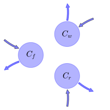
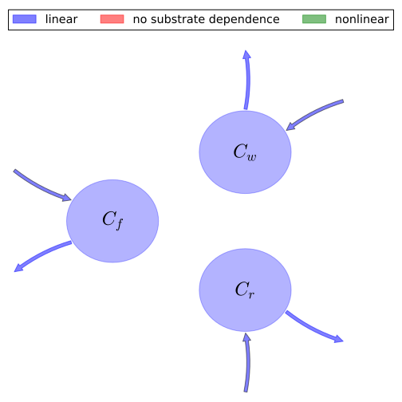

# General Overview

 

This report is the result of the use of the Python 3.4 package Sympy (for symbolic mathematics), as means to translate published models to a common language. It was created by Verónika Ceballos-Núñez (Orcid ID: 0000-0002-0046-1160) on 24/3/2016, and was last modified on _lm_.

## About the model
The model depicted in this document considers carbon allocation with a process based approach. It was originally described by @Luo2012TE.  

### Abstract
Ecosystem ecology is a subdiscipline of ecology that focuses on exchange of energy and materials between organisms and the environment. The materials that are commonly studied in ecosystem ecology include water, carbon, nitrogen, phosphorus, and other elements that organisms use as nutrients. The source of energy for most ecosystems is solar radiation. In this entry, material cy-cling and energy exchange are generally described before the carbon cycle is used as an example to illustrate our quantitative and theoretical understanding of ecosystem ecology.

### Space Scale
global

### Available parameter values

Abbreviation|Description
:-----|:-----
Original parameters of the publication|Parameter value of GPP corresponds to an annual average

Table:  Information on given parameter sets

### Available initial values

Abbreviation|Description
:-----|:-----
Original initial values of the publication|original dataset of the publication. Parameter value of GPP corresponds to an annual average

Table:  Information on given sets of initial values

# State Variables
The following table contains the available information regarding this section:

Variable|Description|key|Values    Original initial values of the publication
:-----:|:-----|:-----:|:-----:
$C_{f}$|Carbon in foliage|foliage|$250$
$C_{r}$|Carbon in roots|fine_roots|$192$
$C_{w}$|Carbon in woody tissue|wood|$4145$

Table: Information on State Variables

# Photosynthetic Parameters
The following table contains the available information regarding this section:

Variable|Description|Expressions|key|Type|Units|Values    Original parameters of the publication
:-----:|:-----|:-----:|:-----:|:-----:|:-----:|:-----:
$GPP$|Photosynthetic rate (Carbon input) at time t|-|GPP|variable|$gC\cdot day^{-1}$|$3370$
$T$|Temperature|-|-|variable|-|-
$Q_{10}$|Temperature quotient that describes a change in decomposition rate for evey 10°C difference in temperature|-|-|parameter|-|-
$W$|Volumetric soil moisture|-|-|variable|-|-
$f_{W}$|Function of W|$f_{W}=\operatorname{Min}\left(0.5\cdot W, 1\right)$|-|variable|-|-
$f_{T}$|Function of T|$f_{T}=Q_{10}^{\frac{T-10}{10}}$|-|variable|-|-
$\epsilon_{t}$|Environmental scalar|$\epsilon_{t}=f_{W}\cdot f_{T}$|-|variable|$km^2$|-

Table: Information on Photosynthetic Parameters

# Allocation Coefficients
The following table contains the available information regarding this section:

Variable|Description|key|Type|Values    Original parameters of the publication
:-----:|:-----|:-----:|:-----:|:-----:
$\eta_{f}$|Fixed partitioning ratio (fraction) of available carbon allocated to foliage|part_foliage|parameter|$0.14$
$\eta_{r}$|Fixed partitioning ratio (fraction) of available carbon allocated to roots|part_roots|parameter|$0.26$
$\eta_{w}$|Fixed partitioning ratio (fraction) of available carbon allocated to wood|part_wood|parameter|$0.14$

Table: Information on Allocation Coefficients

# Cycling Rates
The following table contains the available information regarding this section:

Variable|Description|Entry Author Orcid|key|Type|Values    Original parameters of the publication
:-----:|:-----|:-----:|:-----:|:-----:|:-----:
$\gamma_{f}$|Foliage turnover rate|0000-0002-0046-1160|cyc_foliage|parameter|$0.00258$
$\gamma_{r}$|Roots turnover rate|0000-0002-0046-1160|cyc_roots|parameter|$0.00239$
$\gamma_{w}$|Wood turnover rate|0000-0002-0046-1160|cyc_wood|parameter|$5.86\cdot 10^{-5}$

Table: Information on Cycling Rates

# Components
The following table contains the available information regarding this section:

Variable|Description|Expressions|Values    key
:-----:|:-----|:-----:|:-----:
$x$|vector of states for vegetation|$x=\left[\begin{matrix}C_{f}\\C_{w}\\C_{r}\end{matrix}\right]$|state_vector
$u$|scalar function of photosynthetic inputs|$u=GPP\cdot \epsilon_{t}$|scalar_func_phot
$b$|vector of partitioning coefficients of photosynthetically fixed carbon|$b=\left[\begin{matrix}\eta_{f}\\\eta_{w}\\\eta_{r}\end{matrix}\right]$|part_coeff
$A$|matrix of turnover (cycling) rates|$A=\left[\begin{matrix}-\gamma_{f} & 0 & 0\\0 & -\gamma_{w} & 0\\0 & 0 & -\gamma_{r}\end{matrix}\right]$|cyc_matrix
$f_{v}$|the righthandside of the ode|$f_{v}=u\cdot b+A\cdot x$|state_vector_derivative

Table: Information on Components

## Pool model representation
<table><thead><tr><th></th><th>Flux description</th></tr></thead><tbody><tr><td align=center, style='vertical-align: middle'>
 

 **Figure 1:** *Pool model representation* 

</td><td align=left style='vertical-align: middle'>
#### Input fluxes
$C_{f}: GPP\cdot Q_{10}^{\frac{T}{10} - 1}\cdot\eta_{f}\cdot\min\left(1, 0.5\cdot W\right)$  $C_{r}: GPP\cdot Q_{10}^{\frac{T}{10} - 1}\cdot\eta_{w}\cdot\min\left(1, 0.5\cdot W\right)$  $C_{w}: GPP\cdot Q_{10}^{\frac{T}{10} - 1}\cdot\eta_{r}\cdot\min\left(1, 0.5\cdot W\right)$  

#### Output fluxes
$C_{f}: C_{f}\cdot\gamma_{f}$  $C_{r}: C_{w}\cdot\gamma_{w}$  $C_{w}: C_{r}\cdot\gamma_{r}$  </td></tr></tbody></table>
## The right hand side of the ODE
$\left[\begin{matrix}- C_{f}\cdot\gamma_{f} + GPP\cdot Q_{10}^{\frac{T}{10} - 1}\cdot\eta_{f}\cdot\min\left(1, 0.5\cdot W\right)\\- C_{w}\cdot\gamma_{w} + GPP\cdot Q_{10}^{\frac{T}{10} - 1}\cdot\eta_{w}\cdot\min\left(1, 0.5\cdot W\right)\\- C_{r}\cdot\gamma_{r} + GPP\cdot Q_{10}^{\frac{T}{10} - 1}\cdot\eta_{r}\cdot\min\left(1, 0.5\cdot W\right)\end{matrix}\right]$

## The Jacobian (derivative of the ODE w.r.t. state variables)
$\left[\begin{matrix}-\gamma_{f} & 0 & 0\\0 & -\gamma_{w} & 0\\0 & 0 & -\gamma_{r}\end{matrix}\right]$

# References
