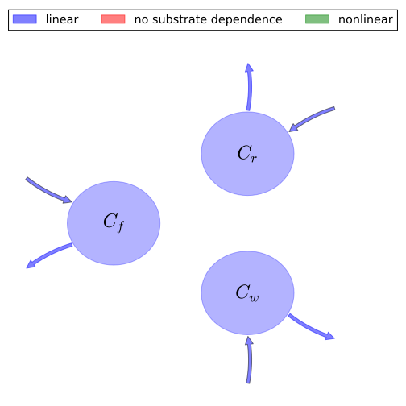

# General Overview
This report is the result of the use of the Python 3.4 package Sympy (for symbolic mathematics), as means to translate published models to a common language. It was created by Verónika Ceballos-Núñez (Orcid ID: 0000-0002-0046-1160) on 17/7/2015, and was last modified on _lm_.

## About the model
The model depicted in this document considers carbon allocation with a process based approach. It was originally described by @Running1988Ecological_Modelling.  

### Abstract
An ecosystem process model is described that calculates the carbon, water and nitrogen cycles through a forest ecosystem. The model, FOREST-BGC, treats canopy interception and evaporation, transpiration, photosynthesis, growth and maintenance respiration, carbon allocation above and below-ground, litterfall, decomposition and nitrogen mineralization. The model uses leaf area index (LAI) to quantify the forest structure important for energy and mass exchange, and this represents a key simplification for regional scale applications. FOREST-BGC requires daily incoming short-wave radiation, air temperature, dew point, and precipitation as driving variables. The model was used to simulate the annual hydrologic balance and net primary production of a hypothetical forest stand in seven contrasting environments across North America for the year 1984. Hydrologic partitioning ranged from 14/86/0% for evaporation, transpiration and outflow, respectively, in Fairbanks, AK (annual precipitation of 313 mm) to 10/27/66% in Jacksonville, FL (annual ppt of 1244 mm), and these balances changed as LAI was increased from 3 to 9 in successive simulations. Net primary production (npp) ranged from 0.0 t C ha-1 year-1 at Tucson, AZ, to 14.1 t C ha-1 year-1 at Knoxville, TN and corresponded reasonably with observed values at each site. The sensitivity of ecosystem processes to varying LAI in different climates was substantial, and underscores the utility of parameterizing this model at regional scales in the future with forest LAI measurements derived from satellite imagery. ?? 1988.

### Space Scale
global
### Available parameter values

Abbreviation|Source
:-----|:-----
Original dataset of the publication|@Running1988Ecological_Modelling
Additional set 1|@Hunt_Jr1991Tree_physiology
Additional set 2|@Korol1991Canadian_Journal_of_Forest_Research-Revue_Canadienne_De_Recherche_Forestiere

Table:  Information on given parameter sets

# State Variables
The following table contains the available information regarding this section:

Variable|Description|key
:-----:|:-----|:-----:
$C_{f}$|Carbon in foliage|foliage
$C_{r}$|Carbon in roots|fine_roots
$C_{w}$|Carbon in woody tissue|wood

Table: Information on State Variables

# Allocation Coefficients
The following table contains the available information regarding this section:

Variable|key|Type|Values    Original dataset of the publication|Additional set 1|Additional set 2
:-----:|:-----:|:-----:|:-----:|:-----:|:-----:
$\eta_{f}$|part_foliage|parameter|$\frac{1}{4}$|$\frac{1}{5}$|$\frac{12}{25}$
$\eta_{r}$|part_roots|parameter|$\frac{2}{5}$|$\frac{11}{20}$|$\frac{37}{100}$
$\eta_{w}$|part_wood|parameter|$\frac{7}{20}$|$\frac{1}{4}$|$\frac{3}{20}$

Table: Information on Allocation Coefficients

# Cycling Rates
The following table contains the available information regarding this section:

Variable|Entry Author Orcid|key|Type|Values    Original dataset of the publication|Additional set 1|Additional set 2
:-----:|:-----:|:-----:|:-----:|:-----:|:-----:|:-----:
$\gamma_{f}$|0000-0002-0046-1160|cyc_foliage|parameter|-|-|-
$\gamma_{r}$|0000-0002-0046-1160|cyc_roots|parameter|$\frac{3}{4}$|$\frac{3}{4}$|$\frac{3}{4}$
$\gamma_{w}$|0000-0002-0046-1160|cyc_wood|parameter|-|-|-

Table: Information on Cycling Rates

# Components
The following table contains the available information regarding this section:

Variable|Description|Expressions|key
:-----:|:-----|:-----:|:-----:
$x$|vector of states for vegetation|$x=\left[\begin{matrix}C_{f}\\C_{r}\\C_{w}\end{matrix}\right]$|state_vector
$u$|scalar function of photosynthetic inputs|-|scalar_func_phot
$b$|vector of partitioning coefficients of photosynthetically fixed carbon|$b=\left[\begin{matrix}\eta_{f}\\\eta_{r}\\\eta_{w}\end{matrix}\right]$|part_coeff
$A$|matrix of turnover (cycling) rates|$A=\left[\begin{matrix}-\gamma_{f} & 0 & 0\\0 & -\gamma_{r} & 0\\0 & 0 & -\gamma_{w}\end{matrix}\right]$|cyc_matrix
$f_{v}$|the righthandside of the ode|$f_{v}=u\cdot b+A\cdot x$|state_vector_derivative

Table: Information on Components

## Pool model representation
<table><thead><tr><th></th><th>Flux description</th></tr></thead><tbody><tr><td align=center, style='vertical-align: middle'>
 

 **Figure 1:** *Pool model representation* 

</td><td align=left style='vertical-align: middle'>
#### Input fluxes
$C_{f}: \eta_{f}\cdot u$  $C_{r}: \eta_{r}\cdot u$  $C_{w}: \eta_{w}\cdot u$  

#### Output fluxes
$C_{f}: C_{f}\cdot\gamma_{f}$  $C_{r}: C_{r}\cdot\gamma_{r}$  $C_{w}: C_{w}\cdot\gamma_{w}$  </td></tr></tbody></table>
## The right hand side of the ODE
$\left[\begin{matrix}- C_{f}\cdot\gamma_{f} +\eta_{f}\cdot u\\- C_{r}\cdot\gamma_{r} +\eta_{r}\cdot u\\- C_{w}\cdot\gamma_{w} +\eta_{w}\cdot u\end{matrix}\right]$

## The Jacobian (derivative of the ODE w.r.t. state variables)
$\left[\begin{matrix}-\gamma_{f} & 0 & 0\\0 & -\gamma_{r} & 0\\0 & 0 & -\gamma_{w}\end{matrix}\right]$

# References
