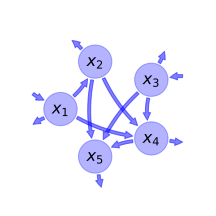

# General Overview

 

This report is the result of the use of the python package bgc_md , as means to translate published models to a common language.  The underlying yaml file was created by Carlos A. Sierra (Orcid ID: 0000-0003-0009-4169) on 12/9/2016, and was last modified on \mathrm{None}.

## About the model
The model depicted in this document considers carbon allocation. It was originally described by @Emanuel1981.  

### Abstract
A mathematical model for the circulation of carbon in the world terrestrial ecosystems is proposed. A five-compartment representation is developed which corresponds to the functional components studied by field ecologists. Rate coefficients for this linear dynamic model are calculated from estimates of the 1970 standingcrops and compartment exchanges of carbon. The model is analyzed in terms of response to a unit impulse, thereby displaying a transient time distribution. The response to a hypothetical pulse input through gross primary production is also simulated, illustrating the efficiency of the terrestrial carbon system in transferring carbon into longer storage components. Finally, the concept of CO$_{2}$ fertilization is examined by allowing gross primary production to increase in response to higher atmospheric concentrations. Although the standing crop of carbon in photosynthesizing compartments is induced to grow from a hypothetical preindustrial level to a specified 1970 level, the accompanying increase in other compartments is not as large as obtained in earlier model formulations which incorporate an input from the atmosphere directly to compartments containing carbon in woody material or soil.

### Keywords
differential equations, linear, time invariant, analytic

### Principles
mass balance, substrate dependence of decomposition, heterogeneity of speed of decay, internal transformations of organic matter

### Available parameter values

Abbreviation|Description
:-----|:-----
Original parameters of the publication|Parameter value of GPP corresponds to an annual average

Table:  Information on given parameter sets

### Available initial values

Abbreviation|Description
:-----|:-----
Original initial values of the publication|original dataset of the publication. Parameter value of GPP corresponds to an annual average

Table:  Information on given sets of initial values

# State Variables
The following table contains the available information regarding this section:

Name|Description|Values    Original initial values of the publication
:-----:|:-----|:-----:
$x_{1}$|Non-woody tree parts|$37$
$x_{2}$|Woody tree parts|$452$
$x_{3}$|Ground vegetation|$69$
$x_{4}$|Detritus/Decomposers|$81$
$x_{5}$|Active soil carbon|$1121$

Table: Information on State Variables

# Photosynthetic Parameters
The following table contains the available information regarding this section:

Name|Description|Units|Values    Original parameters of the publication
:-----:|:-----|:-----:|:-----:
$I_{1}$|Gross primary production of the non-woody pool|$PgC yr^{-1}$|$77$
$I_{3}$|Gross primary production of the ground vegetation pool|$PgC yr^{-1}$|$36$

Table: Information on Photosynthetic Parameters

# Cycling Rates
The following table contains the available information regarding this section:

Name|Description|Type|Units|Values    Original parameters of the publication
:-----:|:-----|:-----:|:-----:|:-----:
$F_{1}$|Cycling rate of pool 1|parameter|$yr^{-1}$|$2.081$
$F_{2}$|Cycling rate of pool 2|parameter|$yr^{-1}$|$0.0686$
$F_{3}$|Cycling rate of pool 3|parameter|$yr^{-1}$|$0.5217$
$F_{4}$|Cycling rate of pool 4|parameter|$yr^{-1}$|$0.5926$
$F_{5}$|Cycling rate of pool 5|parameter|$yr^{-1}$|$0.009813$

Table: Information on Cycling Rates

# Transfer Coefficients
The following table contains the available information regarding this section:

Name|Description|Values    Original parameters of the publication
:-----:|:-----|:-----:
$F_{21}$|Transfer coefficient from non-woody to woody vegetation|$0.8378$
$F_{41}$|Transfer coefficient from non-woody to detritus|$0.5676$
$F_{42}$|Transfer coefficient from ground vegetaion to detritus|$0.0322$
$F_{52}$|Transfer coefficient from woody parts to soil|$0.004425$
$F_{43}$|Transfer coefficient from ground vegetation to deteritus|$0.1739$
$F_{53}$|Transfer coefficient from ground vegetation to soil|$0.087$
$F_{54}$|Transfer coefficient from detritus to soil|$0.037$

Table: Information on Transfer Coefficients

# Components
The following table contains the available information regarding this section:

Name|Description|Expressions
:-----:|:-----|:-----:
$x$|vector of state variables|$x=\left[\begin{matrix}x_{1}\\x_{2}\\x_{3}\\x_{4}\\x_{5}\end{matrix}\right]$
$u$|vector of photosynthetically fixed carbon|$u=\left[\begin{matrix}I_{1}\\0\\I_{3}\\0\\0\end{matrix}\right]$
$B$|matrix of cycling rates|$B=\left[\begin{matrix}- F_{1} & 0 & 0 & 0 & 0\\F_{21} & - F_{2} & 0 & 0 & 0\\0 & 0 & - F_{3} & 0 & 0\\F_{41} & F_{42} & F_{43} & - F_{4} & 0\\0 & F_{52} & F_{53} & F_{54} & - F_{5}\end{matrix}\right]$
$f_{v}$|the righthandside of the ode|$f_{v}=u+B\cdot x$

Table: Information on Components

## Pool model representation
<table><thead><tr><th></th><th>Flux description</th></tr></thead><tbody><tr><td align=center, style='vertical-align: middle'>
 

 **Figure 1:** *Pool model representation* 

</td><td align=left style='vertical-align: middle'>
#### Input fluxes
$x_{1}: I_{1}$  $x_{3}: I_{3}$  

#### Output fluxes
$x_{1}: x_{1}\cdot\left(F_{1} - F_{21} - F_{41}\right)$  $x_{2}: x_{2}\cdot\left(F_{2} - F_{42} - F_{52}\right)$  $x_{3}: x_{3}\cdot\left(F_{3} - F_{43} - F_{53}\right)$  $x_{4}: x_{4}\cdot\left(F_{4} - F_{54}\right)$  $x_{5}: F_{5}\cdot x_{5}$  

#### Internal fluxes
$x_{1} \rightarrow x_{2}: F_{21}\cdot x_{1}$  $x_{1} \rightarrow x_{4}: F_{41}\cdot x_{1}$  $x_{2} \rightarrow x_{4}: F_{42}\cdot x_{2}$  $x_{2} \rightarrow x_{5}: F_{52}\cdot x_{2}$  $x_{3} \rightarrow x_{4}: F_{43}\cdot x_{3}$  $x_{3} \rightarrow x_{5}: F_{53}\cdot x_{3}$  $x_{4} \rightarrow x_{5}: F_{54}\cdot x_{4}$  </td></tr></tbody></table>
## The right hand side of the ODE
$\left[\begin{matrix}- F_{1}\cdot x_{1} + I_{1}\\- F_{2}\cdot x_{2} + F_{21}\cdot x_{1}\\- F_{3}\cdot x_{3} + I_{3}\\- F_{4}\cdot x_{4} + F_{41}\cdot x_{1} + F_{42}\cdot x_{2} + F_{43}\cdot x_{3}\\- F_{5}\cdot x_{5} + F_{52}\cdot x_{2} + F_{53}\cdot x_{3} + F_{54}\cdot x_{4}\end{matrix}\right]$

## The Jacobian (derivative of the ODE w.r.t. state variables)
$\left[\begin{matrix}- F_{1} & 0 & 0 & 0 & 0\\F_{21} & - F_{2} & 0 & 0 & 0\\0 & 0 & - F_{3} & 0 & 0\\F_{41} & F_{42} & F_{43} & - F_{4} & 0\\0 & F_{52} & F_{53} & F_{54} & - F_{5}\end{matrix}\right]$

## Steady state formulas
$x_{1} = \frac{I_{1}}{F_{1}}$  $x_{2} = \frac{F_{21}\cdot I_{1}}{F_{1}\cdot F_{2}}$  $x_{3} = \frac{I_{3}}{F_{3}}$  $x_{4} = \frac{1}{F_{1}\cdot F_{2}\cdot F_{3}\cdot F_{4}}\cdot\left(F_{1}\cdot F_{2}\cdot F_{43}\cdot I_{3} + F_{3}\cdot I_{1}\cdot\left(F_{2}\cdot F_{41} + F_{21}\cdot F_{42}\right)\right)$  $x_{5} = \frac{1}{F_{1}\cdot F_{2}\cdot F_{3}\cdot F_{4}\cdot F_{5}}\cdot\left(F_{1}\cdot F_{2}\cdot I_{3}\cdot\left(F_{4}\cdot F_{53} + F_{43}\cdot F_{54}\right) + F_{3}\cdot I_{1}\cdot\left(F_{2}\cdot F_{41}\cdot F_{54} + F_{21}\cdot F_{4}\cdot F_{52} + F_{21}\cdot F_{42}\cdot F_{54}\right)\right)$    

## Steady states (potentially incomplete), according jacobian eigenvalues, damping ratio

### Parameter set: Original parameters of the publication
$x_1: 37.001$, $x_2: 451.892$, $x_3: 69.005$, $x_4: 80.245$, $x_5: 1118.121$    $\lambda_{1}: -2.081$  $\lambda_{2}: -0.069$  $\lambda_{3}: -0.593$  $\lambda_{4}: -0.522$  $\lambda_{5}: -0.010$  

# References
