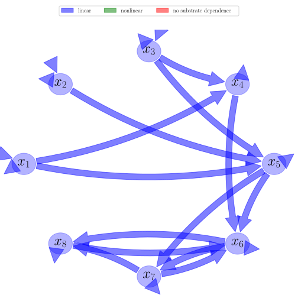

# General Overview

 

This report is the result of the use of the python package bgc_md , as means to translate published models to a common language.  The underlying yaml file was created by Carlos A. Sierra (Orcid ID: 0000-0003-0009-4169) on 15/4/2016, and was last modified on _lm_.

## About the model
The model depicted in this document considers carbon allocation with a process based approach. It was originally described by @Luo2012TE.  

### Abstract
Ecosystem ecology is a subdiscipline of ecology that focuses on exchange of energy and materials between organisms and the environment. The materials that are commonly studied in ecosystem ecology include water, carbon, nitrogen, phosphorus, and other elements that organisms use as nutrients. The source of energy for most ecosystems is solar radiation. In this entry, material cy-cling and energy exchange are generally described before the carbon cycle is used as an example to illustrate our quantitative and theoretical understanding of ecosystem ecology.

### Space Scale
global

# State Variables
The following table contains the available information regarding this section:

Name|Description
:-----:|:-----
$x_{1}$|Carbon in foliage
$x_{2}$|Carbon in roots
$x_{3}$|Carbon in woody tissue
$x_{4}$|Carbon in metabolic litter
$x_{5}$|Carbon in structural litter
$x_{6}$|Carbon in fast SOM
$x_{7}$|Carbon in slow SOM
$x_{8}$|Carbon in passive SOM

Table: Information on State Variables

# Photosynthetic Parameters
The following table contains the available information regarding this section:

Name|Description|Expressions|Type|Units
:-----:|:-----|:-----:|:-----:|:-----:
$GPP$|Photosynthetic rate (Carbon input) at time t|-|variable|$gC\cdot day^{-1}$
$T$|Temperature|-|variable|-
$Q_{10}$|Temperature quotient that describes a change in decomposition rate for evey 10°C difference in temperature|-|parameter|-
$W$|Volumetric soil moisture|-|variable|-
$f_{W}$|Function of W|$f_{W}=\operatorname{Min}\left(0.5\cdot W, 1\right)$|variable|-
$f_{T}$|Function of T|$f_{T}=Q_{10}\cdot \frac{T-10}{10}$|variable|-
$\xi$|Environmental scalar|$\xi=f_{W}\cdot f_{T}$|variable|-

Table: Information on Photosynthetic Parameters

# Allocation Coefficients
The following table contains the available information regarding this section:

Name|Description|Type
:-----:|:-----|:-----:
$b_{1}$|Fixed partitioning ratio (fraction) of available carbon allocated to foliage|parameter
$b_{2}$|Fixed partitioning ratio (fraction) of available carbon allocated to roots|parameter
$b_{3}$|Fixed partitioning ratio (fraction) of available carbon allocated to wood|parameter

Table: Information on Allocation Coefficients

# Cycling Rates
The following table contains the available information regarding this section:

Name|Description|Type|Units
:-----:|:-----|:-----:|:-----:
$c_{1}$|Foliage cycling rate|parameter|$day^{-1}$
$c_{2}$|Woody cycling rate|parameter|$day^{-1}$
$c_{3}$|Fine roots cycling rate|parameter|$day^{-1}$
$c_{4}$|Metabolic litter cycling rate|parameter|$day^{-1}$
$c_{5}$|Structural litter cycling rate|parameter|$day^{-1}$
$c_{6}$|Fast SOM cycling rate|parameter|$day^{-1}$
$c_{7}$|Slow SOM cycling rate|parameter|$day^{-1}$
$c_{8}$|Passive SOM cycling rate|parameter|$day^{-1}$

Table: Information on Cycling Rates

# Transfer Coefficients
The following table contains the available information regarding this section:

Name|Description
:-----:|:-----
$f_{41}$|Transfer coefficient from Foliage to Metabilic Litter
$f_{51}$|Transfer coefficient from Foliage to Structural Litter
$f_{52}$|Transfer coefficient from Wood to Structural Litter
$f_{43}$|Transfer coefficient from Fine Roots to Metabolic Litter
$f_{53}$|Transfer coefficient from Fine Roots to Structural Litter
$f_{64}$|Transfer coefficient from Metabolic Litter to Fast SOM
$f_{65}$|Transfer coefficient from Structural Litter to Fast SOM
$f_{75}$|Transfer coefficient from Structural Litter to Slow SOM
$f_{76}$|Transfer coefficient from Fast to Slow SOM
$f_{86}$|Transfer coefficient from Fast to Passive SOM
$f_{67}$|Transfer coefficient from Slow to Fast SOM
$f_{87}$|Transfer coefficient from Slow to Passive SOM
$f_{68}$|Transfer coefficient from Passive to Fast SOM

Table: Information on Transfer Coefficients

# Components
The following table contains the available information regarding this section:

Name|Description|Expressions
:-----:|:-----|:-----:
$x$|vector of state variables|$x=\left[\begin{matrix}x_{1}\\x_{2}\\x_{3}\\x_{4}\\x_{5}\\x_{6}\\x_{7}\\x_{8}\end{matrix}\right]$
$u$|scalar function of photosynthetic inputs|$u=GPP$
$b$|vector of partitioning coefficients of photosynthetically fixed carbon|$b=\left[\begin{matrix}b_{1}\\b_{2}\\b_{3}\\0\\0\\0\\0\\0\end{matrix}\right]$
$C$|matrix of cycling rates|$C=\left[\begin{matrix}c_{1} & 0 & 0 & 0 & 0 & 0 & 0 & 0\\0 & c_{2} & 0 & 0 & 0 & 0 & 0 & 0\\0 & 0 & c_{3} & 0 & 0 & 0 & 0 & 0\\0 & 0 & 0 & c_{4} & 0 & 0 & 0 & 0\\0 & 0 & 0 & 0 & c_{5} & 0 & 0 & 0\\0 & 0 & 0 & 0 & 0 & c_{6} & 0 & 0\\0 & 0 & 0 & 0 & 0 & 0 & c_{7} & 0\\0 & 0 & 0 & 0 & 0 & 0 & 0 & c_{8}\end{matrix}\right]$
$A$|matrix of transfer coefficients|$A=\left[\begin{matrix}-1 & 0 & 0 & 0 & 0 & 0 & 0 & 0\\0 & -1 & 0 & 0 & 0 & 0 & 0 & 0\\0 & 0 & -1 & 0 & 0 & 0 & 0 & 0\\f_{41} & 0 & f_{43} & -1 & 0 & 0 & 0 & 0\\f_{51} & f_{52} & f_{53} & 0 & -1 & 0 & 0 & 0\\0 & 0 & 0 & f_{64} & f_{65} & -1 & f_{67} & f_{68}\\0 & 0 & 0 & 0 & f_{75} & f_{76} & -1 & 0\\0 & 0 & 0 & 0 & 0 & f_{86} & f_{87} & -1\end{matrix}\right]$
$B$|matrix of cycling and tansfer rates|$B=A\cdot C$
$f_{v}$|the righthandside of the ode|$f_{v}=u\cdot b+B\cdot x$

Table: Information on Components

## Pool model representation
<table><thead><tr><th></th><th>Flux description</th></tr></thead><tbody><tr><td align=center, style='vertical-align: middle'>
 

 **Figure 1:** *Pool model representation* 

</td><td align=left style='vertical-align: middle'>
#### Input fluxes
$x_{1}: GPP\cdot b_{1}$  $x_{2}: GPP\cdot b_{2}$  $x_{3}: GPP\cdot b_{3}$  

#### Output fluxes
$x_{1}: c_{1}\cdot x_{1}\cdot\left(- f_{41} - f_{51} + 1\right)$  $x_{2}: c_{2}\cdot x_{2}\cdot\left(- f_{52} + 1\right)$  $x_{3}: c_{3}\cdot x_{3}\cdot\left(- f_{43} - f_{53} + 1\right)$  $x_{4}: c_{4}\cdot x_{4}\cdot\left(- f_{64} + 1\right)$  $x_{5}: c_{5}\cdot x_{5}\cdot\left(- f_{65} - f_{75} + 1\right)$  $x_{6}: c_{6}\cdot x_{6}\cdot\left(- f_{76} - f_{86} + 1\right)$  $x_{7}: c_{7}\cdot x_{7}\cdot\left(- f_{67} - f_{87} + 1\right)$  $x_{8}: c_{8}\cdot x_{8}\cdot\left(- f_{68} + 1\right)$  

#### Internal fluxes
$x_{1} \rightarrow x_{4}: c_{1}\cdot f_{41}\cdot x_{1}$  $x_{1} \rightarrow x_{5}: c_{1}\cdot f_{51}\cdot x_{1}$  $x_{2} \rightarrow x_{5}: c_{2}\cdot f_{52}\cdot x_{2}$  $x_{3} \rightarrow x_{4}: c_{3}\cdot f_{43}\cdot x_{3}$  $x_{3} \rightarrow x_{5}: c_{3}\cdot f_{53}\cdot x_{3}$  $x_{4} \rightarrow x_{6}: c_{4}\cdot f_{64}\cdot x_{4}$  $x_{5} \rightarrow x_{6}: c_{5}\cdot f_{65}\cdot x_{5}$  $x_{5} \rightarrow x_{7}: c_{5}\cdot f_{75}\cdot x_{5}$  $x_{6} \rightarrow x_{7}: c_{6}\cdot f_{76}\cdot x_{6}$  $x_{6} \rightarrow x_{8}: c_{6}\cdot f_{86}\cdot x_{6}$  $x_{7} \rightarrow x_{6}: c_{7}\cdot f_{67}\cdot x_{7}$  $x_{7} \rightarrow x_{8}: c_{7}\cdot f_{87}\cdot x_{7}$  $x_{8} \rightarrow x_{6}: c_{8}\cdot f_{68}\cdot x_{8}$  </td></tr></tbody></table>
## The right hand side of the ODE
$\left[\begin{matrix}GPP\cdot b_{1} - c_{1}\cdot x_{1}\\GPP\cdot b_{2} - c_{2}\cdot x_{2}\\GPP\cdot b_{3} - c_{3}\cdot x_{3}\\c_{1}\cdot f_{41}\cdot x_{1} + c_{3}\cdot f_{43}\cdot x_{3} - c_{4}\cdot x_{4}\\c_{1}\cdot f_{51}\cdot x_{1} + c_{2}\cdot f_{52}\cdot x_{2} + c_{3}\cdot f_{53}\cdot x_{3} - c_{5}\cdot x_{5}\\c_{4}\cdot f_{64}\cdot x_{4} + c_{5}\cdot f_{65}\cdot x_{5} - c_{6}\cdot x_{6} + c_{7}\cdot f_{67}\cdot x_{7} + c_{8}\cdot f_{68}\cdot x_{8}\\c_{5}\cdot f_{75}\cdot x_{5} + c_{6}\cdot f_{76}\cdot x_{6} - c_{7}\cdot x_{7}\\c_{6}\cdot f_{86}\cdot x_{6} + c_{7}\cdot f_{87}\cdot x_{7} - c_{8}\cdot x_{8}\end{matrix}\right]$

## The Jacobian (derivative of the ODE w.r.t. state variables)
$\left[\begin{matrix}- c_{1} & 0 & 0 & 0 & 0 & 0 & 0 & 0\\0 & - c_{2} & 0 & 0 & 0 & 0 & 0 & 0\\0 & 0 & - c_{3} & 0 & 0 & 0 & 0 & 0\\c_{1}\cdot f_{41} & 0 & c_{3}\cdot f_{43} & - c_{4} & 0 & 0 & 0 & 0\\c_{1}\cdot f_{51} & c_{2}\cdot f_{52} & c_{3}\cdot f_{53} & 0 & - c_{5} & 0 & 0 & 0\\0 & 0 & 0 & c_{4}\cdot f_{64} & c_{5}\cdot f_{65} & - c_{6} & c_{7}\cdot f_{67} & c_{8}\cdot f_{68}\\0 & 0 & 0 & 0 & c_{5}\cdot f_{75} & c_{6}\cdot f_{76} & - c_{7} & 0\\0 & 0 & 0 & 0 & 0 & c_{6}\cdot f_{86} & c_{7}\cdot f_{87} & - c_{8}\end{matrix}\right]$

## Steady state formulas
$x_{1} = \frac{GPP}{c_{1}}\cdot b_{1}$  $x_{2} = \frac{GPP}{c_{2}}\cdot b_{2}$  $x_{3} = \frac{GPP}{c_{3}}\cdot b_{3}$  $x_{4} = \frac{GPP}{c_{4}}\cdot\left(b_{1}\cdot f_{41} + b_{3}\cdot f_{43}\right)$  $x_{5} = \frac{GPP}{c_{5}}\cdot\left(b_{1}\cdot f_{51} + b_{2}\cdot f_{52} + b_{3}\cdot f_{53}\right)$  $x_{6} = -\frac{GPP}{c_{6}\cdot\left(f_{67}\cdot f_{76} + f_{68}\cdot f_{76}\cdot f_{87} + f_{68}\cdot f_{86} - 1\right)}\cdot\left(b_{1}\cdot\left(f_{41}\cdot f_{64} + f_{51}\cdot f_{65} + f_{51}\cdot f_{67}\cdot f_{75} + f_{51}\cdot f_{68}\cdot f_{75}\cdot f_{87}\right) + b_{2}\cdot f_{52}\cdot\left(f_{65} + f_{67}\cdot f_{75} + f_{68}\cdot f_{75}\cdot f_{87}\right) + b_{3}\cdot\left(f_{43}\cdot f_{64} + f_{53}\cdot f_{65} + f_{53}\cdot f_{67}\cdot f_{75} + f_{53}\cdot f_{68}\cdot f_{75}\cdot f_{87}\right)\right)$  $x_{7} = -\frac{GPP}{c_{7}\cdot\left(f_{67}\cdot f_{76} + f_{68}\cdot f_{76}\cdot f_{87} + f_{68}\cdot f_{86} - 1\right)}\cdot\left(b_{1}\cdot\left(f_{41}\cdot f_{64}\cdot f_{76} + f_{51}\cdot f_{65}\cdot f_{76} - f_{51}\cdot f_{68}\cdot f_{75}\cdot f_{86} + f_{51}\cdot f_{75}\right) + b_{2}\cdot f_{52}\cdot\left(f_{65}\cdot f_{76} - f_{68}\cdot f_{75}\cdot f_{86} + f_{75}\right) + b_{3}\cdot\left(f_{43}\cdot f_{64}\cdot f_{76} + f_{53}\cdot f_{65}\cdot f_{76} - f_{53}\cdot f_{68}\cdot f_{75}\cdot f_{86} + f_{53}\cdot f_{75}\right)\right)$  $x_{8} = -\frac{GPP}{c_{8}\cdot\left(f_{67}\cdot f_{76} + f_{68}\cdot f_{76}\cdot f_{87} + f_{68}\cdot f_{86} - 1\right)}\cdot\left(b_{1}\cdot\left(f_{41}\cdot f_{64}\cdot f_{76}\cdot f_{87} + f_{41}\cdot f_{64}\cdot f_{86} + f_{51}\cdot f_{65}\cdot f_{76}\cdot f_{87} + f_{51}\cdot f_{65}\cdot f_{86} + f_{51}\cdot f_{67}\cdot f_{75}\cdot f_{86} + f_{51}\cdot f_{75}\cdot f_{87}\right) + b_{2}\cdot f_{52}\cdot\left(f_{65}\cdot f_{76}\cdot f_{87} + f_{65}\cdot f_{86} + f_{67}\cdot f_{75}\cdot f_{86} + f_{75}\cdot f_{87}\right) + b_{3}\cdot\left(f_{43}\cdot f_{64}\cdot f_{76}\cdot f_{87} + f_{43}\cdot f_{64}\cdot f_{86} + f_{53}\cdot f_{65}\cdot f_{76}\cdot f_{87} + f_{53}\cdot f_{65}\cdot f_{86} + f_{53}\cdot f_{67}\cdot f_{75}\cdot f_{86} + f_{53}\cdot f_{75}\cdot f_{87}\right)\right)$    

# References
