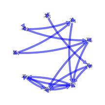
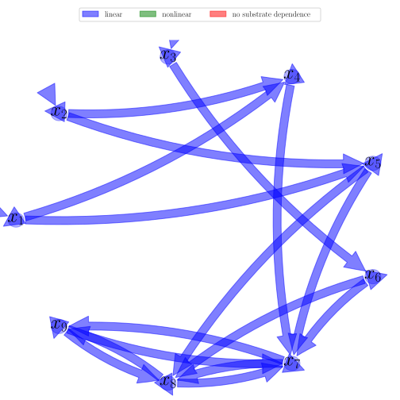

# General Overview

 

This report is the result of the use of the python package bgc_md , as means to translate published models to a common language.  The underlying yaml file was created by Holger Metzler (Orcid ID: 0000-0002-8239-1601) on 18/01/2018, and was last modified on 12/04/2018.

## About the model
The model depicted in this document considers soil organic matter decomposition. It was originally described by @Rasmussen2016JMB.  

### Keywords
differential equations, linear, time variant

# State Variables
The following table contains the available information regarding this section:

Name|Description|Units
:-----:|:-----|:-----:
$x_{1}$|Leaves|$Pg C$
$x_{2}$|Roots|$Pg C$
$x_{3}$|Wood|$Pg C$
$x_{4}$|Litter 1|$Pg C$
$x_{5}$|Litter 2|$Pg C$
$x_{6}$|Litter 3|$Pg C$
$x_{7}$|Soil 1|$Pg C$
$x_{8}$|Soil 2|$Pg C$
$x_{9}$|Soil 3|$Pg C$

Table: Information on State Variables

# Cycling Rates
The following table contains the available information regarding this section:

Name|Description|Type|Units
:-----:|:-----|:-----:|:-----:
$b_{11}$|Cycling rate for leaf pool|parameter|$yr^{-1}$
$b_{22}$|Cycling rate for root pool|parameter|$yr^{-1}$
$b_{33}$|Cycling rate for wood pool|parameter|$yr^{-1}$
$b_{44}$|Cycling rate for litter pool 1|parameter|$yr^{-1}$
$b_{55}$|Cycling rate for litter pool 2|parameter|$yr^{-1}$
$b_{66}$|Cycling rate for litter pool 3|parameter|$yr^{-1}$
$b_{77}$|Cycling rate for soil pool 1|parameter|$yr^{-1}$
$b_{88}$|Cycling rate for soil pool 2|parameter|$yr^{-1}$
$b_{99}$|Cycling rate for soil pool 3|parameter|$yr^{-1}$

Table: Information on Cycling Rates

# Additional Parameters
The following table contains the available information regarding this section:

Name|Description|Type
:-----:|:-----|:-----:
$\sigma$|Sensitivity of global temperatures to atmospheric CO2  $x_{a}$|parameter
$T_{s0}$|Mean land surface temperature in 1850|parameter

Table: Information on Additional Parameters

# Auxiliary Variables
The following table contains the available information regarding this section:

Name|Description|Expressions
:-----:|:-----|:-----:
$t$|time symbol|-
$x_{a}$|Atmospheric CO2 content|$x_{a}=\frac{1715\cdot \operatorname{exp}\left(0.0305\cdot t\right)}{1715+\operatorname{exp}\left(0.0305\cdot t\right)-1}+284$

Table: Information on Auxiliary Variables

# Transfer Coefficients
The following table contains the available information regarding this section:

Name|Description|Type|Units
:-----:|:-----|:-----:|:-----:
$b_{41}$|Transfer rate from Leaves to Litter 1|parameter|$yr^{-1}$
$b_{51}$|Transfer rate from Leaves to Litter 2|parameter|$yr^{-1}$
$b_{42}$|Transfer rate from Roots to Litter 1|parameter|$yr^{-1}$
$b_{52}$|Transfer rate from Roots to Litter 2|parameter|$yr^{-1}$
$b_{63}$|Transfer rate from Wood to Litter 3|parameter|$yr^{-1}$
$b_{74}$|Transfer rate from Litter 1 to Soil 1|parameter|$yr^{-1}$
$b_{75}$|Transfer rate from Litter 2 to Soil 1|parameter|$yr^{-1}$
$b_{85}$|Transfer rate from Litter 2 to Soil 2|parameter|$yr^{-1}$
$b_{76}$|Transfer rate from Litter 3 to Soil 1|parameter|$yr^{-1}$
$b_{86}$|Transfer rate from Litter 3 to Soil 2|parameter|$yr^{-1}$
$b_{87}$|Transfer rate from Soil 1 to Soil 2|parameter|$yr^{-1}$
$b_{97}$|Transfer rate from Soil 1 to Soil 3|parameter|$yr^{-1}$
$b_{78}$|Transfer rate from Soil 2 to Soil 1|parameter|$yr^{-1}$
$b_{98}$|Transfer rate from Soil 2 to Soil 3|parameter|$yr^{-1}$
$b_{79}$|Transfer rate from Soil 3 to Soil 1|parameter|$yr^{-1}$
$b_{89}$|Transfer rate from Soil 3 to Soil 2|parameter|$yr^{-1}$

Table: Information on Transfer Coefficients

# Environmental Coefficients
The following table contains the available information regarding this section:

Name|Description|Expressions|Type
:-----:|:-----|:-----:|:-----:
$T_{s}$|Surface temperature|$T_{s}=T_{s0}+\frac{\sigma}{\ln(2)}\cdot \ln(\frac{x_{a}}{285})$|-
$\xi_{b}$|Scaling of decomposition rates at 20 degrees Celsius|-|parameter

Table: Information on Environmental Coefficients

# Input Components
The following table contains the available information regarding this section:

Name|Description|Expressions|Type
:-----:|:-----|:-----:|:-----:
$f_{i}$|proportion of carbon input going to different carbon pools|-|parameter
$\alpha$|proportion of gross primary production that remains after respiration|-|parameter
$\rho$|ratio of intercellular CO$_{2}$ to $x_{a}$|-|parameter
$\Gamma$|-|$\Gamma=42.7+1.68\cdot \left(T_{s}-25\right)+0.012\cdot \left(T_{s}-25\right)^{2}$|-
$\beta$|sensitivity of $s$ to $x_{a}$|$\beta=\frac{3\cdot \rho\cdot x_{a}\cdot \Gamma}{\left(\rho\cdot x_{a}-\Gamma\right)\cdot \left(\rho\cdot x_{a}+2\cdot \Gamma\right)}$|-
$s_{0}$|-|-|parameter
$s_{i}$|general input function|$s_{i}=f_{i}\cdot \alpha\cdot s_{0}\cdot \left(1+2.5\cdot \beta\cdot \ln(\frac{x_{a}}{285})\right)$|-
$s_{1}$|input to pool 1|$s_{1}=s_{i}$|-
$s_{2}$|input to pool 2|$s_{2}=s_{i}$|-
$s_{3}$|input to pool 3|$s_{3}=s_{i}$|-

Table: Information on Input Components

# Components
The following table contains the available information regarding this section:

Name|Description|Expressions
:-----:|:-----|:-----:
$C$|carbon content|$C=\left[\begin{matrix}x_{1}\\x_{2}\\x_{3}\\x_{4}\\x_{5}\\x_{6}\\x_{7}\\x_{8}\\x_{9}\end{matrix}\right]$
$s$|input vector|$s=\left[\begin{matrix}s_{1}\\s_{2}\\s_{3}\\0\\0\\0\\0\\0\\0\end{matrix}\right]$
$\xi$|environmental effects multiplier, not for all pools|$\xi=\xi_{b}^{0.1\cdot T_{s}-1.5}$
$B$|Matrix of cycling and transfer rates|$B=\left[\begin{matrix}- b_{11} & 0 & 0 & 0 & 0 & 0 & 0 & 0 & 0\\0 & - b_{22} & 0 & 0 & 0 & 0 & 0 & 0 & 0\\0 & 0 & - b_{33} & 0 & 0 & 0 & 0 & 0 & 0\\b_{41} & b_{42} & 0 & - b_{44}\cdot\xi & 0 & 0 & 0 & 0 & 0\\b_{51} & b_{52} & 0 & 0 & - b_{55}\cdot\xi & 0 & 0 & 0 & 0\\0 & 0 & b_{63} & 0 & 0 & - b_{66}\cdot\xi & 0 & 0 & 0\\0 & 0 & 0 & b_{74}\cdot\xi & b_{75}\cdot\xi & b_{76}\cdot\xi & - b_{77}\cdot\xi & b_{78}\cdot\xi & b_{79}\cdot\xi\\0 & 0 & 0 & 0 & b_{85}\cdot\xi & b_{86}\cdot\xi & b_{87}\cdot\xi & - b_{88}\cdot\xi & b_{89}\cdot\xi\\0 & 0 & 0 & 0 & 0 & 0 & b_{97}\cdot\xi & b_{98}\cdot\xi & - b_{99}\cdot\xi\end{matrix}\right]$
$f_{s}$|the right hand side of the ode|$f_{s}=s+B\cdot C$

Table: Information on Components

## Pool model representation
<table><thead><tr><th></th><th>Flux description</th></tr></thead><tbody><tr><td align=center, style='vertical-align: middle'>
 

 **Figure 1:** *Pool model representation* 

</td><td align=left style='vertical-align: middle'>
#### Input fluxes
$x_{1}: \alpha\cdot f_{i}\cdot s_{0}\cdot\left(\frac{7.5\cdot\rho\cdot\left(284 +\frac{1715\cdot e^{0.0305\cdot t}}{e^{0.0305\cdot t} + 1714}\right)\cdot\left(1.68\cdot T_{s0} +\frac{1.68\cdot\sigma}{\log{\left (2\right )}}\cdot\log{\left (\frac{284}{285} +\frac{343\cdot e^{0.0305\cdot t}}{57\cdot e^{0.0305\cdot t} + 97698}\right )} + 0.012\cdot\left(T_{s0} +\frac{\sigma}{\log{\left (2\right )}}\cdot\log{\left (\frac{284}{285} +\frac{343\cdot e^{0.0305\cdot t}}{57\cdot e^{0.0305\cdot t} + 97698}\right )} - 25\right)^{2} + 0.700000000000003\right)\cdot\log{\left (\frac{284}{285} +\frac{343\cdot e^{0.0305\cdot t}}{57\cdot e^{0.0305\cdot t} + 97698}\right )}}{\left(- 1.68\cdot T_{s0} +\rho\cdot\left(284 +\frac{1715\cdot e^{0.0305\cdot t}}{e^{0.0305\cdot t} + 1714}\right) -\frac{1.68\cdot\sigma}{\log{\left (2\right )}}\cdot\log{\left (\frac{284}{285} +\frac{343\cdot e^{0.0305\cdot t}}{57\cdot e^{0.0305\cdot t} + 97698}\right )} - 0.012\cdot\left(T_{s0} +\frac{\sigma}{\log{\left (2\right )}}\cdot\log{\left (\frac{284}{285} +\frac{343\cdot e^{0.0305\cdot t}}{57\cdot e^{0.0305\cdot t} + 97698}\right )} - 25\right)^{2} - 0.700000000000003\right)\cdot\left(3.36\cdot T_{s0} +\rho\cdot\left(284 +\frac{1715\cdot e^{0.0305\cdot t}}{e^{0.0305\cdot t} + 1714}\right) +\frac{3.36\cdot\sigma}{\log{\left (2\right )}}\cdot\log{\left (\frac{284}{285} +\frac{343\cdot e^{0.0305\cdot t}}{57\cdot e^{0.0305\cdot t} + 97698}\right )} + 0.024\cdot\left(T_{s0} +\frac{\sigma}{\log{\left (2\right )}}\cdot\log{\left (\frac{284}{285} +\frac{343\cdot e^{0.0305\cdot t}}{57\cdot e^{0.0305\cdot t} + 97698}\right )} - 25\right)^{2} + 1.40000000000001\right)} + 1\right)$  $x_{2}: \alpha\cdot f_{i}\cdot s_{0}\cdot\left(\frac{7.5\cdot\rho\cdot\left(284 +\frac{1715\cdot e^{0.0305\cdot t}}{e^{0.0305\cdot t} + 1714}\right)\cdot\left(1.68\cdot T_{s0} +\frac{1.68\cdot\sigma}{\log{\left (2\right )}}\cdot\log{\left (\frac{284}{285} +\frac{343\cdot e^{0.0305\cdot t}}{57\cdot e^{0.0305\cdot t} + 97698}\right )} + 0.012\cdot\left(T_{s0} +\frac{\sigma}{\log{\left (2\right )}}\cdot\log{\left (\frac{284}{285} +\frac{343\cdot e^{0.0305\cdot t}}{57\cdot e^{0.0305\cdot t} + 97698}\right )} - 25\right)^{2} + 0.700000000000003\right)\cdot\log{\left (\frac{284}{285} +\frac{343\cdot e^{0.0305\cdot t}}{57\cdot e^{0.0305\cdot t} + 97698}\right )}}{\left(- 1.68\cdot T_{s0} +\rho\cdot\left(284 +\frac{1715\cdot e^{0.0305\cdot t}}{e^{0.0305\cdot t} + 1714}\right) -\frac{1.68\cdot\sigma}{\log{\left (2\right )}}\cdot\log{\left (\frac{284}{285} +\frac{343\cdot e^{0.0305\cdot t}}{57\cdot e^{0.0305\cdot t} + 97698}\right )} - 0.012\cdot\left(T_{s0} +\frac{\sigma}{\log{\left (2\right )}}\cdot\log{\left (\frac{284}{285} +\frac{343\cdot e^{0.0305\cdot t}}{57\cdot e^{0.0305\cdot t} + 97698}\right )} - 25\right)^{2} - 0.700000000000003\right)\cdot\left(3.36\cdot T_{s0} +\rho\cdot\left(284 +\frac{1715\cdot e^{0.0305\cdot t}}{e^{0.0305\cdot t} + 1714}\right) +\frac{3.36\cdot\sigma}{\log{\left (2\right )}}\cdot\log{\left (\frac{284}{285} +\frac{343\cdot e^{0.0305\cdot t}}{57\cdot e^{0.0305\cdot t} + 97698}\right )} + 0.024\cdot\left(T_{s0} +\frac{\sigma}{\log{\left (2\right )}}\cdot\log{\left (\frac{284}{285} +\frac{343\cdot e^{0.0305\cdot t}}{57\cdot e^{0.0305\cdot t} + 97698}\right )} - 25\right)^{2} + 1.40000000000001\right)} + 1\right)$  $x_{3}: \alpha\cdot f_{i}\cdot s_{0}\cdot\left(\frac{7.5\cdot\rho\cdot\left(284 +\frac{1715\cdot e^{0.0305\cdot t}}{e^{0.0305\cdot t} + 1714}\right)\cdot\left(1.68\cdot T_{s0} +\frac{1.68\cdot\sigma}{\log{\left (2\right )}}\cdot\log{\left (\frac{284}{285} +\frac{343\cdot e^{0.0305\cdot t}}{57\cdot e^{0.0305\cdot t} + 97698}\right )} + 0.012\cdot\left(T_{s0} +\frac{\sigma}{\log{\left (2\right )}}\cdot\log{\left (\frac{284}{285} +\frac{343\cdot e^{0.0305\cdot t}}{57\cdot e^{0.0305\cdot t} + 97698}\right )} - 25\right)^{2} + 0.700000000000003\right)\cdot\log{\left (\frac{284}{285} +\frac{343\cdot e^{0.0305\cdot t}}{57\cdot e^{0.0305\cdot t} + 97698}\right )}}{\left(- 1.68\cdot T_{s0} +\rho\cdot\left(284 +\frac{1715\cdot e^{0.0305\cdot t}}{e^{0.0305\cdot t} + 1714}\right) -\frac{1.68\cdot\sigma}{\log{\left (2\right )}}\cdot\log{\left (\frac{284}{285} +\frac{343\cdot e^{0.0305\cdot t}}{57\cdot e^{0.0305\cdot t} + 97698}\right )} - 0.012\cdot\left(T_{s0} +\frac{\sigma}{\log{\left (2\right )}}\cdot\log{\left (\frac{284}{285} +\frac{343\cdot e^{0.0305\cdot t}}{57\cdot e^{0.0305\cdot t} + 97698}\right )} - 25\right)^{2} - 0.700000000000003\right)\cdot\left(3.36\cdot T_{s0} +\rho\cdot\left(284 +\frac{1715\cdot e^{0.0305\cdot t}}{e^{0.0305\cdot t} + 1714}\right) +\frac{3.36\cdot\sigma}{\log{\left (2\right )}}\cdot\log{\left (\frac{284}{285} +\frac{343\cdot e^{0.0305\cdot t}}{57\cdot e^{0.0305\cdot t} + 97698}\right )} + 0.024\cdot\left(T_{s0} +\frac{\sigma}{\log{\left (2\right )}}\cdot\log{\left (\frac{284}{285} +\frac{343\cdot e^{0.0305\cdot t}}{57\cdot e^{0.0305\cdot t} + 97698}\right )} - 25\right)^{2} + 1.40000000000001\right)} + 1\right)$  

#### Output fluxes
$x_{1}: x_{1}\cdot\left(b_{11} - b_{41} - b_{51}\right)$  $x_{2}: x_{2}\cdot\left(b_{22} - b_{42} - b_{52}\right)$  $x_{3}: x_{3}\cdot\left(b_{33} - b_{63}\right)$  $x_{4}: x_{4}\cdot\xi_{b}^{\frac{1}{\log{\left (2\right )}}\cdot\left(0.1\cdot\sigma\cdot\log{\left (\frac{1999\cdot e^{0.0305\cdot t} + 486776}{285\cdot e^{0.0305\cdot t} + 488490}\right )} +\left(0.1\cdot T_{s0} - 1.5\right)\cdot\log{\left (2\right )}\right)}\cdot\left(b_{44} - b_{74}\right)$  $x_{5}: - x_{5}\cdot\xi_{b}^{\frac{1}{\log{\left (2\right )}}\cdot\left(0.1\cdot\sigma\cdot\log{\left (\frac{1999\cdot e^{0.0305\cdot t} + 486776}{285\cdot e^{0.0305\cdot t} + 488490}\right )} +\left(0.1\cdot T_{s0} - 1.5\right)\cdot\log{\left (2\right )}\right)}\cdot\left(- b_{55} + b_{75} + b_{85}\right)$  $x_{6}: - x_{6}\cdot\xi_{b}^{\frac{1}{\log{\left (2\right )}}\cdot\left(0.1\cdot\sigma\cdot\log{\left (\frac{1999\cdot e^{0.0305\cdot t} + 486776}{285\cdot e^{0.0305\cdot t} + 488490}\right )} +\left(0.1\cdot T_{s0} - 1.5\right)\cdot\log{\left (2\right )}\right)}\cdot\left(- b_{66} + b_{76} + b_{86}\right)$  $x_{7}: - x_{7}\cdot\xi_{b}^{\frac{1}{\log{\left (2\right )}}\cdot\left(0.1\cdot\sigma\cdot\log{\left (\frac{1999\cdot e^{0.0305\cdot t} + 486776}{285\cdot e^{0.0305\cdot t} + 488490}\right )} +\left(0.1\cdot T_{s0} - 1.5\right)\cdot\log{\left (2\right )}\right)}\cdot\left(- b_{77} + b_{87} + b_{97}\right)$  $x_{8}: - x_{8}\cdot\xi_{b}^{\frac{1}{\log{\left (2\right )}}\cdot\left(0.1\cdot\sigma\cdot\log{\left (\frac{1999\cdot e^{0.0305\cdot t} + 486776}{285\cdot e^{0.0305\cdot t} + 488490}\right )} +\left(0.1\cdot T_{s0} - 1.5\right)\cdot\log{\left (2\right )}\right)}\cdot\left(b_{78} - b_{88} + b_{98}\right)$  $x_{9}: - x_{9}\cdot\xi_{b}^{\frac{1}{\log{\left (2\right )}}\cdot\left(0.1\cdot\sigma\cdot\log{\left (\frac{1999\cdot e^{0.0305\cdot t} + 486776}{285\cdot e^{0.0305\cdot t} + 488490}\right )} +\left(0.1\cdot T_{s0} - 1.5\right)\cdot\log{\left (2\right )}\right)}\cdot\left(b_{79} + b_{89} - b_{99}\right)$  

#### Internal fluxes
$x_{1} \rightarrow x_{4}: b_{41}\cdot x_{1}$  $x_{1} \rightarrow x_{5}: b_{51}\cdot x_{1}$  $x_{2} \rightarrow x_{4}: b_{42}\cdot x_{2}$  $x_{2} \rightarrow x_{5}: b_{52}\cdot x_{2}$  $x_{3} \rightarrow x_{6}: b_{63}\cdot x_{3}$  $x_{4} \rightarrow x_{7}: b_{74}\cdot x_{4}\cdot\xi_{b}^{\frac{1}{\log{\left (2\right )}}\cdot\left(0.1\cdot\sigma\cdot\log{\left (\frac{1999\cdot e^{0.0305\cdot t} + 486776}{285\cdot e^{0.0305\cdot t} + 488490}\right )} +\left(0.1\cdot T_{s0} - 1.5\right)\cdot\log{\left (2\right )}\right)}$  $x_{5} \rightarrow x_{7}: b_{75}\cdot x_{5}\cdot\xi_{b}^{\frac{1}{\log{\left (2\right )}}\cdot\left(0.1\cdot\sigma\cdot\log{\left (\frac{1999\cdot e^{0.0305\cdot t} + 486776}{285\cdot e^{0.0305\cdot t} + 488490}\right )} +\left(0.1\cdot T_{s0} - 1.5\right)\cdot\log{\left (2\right )}\right)}$  $x_{5} \rightarrow x_{8}: b_{85}\cdot x_{5}\cdot\xi_{b}^{\frac{1}{\log{\left (2\right )}}\cdot\left(0.1\cdot\sigma\cdot\log{\left (\frac{1999\cdot e^{0.0305\cdot t} + 486776}{285\cdot e^{0.0305\cdot t} + 488490}\right )} +\left(0.1\cdot T_{s0} - 1.5\right)\cdot\log{\left (2\right )}\right)}$  $x_{6} \rightarrow x_{7}: b_{76}\cdot x_{6}\cdot\xi_{b}^{\frac{1}{\log{\left (2\right )}}\cdot\left(0.1\cdot\sigma\cdot\log{\left (\frac{1999\cdot e^{0.0305\cdot t} + 486776}{285\cdot e^{0.0305\cdot t} + 488490}\right )} +\left(0.1\cdot T_{s0} - 1.5\right)\cdot\log{\left (2\right )}\right)}$  $x_{6} \rightarrow x_{8}: b_{86}\cdot x_{6}\cdot\xi_{b}^{\frac{1}{\log{\left (2\right )}}\cdot\left(0.1\cdot\sigma\cdot\log{\left (\frac{1999\cdot e^{0.0305\cdot t} + 486776}{285\cdot e^{0.0305\cdot t} + 488490}\right )} +\left(0.1\cdot T_{s0} - 1.5\right)\cdot\log{\left (2\right )}\right)}$  $x_{7} \rightarrow x_{8}: b_{87}\cdot x_{7}\cdot\xi_{b}^{\frac{1}{\log{\left (2\right )}}\cdot\left(0.1\cdot\sigma\cdot\log{\left (\frac{1999\cdot e^{0.0305\cdot t} + 486776}{285\cdot e^{0.0305\cdot t} + 488490}\right )} +\left(0.1\cdot T_{s0} - 1.5\right)\cdot\log{\left (2\right )}\right)}$  $x_{7} \rightarrow x_{9}: b_{97}\cdot x_{7}\cdot\xi_{b}^{\frac{1}{\log{\left (2\right )}}\cdot\left(0.1\cdot\sigma\cdot\log{\left (\frac{1999\cdot e^{0.0305\cdot t} + 486776}{285\cdot e^{0.0305\cdot t} + 488490}\right )} +\left(0.1\cdot T_{s0} - 1.5\right)\cdot\log{\left (2\right )}\right)}$  $x_{8} \rightarrow x_{7}: b_{78}\cdot x_{8}\cdot\xi_{b}^{\frac{1}{\log{\left (2\right )}}\cdot\left(0.1\cdot\sigma\cdot\log{\left (\frac{1999\cdot e^{0.0305\cdot t} + 486776}{285\cdot e^{0.0305\cdot t} + 488490}\right )} +\left(0.1\cdot T_{s0} - 1.5\right)\cdot\log{\left (2\right )}\right)}$  $x_{8} \rightarrow x_{9}: b_{98}\cdot x_{8}\cdot\xi_{b}^{\frac{1}{\log{\left (2\right )}}\cdot\left(0.1\cdot\sigma\cdot\log{\left (\frac{1999\cdot e^{0.0305\cdot t} + 486776}{285\cdot e^{0.0305\cdot t} + 488490}\right )} +\left(0.1\cdot T_{s0} - 1.5\right)\cdot\log{\left (2\right )}\right)}$  $x_{9} \rightarrow x_{7}: b_{79}\cdot x_{9}\cdot\xi_{b}^{\frac{1}{\log{\left (2\right )}}\cdot\left(0.1\cdot\sigma\cdot\log{\left (\frac{1999\cdot e^{0.0305\cdot t} + 486776}{285\cdot e^{0.0305\cdot t} + 488490}\right )} +\left(0.1\cdot T_{s0} - 1.5\right)\cdot\log{\left (2\right )}\right)}$  $x_{9} \rightarrow x_{8}: b_{89}\cdot x_{9}\cdot\xi_{b}^{\frac{1}{\log{\left (2\right )}}\cdot\left(0.1\cdot\sigma\cdot\log{\left (\frac{1999\cdot e^{0.0305\cdot t} + 486776}{285\cdot e^{0.0305\cdot t} + 488490}\right )} +\left(0.1\cdot T_{s0} - 1.5\right)\cdot\log{\left (2\right )}\right)}$  </td></tr></tbody></table>
## The right hand side of the ODE
$\left[\begin{matrix}\alpha\cdot f_{i}\cdot s_{0}\cdot\left(\frac{7.5\cdot\rho\cdot\left(284 +\frac{1715\cdot e^{0.0305\cdot t}}{e^{0.0305\cdot t} + 1714}\right)\cdot\left(1.68\cdot T_{s0} +\frac{1.68\cdot\sigma}{\log{\left (2\right )}}\cdot\log{\left (\frac{284}{285} +\frac{343\cdot e^{0.0305\cdot t}}{57\cdot e^{0.0305\cdot t} + 97698}\right )} + 0.012\cdot\left(T_{s0} +\frac{\sigma}{\log{\left (2\right )}}\cdot\log{\left (\frac{284}{285} +\frac{343\cdot e^{0.0305\cdot t}}{57\cdot e^{0.0305\cdot t} + 97698}\right )} - 25\right)^{2} + 0.700000000000003\right)\cdot\log{\left (\frac{284}{285} +\frac{343\cdot e^{0.0305\cdot t}}{57\cdot e^{0.0305\cdot t} + 97698}\right )}}{\left(- 1.68\cdot T_{s0} +\rho\cdot\left(284 +\frac{1715\cdot e^{0.0305\cdot t}}{e^{0.0305\cdot t} + 1714}\right) -\frac{1.68\cdot\sigma}{\log{\left (2\right )}}\cdot\log{\left (\frac{284}{285} +\frac{343\cdot e^{0.0305\cdot t}}{57\cdot e^{0.0305\cdot t} + 97698}\right )} - 0.012\cdot\left(T_{s0} +\frac{\sigma}{\log{\left (2\right )}}\cdot\log{\left (\frac{284}{285} +\frac{343\cdot e^{0.0305\cdot t}}{57\cdot e^{0.0305\cdot t} + 97698}\right )} - 25\right)^{2} - 0.700000000000003\right)\cdot\left(3.36\cdot T_{s0} +\rho\cdot\left(284 +\frac{1715\cdot e^{0.0305\cdot t}}{e^{0.0305\cdot t} + 1714}\right) +\frac{3.36\cdot\sigma}{\log{\left (2\right )}}\cdot\log{\left (\frac{284}{285} +\frac{343\cdot e^{0.0305\cdot t}}{57\cdot e^{0.0305\cdot t} + 97698}\right )} + 0.024\cdot\left(T_{s0} +\frac{\sigma}{\log{\left (2\right )}}\cdot\log{\left (\frac{284}{285} +\frac{343\cdot e^{0.0305\cdot t}}{57\cdot e^{0.0305\cdot t} + 97698}\right )} - 25\right)^{2} + 1.40000000000001\right)} + 1\right) - b_{11}\cdot x_{1}\\\alpha\cdot f_{i}\cdot s_{0}\cdot\left(\frac{7.5\cdot\rho\cdot\left(284 +\frac{1715\cdot e^{0.0305\cdot t}}{e^{0.0305\cdot t} + 1714}\right)\cdot\left(1.68\cdot T_{s0} +\frac{1.68\cdot\sigma}{\log{\left (2\right )}}\cdot\log{\left (\frac{284}{285} +\frac{343\cdot e^{0.0305\cdot t}}{57\cdot e^{0.0305\cdot t} + 97698}\right )} + 0.012\cdot\left(T_{s0} +\frac{\sigma}{\log{\left (2\right )}}\cdot\log{\left (\frac{284}{285} +\frac{343\cdot e^{0.0305\cdot t}}{57\cdot e^{0.0305\cdot t} + 97698}\right )} - 25\right)^{2} + 0.700000000000003\right)\cdot\log{\left (\frac{284}{285} +\frac{343\cdot e^{0.0305\cdot t}}{57\cdot e^{0.0305\cdot t} + 97698}\right )}}{\left(- 1.68\cdot T_{s0} +\rho\cdot\left(284 +\frac{1715\cdot e^{0.0305\cdot t}}{e^{0.0305\cdot t} + 1714}\right) -\frac{1.68\cdot\sigma}{\log{\left (2\right )}}\cdot\log{\left (\frac{284}{285} +\frac{343\cdot e^{0.0305\cdot t}}{57\cdot e^{0.0305\cdot t} + 97698}\right )} - 0.012\cdot\left(T_{s0} +\frac{\sigma}{\log{\left (2\right )}}\cdot\log{\left (\frac{284}{285} +\frac{343\cdot e^{0.0305\cdot t}}{57\cdot e^{0.0305\cdot t} + 97698}\right )} - 25\right)^{2} - 0.700000000000003\right)\cdot\left(3.36\cdot T_{s0} +\rho\cdot\left(284 +\frac{1715\cdot e^{0.0305\cdot t}}{e^{0.0305\cdot t} + 1714}\right) +\frac{3.36\cdot\sigma}{\log{\left (2\right )}}\cdot\log{\left (\frac{284}{285} +\frac{343\cdot e^{0.0305\cdot t}}{57\cdot e^{0.0305\cdot t} + 97698}\right )} + 0.024\cdot\left(T_{s0} +\frac{\sigma}{\log{\left (2\right )}}\cdot\log{\left (\frac{284}{285} +\frac{343\cdot e^{0.0305\cdot t}}{57\cdot e^{0.0305\cdot t} + 97698}\right )} - 25\right)^{2} + 1.40000000000001\right)} + 1\right) - b_{22}\cdot x_{2}\\\alpha\cdot f_{i}\cdot s_{0}\cdot\left(\frac{7.5\cdot\rho\cdot\left(284 +\frac{1715\cdot e^{0.0305\cdot t}}{e^{0.0305\cdot t} + 1714}\right)\cdot\left(1.68\cdot T_{s0} +\frac{1.68\cdot\sigma}{\log{\left (2\right )}}\cdot\log{\left (\frac{284}{285} +\frac{343\cdot e^{0.0305\cdot t}}{57\cdot e^{0.0305\cdot t} + 97698}\right )} + 0.012\cdot\left(T_{s0} +\frac{\sigma}{\log{\left (2\right )}}\cdot\log{\left (\frac{284}{285} +\frac{343\cdot e^{0.0305\cdot t}}{57\cdot e^{0.0305\cdot t} + 97698}\right )} - 25\right)^{2} + 0.700000000000003\right)\cdot\log{\left (\frac{284}{285} +\frac{343\cdot e^{0.0305\cdot t}}{57\cdot e^{0.0305\cdot t} + 97698}\right )}}{\left(- 1.68\cdot T_{s0} +\rho\cdot\left(284 +\frac{1715\cdot e^{0.0305\cdot t}}{e^{0.0305\cdot t} + 1714}\right) -\frac{1.68\cdot\sigma}{\log{\left (2\right )}}\cdot\log{\left (\frac{284}{285} +\frac{343\cdot e^{0.0305\cdot t}}{57\cdot e^{0.0305\cdot t} + 97698}\right )} - 0.012\cdot\left(T_{s0} +\frac{\sigma}{\log{\left (2\right )}}\cdot\log{\left (\frac{284}{285} +\frac{343\cdot e^{0.0305\cdot t}}{57\cdot e^{0.0305\cdot t} + 97698}\right )} - 25\right)^{2} - 0.700000000000003\right)\cdot\left(3.36\cdot T_{s0} +\rho\cdot\left(284 +\frac{1715\cdot e^{0.0305\cdot t}}{e^{0.0305\cdot t} + 1714}\right) +\frac{3.36\cdot\sigma}{\log{\left (2\right )}}\cdot\log{\left (\frac{284}{285} +\frac{343\cdot e^{0.0305\cdot t}}{57\cdot e^{0.0305\cdot t} + 97698}\right )} + 0.024\cdot\left(T_{s0} +\frac{\sigma}{\log{\left (2\right )}}\cdot\log{\left (\frac{284}{285} +\frac{343\cdot e^{0.0305\cdot t}}{57\cdot e^{0.0305\cdot t} + 97698}\right )} - 25\right)^{2} + 1.40000000000001\right)} + 1\right) - b_{33}\cdot x_{3}\\b_{41}\cdot x_{1} + b_{42}\cdot x_{2} - b_{44}\cdot x_{4}\cdot\xi_{b}^{0.1\cdot T_{s0} +\frac{0.1\cdot\sigma}{\log{\left (2\right )}}\cdot\log{\left (\frac{284}{285} +\frac{343\cdot e^{0.0305\cdot t}}{57\cdot e^{0.0305\cdot t} + 97698}\right )} - 1.5}\\b_{51}\cdot x_{1} + b_{52}\cdot x_{2} - b_{55}\cdot x_{5}\cdot\xi_{b}^{0.1\cdot T_{s0} +\frac{0.1\cdot\sigma}{\log{\left (2\right )}}\cdot\log{\left (\frac{284}{285} +\frac{343\cdot e^{0.0305\cdot t}}{57\cdot e^{0.0305\cdot t} + 97698}\right )} - 1.5}\\b_{63}\cdot x_{3} - b_{66}\cdot x_{6}\cdot\xi_{b}^{0.1\cdot T_{s0} +\frac{0.1\cdot\sigma}{\log{\left (2\right )}}\cdot\log{\left (\frac{284}{285} +\frac{343\cdot e^{0.0305\cdot t}}{57\cdot e^{0.0305\cdot t} + 97698}\right )} - 1.5}\\b_{74}\cdot x_{4}\cdot\xi_{b}^{0.1\cdot T_{s0} +\frac{0.1\cdot\sigma}{\log{\left (2\right )}}\cdot\log{\left (\frac{284}{285} +\frac{343\cdot e^{0.0305\cdot t}}{57\cdot e^{0.0305\cdot t} + 97698}\right )} - 1.5} + b_{75}\cdot x_{5}\cdot\xi_{b}^{0.1\cdot T_{s0} +\frac{0.1\cdot\sigma}{\log{\left (2\right )}}\cdot\log{\left (\frac{284}{285} +\frac{343\cdot e^{0.0305\cdot t}}{57\cdot e^{0.0305\cdot t} + 97698}\right )} - 1.5} + b_{76}\cdot x_{6}\cdot\xi_{b}^{0.1\cdot T_{s0} +\frac{0.1\cdot\sigma}{\log{\left (2\right )}}\cdot\log{\left (\frac{284}{285} +\frac{343\cdot e^{0.0305\cdot t}}{57\cdot e^{0.0305\cdot t} + 97698}\right )} - 1.5} - b_{77}\cdot x_{7}\cdot\xi_{b}^{0.1\cdot T_{s0} +\frac{0.1\cdot\sigma}{\log{\left (2\right )}}\cdot\log{\left (\frac{284}{285} +\frac{343\cdot e^{0.0305\cdot t}}{57\cdot e^{0.0305\cdot t} + 97698}\right )} - 1.5} + b_{78}\cdot x_{8}\cdot\xi_{b}^{0.1\cdot T_{s0} +\frac{0.1\cdot\sigma}{\log{\left (2\right )}}\cdot\log{\left (\frac{284}{285} +\frac{343\cdot e^{0.0305\cdot t}}{57\cdot e^{0.0305\cdot t} + 97698}\right )} - 1.5} + b_{79}\cdot x_{9}\cdot\xi_{b}^{0.1\cdot T_{s0} +\frac{0.1\cdot\sigma}{\log{\left (2\right )}}\cdot\log{\left (\frac{284}{285} +\frac{343\cdot e^{0.0305\cdot t}}{57\cdot e^{0.0305\cdot t} + 97698}\right )} - 1.5}\\b_{85}\cdot x_{5}\cdot\xi_{b}^{0.1\cdot T_{s0} +\frac{0.1\cdot\sigma}{\log{\left (2\right )}}\cdot\log{\left (\frac{284}{285} +\frac{343\cdot e^{0.0305\cdot t}}{57\cdot e^{0.0305\cdot t} + 97698}\right )} - 1.5} + b_{86}\cdot x_{6}\cdot\xi_{b}^{0.1\cdot T_{s0} +\frac{0.1\cdot\sigma}{\log{\left (2\right )}}\cdot\log{\left (\frac{284}{285} +\frac{343\cdot e^{0.0305\cdot t}}{57\cdot e^{0.0305\cdot t} + 97698}\right )} - 1.5} + b_{87}\cdot x_{7}\cdot\xi_{b}^{0.1\cdot T_{s0} +\frac{0.1\cdot\sigma}{\log{\left (2\right )}}\cdot\log{\left (\frac{284}{285} +\frac{343\cdot e^{0.0305\cdot t}}{57\cdot e^{0.0305\cdot t} + 97698}\right )} - 1.5} - b_{88}\cdot x_{8}\cdot\xi_{b}^{0.1\cdot T_{s0} +\frac{0.1\cdot\sigma}{\log{\left (2\right )}}\cdot\log{\left (\frac{284}{285} +\frac{343\cdot e^{0.0305\cdot t}}{57\cdot e^{0.0305\cdot t} + 97698}\right )} - 1.5} + b_{89}\cdot x_{9}\cdot\xi_{b}^{0.1\cdot T_{s0} +\frac{0.1\cdot\sigma}{\log{\left (2\right )}}\cdot\log{\left (\frac{284}{285} +\frac{343\cdot e^{0.0305\cdot t}}{57\cdot e^{0.0305\cdot t} + 97698}\right )} - 1.5}\\b_{97}\cdot x_{7}\cdot\xi_{b}^{0.1\cdot T_{s0} +\frac{0.1\cdot\sigma}{\log{\left (2\right )}}\cdot\log{\left (\frac{284}{285} +\frac{343\cdot e^{0.0305\cdot t}}{57\cdot e^{0.0305\cdot t} + 97698}\right )} - 1.5} + b_{98}\cdot x_{8}\cdot\xi_{b}^{0.1\cdot T_{s0} +\frac{0.1\cdot\sigma}{\log{\left (2\right )}}\cdot\log{\left (\frac{284}{285} +\frac{343\cdot e^{0.0305\cdot t}}{57\cdot e^{0.0305\cdot t} + 97698}\right )} - 1.5} - b_{99}\cdot x_{9}\cdot\xi_{b}^{0.1\cdot T_{s0} +\frac{0.1\cdot\sigma}{\log{\left (2\right )}}\cdot\log{\left (\frac{284}{285} +\frac{343\cdot e^{0.0305\cdot t}}{57\cdot e^{0.0305\cdot t} + 97698}\right )} - 1.5}\end{matrix}\right]$

## The Jacobian (derivative of the ODE w.r.t. state variables)
$\left[\begin{matrix}- b_{11} & 0 & 0 & 0 & 0 & 0 & 0 & 0 & 0\\0 & - b_{22} & 0 & 0 & 0 & 0 & 0 & 0 & 0\\0 & 0 & - b_{33} & 0 & 0 & 0 & 0 & 0 & 0\\b_{41} & b_{42} & 0 & - b_{44}\cdot\xi_{b}^{0.1\cdot T_{s0} +\frac{0.1\cdot\sigma}{\log{\left (2\right )}}\cdot\log{\left (\frac{284}{285} +\frac{343\cdot e^{0.0305\cdot t}}{57\cdot e^{0.0305\cdot t} + 97698}\right )} - 1.5} & 0 & 0 & 0 & 0 & 0\\b_{51} & b_{52} & 0 & 0 & - b_{55}\cdot\xi_{b}^{0.1\cdot T_{s0} +\frac{0.1\cdot\sigma}{\log{\left (2\right )}}\cdot\log{\left (\frac{284}{285} +\frac{343\cdot e^{0.0305\cdot t}}{57\cdot e^{0.0305\cdot t} + 97698}\right )} - 1.5} & 0 & 0 & 0 & 0\\0 & 0 & b_{63} & 0 & 0 & - b_{66}\cdot\xi_{b}^{0.1\cdot T_{s0} +\frac{0.1\cdot\sigma}{\log{\left (2\right )}}\cdot\log{\left (\frac{284}{285} +\frac{343\cdot e^{0.0305\cdot t}}{57\cdot e^{0.0305\cdot t} + 97698}\right )} - 1.5} & 0 & 0 & 0\\0 & 0 & 0 & b_{74}\cdot\xi_{b}^{0.1\cdot T_{s0} +\frac{0.1\cdot\sigma}{\log{\left (2\right )}}\cdot\log{\left (\frac{284}{285} +\frac{343\cdot e^{0.0305\cdot t}}{57\cdot e^{0.0305\cdot t} + 97698}\right )} - 1.5} & b_{75}\cdot\xi_{b}^{0.1\cdot T_{s0} +\frac{0.1\cdot\sigma}{\log{\left (2\right )}}\cdot\log{\left (\frac{284}{285} +\frac{343\cdot e^{0.0305\cdot t}}{57\cdot e^{0.0305\cdot t} + 97698}\right )} - 1.5} & b_{76}\cdot\xi_{b}^{0.1\cdot T_{s0} +\frac{0.1\cdot\sigma}{\log{\left (2\right )}}\cdot\log{\left (\frac{284}{285} +\frac{343\cdot e^{0.0305\cdot t}}{57\cdot e^{0.0305\cdot t} + 97698}\right )} - 1.5} & - b_{77}\cdot\xi_{b}^{0.1\cdot T_{s0} +\frac{0.1\cdot\sigma}{\log{\left (2\right )}}\cdot\log{\left (\frac{284}{285} +\frac{343\cdot e^{0.0305\cdot t}}{57\cdot e^{0.0305\cdot t} + 97698}\right )} - 1.5} & b_{78}\cdot\xi_{b}^{0.1\cdot T_{s0} +\frac{0.1\cdot\sigma}{\log{\left (2\right )}}\cdot\log{\left (\frac{284}{285} +\frac{343\cdot e^{0.0305\cdot t}}{57\cdot e^{0.0305\cdot t} + 97698}\right )} - 1.5} & b_{79}\cdot\xi_{b}^{0.1\cdot T_{s0} +\frac{0.1\cdot\sigma}{\log{\left (2\right )}}\cdot\log{\left (\frac{284}{285} +\frac{343\cdot e^{0.0305\cdot t}}{57\cdot e^{0.0305\cdot t} + 97698}\right )} - 1.5}\\0 & 0 & 0 & 0 & b_{85}\cdot\xi_{b}^{0.1\cdot T_{s0} +\frac{0.1\cdot\sigma}{\log{\left (2\right )}}\cdot\log{\left (\frac{284}{285} +\frac{343\cdot e^{0.0305\cdot t}}{57\cdot e^{0.0305\cdot t} + 97698}\right )} - 1.5} & b_{86}\cdot\xi_{b}^{0.1\cdot T_{s0} +\frac{0.1\cdot\sigma}{\log{\left (2\right )}}\cdot\log{\left (\frac{284}{285} +\frac{343\cdot e^{0.0305\cdot t}}{57\cdot e^{0.0305\cdot t} + 97698}\right )} - 1.5} & b_{87}\cdot\xi_{b}^{0.1\cdot T_{s0} +\frac{0.1\cdot\sigma}{\log{\left (2\right )}}\cdot\log{\left (\frac{284}{285} +\frac{343\cdot e^{0.0305\cdot t}}{57\cdot e^{0.0305\cdot t} + 97698}\right )} - 1.5} & - b_{88}\cdot\xi_{b}^{0.1\cdot T_{s0} +\frac{0.1\cdot\sigma}{\log{\left (2\right )}}\cdot\log{\left (\frac{284}{285} +\frac{343\cdot e^{0.0305\cdot t}}{57\cdot e^{0.0305\cdot t} + 97698}\right )} - 1.5} & b_{89}\cdot\xi_{b}^{0.1\cdot T_{s0} +\frac{0.1\cdot\sigma}{\log{\left (2\right )}}\cdot\log{\left (\frac{284}{285} +\frac{343\cdot e^{0.0305\cdot t}}{57\cdot e^{0.0305\cdot t} + 97698}\right )} - 1.5}\\0 & 0 & 0 & 0 & 0 & 0 & b_{97}\cdot\xi_{b}^{0.1\cdot T_{s0} +\frac{0.1\cdot\sigma}{\log{\left (2\right )}}\cdot\log{\left (\frac{284}{285} +\frac{343\cdot e^{0.0305\cdot t}}{57\cdot e^{0.0305\cdot t} + 97698}\right )} - 1.5} & b_{98}\cdot\xi_{b}^{0.1\cdot T_{s0} +\frac{0.1\cdot\sigma}{\log{\left (2\right )}}\cdot\log{\left (\frac{284}{285} +\frac{343\cdot e^{0.0305\cdot t}}{57\cdot e^{0.0305\cdot t} + 97698}\right )} - 1.5} & - b_{99}\cdot\xi_{b}^{0.1\cdot T_{s0} +\frac{0.1\cdot\sigma}{\log{\left (2\right )}}\cdot\log{\left (\frac{284}{285} +\frac{343\cdot e^{0.0305\cdot t}}{57\cdot e^{0.0305\cdot t} + 97698}\right )} - 1.5}\end{matrix}\right]$

# References
