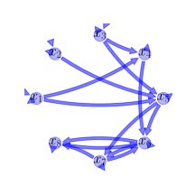
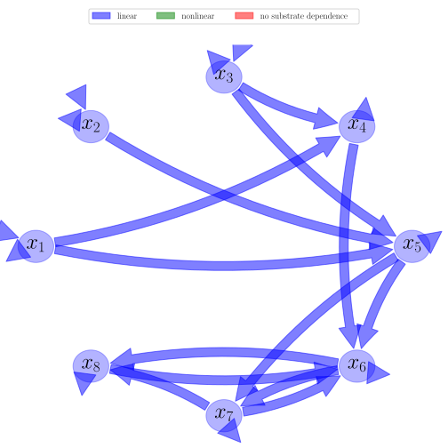
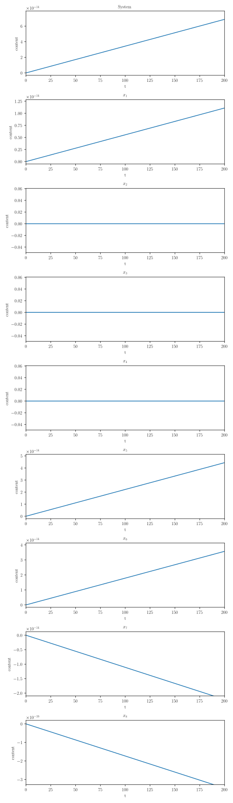
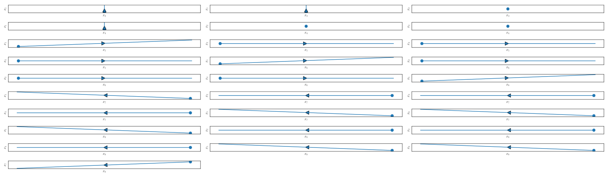

[/Users/csierra/Repos/bgc-md/bgc_md/data/all_records/TECO.yaml](data/all_records/TECO.yaml)

# General Overview

 

This report is the result of the use of the python package bgc_md, as means to translate published models to a common language.  The underlying yaml file was created by Carlos A. Sierra (Orcid ID: 0000-0003-0009-4169) on 12/4/2018.

## About the model
The model depicted in this document considers carbon allocation. It was originally described by @Luo2012TE.

### Abstract
Ecosystem ecology is a subdiscipline of ecology that focuses on exchange of energy and materials between organisms and the environment. The materials that are commonly studied in ecosystem ecology include water, carbon, nitrogen, phosphorus, and other elements that organisms use as nutrients. The source of energy for most ecosystems is solar radiation. In this entry, material cy-cling and energy exchange are generally described before the carbon cycle is used as an example to illustrate our quantitative and theoretical understanding of ecosystem ecology.

### Available parameter values
  
  
Abbreviation|Description  
:-----|:-----  
Set1|Parameter values as described in Wang and Luo  
  Table:  Information on given parameter sets  

### Available initial values
  
  
Abbreviation|Description  
:-----|:-----  
IV1|Initial values as in Wang and Luo  
IV2|Initial values as in Wang and Luo  
  Table:  Information on given sets of initial values  
  
  
Name|Description  
:-----|:-----  
$x_{1}$|Carbon in foliage  
$x_{2}$|Carbon in roots  
$x_{3}$|Carbon in woody tissue  
$x_{4}$|Carbon in metabolic litter  
$x_{5}$|Carbon in structural litter  
$x_{6}$|Carbon in fast SOM  
$x_{7}$|Carbon in slow SOM  
$x_{8}$|Carbon in passive SOM  
  Table: state_variables  
  
  
Name|Description|Unit  
:-----|:-----|:-----  
$t$|time|$day$  
  Table: additional_variables  
  
  
Name|Description|Expression  
:-----|:-----|:-----:  
$x$|vector of state variables|$x=\left[\begin{matrix}x_{1}\\x_{2}\\x_{3}\\x_{4}\\x_{5}\\x_{6}\\x_{7}\\x_{8}\end{matrix}\right]$  
$u$|scalar function of photosynthetic inputs|$u=GPP$  
$b$|vector of partitioning coefficients of photosynthetically fixed carbon|$b=\left[\begin{matrix}b_{1}\\b_{2}\\b_{3}\\0\\0\\0\\0\\0\end{matrix}\right]$  
$C$|matrix of cycling rates|$C=\left[\begin{matrix}c_{1} & 0 & 0 & 0 & 0 & 0 & 0 & 0\\0 & c_{2} & 0 & 0 & 0 & 0 & 0 & 0\\0 & 0 & c_{3} & 0 & 0 & 0 & 0 & 0\\0 & 0 & 0 & c_{4} & 0 & 0 & 0 & 0\\0 & 0 & 0 & 0 & c_{5} & 0 & 0 & 0\\0 & 0 & 0 & 0 & 0 & c_{6} & 0 & 0\\0 & 0 & 0 & 0 & 0 & 0 & c_{7} & 0\\0 & 0 & 0 & 0 & 0 & 0 & 0 & c_{8}\end{matrix}\right]$  
$A$|matrix of transfer coefficients|$A=\left[\begin{matrix}-1 & 0 & 0 & 0 & 0 & 0 & 0 & 0\\0 & -1 & 0 & 0 & 0 & 0 & 0 & 0\\0 & 0 & -1 & 0 & 0 & 0 & 0 & 0\\f_{41} & 0 & f_{43} & -1 & 0 & 0 & 0 & 0\\f_{51} & f_{52} & f_{53} & 0 & -1 & 0 & 0 & 0\\0 & 0 & 0 & f_{64} & f_{65} & -1 & f_{67} & f_{68}\\0 & 0 & 0 & 0 & f_{75} & f_{76} & -1 & 0\\0 & 0 & 0 & 0 & 0 & f_{86} & f_{87} & -1\end{matrix}\right]$  
$B$|matrix of cycling and tansfer rates|$B=A C$  
$f_{v}$|the righthandside of the ode|$f_{v}=u b + B x$  
  Table: components  

## Pool model representation

 

 **Figure 1:** *Pool model representation* 

#### Input fluxes
$x_{1}: GPP\cdot b_{1}$  $x_{2}: GPP\cdot b_{2}$  $x_{3}: GPP\cdot b_{3}$  

#### Output fluxes
$x_{1}: c_{1}\cdot x_{1}\cdot\left(- f_{41} - f_{51} + 1\right)$  $x_{2}: c_{2}\cdot x_{2}\cdot\left(- f_{52} + 1\right)$  $x_{3}: c_{3}\cdot x_{3}\cdot\left(- f_{43} - f_{53} + 1\right)$  $x_{4}: c_{4}\cdot x_{4}\cdot\left(- f_{64} + 1\right)$  $x_{5}: c_{5}\cdot x_{5}\cdot\left(- f_{65} - f_{75} + 1\right)$  $x_{6}: c_{6}\cdot x_{6}\cdot\left(- f_{76} - f_{86} + 1\right)$  $x_{7}: c_{7}\cdot x_{7}\cdot\left(- f_{67} - f_{87} + 1\right)$  $x_{8}: c_{8}\cdot x_{8}\cdot\left(- f_{68} + 1\right)$  

#### Internal fluxes
$x_{1} \rightarrow x_{4}: c_{1}\cdot f_{41}\cdot x_{1}$  $x_{1} \rightarrow x_{5}: c_{1}\cdot f_{51}\cdot x_{1}$  $x_{2} \rightarrow x_{5}: c_{2}\cdot f_{52}\cdot x_{2}$  $x_{3} \rightarrow x_{4}: c_{3}\cdot f_{43}\cdot x_{3}$  $x_{3} \rightarrow x_{5}: c_{3}\cdot f_{53}\cdot x_{3}$  $x_{4} \rightarrow x_{6}: c_{4}\cdot f_{64}\cdot x_{4}$  $x_{5} \rightarrow x_{6}: c_{5}\cdot f_{65}\cdot x_{5}$  $x_{5} \rightarrow x_{7}: c_{5}\cdot f_{75}\cdot x_{5}$  $x_{6} \rightarrow x_{7}: c_{6}\cdot f_{76}\cdot x_{6}$  $x_{6} \rightarrow x_{8}: c_{6}\cdot f_{86}\cdot x_{6}$  $x_{7} \rightarrow x_{6}: c_{7}\cdot f_{67}\cdot x_{7}$  $x_{7} \rightarrow x_{8}: c_{7}\cdot f_{87}\cdot x_{7}$  $x_{8} \rightarrow x_{6}: c_{8}\cdot f_{68}\cdot x_{8}$  

## Steady state formulas
$x_{1} = \frac{GPP}{c_{1}}\cdot b_{1}$  $x_{2} = \frac{GPP}{c_{2}}\cdot b_{2}$  $x_{3} = \frac{GPP}{c_{3}}\cdot b_{3}$  $x_{4} = \frac{GPP}{c_{4}}\cdot\left(b_{1}\cdot f_{41} + b_{3}\cdot f_{43}\right)$  $x_{5} = \frac{GPP}{c_{5}}\cdot\left(b_{1}\cdot f_{51} + b_{2}\cdot f_{52} + b_{3}\cdot f_{53}\right)$  $x_{6} = -\frac{GPP}{c_{6}\cdot\left(f_{67}\cdot f_{76} + f_{68}\cdot f_{76}\cdot f_{87} + f_{68}\cdot f_{86} - 1\right)}\cdot\left(b_{1}\cdot\left(f_{41}\cdot f_{64} + f_{51}\cdot f_{65} + f_{51}\cdot f_{67}\cdot f_{75} + f_{51}\cdot f_{68}\cdot f_{75}\cdot f_{87}\right) + b_{2}\cdot f_{52}\cdot\left(f_{65} + f_{67}\cdot f_{75} + f_{68}\cdot f_{75}\cdot f_{87}\right) + b_{3}\cdot\left(f_{43}\cdot f_{64} + f_{53}\cdot f_{65} + f_{53}\cdot f_{67}\cdot f_{75} + f_{53}\cdot f_{68}\cdot f_{75}\cdot f_{87}\right)\right)$  $x_{7} = -\frac{GPP}{c_{7}\cdot\left(f_{67}\cdot f_{76} + f_{68}\cdot f_{76}\cdot f_{87} + f_{68}\cdot f_{86} - 1\right)}\cdot\left(b_{1}\cdot\left(f_{41}\cdot f_{64}\cdot f_{76} + f_{51}\cdot f_{65}\cdot f_{76} - f_{51}\cdot f_{68}\cdot f_{75}\cdot f_{86} + f_{51}\cdot f_{75}\right) + b_{2}\cdot f_{52}\cdot\left(f_{65}\cdot f_{76} - f_{68}\cdot f_{75}\cdot f_{86} + f_{75}\right) + b_{3}\cdot\left(f_{43}\cdot f_{64}\cdot f_{76} + f_{53}\cdot f_{65}\cdot f_{76} - f_{53}\cdot f_{68}\cdot f_{75}\cdot f_{86} + f_{53}\cdot f_{75}\right)\right)$  $x_{8} = -\frac{GPP}{c_{8}\cdot\left(f_{67}\cdot f_{76} + f_{68}\cdot f_{76}\cdot f_{87} + f_{68}\cdot f_{86} - 1\right)}\cdot\left(b_{1}\cdot\left(f_{41}\cdot f_{64}\cdot f_{76}\cdot f_{87} + f_{41}\cdot f_{64}\cdot f_{86} + f_{51}\cdot f_{65}\cdot f_{76}\cdot f_{87} + f_{51}\cdot f_{65}\cdot f_{86} + f_{51}\cdot f_{67}\cdot f_{75}\cdot f_{86} + f_{51}\cdot f_{75}\cdot f_{87}\right) + b_{2}\cdot f_{52}\cdot\left(f_{65}\cdot f_{76}\cdot f_{87} + f_{65}\cdot f_{86} + f_{67}\cdot f_{75}\cdot f_{86} + f_{75}\cdot f_{87}\right) + b_{3}\cdot\left(f_{43}\cdot f_{64}\cdot f_{76}\cdot f_{87} + f_{43}\cdot f_{64}\cdot f_{86} + f_{53}\cdot f_{65}\cdot f_{76}\cdot f_{87} + f_{53}\cdot f_{65}\cdot f_{86} + f_{53}\cdot f_{67}\cdot f_{75}\cdot f_{86} + f_{53}\cdot f_{75}\cdot f_{87}\right)\right)$    

## Steady states (potentially incomplete), according jacobian eigenvalues, damping ratio

### Parameter set: Set1
$x_1: 182.868$, $x_2: 14952.218$, $x_3: 197.406$, $x_4: 47.613$, $x_5: 1369.284$, $x_6: 81.111$, $x_7: 6128.836$, $x_8: 826.51$    $\lambda_{1}: -0.011$  $\lambda_{2}: -0.001$  $\lambda_{3}: -0.003$  $\lambda_{4}: -0.002$  $\lambda_{5}: -0.000$  $\lambda_{6}: -0.011+0.000j$  $\rho_{6}: 1.000000$  $\lambda_{7}: -0.000-0.000j$  $\rho_{7}: 1.000000$  $\lambda_{8}: -0.000+0.000j$  $\rho_{8}: 1.000000$  

## Model simulations

 

 **Model run 1 - solutions:** *Initial values: IV2, Parameter set: Set1, Time step: 0.1* 

 

 **Model run 1 - phase planes:** *Initial values: IV2, Parameter set: Set1, Start: 0, End: 200, Time step: 0.1* 

# References
