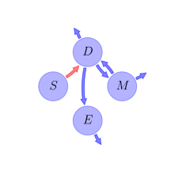
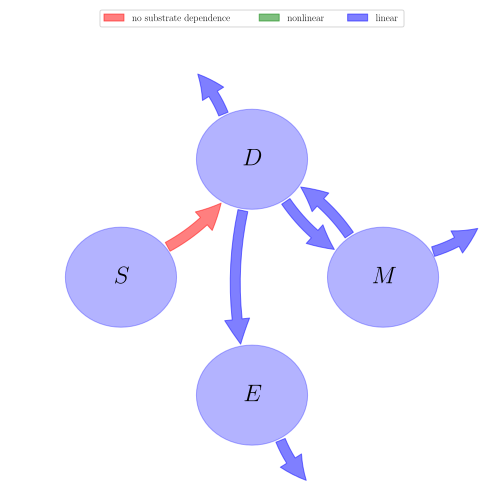

# General Overview

 

This report is the result of the use of the Python 3.4 package Sympy (for symbolic mathematics), as means to translate published models to a common language. It was created by Holger Metzler (Orcid ID: 0000-0002-8239-1601) on 14/03/2016, and was last modified on _lm_.

## About the model
The model depicted in this document considers soil organic matter decomposition. It was originally described by @Schimel2003SoilBiologyandBiochemistry.  

### Abstract
Traditional models of soil organic matter (SOM) decomposition are all based on first order kinetics in which the decomposition rate of a particular C pool is proportional to the size of the pool and a simple decomposition constant ($dC/dt = kC$). In fact, SOM decomposition is catalyzed by extracellular enzymes that are produced by microorganisms. We built a simple theoretical model to explore the behavior of the decomposition – microbial growth system when the fundamental kinetic assumption is changed from first order kinetics to exoenzymes catalyzed decomposition ($dC/dt = KC\times Enzymes$). An analysis of the enzyme kinetics showed that there must be some mechanism to produce a non-linear response of decomposition rates to enzyme concentration—the most likely is competition for enzyme binding on solid substrates as predicted by Langmuir adsorption isotherm theory. This non-linearity also induces C limitation, regardless of the potential supply of C. The linked C and N version of the model showed that actual polymer breakdown and microbial use of the released monomers can be disconnected, and that it requires relatively little N to maintain the maximal rate of decomposition, regardless of the microbial biomass’ ability to use the breakdown products. In this model, adding a pulse of C to an N limited system increases respiration, while adding N actually decreases respiration (as C is redirected from waste respiration to microbial growth). For many years, researchers have argued that the lack of a respiratory response by soil microbes to added N indicates that they are not N limited. This model suggests that conclusion may be wrong. While total C flow may be limited by the functioning of the exoenzyme system, actual microbial growth may be N limited.

### Keywords
differential equations, nonlinear, time invariant

### Principles
heterogeneity of speed of decay, internal transformations of organic matter, substrate interactions

### Available parameter values

Abbreviation|Description
:-----|:-----
Set 1|original values from linked model (no nitrogen cycle considered in this model here)

Table:  Information on given parameter sets

# State Variables
The following table contains the available information regarding this section:

Name|Description|Units
:-----:|:-----|:-----:
$S$|soil organic carbon|$g$
$D$|dissolved organic carbon|$g$
$M$|microbial biomass|$g$
$E$|exoenzymes|$g$

Table: Information on State Variables

# Additional Parameters
The following table contains the available information regarding this section:

Name|Description|Type|Values    Set 1
:-----:|:-----|:-----:|:-----:
$K_{es}$|half saturation constant for enzymes on substrate|parameter|$0.0003$
$SUE$|substrate use efficiency|parameter|$0.5$
$K_{e}$|fraction of of dissolved organic carbon that is allocated to exoenzymes|parameter|$0.05$
$K_{r}$|proportion of dead microbial biomass that is available for microbial use|parameter|$0.85$

Table: Information on Additional Parameters

# Decomposition Rates
The following table contains the available information regarding this section:

Name|Description|Expressions|Type|Units|Values    Set 1
:-----:|:-----|:-----:|:-----:|:-----:|:-----:
$k_{d}$|collapsed decomposition constant|-|parameter|$d^{-1}$|$1$
$D_{C}$|decomposition of polymeric material to produce available carbon|$D_{C}=\frac{k_{d}\cdot E}{K_{es}+E}$|auxiliary variable|$g d^{-1}$|-
$k_{m}$|microbial maintenance rate|-|parameter|$d^{-1}$|$0.01$
$k_{t}$|rate of microbial biomass that dies in each time interval|-|parameter|$d^{-1}$|$0.012$
$k_{l}$|decay constant for exoenzymes|-|parameter|$d^{-1}$|$0.05$

Table: Information on Decomposition Rates

# Respiration Variables
The following table contains the available information regarding this section:

Name|Description|Expressions|Values    Set 1
:-----:|:-----|:-----:|:-----:
$R_{e}$|respiration to support enzyme synthesis|$R_{e}=\frac{K_{e}\cdot D\cdot \left(1-SUE\right)}{SUE}$|-
$R_{m}$|respiration to support maintenance energy needs|$R_{m}=k_{m}\cdot M$|-
$R_{g}$|respiration to support growth of the microbial biomass (not allowed to be negative)|$R_{g}=\operatorname{Max}\left(\left(D-K_{e}\cdot D-R_{e}-R_{m}\right)\cdot \left(1-SUE\right), 0\right)$|-

Table: Information on Respiration Variables

# Components
The following table contains the available information regarding this section:

Name|Description|Expressions
:-----:|:-----|:-----:
$C$|carbon content|$C=\left[\begin{matrix}S\\D\\M\\E\end{matrix}\right]$
$T$|transition operator|$T=\left[\begin{matrix}-1 & 0 & 0 & 0\\1 & -1 &\frac{K_{r}\cdot k_{t}}{SUE\cdot k_{m} + k_{t}} & 0\\0 & - K_{e} + SUE & -1 & 0\\0 & K_{e} & 0 & -1\end{matrix}\right]$
$N$|decomposition operator|$N=\left[\begin{matrix}\frac{D_{C}}{S} & 0 & 0 & 0\\0 & 1 & 0 & 0\\0 & 0 & SUE\cdot k_{m} + k_{t} & 0\\0 & 0 & 0 & k_{l}\end{matrix}\right]$
$f_{s}$|the right hand side of the ode|$f_{s}=T\cdot N\cdot C$

Table: Information on Components

## Pool model representation
<table><thead><tr><th></th><th>Flux description</th></tr></thead><tbody><tr><td align=center, style='vertical-align: middle'>
 

 **Figure 1:** *Pool model representation* 

</td><td align=left style='vertical-align: middle'>

#### Output fluxes
$D: D\cdot\left(- SUE + 1\right)$  $M: M\cdot\left(- K_{r}\cdot k_{t} + SUE\cdot k_{m} + k_{t}\right)$  $E: E\cdot k_{l}$  

#### Internal fluxes
$S \rightarrow D: \frac{E\cdot k_{d}}{E + K_{es}}$  $D \rightarrow M: D\cdot\left(- K_{e} + SUE\right)$  $D \rightarrow E: D\cdot K_{e}$  $M \rightarrow D: K_{r}\cdot M\cdot k_{t}$  </td></tr></tbody></table>
## The right hand side of the ODE
$\left[\begin{matrix}-\frac{E\cdot k_{d}}{E + K_{es}}\\- D +\frac{E\cdot k_{d}}{E + K_{es}} + K_{r}\cdot M\cdot k_{t}\\D\cdot\left(- K_{e} + SUE\right) + M\cdot\left(- SUE\cdot k_{m} - k_{t}\right)\\D\cdot K_{e} - E\cdot k_{l}\end{matrix}\right]$

## The Jacobian (derivative of the ODE w.r.t. state variables)
$\left[\begin{matrix}0 & 0 & 0 &\frac{E\cdot k_{d}}{\left(E + K_{es}\right)^{2}} -\frac{k_{d}}{E + K_{es}}\\0 & -1 & K_{r}\cdot k_{t} & -\frac{E\cdot k_{d}}{\left(E + K_{es}\right)^{2}} +\frac{k_{d}}{E + K_{es}}\\0 & - K_{e} + SUE & - SUE\cdot k_{m} - k_{t} & 0\\0 & K_{e} & 0 & - k_{l}\end{matrix}\right]$

# References
