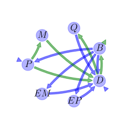
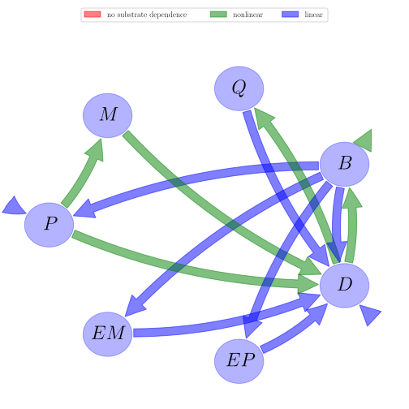

# General Overview

 

This report is the result of the use of the Python 3.4 package Sympy (for symbolic mathematics), as means to translate published models to a common language. It was created by Holger Metzler (Orcid ID: 0000-0002-8239-1601) on 21/03/2016, and was last modified on _lm_.

## About the model
The model depicted in this document considers soil organic matter decomposition. It was originally described by @Wang2013EcologicalApplications.  

### Further references
@Li2014Biogeochemistry: \mathrm{None}

### Abstract
We developed a microbial-enzyme-mediated decomposition (MEND) model, based on the Michaelis-Menten kinetics, that describes the dynamics of physically defined pools of soil organic matter (SOC). These include particulate, mineral-associated, dissolved organic matter (POC, MOC, and DOC, respectively), microbial biomass, and associated exoenzymes. The ranges and/or distributions of parameters were determined by both analytical steady-state and dynamic analyses with SOC data from the literature. We used an improved multi-objective parameter sensitivity analysis (MOPSA) to identify the most important parameters for the full model: maintenance of microbial biomass, turnover and synthesis of enzymes, and carbon use efficiency (CUE). The model predicted that an increase of 2°C (baseline temperature 12°C) caused the pools of POC-cellulose, MOC, and total SOC to increase with dynamic CUE and decrease with constant CUE, as indicated by the 50% confidence intervals. Regardless of dynamic or constant CUE, the changes in pool size of POC, MOC, and total SOC varied from −8% to 8% under +2°C. The scenario analysis using a single parameter set indicates that higher temperature with dynamic CUE might result in greater net increases in both POC-cellulose and MOC pools. Different dynamics of various SOC pools reflected the catalytic functions of specific enzymes targeting specific substrates and the interactions between microbes, enzymes, and SOC. With the feasible parameter values estimated in this study, models incorporating fundamental principles of microbial-enzyme dynamics can lead to simulation results qualitatively different from traditional models with fast/slow/passive pools.

### Keywords
differential equations, nonlinear, time invariant, Michaelis-Menten

### Principles
mass balance, substrate dependence of decomposition, heterogeneity of speed of decay, internal transformations of organic matter, substrate interactions

# State Variables
The following table contains the available information regarding this section:

Name|Description|Units
:-----:|:-----|:-----:
$P$|particulate organic carbon pool|$mgC g^{-1}\text{ soil}$
$M$|mineral associated organic carbon pool|$mgC g^{-1}\text{ soil}$
$Q$|active layer of $M$ interacting with dissolved organic carbon through adsorption and desorption|$mgC g^{-1}\text{ soil}$
$B$|microbial biomass pool|$mgC g^{-1}\text{ soil}$
$D$|dissolved organic carbon pool|$mgC g^{-1}\text{ soil}$
$EP$|enzymes for the decomposition of $P$|$mgC g^{-1}\text{ soil}$
$EM$|enzymes for the decompsotion of $M$|$mgC g^{-1}\text{ soil}$

Table: Information on State Variables

# Parameters
The following table contains the available information regarding this section:

Name|Description|Type|Units
:-----:|:-----|:-----:|:-----:
$V_{P}$|maximum specific decomposition rate for $P$ by $EP$|parameter|$h^{-1}$
$K_{P}$|half-saturation constant for decomposition of $P$|parameter|$mgC g^{-1}\text{ soil}$
$V_{M}$|maximum specific decomposition rate for $M$ by $EM$|parameter|$h^{-1}$
$K_{M}$|half-saturation constant for decomposition of $M$|parameter|$mgC g^{-1}\text{ soil}$
$V_{D}$|maximum specific uptake rate of $D$ for growth of $B$|parameter|$h^{-1}$
$K_{D}$|half-saturation constant for uptake of $D$ for growth of $B$|parameter|$mgC g^{-1}\text{ soil}$
$m_{R}$|specific maintenance factor or rate|parameter|$h^{-1}$
$E_{C}$|carbon use efficiency|parameter|-
$Q_{max}$|maximum dissolved organic carbon sorption capacity|parameter|$mgC g^{-1}\text{ soil}$
$K_{ads}$|specific adsorption rate|parameter|$h^{-1}$
$K_{des}$|desorption rate|parameter|$h^{-1}$
$r_{EP}$|turnover rate of $EP$|parameter|$h^{-1}$
$r_{EM}$|turnover rate of $EM$|parameter|$h^{-1}$
$g_{D}$|fraction of dead $B$ allocated to $D$|parameter|-
$p_{EP}$|fraction of $m_{R}$ for production of $EP$|parameter|-
$p_{EM}$|fraction of $m_{R}$ for production of $EM$|parameter|-
$f_{D}$|fraction of decomposed $P$ allocated to $D$|parameter|-

Table: Information on Parameters

# Additional Variables
The following table contains the available information regarding this section:

Name|Description|Expressions|Units
:-----:|:-----|:-----:|:-----:
$F_{E}$|enzyme production rate|$F_{E}=m_{R}$|$h^{-1}$
$F_{R}$|microbial respiration rate|$F_{R}=\frac{\left(\frac{1}{E_{C}}-1\right)\cdot \left(V_{D}+m_{R}\right)\cdot D}{K_{D}+D}$|$h^{-1}$
$F_{U}$|dissolved organic matter uptakte rate|$F_{U}=\frac{\frac{1}{E_{C}}\cdot \left(V_{D}+m_{R}\right)\cdot B}{K_{D}+D}$|$h^{-1}$
$F_{A}$|adsorption rate of dissolved organic matter|$F_{A}=K_{ads}\cdot \left(1-\frac{Q}{Q_{max}}\right)$|$h^{-1}$

Table: Information on Additional Variables

# Input Components
The following table contains the available information regarding this section:

Name|Description|Type|Units
:-----:|:-----|:-----:|:-----:
$I_{P}$|soil organic carbon input rate|parameter|$mgC g^{-1}\text{ soil } h^{-1}$
$I_{D}$|dissolved organic carbon input rate|parameter|$mgC g^{-1}\text{ soil } h^{-1}$

Table: Information on Input Components

# Components
The following table contains the available information regarding this section:

Name|Description|Expressions
:-----:|:-----|:-----:
$C$|carbon content|$C=\left[\begin{matrix}P\\M\\Q\\B\\D\\EP\\EM\end{matrix}\right]$
$I$|input vector|$I=\left[\begin{matrix}I_{P}\\0\\0\\0\\I_{D}\\0\\0\end{matrix}\right]$
$T$|transition operator|$T=\left[\begin{matrix}-1 & 0 & 0 &\frac{F_{E}}{F_{E} + F_{R}}\cdot\left(- g_{D} + 1\right)\cdot\left(- p_{EM} - p_{EP} + 1\right) & 0 & 0 & 0\\- f_{D} + 1 & -1 & 0 & 0 & 0 & 0 & 0\\0 & 0 & -1 & 0 &\frac{F_{A}}{F_{A} + F_{U}} & 0 & 0\\0 & 0 & 0 & -1 &\frac{F_{U}}{F_{A} + F_{U}} & 0 & 0\\f_{D} & 1 & 1 &\frac{F_{E}\cdot g_{D}}{F_{E} + F_{R}}\cdot\left(- p_{EM} - p_{EP} + 1\right) & -1 & 1 & 1\\0 & 0 & 0 &\frac{F_{E}\cdot p_{EP}}{F_{E} + F_{R}} & 0 & -1 & 0\\0 & 0 & 0 &\frac{F_{E}\cdot p_{EM}}{F_{E} + F_{R}} & 0 & 0 & -1\end{matrix}\right]$
$N$|decomposition operator|$N=\left[\begin{matrix}\frac{EP\cdot V_{P}}{K_{P} + P} & 0 & 0 & 0 & 0 & 0 & 0\\0 &\frac{EM\cdot V_{M}}{K_{M} + M} & 0 & 0 & 0 & 0 & 0\\0 & 0 &\frac{K_{des}}{Q_{max}} & 0 & 0 & 0 & 0\\0 & 0 & 0 & F_{E} + F_{R} & 0 & 0 & 0\\0 & 0 & 0 & 0 & F_{A} + F_{U} & 0 & 0\\0 & 0 & 0 & 0 & 0 & r_{EP} & 0\\0 & 0 & 0 & 0 & 0 & 0 & r_{EM}\end{matrix}\right]$
$f_{s}$|the right hand side of the ode|$f_{s}=I+T\cdot N\cdot C$

Table: Information on Components

## Pool model representation
<table><thead><tr><th></th><th>Flux description</th></tr></thead><tbody><tr><td align=center, style='vertical-align: middle'>
 

 **Figure 1:** *Pool model representation* 

</td><td align=left style='vertical-align: middle'>
#### Input fluxes
$P: I_{P}$  $D: I_{D}$  

#### Output fluxes
$B: -\frac{B\cdot D}{E_{C}\cdot\left(D + K_{D}\right)}\cdot\left(E_{C}\cdot V_{D} + E_{C}\cdot m_{R} - V_{D} - m_{R}\right)$  

#### Internal fluxes
$P \rightarrow M: -\frac{EP\cdot P\cdot V_{P}}{K_{P} + P}\cdot\left(f_{D} - 1\right)$  $P \rightarrow D: \frac{EP\cdot P\cdot V_{P}}{K_{P} + P}\cdot f_{D}$  $M \rightarrow D: \frac{EM\cdot M\cdot V_{M}}{K_{M} + M}$  $Q \rightarrow D: \frac{K_{des}}{Q_{max}}\cdot Q$  $B \rightarrow P: B\cdot m_{R}\cdot\left(g_{D} - 1\right)\cdot\left(p_{EM} + p_{EP} - 1\right)$  $B \rightarrow D: B\cdot g_{D}\cdot m_{R}\cdot\left(- p_{EM} - p_{EP} + 1\right)$  $B \rightarrow EP: B\cdot m_{R}\cdot p_{EP}$  $B \rightarrow EM: B\cdot m_{R}\cdot p_{EM}$  $D \rightarrow Q: -\frac{D}{Q_{max}}\cdot K_{ads}\cdot\left(Q - Q_{max}\right)$  $D \rightarrow B: \frac{B\cdot D\cdot\left(V_{D} + m_{R}\right)}{E_{C}\cdot\left(D + K_{D}\right)}$  $EP \rightarrow D: EP\cdot r_{EP}$  $EM \rightarrow D: EM\cdot r_{EM}$  </td></tr></tbody></table>
## The right hand side of the ODE
$\left[\begin{matrix}B\cdot m_{R}\cdot\left(- g_{D} + 1\right)\cdot\left(- p_{EM} - p_{EP} + 1\right) -\frac{EP\cdot P\cdot V_{P}}{K_{P} + P} + I_{P}\\-\frac{EM\cdot M\cdot V_{M}}{K_{M} + M} +\frac{EP\cdot P\cdot V_{P}}{K_{P} + P}\cdot\left(- f_{D} + 1\right)\\D\cdot K_{ads}\cdot\left(-\frac{Q}{Q_{max}} + 1\right) -\frac{K_{des}}{Q_{max}}\cdot Q\\\frac{B\cdot D\cdot\left(V_{D} + m_{R}\right)}{E_{C}\cdot\left(D + K_{D}\right)} + B\cdot\left(-\frac{D}{D + K_{D}}\cdot\left(-1 +\frac{1}{E_{C}}\right)\cdot\left(V_{D} + m_{R}\right) - m_{R}\right)\\B\cdot g_{D}\cdot m_{R}\cdot\left(- p_{EM} - p_{EP} + 1\right) + D\cdot\left(-\frac{B\cdot\left(V_{D} + m_{R}\right)}{E_{C}\cdot\left(D + K_{D}\right)} - K_{ads}\cdot\left(-\frac{Q}{Q_{max}} + 1\right)\right) +\frac{EM\cdot M\cdot V_{M}}{K_{M} + M} + EM\cdot r_{EM} +\frac{EP\cdot P\cdot V_{P}}{K_{P} + P}\cdot f_{D} + EP\cdot r_{EP} + I_{D} +\frac{K_{des}}{Q_{max}}\cdot Q\\B\cdot m_{R}\cdot p_{EP} - EP\cdot r_{EP}\\B\cdot m_{R}\cdot p_{EM} - EM\cdot r_{EM}\end{matrix}\right]$

## The Jacobian (derivative of the ODE w.r.t. state variables)
$\left[\begin{matrix}\frac{EP\cdot P\cdot V_{P}}{\left(K_{P} + P\right)^{2}} -\frac{EP\cdot V_{P}}{K_{P} + P} & 0 & 0 & m_{R}\cdot\left(- g_{D} + 1\right)\cdot\left(- p_{EM} - p_{EP} + 1\right) & 0 & -\frac{P\cdot V_{P}}{K_{P} + P} & 0\\-\frac{EP\cdot P\cdot V_{P}}{\left(K_{P} + P\right)^{2}}\cdot\left(- f_{D} + 1\right) +\frac{EP\cdot V_{P}}{K_{P} + P}\cdot\left(- f_{D} + 1\right) &\frac{EM\cdot M\cdot V_{M}}{\left(K_{M} + M\right)^{2}} -\frac{EM\cdot V_{M}}{K_{M} + M} & 0 & 0 & 0 &\frac{P\cdot V_{P}}{K_{P} + P}\cdot\left(- f_{D} + 1\right) & -\frac{M\cdot V_{M}}{K_{M} + M}\\0 & 0 & -\frac{D}{Q_{max}}\cdot K_{ads} -\frac{K_{des}}{Q_{max}} & 0 & K_{ads}\cdot\left(-\frac{Q}{Q_{max}} + 1\right) & 0 & 0\\0 & 0 & 0 & -\frac{D}{D + K_{D}}\cdot\left(-1 +\frac{1}{E_{C}}\right)\cdot\left(V_{D} + m_{R}\right) +\frac{D\cdot\left(V_{D} + m_{R}\right)}{E_{C}\cdot\left(D + K_{D}\right)} - m_{R} & -\frac{B\cdot D\cdot\left(V_{D} + m_{R}\right)}{E_{C}\cdot\left(D + K_{D}\right)^{2}} + B\cdot\left(\frac{D}{\left(D + K_{D}\right)^{2}}\cdot\left(-1 +\frac{1}{E_{C}}\right)\cdot\left(V_{D} + m_{R}\right) -\frac{1}{D + K_{D}}\cdot\left(-1 +\frac{1}{E_{C}}\right)\cdot\left(V_{D} + m_{R}\right)\right) +\frac{B\cdot\left(V_{D} + m_{R}\right)}{E_{C}\cdot\left(D + K_{D}\right)} & 0 & 0\\-\frac{EP\cdot P\cdot V_{P}}{\left(K_{P} + P\right)^{2}}\cdot f_{D} +\frac{EP\cdot V_{P}\cdot f_{D}}{K_{P} + P} & -\frac{EM\cdot M\cdot V_{M}}{\left(K_{M} + M\right)^{2}} +\frac{EM\cdot V_{M}}{K_{M} + M} &\frac{D}{Q_{max}}\cdot K_{ads} +\frac{K_{des}}{Q_{max}} & -\frac{D\cdot\left(V_{D} + m_{R}\right)}{E_{C}\cdot\left(D + K_{D}\right)} + g_{D}\cdot m_{R}\cdot\left(- p_{EM} - p_{EP} + 1\right) &\frac{B\cdot D\cdot\left(V_{D} + m_{R}\right)}{E_{C}\cdot\left(D + K_{D}\right)^{2}} -\frac{B\cdot\left(V_{D} + m_{R}\right)}{E_{C}\cdot\left(D + K_{D}\right)} - K_{ads}\cdot\left(-\frac{Q}{Q_{max}} + 1\right) &\frac{P\cdot V_{P}\cdot f_{D}}{K_{P} + P} + r_{EP} &\frac{M\cdot V_{M}}{K_{M} + M} + r_{EM}\\0 & 0 & 0 & m_{R}\cdot p_{EP} & 0 & - r_{EP} & 0\\0 & 0 & 0 & m_{R}\cdot p_{EM} & 0 & 0 & - r_{EM}\end{matrix}\right]$

# References
