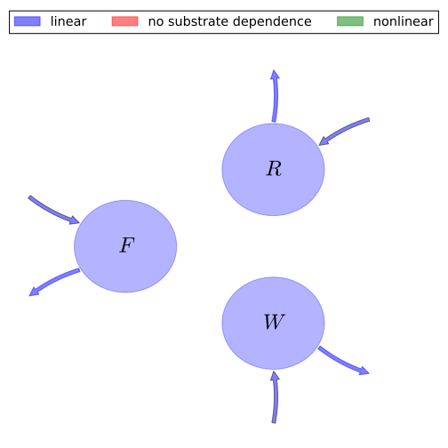

# General Overview
This report is the result of the use of the Python 3.4 package Sympy (for symbolic mathematics), as means to translate published models to a common language. It was created by Verónika Ceballos-Núñez (Orcid ID: 0000-0002-0046-1160) on 29/7/2015, and was last modified on _lm_.

## About the model
The model depicted in this document considers carbon allocation with a process based approach. It was originally described by @King1993Tree_Physiology.  

### Abstract
A general model was constructed relating forest growth to nitrogen uptake and the partitioning of biomass among leaves, fine roots and woody tissues. The model was used to assess the influence of the allocation pattern on stand wood production, individual tree growth and nutrient cycling for even-aged conifer stands with adequate water, but suboptimal nitrogen. Stand wood production was maximized by quite low allocation to roots for specified amounts of plant-available nitrogen. However, the wood production of the individual was maximized by higher allocation to roots, because large root systems enhanced the ability of individuals to compete for nutrients. The optimal fine root allocation for a competing individual was less than 5% of total production for adequate nitrogen, but rose to 30% as nitrogen became more limiting, in general agreement with observed allocation patterns for fertilized versus non-fertilized forests. The high allocation to roots predicted for competitors may also enhance long-term productivity by decreasing nutrient losses from the ecosystem. Although collective, short-term stand wood production could be increased by shifting growth from roots to stems, this strategy may increase nutrient losses, ultimately decreasing productivity.

### Space Scale
global
### Available parameter values

Abbreviation|Source
:-----|:-----
Original dataset of the publication|@King1993Tree_Physiology

Table:  Information on given parameter sets

# State Variables
The following table contains the available information regarding this section:

Variable|Description|Values    key
:-----:|:-----|:-----:
$F$|Carbon in foliage|foliage
$R$|Carbon in roots|fine_roots
$W$|Carbon in woody tissue|wood

Table: Information on State Variables

# Photosynthetic Parameters
The following table contains the available information regarding this section:

Variable|Description|Expressions|key|Type|Units|Values    Original dataset of the publication
:-----:|:-----|:-----:|:-----:|:-----:|:-----:|:-----:
$\Phi$|Annual photosynthetically active radiation (PAR)|-|-|variable|$M J m^{-2} year^{-1}$|-
$\epsilon$|Light utilization coefficient|-|-|parameter|$Kg M J^{-1}$|-
$G$|Rate of biomass production per unit ground area|$G=\Phi\cdot \epsilon$|GPP|parameter|$Kg m^{-2} year^{-1}$|-

Table: Information on Photosynthetic Parameters

# Allocation Coefficients
The following table contains the available information regarding this section:

Variable|Expressions|key|Type|Values    Original dataset of the publication
:-----:|:-----:|:-----:|:-----:|:-----:
$\eta_{f}$|-|part_foliage|parameter|$\frac{1}{5}$
$\eta_{r}$|-|part_roots|parameter|$\frac{11}{20}$
$\eta_{w}$|$\eta_{w}=1-\eta_{f}-\eta_{r}$|part_wood|parameter|$\frac{1}{4}$

Table: Information on Allocation Coefficients

# Cycling Rates
The following table contains the available information regarding this section:

Variable|key|Type|Values    Original dataset of the publication
:-----:|:-----:|:-----:|:-----:
$\gamma_{f}$|cyc_foliage|parameter|$0.5$
$\gamma_{r}$|cyc_roots|parameter|$2$
$\gamma_{w}$|cyc_wood|parameter|-

Table: Information on Cycling Rates

# Components
The following table contains the available information regarding this section:

Variable|Description|Expressions|Values    key
:-----:|:-----|:-----:|:-----:
$x$|vector of states for vegetation|$x=\left[\begin{matrix}F\\R\\W\end{matrix}\right]$|state_vector
$u$|scalar function of photosynthetic inputs|$u=G$|scalar_func_phot
$b$|vector of partitioning coefficients of photosynthetically fixed carbon|$b=\left[\begin{matrix}\eta_{f}\\\eta_{r}\\\eta_{w}\end{matrix}\right]$|part_coeff
$A$|matrix of turnover (cycling) rates|$A=\left[\begin{matrix}-\gamma_{f} & 0 & 0\\0 & -\gamma_{r} & 0\\0 & 0 & -\gamma_{w}\end{matrix}\right]$|cyc_matrix
$f_{v}$|the righthandside of the ode|$f_{v}=u\cdot b+A\cdot x$|state_vector_derivative

Table: Information on Components

## Pool model representation
<table><thead><tr><th></th><th>Flux description</th></tr></thead><tbody><tr><td align=center, style='vertical-align: middle'>
 

 **Figure 1:** *Pool model representation* 

</td><td align=left style='vertical-align: middle'>
#### Input fluxes
$F: \Phi\cdot\epsilon\cdot\eta_{f}$  $R: \Phi\cdot\epsilon\cdot\eta_{r}$  $W: \Phi\cdot\epsilon\cdot\left(-\eta_{f} -\eta_{r} + 1\right)$  

#### Output fluxes
$F: F\cdot\gamma_{f}$  $R: R\cdot\gamma_{r}$  $W: W\cdot\gamma_{w}$  </td></tr></tbody></table>
## The right hand side of the ODE
$\left[\begin{matrix}- F\cdot\gamma_{f} +\Phi\cdot\epsilon\cdot\eta_{f}\\\Phi\cdot\epsilon\cdot\eta_{r} - R\cdot\gamma_{r}\\\Phi\cdot\epsilon\cdot\left(-\eta_{f} -\eta_{r} + 1\right) - W\cdot\gamma_{w}\end{matrix}\right]$

## The Jacobian (derivative of the ODE w.r.t. state variables)
$\left[\begin{matrix}-\gamma_{f} & 0 & 0\\0 & -\gamma_{r} & 0\\0 & 0 & -\gamma_{w}\end{matrix}\right]$

# References
