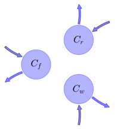
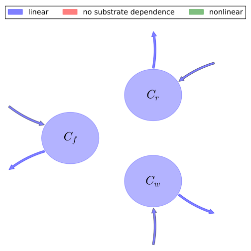

# General Overview

 

This report is the result of the use of the Python 3.4 package Sympy (for symbolic mathematics), as means to translate published models to a common language. It was created by Verónika Ceballos-Núñez (Orcid ID: 0000-0002-0046-1160) on 16/3/2016, and was last modified on _lm_.

## About the model
The model depicted in this document considers carbon allocation with a process based approach. It was originally described by @Murty2000EcologicalModelling.  

### Abstract
For closed canopy forests, both above-ground net primary productivity (ANPP) and wood yield decline as stands age. However the physiological mechanisms responsible for the decline are not well understood. Understanding of the causes of the decline and incorporation of aging mechanisms into models of forest production are essential both for sound forest management and for reliable prediction of changes in terrestrial carbon storage under altered climates. To investigate causes for declining net primary productivity (NPP) an ecosystem model G'DAY was modified to include aging mechanisms associated with three main current hypotheses for NPP decline. These hypotheses are: (1) sapwood maintenance respiration increases as stands age, reducing the availability of carbon to support growth; (2) stomatal conductance and hence photosynthetic rates decline; and (3) soil nitrogen availability declines due to nitrogen (N) accumulation in woody litter. A model-based method was developed for determining the relative importance of three mechanisms for NPP decline in forest stands. The method involves a decomposition of simulated model output into three components, each related to one aging mechanism. The method is illustrated by parameterizing G'DAY for young (40 year-old) and mature (245 year-old) stands of Pinus contorta in Colorado USA. Results from this method of analysis indicate that: 1. The G'DAY model without aging mechanisms cannot reproduce the observed changes in NPP as stands age. When the above three aging mechanisms are switched off, G'DAY shows only transient changes in NPP lasting less than 20 years. When the aging mechanisms are incorporated in G'DAY, the model simulates declining NPP on a scale similar to that observed in the field. 2. The gradual decline in NPP following canopy closure is sensitive to assumptions about aging mechanisms and is particularly sensitive to assumptions about soil N availability and declining photosynthetic rates. We identified key areas of model uncertainty requiring further experimental clarification. Here we highlight two inadequately understood processes: soil N immobilization associated with woody litter accumulation and changes in carbon allocation as stands develop. (C) 2000 Elsevier Science B.V.

### Space Scale
global

# Time
The following table contains the available information regarding this section:

Variable|Description
:-----:|:-----
$t$|Age of the stand
$t_{1}$|Age of the stand at which $\epsilon_{0}$ begins to decline
$t_{2}$|Age of the stand at which $\epsilon_{0}$ reaches a minimum

Table: Information on Time

# State Variables
The following table contains the available information regarding this section:

Variable|Description|key|Units
:-----:|:-----|:-----:|:-----:
$C_{f}$|Foliar carbon mass|foliage|$kgC\cdot m^{-2}$
$C_{r}$|Root carbon|fine_roots|$kgC\cdot m^{-2}$
$C_{w}$|Carbon in woody tissue|wood|$kgC\cdot m^{-2}$

Table: Information on State Variables

# Additional Variables
The following table contains the available information regarding this section:

Variable|Description|Expressions|key|Type|Units
:-----:|:-----|:-----:|:-----:|:-----:|:-----:
$C_{sw}$|Sapwood carbon content|$C_{sw}=1.11\cdot C_{w}^{0.77}$|-|-|$kgC\cdot m^{-2}$
$N_{f}$|Nitrogen content of foliage|-|-|variable|$kgN\cdot m^{-2}$
$N_{r}$|Nitrogen content of fine roots|-|-|variable|-
$n_{f}$|Foliar N:C ratio|-|-|-|-
$n_{crit}$|Foliar N:C ratio below which production is N-limited|-|-|-|-
$T_{a}$|Mean air temperature|-|air_temperature|parameter|-
$Q_{10}$|-|-|-|parameter|-
$Q_{010}$|-|-|-|parameter|-

Table: Information on Additional Variables

# Respiration Parameters
The following table contains the available information regarding this section:

Variable|Description|Expressions|Type|Units
:-----:|:-----|:-----:|:-----:|:-----:
$R_{c}$|Total construction respiration|-|variable|-
$R_{0}$|Respiration rate per unit nitrogen content corresponding to a temperature of 0°C|-|variable|$kgC\cdot kgN^{-1}\cdot year^{-1}$
$R_{mf}$|Annual maintenance respiration rate of foliage (dark period only)|$R_{mf}=0.5\cdot R_{0}\cdot N_{f}\cdot Q_{10}^{\frac{T_{a}}{10}}$|variable|-
$R_{mr}$|Annual maintenance respiration rate of fine roots (dark period only)|$R_{mr}=R_{0}\cdot N_{r}\cdot Q_{10}^{\frac{T_{a}}{10}}$|variable|-
$R_{msw}$|Annual maintenance respiration rate of sapwood (dark period only)|$R_{msw}=0.00876\cdot C_{sw}\cdot Q_{010}^{\frac{T_{a}}{10}}$|variable|-
$R_{m}$|Total maintenance respiration|$R_{m}=R_{mf}+R_{mr}+R_{msw}$|variable|-

Table: Information on Respiration Parameters

# Photosynthetic Parameters
The following table contains the available information regarding this section:

Variable|Description|Expressions|key|Type|Units
:-----:|:-----|:-----:|:-----:|:-----:|:-----:
$I_{0}$|Incident PAR|-|IPAR|-|$GJ\cdot m^{-2}$
$\sigma$|Leaf area per unit carbon|-|LAI?|variable|$m^{2}\cdot kgC^{-1}$
$k$|Light extinction coefficient|-|-|-|$kgC\cdot m^{-2}$
$APAR$|Absorbed photosynthetically active radiation|$APAR=I_{0}\cdot \left(1-\operatorname{exp}\left(- k\cdot \sigma\cdot C_{f}\right)\right)$|-|variable|-
$E_{nf}$|Function that represents the dependence of NPP on foliar N:C ratio (n_f)|$E_{nf}=\begin{cases}\frac{\left(n_{crit} + 0.017\right)\cdot\left(1.84\cdot n_{f} - 0.01\right)}{\left(1.84\cdot n_{crit} - 0.01\right)\cdot\left(n_{f} + 0.017\right)} &\text{for}\: n_{f} < n_{crit}\\1 &\text{for}\: n_{f} > n_{crit}\end{cases}$|-|-|-
$\epsilon_{young}$|Maximum gross PAR utilization efficiency of young stands|-|-|parameter|$gC\cdot MJ^{-1}$
$\epsilon_{old}$|Maximum gross PAR utilization efficiency of old stands|-|-|parameter|$gC\cdot MJ^{-1}$
$\epsilon_{0}$|Maximum gross PAR utilization efficiency|$\epsilon_{0}=\begin{cases}\epsilon_{young} &\text{for}\: t{\leq} t_{1}\\\begin{cases}\epsilon_{young} -\frac{\left(-\epsilon_{old} +\epsilon_{young}\right)\cdot\left(t - t_{1}\right)}{- t_{1} + t_{2}} &\text{for}\: t_{1} < t\\\begin{cases}\epsilon_{young} -\frac{\left(-\epsilon_{old} +\epsilon_{young}\right)\cdot\left(t - t_{1}\right)}{- t_{1} + t_{2}} &\text{for}\: t < t_{2}\\\epsilon_{old} &\text{for}\: t{\geq} t_{2}\end{cases} &\text{otherwise}\end{cases} &\text{otherwise}\end{cases}$|-|parameter|$gC\cdot MJ^{-1}$
$GPP$|Gross primary production|$GPP=\epsilon_{0}\cdot E_{nf}\cdot APAR$|-|variable|-
$NPP$|Annual net primary production|$NPP=GPP-\left(R_{c}+R_{m}\right)$|NPP|variable|$kgC\cdot m^{-2}\cdot year^{-1}$

Table: Information on Photosynthetic Parameters

# Partitioning coefficients
The following table contains the available information regarding this section:

Variable|Description|Expressions|key|Type
:-----:|:-----|:-----:|:-----:|:-----:
$a_{f}$|Allocation fraction to foliar biomass|-|part_foliage|parameter
$a_{r}$|Allocation fraction to roots biomass|-|part_roots|parameter
$a_{w}$|Allocation fraction to wood (in stem, branches and large structurl roots) biomass|$a_{w}=1-a_{f}-a_{r}$|part_wood|parameter

Table: Information on Partitioning coefficients

# Cycling Rates
The following table contains the available information regarding this section:

Variable|Description|key|Type|Units
:-----:|:-----|:-----:|:-----:|:-----:
$\gamma_{f}$|Foliage senescence rate|cyc_foliage|parameter|$yr^{-1}$
$\gamma_{r}$|Roots senescence rate|cyc_roots|parameter|$yr^{-1}$
$\gamma_{w}$|Wood senescence rate|cyc_wood|parameter|$yr^{-1}$

Table: Information on Cycling Rates

# Components
The following table contains the available information regarding this section:

Variable|Description|Expressions|key
:-----:|:-----|:-----:|:-----:
$x$|vector of states for vegetation|$x=\left[\begin{matrix}C_{f}\\C_{r}\\C_{w}\end{matrix}\right]$|state_vector
$u$|scalar function of photosynthetic inputs|$u=NPP$|scalar_func_phot
$b$|vector of partitioning coefficients of photosynthetically fixed carbon|$b=\left[\begin{matrix}a_{f}\\a_{r}\\a_{w}\end{matrix}\right]$|part_coeff
$A$|matrix of senescence (cycling) rates|$A=\left[\begin{matrix}-\gamma_{f} & 0 & 0\\0 & -\gamma_{r} & 0\\0 & 0 & -\gamma_{w}\end{matrix}\right]$|cyc_matrix
$f_{v}$|the righthandside of the ode|$f_{v}=u\cdot b+A\cdot x$|state_vector_derivative

Table: Information on Components

## Pool model representation
<table><thead><tr><th></th><th>Flux description</th></tr></thead><tbody><tr><td align=center, style='vertical-align: middle'>
 

 **Figure 1:** *Pool model representation* 

</td><td align=left style='vertical-align: middle'>
#### Input fluxes
$C_{f}: a_{f}\cdot\left(- 0.0097236\cdot C_{w}^{0.77}\cdot Q_{010}^{\frac{T_{a}}{10}} + I_{0}\cdot\left(1 - e^{- C_{f}\cdot k\cdot\sigma}\right)\cdot\left(\begin{cases}\epsilon_{young} &\text{for}\: t{\leq} t_{1}\\\begin{cases}\epsilon_{young} -\frac{\left(-\epsilon_{old} +\epsilon_{young}\right)\cdot\left(t - t_{1}\right)}{- t_{1} + t_{2}} &\text{for}\: t_{1} < t\\\begin{cases}\epsilon_{young} -\frac{\left(-\epsilon_{old} +\epsilon_{young}\right)\cdot\left(t - t_{1}\right)}{- t_{1} + t_{2}} &\text{for}\: t < t_{2}\\\epsilon_{old} &\text{for}\: t{\geq} t_{2}\end{cases} &\text{otherwise}\end{cases} &\text{otherwise}\end{cases}\right)\cdot\begin{cases}\frac{\left(n_{crit} + 0.017\right)\cdot\left(1.84\cdot n_{f} - 0.01\right)}{\left(1.84\cdot n_{crit} - 0.01\right)\cdot\left(n_{f} + 0.017\right)} &\text{for}\: n_{f} < n_{crit}\\1 &\text{for}\: n_{f} > n_{crit}\end{cases} - 0.5\cdot N_{f}\cdot Q_{10}^{\frac{T_{a}}{10}}\cdot R_{0} - N_{r}\cdot Q_{10}^{\frac{T_{a}}{10}}\cdot R_{0} - R_{c}\right)$  $C_{r}: a_{r}\cdot\left(- 0.0097236\cdot C_{w}^{0.77}\cdot Q_{010}^{\frac{T_{a}}{10}} + I_{0}\cdot\left(1 - e^{- C_{f}\cdot k\cdot\sigma}\right)\cdot\left(\begin{cases}\epsilon_{young} &\text{for}\: t{\leq} t_{1}\\\begin{cases}\epsilon_{young} -\frac{\left(-\epsilon_{old} +\epsilon_{young}\right)\cdot\left(t - t_{1}\right)}{- t_{1} + t_{2}} &\text{for}\: t_{1} < t\\\begin{cases}\epsilon_{young} -\frac{\left(-\epsilon_{old} +\epsilon_{young}\right)\cdot\left(t - t_{1}\right)}{- t_{1} + t_{2}} &\text{for}\: t < t_{2}\\\epsilon_{old} &\text{for}\: t{\geq} t_{2}\end{cases} &\text{otherwise}\end{cases} &\text{otherwise}\end{cases}\right)\cdot\begin{cases}\frac{\left(n_{crit} + 0.017\right)\cdot\left(1.84\cdot n_{f} - 0.01\right)}{\left(1.84\cdot n_{crit} - 0.01\right)\cdot\left(n_{f} + 0.017\right)} &\text{for}\: n_{f} < n_{crit}\\1 &\text{for}\: n_{f} > n_{crit}\end{cases} - 0.5\cdot N_{f}\cdot Q_{10}^{\frac{T_{a}}{10}}\cdot R_{0} - N_{r}\cdot Q_{10}^{\frac{T_{a}}{10}}\cdot R_{0} - R_{c}\right)$  $C_{w}: \left(- a_{f} - a_{r} + 1\right)\cdot\left(- 0.0097236\cdot C_{w}^{0.77}\cdot Q_{010}^{\frac{T_{a}}{10}} + I_{0}\cdot\left(1 - e^{- C_{f}\cdot k\cdot\sigma}\right)\cdot\left(\begin{cases}\epsilon_{young} &\text{for}\: t{\leq} t_{1}\\\begin{cases}\epsilon_{young} -\frac{\left(-\epsilon_{old} +\epsilon_{young}\right)\cdot\left(t - t_{1}\right)}{- t_{1} + t_{2}} &\text{for}\: t_{1} < t\\\begin{cases}\epsilon_{young} -\frac{\left(-\epsilon_{old} +\epsilon_{young}\right)\cdot\left(t - t_{1}\right)}{- t_{1} + t_{2}} &\text{for}\: t < t_{2}\\\epsilon_{old} &\text{for}\: t{\geq} t_{2}\end{cases} &\text{otherwise}\end{cases} &\text{otherwise}\end{cases}\right)\cdot\begin{cases}\frac{\left(n_{crit} + 0.017\right)\cdot\left(1.84\cdot n_{f} - 0.01\right)}{\left(1.84\cdot n_{crit} - 0.01\right)\cdot\left(n_{f} + 0.017\right)} &\text{for}\: n_{f} < n_{crit}\\1 &\text{for}\: n_{f} > n_{crit}\end{cases} - 0.5\cdot N_{f}\cdot Q_{10}^{\frac{T_{a}}{10}}\cdot R_{0} - N_{r}\cdot Q_{10}^{\frac{T_{a}}{10}}\cdot R_{0} - R_{c}\right)$  

#### Output fluxes
$C_{f}: C_{f}\cdot\gamma_{f}$  $C_{r}: C_{r}\cdot\gamma_{r}$  $C_{w}: C_{w}\cdot\gamma_{w}$  </td></tr></tbody></table>
## The right hand side of the ODE
$\left[\begin{matrix}- C_{f}\cdot\gamma_{f} + a_{f}\cdot\left(- 0.0097236\cdot C_{w}^{0.77}\cdot Q_{010}^{\frac{T_{a}}{10}} + I_{0}\cdot\left(1 - e^{- C_{f}\cdot k\cdot\sigma}\right)\cdot\left(\begin{cases}\epsilon_{young} &\text{for}\: t{\leq} t_{1}\\\begin{cases}\epsilon_{young} -\frac{\left(-\epsilon_{old} +\epsilon_{young}\right)\cdot\left(t - t_{1}\right)}{- t_{1} + t_{2}} &\text{for}\: t_{1} < t\\\begin{cases}\epsilon_{young} -\frac{\left(-\epsilon_{old} +\epsilon_{young}\right)\cdot\left(t - t_{1}\right)}{- t_{1} + t_{2}} &\text{for}\: t < t_{2}\\\epsilon_{old} &\text{for}\: t{\geq} t_{2}\end{cases} &\text{otherwise}\end{cases} &\text{otherwise}\end{cases}\right)\cdot\begin{cases}\frac{\left(n_{crit} + 0.017\right)\cdot\left(1.84\cdot n_{f} - 0.01\right)}{\left(1.84\cdot n_{crit} - 0.01\right)\cdot\left(n_{f} + 0.017\right)} &\text{for}\: n_{f} < n_{crit}\\1 &\text{for}\: n_{f} > n_{crit}\end{cases} - 0.5\cdot N_{f}\cdot Q_{10}^{\frac{T_{a}}{10}}\cdot R_{0} - N_{r}\cdot Q_{10}^{\frac{T_{a}}{10}}\cdot R_{0} - R_{c}\right)\\- C_{r}\cdot\gamma_{r} + a_{r}\cdot\left(- 0.0097236\cdot C_{w}^{0.77}\cdot Q_{010}^{\frac{T_{a}}{10}} + I_{0}\cdot\left(1 - e^{- C_{f}\cdot k\cdot\sigma}\right)\cdot\left(\begin{cases}\epsilon_{young} &\text{for}\: t{\leq} t_{1}\\\begin{cases}\epsilon_{young} -\frac{\left(-\epsilon_{old} +\epsilon_{young}\right)\cdot\left(t - t_{1}\right)}{- t_{1} + t_{2}} &\text{for}\: t_{1} < t\\\begin{cases}\epsilon_{young} -\frac{\left(-\epsilon_{old} +\epsilon_{young}\right)\cdot\left(t - t_{1}\right)}{- t_{1} + t_{2}} &\text{for}\: t < t_{2}\\\epsilon_{old} &\text{for}\: t{\geq} t_{2}\end{cases} &\text{otherwise}\end{cases} &\text{otherwise}\end{cases}\right)\cdot\begin{cases}\frac{\left(n_{crit} + 0.017\right)\cdot\left(1.84\cdot n_{f} - 0.01\right)}{\left(1.84\cdot n_{crit} - 0.01\right)\cdot\left(n_{f} + 0.017\right)} &\text{for}\: n_{f} < n_{crit}\\1 &\text{for}\: n_{f} > n_{crit}\end{cases} - 0.5\cdot N_{f}\cdot Q_{10}^{\frac{T_{a}}{10}}\cdot R_{0} - N_{r}\cdot Q_{10}^{\frac{T_{a}}{10}}\cdot R_{0} - R_{c}\right)\\- C_{w}\cdot\gamma_{w} +\left(- a_{f} - a_{r} + 1\right)\cdot\left(- 0.0097236\cdot C_{w}^{0.77}\cdot Q_{010}^{\frac{T_{a}}{10}} + I_{0}\cdot\left(1 - e^{- C_{f}\cdot k\cdot\sigma}\right)\cdot\left(\begin{cases}\epsilon_{young} &\text{for}\: t{\leq} t_{1}\\\begin{cases}\epsilon_{young} -\frac{\left(-\epsilon_{old} +\epsilon_{young}\right)\cdot\left(t - t_{1}\right)}{- t_{1} + t_{2}} &\text{for}\: t_{1} < t\\\begin{cases}\epsilon_{young} -\frac{\left(-\epsilon_{old} +\epsilon_{young}\right)\cdot\left(t - t_{1}\right)}{- t_{1} + t_{2}} &\text{for}\: t < t_{2}\\\epsilon_{old} &\text{for}\: t{\geq} t_{2}\end{cases} &\text{otherwise}\end{cases} &\text{otherwise}\end{cases}\right)\cdot\begin{cases}\frac{\left(n_{crit} + 0.017\right)\cdot\left(1.84\cdot n_{f} - 0.01\right)}{\left(1.84\cdot n_{crit} - 0.01\right)\cdot\left(n_{f} + 0.017\right)} &\text{for}\: n_{f} < n_{crit}\\1 &\text{for}\: n_{f} > n_{crit}\end{cases} - 0.5\cdot N_{f}\cdot Q_{10}^{\frac{T_{a}}{10}}\cdot R_{0} - N_{r}\cdot Q_{10}^{\frac{T_{a}}{10}}\cdot R_{0} - R_{c}\right)\end{matrix}\right]$

## The Jacobian (derivative of the ODE w.r.t. state variables)
$\left[\begin{matrix}I_{0}\cdot a_{f}\cdot k\cdot\sigma\cdot\left(\begin{cases}\epsilon_{young} &\text{for}\: t{\leq} t_{1}\\\begin{cases}\epsilon_{young} -\frac{\left(-\epsilon_{old} +\epsilon_{young}\right)\cdot\left(t - t_{1}\right)}{- t_{1} + t_{2}} &\text{for}\: t_{1} < t\\\begin{cases}\epsilon_{young} -\frac{\left(-\epsilon_{old} +\epsilon_{young}\right)\cdot\left(t - t_{1}\right)}{- t_{1} + t_{2}} &\text{for}\: t < t_{2}\\\epsilon_{old} &\text{for}\: t{\geq} t_{2}\end{cases} &\text{otherwise}\end{cases} &\text{otherwise}\end{cases}\right)\cdot\left(\begin{cases}\frac{\left(n_{crit} + 0.017\right)\cdot\left(1.84\cdot n_{f} - 0.01\right)}{\left(1.84\cdot n_{crit} - 0.01\right)\cdot\left(n_{f} + 0.017\right)} &\text{for}\: n_{f} < n_{crit}\\1 &\text{for}\: n_{f} > n_{crit}\end{cases}\right)\cdot e^{- C_{f}\cdot k\cdot\sigma} -\gamma_{f} & 0 & -\frac{0.007487172}{C_{w}^{0.23}}\cdot Q_{010}^{\frac{T_{a}}{10}}\cdot a_{f}\\I_{0}\cdot a_{r}\cdot k\cdot\sigma\cdot\left(\begin{cases}\epsilon_{young} &\text{for}\: t{\leq} t_{1}\\\begin{cases}\epsilon_{young} -\frac{\left(-\epsilon_{old} +\epsilon_{young}\right)\cdot\left(t - t_{1}\right)}{- t_{1} + t_{2}} &\text{for}\: t_{1} < t\\\begin{cases}\epsilon_{young} -\frac{\left(-\epsilon_{old} +\epsilon_{young}\right)\cdot\left(t - t_{1}\right)}{- t_{1} + t_{2}} &\text{for}\: t < t_{2}\\\epsilon_{old} &\text{for}\: t{\geq} t_{2}\end{cases} &\text{otherwise}\end{cases} &\text{otherwise}\end{cases}\right)\cdot\left(\begin{cases}\frac{\left(n_{crit} + 0.017\right)\cdot\left(1.84\cdot n_{f} - 0.01\right)}{\left(1.84\cdot n_{crit} - 0.01\right)\cdot\left(n_{f} + 0.017\right)} &\text{for}\: n_{f} < n_{crit}\\1 &\text{for}\: n_{f} > n_{crit}\end{cases}\right)\cdot e^{- C_{f}\cdot k\cdot\sigma} & -\gamma_{r} & -\frac{0.007487172}{C_{w}^{0.23}}\cdot Q_{010}^{\frac{T_{a}}{10}}\cdot a_{r}\\I_{0}\cdot k\cdot\sigma\cdot\left(- a_{f} - a_{r} + 1\right)\cdot\left(\begin{cases}\epsilon_{young} &\text{for}\: t{\leq} t_{1}\\\begin{cases}\epsilon_{young} -\frac{\left(-\epsilon_{old} +\epsilon_{young}\right)\cdot\left(t - t_{1}\right)}{- t_{1} + t_{2}} &\text{for}\: t_{1} < t\\\begin{cases}\epsilon_{young} -\frac{\left(-\epsilon_{old} +\epsilon_{young}\right)\cdot\left(t - t_{1}\right)}{- t_{1} + t_{2}} &\text{for}\: t < t_{2}\\\epsilon_{old} &\text{for}\: t{\geq} t_{2}\end{cases} &\text{otherwise}\end{cases} &\text{otherwise}\end{cases}\right)\cdot\left(\begin{cases}\frac{\left(n_{crit} + 0.017\right)\cdot\left(1.84\cdot n_{f} - 0.01\right)}{\left(1.84\cdot n_{crit} - 0.01\right)\cdot\left(n_{f} + 0.017\right)} &\text{for}\: n_{f} < n_{crit}\\1 &\text{for}\: n_{f} > n_{crit}\end{cases}\right)\cdot e^{- C_{f}\cdot k\cdot\sigma} & 0 & -\frac{0.007487172}{C_{w}^{0.23}}\cdot Q_{010}^{\frac{T_{a}}{10}}\cdot\left(- a_{f} - a_{r} + 1\right) -\gamma_{w}\end{matrix}\right]$

# References
