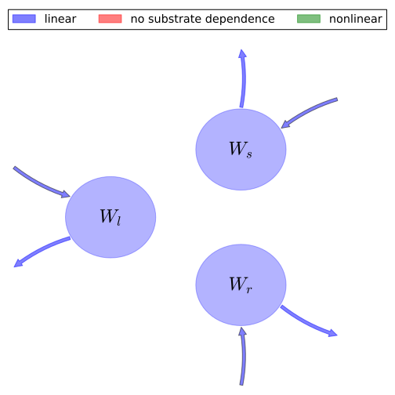

# General Overview

 

This report is the result of the use of the Python 3.4 package Sympy (for symbolic mathematics), as means to translate published models to a common language. It was created by Verónika Ceballos-Núñez (Orcid ID: 0000-0002-0046-1160) on 11/8/2015, and was last modified on _lm_.

## About the model
The model depicted in this document considers carbon allocation with a process based approach. It was originally described by @VanDerWerf1993PlantandSoil.  

### Abstract
In this paper we model allocation of carbon and nitrogen to roots and leaves as a function of the nitrogen status of a plant. Under steady-state conditions, allocation of carbon and nitrogen to leaves is exponentially (positively) correlated with plant nitrogen concentration, whereas allocation to roots is correlated negatively, also in an exponential manner. Allocation functions derived under steady-state conditions are used to simulate biomass partitioning under non-steady-state nutrient conditions. Upon nitrogen deprivation, measured and simulated values are rather similar with time, suggesting that allocation functions derived under steady-state conditions also hold under non-steady-state conditions.

### Space Scale
global

# State Variables
The following table contains the available information regarding this section:

Variable|Description|Expressions|key
:-----:|:-----|:-----:|:-----:
$W_{l}$|Dry weights of leaf blades|-|foliage
$W_{s}$|Dry weights of leaf sheaths|-|foliage
$W_{r}$|Dry weights of roots|-|fine_roots
$N_{p}$|Nitrogen. Rate of uptake obeys to the following expression|$N_{p}=\sigma\cdot W_{r}$|-

Table: Information on State Variables

# Additional Variables
The following table contains the available information regarding this section:

Variable|Description|Type
:-----:|:-----|:-----:
$C_{cl}$|Cabon contents of leaf blades|variable
$C_{cs}$|Cabon contents of leaf sheaths|variable
$C_{cr}$|Cabon contents of roots|variable
$r_{m}$|Amount of carbon lost per day in root respiration (maintenance)|variable
$c_{n u}$|Amounts of carbon lost per unit of nitrogen taken up|variable
$c_{g}$|Amounts of carbon lost per unit of root biomass|variable
$\sigma$|Rate of nitrogen uptake per unit of root weight|parameter

Table: Information on Additional Variables

# Photosynthetic Parameters
The following table contains the available information regarding this section:

Variable|Description|key|Type
:-----:|:-----|:-----:|:-----:
$\phi_{g}$|Rate of gross photosynthesis per unit of leaf weight|GPP|parameter

Table: Information on Photosynthetic Parameters

# Allocation Coefficients
The following table contains the available information regarding this section:

Variable|key|Type
:-----:|:-----:|:-----:
$\alpha_{cl}$|part_foliage|parameter
$\alpha_{cs}$|part_wood|parameter
$\alpha_{cr}$|part_roots|parameter

Table: Information on Allocation Coefficients

# Cycling Rates
The following table contains the available information regarding this section:

Variable|Entry Author Orcid|key|Type
:-----:|:-----:|:-----:|:-----:
$\gamma_{f}$|0000-0002-0046-1160|cyc_foliage|parameter
$\gamma_{r}$|0000-0002-0046-1160|cyc_roots|parameter
$\gamma_{w}$|0000-0002-0046-1160|cyc_wood|parameter

Table: Information on Cycling Rates

# Respiration Rates
The following table contains the available information regarding this section:

Variable|Description|Entry Author Orcid|Expressions|Type
:-----:|:-----|:-----:|:-----:|:-----:
$Q_{l}$|Respiration rates per unit of leaf weight-variable formulated by us, for generalization purposes-|0000-0002-0046-1160|-|parameter
$Q_{s}$|Respiration rates per unit of  stem weight -variable formulated by us, for generalization purposes-|0000-0002-0046-1160|-|parameter
$Q_{r}$|Respiration rates per unit of roots -variable formulated by us, for generalization purposes-|0000-0002-0046-1160|$Q_{r}=\frac{r_{m}+\sigma\cdot c_{n,u}}{1+\frac{c_{g}}{C_{cr}}}$|variable

Table: Information on Respiration Rates

# Components
The following table contains the available information regarding this section:

Variable|Description|Expressions|key
:-----:|:-----|:-----:|:-----:
$x$|vector of states for vegetation|$x=\left[\begin{matrix}W_{l}\\W_{s}\\W_{r}\end{matrix}\right]$|state_vector
$u$|scalar function of photosynthetic inputs|$u=\phi_{g}$|scalar_func_phot
$c$|carbon contents per compartment|$c=\left[\begin{matrix}\frac{1}{C_{cl}} & 0 & 0\\0 &\frac{1}{C_{cs}} & 0\\0 & 0 &\frac{1}{C_{cr}}\end{matrix}\right]$|C_content
$R$|vector of respiration rates|$R=\left[\begin{matrix}- Q_{l} & 0 & 0\\0 & - Q_{s} & 0\\0 & 0 & - Q_{r}\end{matrix}\right]$|resp_matrix
$b$|vector of partitioning coefficients of photosynthetically fixed carbon|$b=\left[\begin{matrix}\alpha_{cl}\\\alpha_{cs}\\\frac{\alpha_{cr}}{1 +\frac{c_{g}}{C_{cr}}}\end{matrix}\right]$|part_coeff
$A$|matrix of turnover (cycling) rates|$A=\left[\begin{matrix}-\gamma_{f} & 0 & 0\\0 & -\gamma_{r} & 0\\0 & 0 & -\gamma_{w}\end{matrix}\right]$|cyc_matrix
$f_{v}$|the righthandside of the ode|$f_{v}=u\cdot x_{0, 0} c b + A c x + R c x$|state_vector_derivative

Table: Information on Components

## Pool model representation
<table><thead><tr><th></th><th>Flux description</th></tr></thead><tbody><tr><td align=center, style='vertical-align: middle'>
 

 **Figure 1:** *Pool model representation* 

</td><td align=left style='vertical-align: middle'>
#### Input fluxes
$W_{l}: \alpha_{cl}\cdot\phi_{g}$  $W_{s}: \alpha_{cs}\cdot\phi_{g}$  $W_{r}: \frac{\alpha_{cr}\cdot\phi_{g}}{1 +\frac{c_{g}}{C_{cr}}}$  

#### Output fluxes
$W_{l}: W_{l}\cdot\gamma_{f}$  $W_{s}: W_{s}\cdot\gamma_{r}$  $W_{r}: W_{r}\cdot\gamma_{w}$  </td></tr></tbody></table>
## The right hand side of the ODE
$\left[\begin{matrix}-\frac{Q_{l}}{C_{cl}}\cdot W_{l} +\frac{W_{l}}{C_{cl}}\cdot\alpha_{cl}\cdot\phi_{g} -\frac{W_{l}}{C_{cl}}\cdot\gamma_{f}\\-\frac{Q_{s}}{C_{cs}}\cdot W_{s} +\frac{W_{l}}{C_{cs}}\cdot\alpha_{cs}\cdot\phi_{g} -\frac{W_{s}}{C_{cs}}\cdot\gamma_{r}\\\frac{W_{l}\cdot\alpha_{cr}\cdot\phi_{g}}{C_{cr}\cdot\left(1 +\frac{c_{g}}{C_{cr}}\right)} -\frac{W_{r}}{C_{cr}}\cdot\gamma_{w} -\frac{W_{r}\cdot\left(c_{n u}\cdot\sigma + r_{m}\right)}{C_{cr}\cdot\left(1 +\frac{c_{g}}{C_{cr}}\right)}\end{matrix}\right]$

## The Jacobian (derivative of the ODE w.r.t. state variables)
$\left[\begin{matrix}-\frac{Q_{l}}{C_{cl}} +\frac{\alpha_{cl}}{C_{cl}}\cdot\phi_{g} -\frac{\gamma_{f}}{C_{cl}} & 0 & 0\\\frac{\alpha_{cs}}{C_{cs}}\cdot\phi_{g} & -\frac{Q_{s}}{C_{cs}} -\frac{\gamma_{r}}{C_{cs}} & 0\\\frac{\alpha_{cr}\cdot\phi_{g}}{C_{cr}\cdot\left(1 +\frac{c_{g}}{C_{cr}}\right)} & 0 & -\frac{\gamma_{w}}{C_{cr}} -\frac{c_{n u}\cdot\sigma + r_{m}}{C_{cr}\cdot\left(1 +\frac{c_{g}}{C_{cr}}\right)}\end{matrix}\right]$

# References
