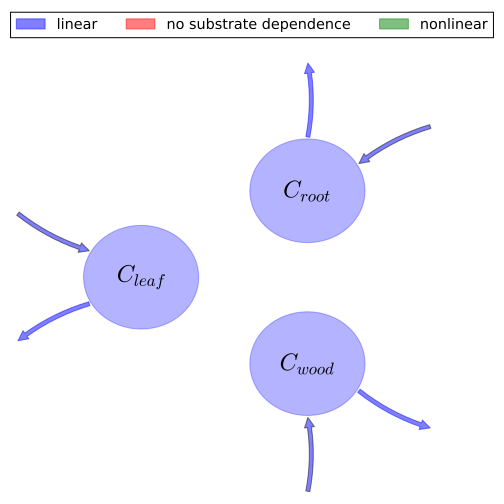

# General Overview

 

This report is the result of the use of the Python 3.4 package Sympy (for symbolic mathematics), as means to translate published models to a common language. It was created by Verónika Ceballos-Núñez (Orcid ID: 0000-0002-0046-1160) on 14/3/2016, and was last modified on _lm_.

## About the model
The model depicted in this document considers carbon allocation with a process based approach. It was originally described by @Wang2010Biogeosciences.  

### Abstract
Carbon storage by many terrestrial ecosystems can be limited by nutrients, predominantly nitrogen (N) and phosphorus (P), in addition to other environmental constraints, water, light and temperature. However the spatial distribution and the extent of both N and P limitation at the global scale have not been quantified. Here we have developed a global model of carbon (C), nitrogen (N) and phosphorus (P) cycles for the terrestrial biosphere. Model estimates of steady state C and N pool sizes and major fluxes between plant, litter and soil pools, under present climate conditions, agree well with various independent estimates. The total amount of C in the terrestrial biosphere is 2767 Gt C, and the C fractions in plant, litter and soil organic matter are 19%, 4% and 77%. The total amount of N is 135 Gt N, with about 94% stored in the soil, 5% in the plant live biomass, and 1% in litter. We found that the estimates of total soil P and its partitioning into different pools in soil are quite sensitive to biochemical P mineralization. The total amount of P (plant biomass, litter and soil) excluding occluded P in soil is 17 Gt P in the terrestrial biosphere, 33% of which is stored in the soil organic matter if biochemical P mineralization is modelled, or 31 Gt P with 67% in soil organic matter otherwise. This model was used to derive the global distribution and uncertainty of N or P limitation on the productivity of terrestrial ecosystems at steady state under present conditions. Our model estimates that the net primary productivity of most tropical evergreen broadleaf forests and tropical savannahs is reduced by about 20% on average by P limitation, and most of the remaining biomes are N limited; N limitation is strongest in high latitude deciduous needle leaf forests, and reduces its net primary productivity by up to 40% under present conditions.

### Space Scale
global

### Available parameter values

Abbreviation|Source
:-----|:-----
Evergreen needle leaf forest|@Wang2010Biogeosciences
Evergreen broadleaf forest|@Wang2010Biogeosciences
Deciduous needle leaf forest|@Wang2010Biogeosciences
Deciduous broadleaf forest|@Wang2010Biogeosciences
Mixed forest|@Wang2010Biogeosciences
Shrub land (open and close shrubland)|@Wang2010Biogeosciences
Woddy savannah|@Wang2010Biogeosciences
Savannah|@Wang2010Biogeosciences
Grassland|@Wang2010Biogeosciences
Crop land (cropland mosaic was aggregated into this term)|@Wang2010Biogeosciences
Barren or sparse vegetation|@Wang2010Biogeosciences

Table:  Information on given parameter sets

# State Variables
The following table contains the available information regarding this section:

Variable|Description|key
:-----:|:-----|:-----:
$C_{leaf}$|Plant (carbon) pool Leaf|foliage
$C_{root}$|Plant (carbon) pool Root|fine_roots
$C_{wood}$|Plant (carbon) pool Wood|wood

Table: Information on State Variables

# Photosynthetic Parameters
The following table contains the available information regarding this section:

Variable|Description|Expressions|key|Type|Units|Values    Evergreen needle leaf forest|Evergreen broadleaf forest|Deciduous needle leaf forest|Deciduous broadleaf forest|Mixed forest|Shrub land (open and close shrubland)|Woddy savannah|Savannah|Grassland|Crop land (cropland mosaic was aggregated into this term)|Barren or sparse vegetation
:-----:|:-----|:-----:|:-----:|:-----:|:-----:|:-----:|:-----:|:-----:|:-----:|:-----:|:-----:|:-----:|:-----:|:-----:|:-----:|:-----:
$\Delta_{t}$|Time step of model integration|-|-|parameter|$d$|$1$|$1$|$1$|$1$|$1$|$1$|$1$|$1$|$1$|$1$|$1$
$N_{min}$|Amount of mineral N in soil|-|-|variable|$gN\cdot m^{-2}$|-|-|-|-|-|-|-|-|-|-|-
$P_{lab}$|Amount of labile P in soil|-|-|variable|$gP\cdot m^{-2}$|-|-|-|-|-|-|-|-|-|-|-
$F_{nupmin}$|Minimum amount of N uptake required to sustain a given NPP|-|-|parameter|-|-|-|-|-|-|-|-|-|-|-|-
$F_{pupmin}$|Minimum amount of P uptake required to sustain a given NPP|-|-|parameter|-|-|-|-|-|-|-|-|-|-|-|-
$x_{nup}$|Nitrogen uptake limitation on NPP|$x_{nup}=\operatorname{Min}\left(1, \frac{N_{min}}{F_{nupmin}\cdot \\Delta _{t}}\right)$|-|variable|-|-|-|-|-|-|-|-|-|-|-|-
$x_{pup}$|Phosphorus uptake limitation on NPP|$x_{pup}=\operatorname{Min}\left(1, \frac{P_{lab}}{F_{pupmin}\cdot \\Delta _{t}}\right)$|-|variable|-|-|-|-|-|-|-|-|-|-|-|-
$x_{npup}$|Nutrient uptake limiting factor|$x_{npup}=\operatorname{Min}\left(x_{nup}, x_{pup}\right)$|-|variable|-|-|-|-|-|-|-|-|-|-|-|-
$n_{leaf}$|N:C ratio of leaf biomass|-|-|parameter|$gN/gC$|$\frac{1}{42}$|$\frac{1}{21}$|$\frac{1}{50}$|$\frac{1}{21}$|$\frac{1}{28}$|$\frac{1}{33}$|$\frac{1}{21}$|$\frac{1}{21}$|$\frac{1}{42}$|$\frac{1}{21}$|$\frac{1}{17}$
$p_{leaf}$|P:C ratio of leaf biomass|-|-|parameter|$gP/gC$|$\frac{1}{408}$|$\frac{1}{400}$|$\frac{1}{405}$|$\frac{1}{333}$|$\frac{1}{278}$|$\frac{1}{293}$|$\frac{1}{354}$|$\frac{1}{492}$|$\frac{1}{833}$|$\frac{1}{333}$|$\frac{1}{167}$
$k_{n}$|Empirical constant|-|-|parameter|$gN\cdot (gC)^{-1}$|$0.01$|$0.01$|$0.01$|$0.01$|$0.01$|$0.01$|$0.01$|$0.01$|$0.01$|$0.01$|$0.01$
$k_{p}$|Empirical constant|-|-|parameter|$gP\cdot (gC)^{-1}$|$0.0006$|$0.0006$|$0.0006$|$0.0006$|$0.0006$|$0.0006$|$0.0006$|$0.0006$|$0.0006$|$0.0006$|$0.0006$
$x_{nleaf}$|-|$x_{nleaf}=\frac{n_{leaf}}{n_{leaf}+k_{n}}$|-|parameter|-|-|-|-|-|-|-|-|-|-|-|-
$x_{pleaf}$|-|$x_{pleaf}=\frac{p_{leaf}}{p_{leaf}+k_{p}}$|-|parameter|-|-|-|-|-|-|-|-|-|-|-|-
$x_{npleaf}$|Nutrient concentration limiting factor|$x_{npleaf}=\operatorname{Min}\left(x_{nleaf}, x_{pleaf}\right)$|-|parameter|-|-|-|-|-|-|-|-|-|-|-|-
$F_{cmax}$|Nutrient unlimited NPP|-|-|variable|$gC\cdot m^{-2}\cdot d^{-1}$|-|-|-|-|-|-|-|-|-|-|-
$F_{c}$|Net Primary Productivity (flux)|$F_{c}=x_{npleaf}\cdot x_{npup}\cdot F_{cmax}$|NPP|variable|$gC\cdot m^{-2}\cdot d^{-1}$|-|-|-|-|-|-|-|-|-|-|-

Table: Information on Photosynthetic Parameters

# Allocation Coefficients
The following table contains the available information regarding this section:

Variable|Description|key|Type|Values    Evergreen needle leaf forest|Evergreen broadleaf forest|Deciduous needle leaf forest|Deciduous broadleaf forest|Mixed forest|Shrub land (open and close shrubland)|Woddy savannah|Savannah|Grassland|Crop land (cropland mosaic was aggregated into this term)|Barren or sparse vegetation
:-----:|:-----|:-----:|:-----:|:-----:|:-----:|:-----:|:-----:|:-----:|:-----:|:-----:|:-----:|:-----:|:-----:|:-----:
$a_{leaf}$|Fraction of NPP allocated to plant pool Leaf|part_foliage|parameter|$0.42$|$0.25$|$0.4$|$0.3$|$0.35$|$0.4$|$0.3$|$0.2$|$0.3$|$0.3$|$0.2$
$a_{root}$|Fraction of NPP allocated to plant pool Root|part_roots|parameter|$0.25$|$0.65$|$0.3$|$0.5$|$0.25$|$0.45$|$0.6$|$0.7$|$0.7$|$0.7$|$0.6$
$a_{wood}$|Fraction of NPP allocated to plant pool Wood|part_wood|parameter|$0.33$|$0.1$|$0.3$|$0.2$|$0.4$|$0.15$|$0.1$|$0.1$|$0$|$0$|$0.2$

Table: Information on Allocation Coefficients

# Turnover Rates
The following table contains the available information regarding this section:

Variable|Description|key|Type|Units|Values    Evergreen needle leaf forest|Evergreen broadleaf forest|Deciduous needle leaf forest|Deciduous broadleaf forest|Mixed forest|Shrub land (open and close shrubland)|Woddy savannah|Savannah|Grassland|Crop land (cropland mosaic was aggregated into this term)|Barren or sparse vegetation
:-----:|:-----|:-----:|:-----:|:-----:|:-----:|:-----:|:-----:|:-----:|:-----:|:-----:|:-----:|:-----:|:-----:|:-----:|:-----:
$\mu_{leaf}$|Turnover rate of plant pool Leaf|cyc_foliage|parameter|$year^{-1}$|$\frac{1}{2}$|$\frac{2}{3}$|$\frac{4503599627370496}{3602879701896397}$|$\frac{1}{8}$|$\frac{4503599627370496}{5404319552844595}$|$\frac{4503599627370496}{5404319552844595}$|$\frac{2}{3}$|$\frac{2}{3}$|$1$|$1$|$1$
$\mu_{root}$|Turnover rate of plant pool Root|cyc_roots|parameter|$year^{-1}$|$\frac{1}{18}$|$\frac{1}{10}$|$\frac{1}{10}$|$\frac{1}{10}$|$\frac{1}{10}$|$\frac{1}{5}$|$\frac{1}{5}$|$\frac{1}{3}$|$\frac{1}{3}$|$\frac{9007199254740992}{8106479329266893}$|$\frac{1}{4}$
$\mu_{wood}$|Turnover rate of plant pool Wood|cyc_wood|parameter|$year^{-1}$|$\frac{1}{70}$|$\frac{1}{60}$|$\frac{1}{80}$|$\frac{1}{40}$|$\frac{1}{50}$|$\frac{1}{40}$|$\frac{1}{40}$|$\frac{1}{40}$|$1$|$1$|$\frac{1}{5}$

Table: Information on Turnover Rates

# Components
The following table contains the available information regarding this section:

Variable|Description|Expressions|key|Units
:-----:|:-----|:-----:|:-----:|:-----:
$x$|vector of states for vegetation|$x=\left[\begin{matrix}C_{leaf}\\C_{root}\\C_{wood}\end{matrix}\right]$|state_vector|-
$u$|scalar function of photosynthetic inputs|$u=F_{c}$|scalar_func_phot|-
$b$|vector of partitioning coefficients of photosynthetically fixed carbon|$b=\left[\begin{matrix}a_{leaf}\\a_{root}\\a_{wood}\end{matrix}\right]$|part_coeff|-
$A$|matrix of turnover (cycling) rates|$A=\left[\begin{matrix}-\mu_{leaf} & 0 & 0\\0 & -\mu_{root} & 0\\0 & 0 & -\mu_{wood}\end{matrix}\right]$|cyc_matrix|-
$f_{v}$|the righthandside of the ode|$f_{v}=u\cdot b+A\cdot x$|state_vector_derivative|$gC\cdot m^{-2}\cdot d^{-1}$

Table: Information on Components

## Pool model representation
<table><thead><tr><th></th><th>Flux description</th></tr></thead><tbody><tr><td align=center, style='vertical-align: middle'>
 

 **Figure 1:** *Pool model representation* 

</td><td align=left style='vertical-align: middle'>
#### Input fluxes
$C_{leaf}: F_{cmax}\cdot a_{leaf}\cdot\min\left(\frac{n_{leaf}}{k_{n} + n_{leaf}},\frac{p_{leaf}}{k_{p} + p_{leaf}}\right)\cdot\min\left(1,\frac{N_{min}}{\Delta_{t}\cdot F_{nupmin}},\frac{P_{lab}}{\Delta_{t}\cdot F_{pupmin}}\right)$  $C_{root}: F_{cmax}\cdot a_{root}\cdot\min\left(\frac{n_{leaf}}{k_{n} + n_{leaf}},\frac{p_{leaf}}{k_{p} + p_{leaf}}\right)\cdot\min\left(1,\frac{N_{min}}{\Delta_{t}\cdot F_{nupmin}},\frac{P_{lab}}{\Delta_{t}\cdot F_{pupmin}}\right)$  $C_{wood}: F_{cmax}\cdot a_{wood}\cdot\min\left(\frac{n_{leaf}}{k_{n} + n_{leaf}},\frac{p_{leaf}}{k_{p} + p_{leaf}}\right)\cdot\min\left(1,\frac{N_{min}}{\Delta_{t}\cdot F_{nupmin}},\frac{P_{lab}}{\Delta_{t}\cdot F_{pupmin}}\right)$  

#### Output fluxes
$C_{leaf}: C_{leaf}\cdot\mu_{leaf}$  $C_{root}: C_{root}\cdot\mu_{root}$  $C_{wood}: C_{wood}\cdot\mu_{wood}$  </td></tr></tbody></table>
## The right hand side of the ODE
$\left[\begin{matrix}- C_{leaf}\cdot\mu_{leaf} + F_{cmax}\cdot a_{leaf}\cdot\min\left(\frac{n_{leaf}}{k_{n} + n_{leaf}},\frac{p_{leaf}}{k_{p} + p_{leaf}}\right)\cdot\min\left(1,\frac{N_{min}}{\Delta_{t}\cdot F_{nupmin}},\frac{P_{lab}}{\Delta_{t}\cdot F_{pupmin}}\right)\\- C_{root}\cdot\mu_{root} + F_{cmax}\cdot a_{root}\cdot\min\left(\frac{n_{leaf}}{k_{n} + n_{leaf}},\frac{p_{leaf}}{k_{p} + p_{leaf}}\right)\cdot\min\left(1,\frac{N_{min}}{\Delta_{t}\cdot F_{nupmin}},\frac{P_{lab}}{\Delta_{t}\cdot F_{pupmin}}\right)\\- C_{wood}\cdot\mu_{wood} + F_{cmax}\cdot a_{wood}\cdot\min\left(\frac{n_{leaf}}{k_{n} + n_{leaf}},\frac{p_{leaf}}{k_{p} + p_{leaf}}\right)\cdot\min\left(1,\frac{N_{min}}{\Delta_{t}\cdot F_{nupmin}},\frac{P_{lab}}{\Delta_{t}\cdot F_{pupmin}}\right)\end{matrix}\right]$

## The Jacobian (derivative of the ODE w.r.t. state variables)
$\left[\begin{matrix}-\mu_{leaf} & 0 & 0\\0 & -\mu_{root} & 0\\0 & 0 & -\mu_{wood}\end{matrix}\right]$

# References
