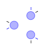
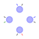
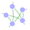
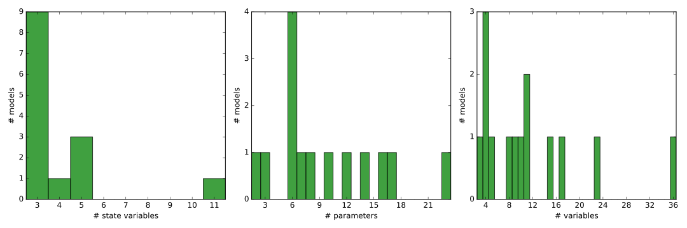
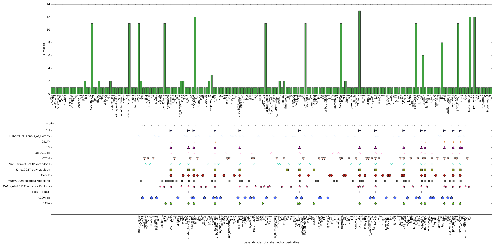
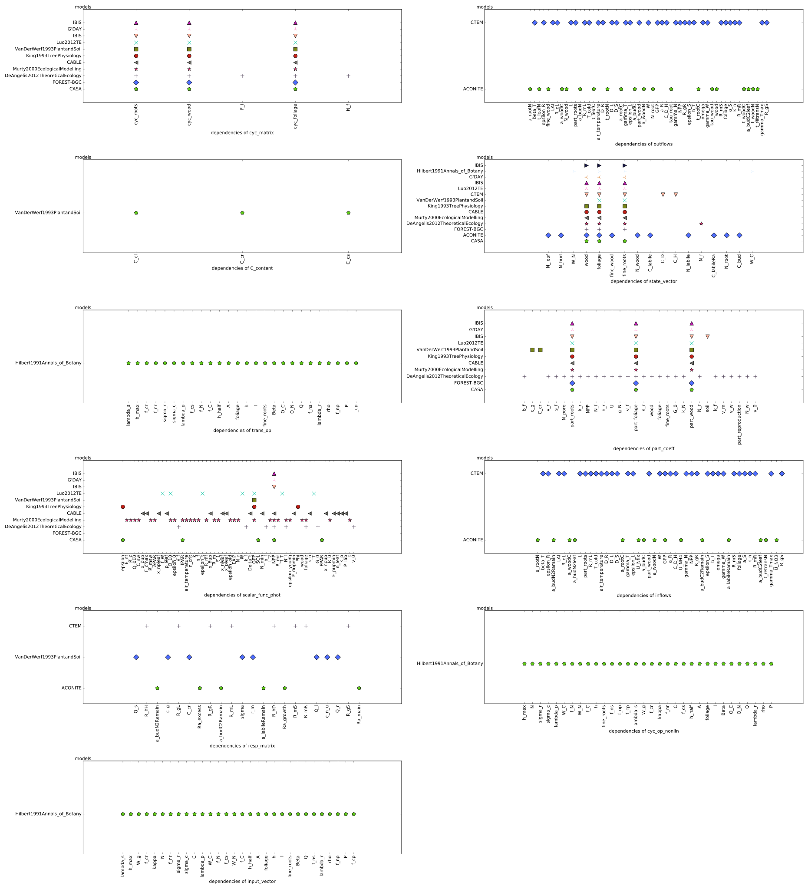
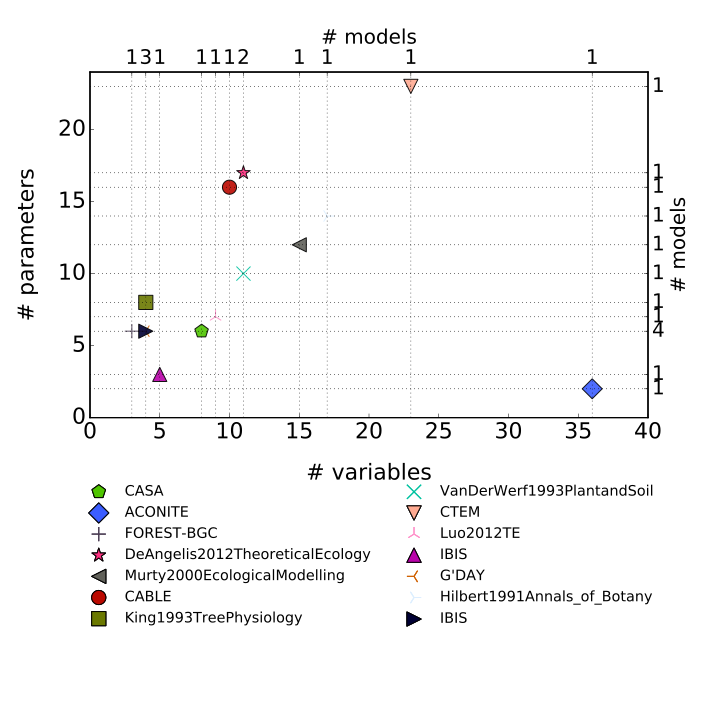
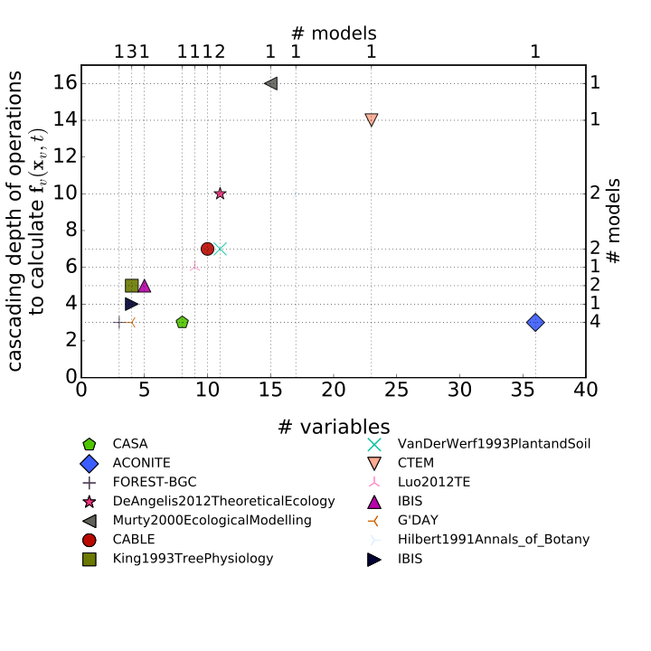
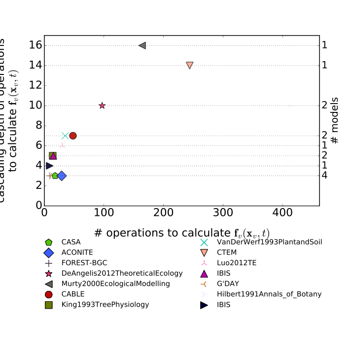
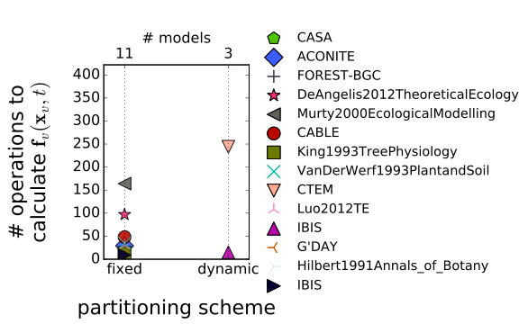

# Overview of the models

<table>
<thead><tr class="header">
<th></th><th align="left">Model</th>
<th align="center"># Variables</th>
<th align="center"># Parameters</th>
<th align="center"># Constants</th>
<th align="center">Structure</th>
<th align="center">Right hand side of ODE</th>
<th align="left">Source</th>
</tr>
</thead>
<tbody>
<tr class="even">
<td align="left"> </td><td align="left"><a href="Potter1993GlobalBiogeochemicalCycles-V0002/Report.html" target="_blank">CASA</a></td>
<td align="center" onclick="ausklappen('comp_table_0');ausklappen('rhs_0')">8</td>
<td align="center" onclick="ausklappen('comp_table_0');ausklappen('rhs_0')">6</td>
<td align="center" onclick="ausklappen('comp_table_0');ausklappen('rhs_0')"></td>
<td align="center" onclick="ausklappen('comp_table_0');ausklappen('rhs_0')">$f_{v}=u\cdot b+A\cdot x$

<table>
<tr class="header">
<th align="center">Component</th>
<th align="left">Description</th>
<th align="center">Expressions</th>
</tr>
</thead>
<tbody>
<tr>
<td align="center">$x$</td>
<td align="left">vector of states for vegetation</td>
<td align="center">$x=\left[\begin{matrix}C_{f}\\C_{r}\\C_{w}\end{matrix}\right]$</td>
</tr>
<tr>
<td align="center">$u$</td>
<td align="left">scalar function of photosynthetic inputs</td>
<td align="center">$u=NPP$</td>
</tr>
<tr>
<td align="center">$b$</td>
<td align="left">vector of partitioning coefficients of photosynthetically fixed carbon</td>
<td align="center">$b=\left[\begin{matrix}\alpha_{f}\\\alpha_{r}\\\alpha_{w}\end{matrix}\right]$</td>
</tr>
<tr>
<td align="center">$A$</td>
<td align="left">matrix of turnover (cycling) rates</td>
<td align="center">$A=\left[\begin{matrix}-\tau_{f} & 0 & 0\\0 & -\tau_{r} & 0\\0 & 0 & -\tau_{w}\end{matrix}\right]$</td>
</tr>
<tr>
<td align="center">$f_{v}$</td>
<td align="left">the righthandside of the ode</td>
<td align="center">$f_{v}=u\cdot b+A\cdot x$</td>
</tr>
</tbody>
</table>
</td>

<td align="center" style="vertical-align:middle" onclick="ausklappen('comp_table_0');ausklappen('rhs_0')">
$\left[\begin{matrix}- C_{f}\cdot\tau_{f} + 0.5\cdot FPAR\cdot SOL\cdot\alpha_{f}\cdot\epsilon\\- C_{r}\cdot\tau_{r} + 0.5\cdot FPAR\cdot SOL\cdot\alpha_{r}\cdot\epsilon\\- C_{w}\cdot\tau_{w} + 0.5\cdot FPAR\cdot SOL\cdot\alpha_{w}\cdot\epsilon\end{matrix}\right]$
</td>
<td align="left" onclick="ausklappen('comp_table_0');ausklappen('rhs_0')">@Potter1993GlobalBiogeochemicalCycles</td>
</tr>
<tbody>
<tr class="odd">
<td align="left"></td><td align="left"><a href="Thomas2014GeoscientificModelDevelopment-V0016/Report.html" target="_blank">ACONITE</a></td>
<td align="center" onclick="ausklappen('comp_table_1');ausklappen('rhs_1')">36</td>
<td align="center" onclick="ausklappen('comp_table_1');ausklappen('rhs_1')">2</td>
<td align="center" onclick="ausklappen('comp_table_1');ausklappen('rhs_1')"></td>
<td align="center" onclick="ausklappen('comp_table_1');ausklappen('rhs_1')">$f_{v}=I+O+R$

<table>
<tr class="header">
<th align="center">Component</th>
<th align="left">Description</th>
<th align="center">Expressions</th>
</tr>
</thead>
<tbody>
<tr>
<td align="center">$x$</td>
<td align="left">vector of states (C$_i$) for vegetation</td>
<td align="center">$x=\left[\begin{matrix}C_{leaf}\\C_{wood}\\C_{root}\\C_{labile}\\C_{bud}\\C_{labileRa}\\N_{leaf}\\N_{wood}\\N_{root}\\N_{labile}\\N_{bud}\end{matrix}\right]$</td>
</tr>
<tr>
<td align="center">$I$</td>
<td align="left">vector of fluxes into pool (C$_i$)</td>
<td align="center">$I=\left[\begin{matrix}a_{budC2leaf}\\a_{woodC}\\a_{rootC}\\GPP\\a_{budC}\\a_{budC2Ramain} + a_{labileRamain}\\a_{budN2leaf}\\a_{woodN}\\a_{rootN}\\U_{NH4} + U_{NO3} + U_{Nfix} + a_{budN2Ramain} + t_{retransN}\\a_{budN2leaf}\end{matrix}\right]$</td>
</tr>
<tr>
<td align="center">$O$</td>
<td align="left">vector of fluxes out of pool (C$_i$)</td>
<td align="center">$O=\left[\begin{matrix}- t_{leafC}\\- t_{woodC}\\- t_{rootC}\\- a_{budC} - a_{rootC} - a_{woodC}\\- a_{budC2leaf}\\0\\- t_{leafN} - t_{retransN}\\- t_{woodN}\\- t_{rootN}\\- a_{budN} - a_{rootN} - a_{woodN}\\0\end{matrix}\right]$</td>
</tr>
<tr>
<td align="center">$R$</td>
<td align="left">vector of respiration fluxes of pool (C$_i$)</td>
<td align="center">$R=\left[\begin{matrix}0\\0\\0\\- Ra_{excess} - Ra_{growth} - a_{labileRamain}\\- a_{budC2Ramain}\\- Ra_{main}\\0\\0\\0\\0\\- a_{budN2Ramain}\end{matrix}\right]$</td>
</tr>
<tr>
<td align="center">$f_{v}$</td>
<td align="left">the righthandside of the ode</td>
<td align="center">$f_{v}=I+O+R$</td>
</tr>
</tbody>
</table>
</td>

<td align="center" style="vertical-align:middle" onclick="ausklappen('comp_table_1');ausklappen('rhs_1')">
$\left[\begin{matrix}a_{budC2leaf} - t_{leafC}\\- C_{wood}\cdot\tau_{wood} + a_{woodC}\\- C_{root}\cdot\tau_{root} + a_{rootC}\\GPP - Ra_{excess} - Ra_{growth} - a_{budC} - a_{labileRamain} - a_{rootC} - a_{woodC}\\a_{budC} - a_{budC2Ramain} - a_{budC2leaf}\\- Ra_{main} + a_{budC2Ramain} + a_{labileRamain}\\a_{budN2leaf} - t_{leafN} - t_{retransN}\\- N_{wood}\cdot\tau_{wood} + a_{woodN}\\- N_{root}\cdot\tau_{root} + a_{rootN}\\U_{NH4} + U_{NO3} + U_{Nfix} - a_{budN} + a_{budN2Ramain} - a_{rootN} - a_{woodN} + t_{retransN}\\- a_{budN2Ramain} + a_{budN2leaf}\end{matrix}\right]$
</td>
<td align="left" onclick="ausklappen('comp_table_1');ausklappen('rhs_1')">@Thomas2014GeoscientificModelDevelopment</td>
</tr>
<tbody>
<tr class="even">
<td align="left"> </td><td align="left"><a href="Running1988EcologicalModelling-V0001/Report.html" target="_blank">FOREST-BGC</a></td>
<td align="center" onclick="ausklappen('comp_table_2');ausklappen('rhs_2')">3</td>
<td align="center" onclick="ausklappen('comp_table_2');ausklappen('rhs_2')">6</td>
<td align="center" onclick="ausklappen('comp_table_2');ausklappen('rhs_2')"></td>
<td align="center" onclick="ausklappen('comp_table_2');ausklappen('rhs_2')">$f_{v}=u\cdot b+A\cdot x$

<table>
<tr class="header">
<th align="center">Component</th>
<th align="left">Description</th>
<th align="center">Expressions</th>
</tr>
</thead>
<tbody>
<tr>
<td align="center">$x$</td>
<td align="left">vector of states for vegetation</td>
<td align="center">$x=\left[\begin{matrix}C_{f}\\C_{r}\\C_{w}\end{matrix}\right]$</td>
</tr>
<tr>
<td align="center">$u$</td>
<td align="left">scalar function of photosynthetic inputs</td>
<td align="center">-</td>
</tr>
<tr>
<td align="center">$b$</td>
<td align="left">vector of partitioning coefficients of photosynthetically fixed carbon</td>
<td align="center">$b=\left[\begin{matrix}\eta_{f}\\\eta_{r}\\\eta_{w}\end{matrix}\right]$</td>
</tr>
<tr>
<td align="center">$A$</td>
<td align="left">matrix of turnover (cycling) rates</td>
<td align="center">$A=\left[\begin{matrix}-\gamma_{f} & 0 & 0\\0 & -\gamma_{r} & 0\\0 & 0 & -\gamma_{w}\end{matrix}\right]$</td>
</tr>
<tr>
<td align="center">$f_{v}$</td>
<td align="left">the righthandside of the ode</td>
<td align="center">$f_{v}=u\cdot b+A\cdot x$</td>
</tr>
</tbody>
</table>
</td>

<td align="center" style="vertical-align:middle" onclick="ausklappen('comp_table_2');ausklappen('rhs_2')">
$\left[\begin{matrix}- C_{f}\cdot\gamma_{f} +\eta_{f}\cdot u\\- C_{r}\cdot\gamma_{r} +\eta_{r}\cdot u\\- C_{w}\cdot\gamma_{w} +\eta_{w}\cdot u\end{matrix}\right]$
</td>
<td align="left" onclick="ausklappen('comp_table_2');ausklappen('rhs_2')">@Running1988EcologicalModelling</td>
</tr>
<tbody>
<tr class="odd">
<td align="left"> </td><td align="left"><a href="DeAngelis2012TheoreticalEcology-V0012/Report.html" target="_blank">DeAngelis2012TheoreticalEcology</a></td>
<td align="center" onclick="ausklappen('comp_table_3');ausklappen('rhs_3')">11</td>
<td align="center" onclick="ausklappen('comp_table_3');ausklappen('rhs_3')">17</td>
<td align="center" onclick="ausklappen('comp_table_3');ausklappen('rhs_3')"></td>
<td align="center" onclick="ausklappen('comp_table_3');ausklappen('rhs_3')">$f_{v}=u\cdot b+A\cdot x$

<table>
<tr class="header">
<th align="center">Component</th>
<th align="left">Description</th>
<th align="center">Expressions</th>
</tr>
</thead>
<tbody>
<tr>
<td align="center">$x$</td>
<td align="left">vector of states for vegetation</td>
<td align="center">$x=\left[\begin{matrix}C_{f}\\C_{r}\\C_{w}\\N_{f}\end{matrix}\right]$</td>
</tr>
<tr>
<td align="center">$u$</td>
<td align="left">scalar function of photosynthetic inputs</td>
<td align="center">$u=G$</td>
</tr>
<tr>
<td align="center">$b$</td>
<td align="left">vector of partitioning coefficients of photosynthetically fixed carbon</td>
<td align="center">$b=\left[\begin{matrix}\eta_{f}\\\eta_{r}\\\eta_{w}\\-\eta_{m}\cdot v_{m} -\eta_{r}\cdot v_{r} -\eta_{w}\cdot v_{w} +\frac{U}{G}\end{matrix}\right]$</td>
</tr>
<tr>
<td align="center">$A$</td>
<td align="left">matrix of senescence (cycling) rates</td>
<td align="center">$A=\left[\begin{matrix}-\frac{F_{i}}{N_{f}} -\gamma_{f} & 0 & 0 & 0\\0 & -\gamma_{r} & 0 & 0\\0 & 0 & -\gamma_{w} & 0\\0 & 0 & 0 & -\frac{F_{i}}{N_{f}} -\gamma_{f}\end{matrix}\right]$</td>
</tr>
<tr>
<td align="center">$f_{v}$</td>
<td align="left">the righthandside of the ode</td>
<td align="center">$f_{v}=u\cdot b+A\cdot x$</td>
</tr>
</tbody>
</table>
</td>

<td align="center" style="vertical-align:middle" onclick="ausklappen('comp_table_3');ausklappen('rhs_3')">
$\left[\begin{matrix}C_{f}\cdot\left(-\frac{F_{i}}{N_{f}} -\gamma_{f}\right) +\frac{G_{0}\cdot N_{f}\cdot\eta_{f}}{C_{f}\cdot\left(v_{0} +\frac{N_{f}}{C_{f}}\right)}\cdot\left(1 - e^{- C_{f}\cdot b_{f}\cdot k_{f}}\right)\\- C_{r}\cdot\gamma_{r} +\frac{G_{0}\cdot N_{f}\cdot\eta_{r}}{C_{f}\cdot\left(v_{0} +\frac{N_{f}}{C_{f}}\right)}\cdot\left(1 - e^{- C_{f}\cdot b_{f}\cdot k_{f}}\right)\\- C_{w}\cdot\gamma_{w} +\frac{G_{0}\cdot N_{f}}{C_{f}\cdot\left(v_{0} +\frac{N_{f}}{C_{f}}\right)}\cdot\left(1 - e^{- C_{f}\cdot b_{f}\cdot k_{f}}\right)\cdot\left(\eta_{f}\cdot s_{f} +\eta_{r}\cdot s_{r}\right)\\N_{f}\cdot\left(-\frac{F_{i}}{N_{f}} -\gamma_{f}\right) +\frac{G_{0}\cdot N_{f}}{C_{f}\cdot\left(v_{0} +\frac{N_{f}}{C_{f}}\right)}\cdot\left(1 - e^{- C_{f}\cdot b_{f}\cdot k_{f}}\right)\cdot\left(\frac{C_{f}\cdot N_{pore}\cdot g_{N}\cdot\left(1 - e^{- C_{r}\cdot b_{r}\cdot k_{r}}\right)\cdot\left(v_{0} +\frac{N_{f}}{C_{f}}\right)}{G_{0}\cdot N_{f}\cdot\left(1 - e^{- C_{f}\cdot b_{f}\cdot k_{f}}\right)\cdot\left(N_{pore} + k_{N}\right)} -\eta_{m}\cdot v_{m} -\frac{N_{w}}{C_{w}}\cdot\left(\eta_{f}\cdot s_{f} +\eta_{r}\cdot s_{r}\right) -\frac{N_{r}}{C_{r}}\cdot\eta_{r}\right)\end{matrix}\right]$
</td>
<td align="left" onclick="ausklappen('comp_table_3');ausklappen('rhs_3')">@DeAngelis2012TheoreticalEcology</td>
</tr>
<tbody>
<tr class="even">
<td align="left"> </td><td align="left"><a href="Murty2000EcologicalModelling-V0013/Report.html" target="_blank">Murty2000EcologicalModelling</a></td>
<td align="center" onclick="ausklappen('comp_table_4');ausklappen('rhs_4')">15</td>
<td align="center" onclick="ausklappen('comp_table_4');ausklappen('rhs_4')">12</td>
<td align="center" onclick="ausklappen('comp_table_4');ausklappen('rhs_4')"></td>
<td align="center" onclick="ausklappen('comp_table_4');ausklappen('rhs_4')">$f_{v}=u\cdot b+A\cdot x$

<table>
<tr class="header">
<th align="center">Component</th>
<th align="left">Description</th>
<th align="center">Expressions</th>
</tr>
</thead>
<tbody>
<tr>
<td align="center">$x$</td>
<td align="left">vector of states for vegetation</td>
<td align="center">$x=\left[\begin{matrix}C_{f}\\C_{r}\\C_{w}\end{matrix}\right]$</td>
</tr>
<tr>
<td align="center">$u$</td>
<td align="left">scalar function of photosynthetic inputs</td>
<td align="center">$u=NPP$</td>
</tr>
<tr>
<td align="center">$b$</td>
<td align="left">vector of partitioning coefficients of photosynthetically fixed carbon</td>
<td align="center">$b=\left[\begin{matrix}a_{f}\\a_{r}\\a_{w}\end{matrix}\right]$</td>
</tr>
<tr>
<td align="center">$A$</td>
<td align="left">matrix of senescence (cycling) rates</td>
<td align="center">$A=\left[\begin{matrix}-\gamma_{f} & 0 & 0\\0 & -\gamma_{r} & 0\\0 & 0 & -\gamma_{w}\end{matrix}\right]$</td>
</tr>
<tr>
<td align="center">$f_{v}$</td>
<td align="left">the righthandside of the ode</td>
<td align="center">$f_{v}=u\cdot b+A\cdot x$</td>
</tr>
</tbody>
</table>
</td>

<td align="center" style="vertical-align:middle" onclick="ausklappen('comp_table_4');ausklappen('rhs_4')">
$\left[\begin{matrix}- C_{f}\cdot\gamma_{f} + a_{f}\cdot\left(- 0.0097236\cdot C_{w}^{0.77}\cdot Q_{010}^{\frac{T_{a}}{10}} + I_{0}\cdot\left(1 - e^{- C_{f}\cdot k\cdot\sigma}\right)\cdot\left(\begin{cases}\epsilon_{young} &\text{for}\: t{\leq} t_{1}\\\begin{cases}\epsilon_{young} -\frac{\left(-\epsilon_{old} +\epsilon_{young}\right)\cdot\left(t - t_{1}\right)}{- t_{1} + t_{2}} &\text{for}\: t_{1} < t\\\begin{cases}\epsilon_{young} -\frac{\left(-\epsilon_{old} +\epsilon_{young}\right)\cdot\left(t - t_{1}\right)}{- t_{1} + t_{2}} &\text{for}\: t < t_{2}\\\epsilon_{old} &\text{for}\: t{\geq} t_{2}\end{cases} &\text{otherwise}\end{cases} &\text{otherwise}\end{cases}\right)\cdot\begin{cases}\frac{\left(n_{crit} + 0.017\right)\cdot\left(1.84\cdot n_{f} - 0.01\right)}{\left(1.84\cdot n_{crit} - 0.01\right)\cdot\left(n_{f} + 0.017\right)} &\text{for}\: n_{f} < n_{crit}\\1 &\text{for}\: n_{f} > n_{crit}\end{cases} - 0.5\cdot N_{f}\cdot Q_{10}^{\frac{T_{a}}{10}}\cdot R_{0} - N_{r}\cdot Q_{10}^{\frac{T_{a}}{10}}\cdot R_{0} - R_{c}\right)\\- C_{r}\cdot\gamma_{r} + a_{r}\cdot\left(- 0.0097236\cdot C_{w}^{0.77}\cdot Q_{010}^{\frac{T_{a}}{10}} + I_{0}\cdot\left(1 - e^{- C_{f}\cdot k\cdot\sigma}\right)\cdot\left(\begin{cases}\epsilon_{young} &\text{for}\: t{\leq} t_{1}\\\begin{cases}\epsilon_{young} -\frac{\left(-\epsilon_{old} +\epsilon_{young}\right)\cdot\left(t - t_{1}\right)}{- t_{1} + t_{2}} &\text{for}\: t_{1} < t\\\begin{cases}\epsilon_{young} -\frac{\left(-\epsilon_{old} +\epsilon_{young}\right)\cdot\left(t - t_{1}\right)}{- t_{1} + t_{2}} &\text{for}\: t < t_{2}\\\epsilon_{old} &\text{for}\: t{\geq} t_{2}\end{cases} &\text{otherwise}\end{cases} &\text{otherwise}\end{cases}\right)\cdot\begin{cases}\frac{\left(n_{crit} + 0.017\right)\cdot\left(1.84\cdot n_{f} - 0.01\right)}{\left(1.84\cdot n_{crit} - 0.01\right)\cdot\left(n_{f} + 0.017\right)} &\text{for}\: n_{f} < n_{crit}\\1 &\text{for}\: n_{f} > n_{crit}\end{cases} - 0.5\cdot N_{f}\cdot Q_{10}^{\frac{T_{a}}{10}}\cdot R_{0} - N_{r}\cdot Q_{10}^{\frac{T_{a}}{10}}\cdot R_{0} - R_{c}\right)\\- C_{w}\cdot\gamma_{w} +\left(- a_{f} - a_{r} + 1\right)\cdot\left(- 0.0097236\cdot C_{w}^{0.77}\cdot Q_{010}^{\frac{T_{a}}{10}} + I_{0}\cdot\left(1 - e^{- C_{f}\cdot k\cdot\sigma}\right)\cdot\left(\begin{cases}\epsilon_{young} &\text{for}\: t{\leq} t_{1}\\\begin{cases}\epsilon_{young} -\frac{\left(-\epsilon_{old} +\epsilon_{young}\right)\cdot\left(t - t_{1}\right)}{- t_{1} + t_{2}} &\text{for}\: t_{1} < t\\\begin{cases}\epsilon_{young} -\frac{\left(-\epsilon_{old} +\epsilon_{young}\right)\cdot\left(t - t_{1}\right)}{- t_{1} + t_{2}} &\text{for}\: t < t_{2}\\\epsilon_{old} &\text{for}\: t{\geq} t_{2}\end{cases} &\text{otherwise}\end{cases} &\text{otherwise}\end{cases}\right)\cdot\begin{cases}\frac{\left(n_{crit} + 0.017\right)\cdot\left(1.84\cdot n_{f} - 0.01\right)}{\left(1.84\cdot n_{crit} - 0.01\right)\cdot\left(n_{f} + 0.017\right)} &\text{for}\: n_{f} < n_{crit}\\1 &\text{for}\: n_{f} > n_{crit}\end{cases} - 0.5\cdot N_{f}\cdot Q_{10}^{\frac{T_{a}}{10}}\cdot R_{0} - N_{r}\cdot Q_{10}^{\frac{T_{a}}{10}}\cdot R_{0} - R_{c}\right)\end{matrix}\right]$
</td>
<td align="left" onclick="ausklappen('comp_table_4');ausklappen('rhs_4')">@Murty2000EcologicalModelling</td>
</tr>
<tbody>
<tr class="odd">
<td align="left"> </td><td align="left"><a href="Wang2010Biogeosciences-V0011/Report.html" target="_blank">CABLE</a></td>
<td align="center" onclick="ausklappen('comp_table_5');ausklappen('rhs_5')">10</td>
<td align="center" onclick="ausklappen('comp_table_5');ausklappen('rhs_5')">16</td>
<td align="center" onclick="ausklappen('comp_table_5');ausklappen('rhs_5')"></td>
<td align="center" onclick="ausklappen('comp_table_5');ausklappen('rhs_5')">$f_{v}=u\cdot b+A\cdot x$

<table>
<tr class="header">
<th align="center">Component</th>
<th align="left">Description</th>
<th align="center">Expressions</th>
</tr>
</thead>
<tbody>
<tr>
<td align="center">$x$</td>
<td align="left">vector of states for vegetation</td>
<td align="center">$x=\left[\begin{matrix}C_{leaf}\\C_{root}\\C_{wood}\end{matrix}\right]$</td>
</tr>
<tr>
<td align="center">$u$</td>
<td align="left">scalar function of photosynthetic inputs</td>
<td align="center">$u=F_{c}$</td>
</tr>
<tr>
<td align="center">$b$</td>
<td align="left">vector of partitioning coefficients of photosynthetically fixed carbon</td>
<td align="center">$b=\left[\begin{matrix}a_{leaf}\\a_{root}\\a_{wood}\end{matrix}\right]$</td>
</tr>
<tr>
<td align="center">$A$</td>
<td align="left">matrix of turnover (cycling) rates</td>
<td align="center">$A=\left[\begin{matrix}-\mu_{leaf} & 0 & 0\\0 & -\mu_{root} & 0\\0 & 0 & -\mu_{wood}\end{matrix}\right]$</td>
</tr>
<tr>
<td align="center">$f_{v}$</td>
<td align="left">the righthandside of the ode</td>
<td align="center">$f_{v}=u\cdot b+A\cdot x$</td>
</tr>
</tbody>
</table>
</td>

<td align="center" style="vertical-align:middle" onclick="ausklappen('comp_table_5');ausklappen('rhs_5')">
$\left[\begin{matrix}- C_{leaf}\cdot\mu_{leaf} + F_{cmax}\cdot a_{leaf}\cdot\min\left(\frac{n_{leaf}}{k_{n} + n_{leaf}},\frac{p_{leaf}}{k_{p} + p_{leaf}}\right)\cdot\min\left(1,\frac{N_{min}}{\Delta_{t}\cdot F_{nupmin}},\frac{P_{lab}}{\Delta_{t}\cdot F_{pupmin}}\right)\\- C_{root}\cdot\mu_{root} + F_{cmax}\cdot a_{root}\cdot\min\left(\frac{n_{leaf}}{k_{n} + n_{leaf}},\frac{p_{leaf}}{k_{p} + p_{leaf}}\right)\cdot\min\left(1,\frac{N_{min}}{\Delta_{t}\cdot F_{nupmin}},\frac{P_{lab}}{\Delta_{t}\cdot F_{pupmin}}\right)\\- C_{wood}\cdot\mu_{wood} + F_{cmax}\cdot a_{wood}\cdot\min\left(\frac{n_{leaf}}{k_{n} + n_{leaf}},\frac{p_{leaf}}{k_{p} + p_{leaf}}\right)\cdot\min\left(1,\frac{N_{min}}{\Delta_{t}\cdot F_{nupmin}},\frac{P_{lab}}{\Delta_{t}\cdot F_{pupmin}}\right)\end{matrix}\right]$
</td>
<td align="left" onclick="ausklappen('comp_table_5');ausklappen('rhs_5')">@Wang2010Biogeosciences</td>
</tr>
<tbody>
<tr class="even">
<td align="left"> </td><td align="left"><a href="King1993TreePhysiology-V0005/Report.html" target="_blank">King1993TreePhysiology</a></td>
<td align="center" onclick="ausklappen('comp_table_6');ausklappen('rhs_6')">4</td>
<td align="center" onclick="ausklappen('comp_table_6');ausklappen('rhs_6')">8</td>
<td align="center" onclick="ausklappen('comp_table_6');ausklappen('rhs_6')"></td>
<td align="center" onclick="ausklappen('comp_table_6');ausklappen('rhs_6')">$f_{v}=u\cdot b+A\cdot x$

<table>
<tr class="header">
<th align="center">Component</th>
<th align="left">Description</th>
<th align="center">Expressions</th>
</tr>
</thead>
<tbody>
<tr>
<td align="center">$x$</td>
<td align="left">vector of states for vegetation</td>
<td align="center">$x=\left[\begin{matrix}F\\R\\W\end{matrix}\right]$</td>
</tr>
<tr>
<td align="center">$u$</td>
<td align="left">scalar function of photosynthetic inputs</td>
<td align="center">$u=G$</td>
</tr>
<tr>
<td align="center">$b$</td>
<td align="left">vector of partitioning coefficients of photosynthetically fixed carbon</td>
<td align="center">$b=\left[\begin{matrix}\eta_{f}\\\eta_{r}\\\eta_{w}\end{matrix}\right]$</td>
</tr>
<tr>
<td align="center">$A$</td>
<td align="left">matrix of turnover (cycling) rates</td>
<td align="center">$A=\left[\begin{matrix}-\gamma_{f} & 0 & 0\\0 & -\gamma_{r} & 0\\0 & 0 & -\gamma_{w}\end{matrix}\right]$</td>
</tr>
<tr>
<td align="center">$f_{v}$</td>
<td align="left">the righthandside of the ode</td>
<td align="center">$f_{v}=u\cdot b+A\cdot x$</td>
</tr>
</tbody>
</table>
</td>

<td align="center" style="vertical-align:middle" onclick="ausklappen('comp_table_6');ausklappen('rhs_6')">
$\left[\begin{matrix}- F\cdot\gamma_{f} +\Phi\cdot\epsilon\cdot\eta_{f}\\\Phi\cdot\epsilon\cdot\eta_{r} - R\cdot\gamma_{r}\\\Phi\cdot\epsilon\cdot\left(-\eta_{f} -\eta_{r} + 1\right) - W\cdot\gamma_{w}\end{matrix}\right]$
</td>
<td align="left" onclick="ausklappen('comp_table_6');ausklappen('rhs_6')">@King1993TreePhysiology</td>
</tr>
<tbody>
<tr class="odd">
<td align="left"> </td><td align="left"><a href="VanDerWerf1993PlantandSoil-V0006/Report.html" target="_blank">VanDerWerf1993PlantandSoil</a></td>
<td align="center" onclick="ausklappen('comp_table_7');ausklappen('rhs_7')">11</td>
<td align="center" onclick="ausklappen('comp_table_7');ausklappen('rhs_7')">10</td>
<td align="center" onclick="ausklappen('comp_table_7');ausklappen('rhs_7')"></td>
<td align="center" onclick="ausklappen('comp_table_7');ausklappen('rhs_7')">$f_{v}=u\cdot x_{0, 0} c b + A c x + R c x$

<table>
<tr class="header">
<th align="center">Component</th>
<th align="left">Description</th>
<th align="center">Expressions</th>
</tr>
</thead>
<tbody>
<tr>
<td align="center">$x$</td>
<td align="left">vector of states for vegetation</td>
<td align="center">$x=\left[\begin{matrix}W_{l}\\W_{s}\\W_{r}\end{matrix}\right]$</td>
</tr>
<tr>
<td align="center">$u$</td>
<td align="left">scalar function of photosynthetic inputs</td>
<td align="center">$u=\phi_{g}$</td>
</tr>
<tr>
<td align="center">$c$</td>
<td align="left">carbon contents per compartment</td>
<td align="center">$c=\left[\begin{matrix}\frac{1}{C_{cl}} & 0 & 0\\0 &\frac{1}{C_{cs}} & 0\\0 & 0 &\frac{1}{C_{cr}}\end{matrix}\right]$</td>
</tr>
<tr>
<td align="center">$R$</td>
<td align="left">vector of respiration rates</td>
<td align="center">$R=\left[\begin{matrix}- Q_{l} & 0 & 0\\0 & - Q_{s} & 0\\0 & 0 & - Q_{r}\end{matrix}\right]$</td>
</tr>
<tr>
<td align="center">$b$</td>
<td align="left">vector of partitioning coefficients of photosynthetically fixed carbon</td>
<td align="center">$b=\left[\begin{matrix}\alpha_{cl}\\\alpha_{cs}\\\frac{\alpha_{cr}}{1 +\frac{c_{g}}{C_{cr}}}\end{matrix}\right]$</td>
</tr>
<tr>
<td align="center">$A$</td>
<td align="left">matrix of turnover (cycling) rates</td>
<td align="center">$A=\left[\begin{matrix}-\gamma_{f} & 0 & 0\\0 & -\gamma_{r} & 0\\0 & 0 & -\gamma_{w}\end{matrix}\right]$</td>
</tr>
<tr>
<td align="center">$f_{v}$</td>
<td align="left">the righthandside of the ode</td>
<td align="center">$f_{v}=u\cdot x_{0, 0} c b + A c x + R c x$</td>
</tr>
</tbody>
</table>
</td>

<td align="center" style="vertical-align:middle" onclick="ausklappen('comp_table_7');ausklappen('rhs_7')">
$\left[\begin{matrix}-\frac{Q_{l}}{C_{cl}}\cdot W_{l} +\frac{W_{l}}{C_{cl}}\cdot\alpha_{cl}\cdot\phi_{g} -\frac{W_{l}}{C_{cl}}\cdot\gamma_{f}\\-\frac{Q_{s}}{C_{cs}}\cdot W_{s} +\frac{W_{l}}{C_{cs}}\cdot\alpha_{cs}\cdot\phi_{g} -\frac{W_{s}}{C_{cs}}\cdot\gamma_{r}\\\frac{W_{l}\cdot\alpha_{cr}\cdot\phi_{g}}{C_{cr}\cdot\left(1 +\frac{c_{g}}{C_{cr}}\right)} -\frac{W_{r}}{C_{cr}}\cdot\gamma_{w} -\frac{W_{r}\cdot\left(c_{n u}\cdot\sigma + r_{m}\right)}{C_{cr}\cdot\left(1 +\frac{c_{g}}{C_{cr}}\right)}\end{matrix}\right]$
</td>
<td align="left" onclick="ausklappen('comp_table_7');ausklappen('rhs_7')">@VanDerWerf1993PlantandSoil</td>
</tr>
<tbody>
<tr class="even">
<td align="left"></td><td align="left"><a href="Arora2005GlobalChangeBiology-V0007/Report.html" target="_blank">CTEM</a></td>
<td align="center" onclick="ausklappen('comp_table_8');ausklappen('rhs_8')">23</td>
<td align="center" onclick="ausklappen('comp_table_8');ausklappen('rhs_8')">23</td>
<td align="center" onclick="ausklappen('comp_table_8');ausklappen('rhs_8')"></td>
<td align="center" onclick="ausklappen('comp_table_8');ausklappen('rhs_8')">$f_{v}=I+O+R$

<table>
<tr class="header">
<th align="center">Component</th>
<th align="left">Description</th>
<th align="center">Expressions</th>
</tr>
</thead>
<tbody>
<tr>
<td align="center">$x$</td>
<td align="left">vector of states (C$_i$) for vegetation</td>
<td align="center">$x=\left[\begin{matrix}C_{L}\\C_{S}\\C_{R}\\C_{D}\\C_{H}\end{matrix}\right]$</td>
</tr>
<tr>
<td align="center">$I$</td>
<td align="left">vector of fluxes into pool (C$_i$)</td>
<td align="center">$I=\left[\begin{matrix}G\\A_{S}\\A_{R}\\D_{L} + D_{R} + D_{S}\\C_{D H}\end{matrix}\right]$</td>
</tr>
<tr>
<td align="center">$O$</td>
<td align="left">vector of fluxes out of pool (C$_i$)</td>
<td align="center">$O=\left[\begin{matrix}- A_{R} - A_{S} - D_{L}\\- D_{S}\\- D_{R}\\- C_{D H}\\0\end{matrix}\right]$</td>
</tr>
<tr>
<td align="center">$R$</td>
<td align="left">vector of respiration fluxes</td>
<td align="center">$R=\left[\begin{matrix}- R_{gL} - R_{mL}\\- R_{gS} - R_{mS}\\- R_{gR} - R_{mR}\\- R_{hD}\\- R_{hH}\end{matrix}\right]$</td>
</tr>
<tr>
<td align="center">$f_{v}$</td>
<td align="left">the righthandside of the ode</td>
<td align="center">$f_{v}=I+O+R$</td>
</tr>
</tbody>
</table>
</td>

<td align="center" style="vertical-align:middle" onclick="ausklappen('comp_table_8');ausklappen('rhs_8')">
$\left[\begin{matrix}- C_{L}\cdot\left(\gamma_{N} +\gamma_{Tmax}\cdot\left(-\begin{cases} 1 &\text{for}\: T_{air}{\geq} T_{cold}\\\begin{cases}\frac{T_{air}}{5} -\frac{T_{cold}}{5} - 1 &\text{for}\: T_{air} > T_{cold} - 5\\0 &\text{for}\: T_{air}{\leq} T_{cold} - 5\end{cases} &\text{for}\: T_{cold} > T_{air}\end{cases} + 1\right)^{b_{T}} +\gamma_{W}\right) + G - R_{gL} - R_{mL} -\begin{cases}\frac{G\cdot\left(\epsilon_{S} +\omega\cdot\left(1 - e^{- LAI\cdot k_{n}}\right)\right)}{\omega\cdot\left(- W + 2 - e^{- LAI\cdot k_{n}}\right) + 1} &\text{for}\: G - R_{gL} - R_{gR} - R_{gS} - R_{mL} - R_{mR} - R_{mS} < 0\\R_{gS} + R_{mS} +\frac{\left(\epsilon_{S} +\omega\cdot\left(1 - e^{- LAI\cdot k_{n}}\right)\right)\cdot\left(G - R_{gL} - R_{gR} - R_{gS} - R_{mL} - R_{mR} - R_{mS}\right)}{\omega\cdot\left(- W + 2 - e^{- LAI\cdot k_{n}}\right) + 1} &\text{for}\: G - R_{gL} - R_{gR} - R_{gS} - R_{mL} - R_{mR} - R_{mS} > 0\end{cases} -\begin{cases}\frac{G\cdot\left(-\epsilon_{L} -\epsilon_{S} +\omega\cdot\left(- W + 1\right) + 1\right)}{\omega\cdot\left(- W + 2 - e^{- LAI\cdot k_{n}}\right) + 1} &\text{for}\: G - R_{gL} - R_{gR} - R_{gS} - R_{mL} - R_{mR} - R_{mS} < 0\\R_{gR} + R_{mR} +\frac{1}{\omega\cdot\left(- W + 2 - e^{- LAI\cdot k_{n}}\right) + 1}\cdot\left(-\epsilon_{L} -\epsilon_{S} +\omega\cdot\left(- W + 1\right) + 1\right)\cdot\left(G - R_{gL} - R_{gR} - R_{gS} - R_{mL} - R_{mR} - R_{mS}\right) &\text{for}\: G - R_{gL} - R_{gR} - R_{gS} - R_{mL} - R_{mR} - R_{mS}{\geq} 0\end{cases}\\- D_{S} - R_{gS} - R_{mS} +\begin{cases}\frac{G\cdot\left(\epsilon_{S} +\omega\cdot\left(1 - e^{- LAI\cdot k_{n}}\right)\right)}{\omega\cdot\left(- W + 2 - e^{- LAI\cdot k_{n}}\right) + 1} &\text{for}\: G - R_{gL} - R_{gR} - R_{gS} - R_{mL} - R_{mR} - R_{mS} < 0\\R_{gS} + R_{mS} +\frac{\left(\epsilon_{S} +\omega\cdot\left(1 - e^{- LAI\cdot k_{n}}\right)\right)\cdot\left(G - R_{gL} - R_{gR} - R_{gS} - R_{mL} - R_{mR} - R_{mS}\right)}{\omega\cdot\left(- W + 2 - e^{- LAI\cdot k_{n}}\right) + 1} &\text{for}\: G - R_{gL} - R_{gR} - R_{gS} - R_{mL} - R_{mR} - R_{mS} > 0\end{cases}\\- D_{R} - R_{gR} - R_{mR} +\begin{cases}\frac{G\cdot\left(-\epsilon_{L} -\epsilon_{S} +\omega\cdot\left(- W + 1\right) + 1\right)}{\omega\cdot\left(- W + 2 - e^{- LAI\cdot k_{n}}\right) + 1} &\text{for}\: G - R_{gL} - R_{gR} - R_{gS} - R_{mL} - R_{mR} - R_{mS} < 0\\R_{gR} + R_{mR} +\frac{1}{\omega\cdot\left(- W + 2 - e^{- LAI\cdot k_{n}}\right) + 1}\cdot\left(-\epsilon_{L} -\epsilon_{S} +\omega\cdot\left(- W + 1\right) + 1\right)\cdot\left(G - R_{gL} - R_{gR} - R_{gS} - R_{mL} - R_{mR} - R_{mS}\right) &\text{for}\: G - R_{gL} - R_{gR} - R_{gS} - R_{mL} - R_{mR} - R_{mS}{\geq} 0\end{cases}\\- C_{D H} + C_{L}\cdot\left(\gamma_{N} +\gamma_{Tmax}\cdot\left(-\begin{cases} 1 &\text{for}\: T_{air}{\geq} T_{cold}\\\begin{cases}\frac{T_{air}}{5} -\frac{T_{cold}}{5} - 1 &\text{for}\: T_{air} > T_{cold} - 5\\0 &\text{for}\: T_{air}{\leq} T_{cold} - 5\end{cases} &\text{for}\: T_{cold} > T_{air}\end{cases} + 1\right)^{b_{T}} +\gamma_{W}\right) + D_{R} + D_{S} - R_{hD}\\C_{D H} - R_{hH}\end{matrix}\right]$
</td>
<td align="left" onclick="ausklappen('comp_table_8');ausklappen('rhs_8')">@Arora2005GlobalChangeBiology</td>
</tr>
<tbody>
<tr class="odd">
<td align="left"> </td><td align="left"><a href="Luo2012TE-V0015/Report.html" target="_blank">Luo2012TE</a></td>
<td align="center" onclick="ausklappen('comp_table_9');ausklappen('rhs_9')">9</td>
<td align="center" onclick="ausklappen('comp_table_9');ausklappen('rhs_9')">7</td>
<td align="center" onclick="ausklappen('comp_table_9');ausklappen('rhs_9')"></td>
<td align="center" onclick="ausklappen('comp_table_9');ausklappen('rhs_9')">$f_{v}=u\cdot b+A\cdot x$

<table>
<tr class="header">
<th align="center">Component</th>
<th align="left">Description</th>
<th align="center">Expressions</th>
</tr>
</thead>
<tbody>
<tr>
<td align="center">$x$</td>
<td align="left">vector of states for vegetation</td>
<td align="center">$x=\left[\begin{matrix}C_{f}\\C_{w}\\C_{r}\end{matrix}\right]$</td>
</tr>
<tr>
<td align="center">$u$</td>
<td align="left">scalar function of photosynthetic inputs</td>
<td align="center">$u=GPP\cdot \epsilon_{t}$</td>
</tr>
<tr>
<td align="center">$b$</td>
<td align="left">vector of partitioning coefficients of photosynthetically fixed carbon</td>
<td align="center">$b=\left[\begin{matrix}\eta_{f}\\\eta_{w}\\\eta_{r}\end{matrix}\right]$</td>
</tr>
<tr>
<td align="center">$A$</td>
<td align="left">matrix of turnover (cycling) rates</td>
<td align="center">$A=\left[\begin{matrix}-\gamma_{f} & 0 & 0\\0 & -\gamma_{w} & 0\\0 & 0 & -\gamma_{r}\end{matrix}\right]$</td>
</tr>
<tr>
<td align="center">$f_{v}$</td>
<td align="left">the righthandside of the ode</td>
<td align="center">$f_{v}=u\cdot b+A\cdot x$</td>
</tr>
</tbody>
</table>
</td>

<td align="center" style="vertical-align:middle" onclick="ausklappen('comp_table_9');ausklappen('rhs_9')">
$\left[\begin{matrix}- C_{f}\cdot\gamma_{f} + GPP\cdot Q_{10}^{\frac{T}{10} - 1}\cdot\eta_{f}\cdot\min\left(1, 0.5\cdot W\right)\\- C_{w}\cdot\gamma_{w} + GPP\cdot Q_{10}^{\frac{T}{10} - 1}\cdot\eta_{w}\cdot\min\left(1, 0.5\cdot W\right)\\- C_{r}\cdot\gamma_{r} + GPP\cdot Q_{10}^{\frac{T}{10} - 1}\cdot\eta_{r}\cdot\min\left(1, 0.5\cdot W\right)\end{matrix}\right]$
</td>
<td align="left" onclick="ausklappen('comp_table_9');ausklappen('rhs_9')">@Luo2012TE</td>
</tr>
<tbody>
<tr class="even">
<td align="left"> </td><td align="left"><a href="Castanho2013Biogeosciences-V0014/Report.html" target="_blank">IBIS</a></td>
<td align="center" onclick="ausklappen('comp_table_10');ausklappen('rhs_10')">5</td>
<td align="center" onclick="ausklappen('comp_table_10');ausklappen('rhs_10')">3</td>
<td align="center" onclick="ausklappen('comp_table_10');ausklappen('rhs_10')"></td>
<td align="center" onclick="ausklappen('comp_table_10');ausklappen('rhs_10')">$f_{v}=u\cdot b+A\cdot x$

<table>
<tr class="header">
<th align="center">Component</th>
<th align="left">Description</th>
<th align="center">Expressions</th>
</tr>
</thead>
<tbody>
<tr>
<td align="center">$x$</td>
<td align="left">vector of states for vegetation</td>
<td align="center">$x=\left[\begin{matrix}C_{il}\\C_{is}\\C_{ir}\end{matrix}\right]$</td>
</tr>
<tr>
<td align="center">$u$</td>
<td align="left">scalar function of photosynthetic inputs</td>
<td align="center">$u=NPP_{i}$</td>
</tr>
<tr>
<td align="center">$b$</td>
<td align="left">vector of partitioning coefficients of photosynthetically fixed carbon</td>
<td align="center">$b=\left[\begin{matrix}a_{il}\\a_{is}\\a_{ir}\end{matrix}\right]$</td>
</tr>
<tr>
<td align="center">$A$</td>
<td align="left">matrix of turnover (cycling) rates</td>
<td align="center">$A=\left[\begin{matrix}-\frac{1}{\tau_{il}} & 0 & 0\\0 & -\frac{1}{\tau_{is}} & 0\\0 & 0 & -\frac{1}{\tau_{ir}}\end{matrix}\right]$</td>
</tr>
<tr>
<td align="center">$f_{v}$</td>
<td align="left">the righthandside of the ode</td>
<td align="center">$f_{v}=u\cdot b+A\cdot x$</td>
</tr>
</tbody>
</table>
</td>

<td align="center" style="vertical-align:middle" onclick="ausklappen('comp_table_10');ausklappen('rhs_10')">
$\left[\begin{matrix}-\frac{C_{il}}{\tau_{il}} + NPP_{i}\cdot\left(- 0.0025\cdot S + 0.44\right)\\-\frac{C_{is}}{\tau_{is}} + NPP_{i}\cdot\left(- 0.0014\cdot S + 0.423\right)\\-\frac{C_{ir}}{\tau_{ir}} + NPP_{i}\cdot\left(0.0039\cdot S + 0.137\right)\end{matrix}\right]$
</td>
<td align="left" onclick="ausklappen('comp_table_10');ausklappen('rhs_10')">@Castanho2013Biogeosciences</td>
</tr>
<tbody>
<tr class="odd">
<td align="left"> </td><td align="left"><a href="Comins1993Ecological_Applications-V0009/Report.html" target="_blank">G'DAY</a></td>
<td align="center" onclick="ausklappen('comp_table_11');ausklappen('rhs_11')">4</td>
<td align="center" onclick="ausklappen('comp_table_11');ausklappen('rhs_11')">6</td>
<td align="center" onclick="ausklappen('comp_table_11');ausklappen('rhs_11')"></td>
<td align="center" onclick="ausklappen('comp_table_11');ausklappen('rhs_11')">$f_{v}=u\cdot b+A\cdot x$

<table>
<tr class="header">
<th align="center">Component</th>
<th align="left">Description</th>
<th align="center">Expressions</th>
</tr>
</thead>
<tbody>
<tr>
<td align="center">$x$</td>
<td align="left">vector of states for vegetation</td>
<td align="center">$x=\left[\begin{matrix}F\\R\\W\end{matrix}\right]$</td>
</tr>
<tr>
<td align="center">$u$</td>
<td align="left">scalar function of photosynthetic inputs</td>
<td align="center">$u=G$</td>
</tr>
<tr>
<td align="center">$b$</td>
<td align="left">vector of partitioning coefficients of photosynthetically fixed carbon</td>
<td align="center">$b=\left[\begin{matrix}\eta_{f}\\\eta_{r}\\\eta_{w}\end{matrix}\right]$</td>
</tr>
<tr>
<td align="center">$A$</td>
<td align="left">matrix of senescence (cycling) rates</td>
<td align="center">$A=\left[\begin{matrix}-\gamma_{f} & 0 & 0\\0 & -\gamma_{r} & 0\\0 & 0 & -\gamma_{w}\end{matrix}\right]$</td>
</tr>
<tr>
<td align="center">$f_{v}$</td>
<td align="left">the righthandside of the ode</td>
<td align="center">$f_{v}=u\cdot b+A\cdot x$</td>
</tr>
</tbody>
</table>
</td>

<td align="center" style="vertical-align:middle" onclick="ausklappen('comp_table_11');ausklappen('rhs_11')">
$\left[\begin{matrix}- F\cdot\gamma_{f} + G\cdot\eta_{f}\\G\cdot\eta_{r} - R\cdot\gamma_{r}\\G\cdot\eta_{w} - W\cdot\gamma_{w}\end{matrix}\right]$
</td>
<td align="left" onclick="ausklappen('comp_table_11');ausklappen('rhs_11')">@Comins1993Ecological_Applications</td>
</tr>
<tbody>
<tr class="even">
<td align="left"> </td><td align="left"><a href="Hilbert1991Annals_of_Botany-V0004/Report.html" target="_blank">Hilbert1991Annals_of_Botany</a></td>
<td align="center" onclick="ausklappen('comp_table_12');ausklappen('rhs_12')">17</td>
<td align="center" onclick="ausklappen('comp_table_12');ausklappen('rhs_12')">14</td>
<td align="center" onclick="ausklappen('comp_table_12');ausklappen('rhs_12')"></td>
<td align="center" onclick="ausklappen('comp_table_12');ausklappen('rhs_12')">$f_{v}=Inp+T\cdot N_{gm}\cdot x$

<table>
<tr class="header">
<th align="center">Component</th>
<th align="left">Description</th>
<th align="center">Expressions</th>
</tr>
</thead>
<tbody>
<tr>
<td align="center">$x$</td>
<td align="left">vector of states for vegetation</td>
<td align="center">$x=\left[\begin{matrix}W_{p}\\W_{s}\\W_{r}\\W_{C}\\W_{N}\end{matrix}\right]$</td>
</tr>
<tr>
<td align="center">$Inp$</td>
<td align="left">external inputs through photosysthesis and roots</td>
<td align="center">$Inp=\left[\begin{matrix}C\cdot N\cdot W_{p}\cdot\kappa\cdot\lambda_{p}\cdot\left(- f_{cp} - f_{np} + 1\right)\\C\cdot N\cdot W_{s}\cdot\kappa\cdot\lambda_{s}\cdot\left(- f_{cs} - f_{ns} + 1\right)\\C\cdot N\cdot W_{r}\cdot\kappa\cdot\lambda_{r}\cdot\left(- f_{cr} - f_{nr} + 1\right)\\A\cdot\sigma_{c}\\W_{r}\cdot\sigma_{r}\end{matrix}\right]$</td>
</tr>
<tr>
<td align="center">$T$</td>
<td align="left">-</td>
<td align="center">$T=\left[\begin{matrix}-1 & 0 & 0 &\frac{W_{p}}{O_{C}}\cdot f_{cp}\cdot\lambda_{p} &\frac{W_{p}}{O_{N}}\cdot f_{np}\cdot\lambda_{p}\\0 & -1 & 0 &\frac{W_{s}}{O_{C}}\cdot f_{cs}\cdot\lambda_{s} &\frac{W_{s}}{O_{N}}\cdot f_{ns}\cdot\lambda_{s}\\0 & 0 & -1 &\frac{W_{r}}{O_{C}}\cdot f_{cr}\cdot\lambda_{r} &\frac{W_{r}}{O_{N}}\cdot f_{nr}\cdot\lambda_{r}\\0 & 0 & 0 & -1 & 0\\0 & 0 & 0 & 0 & -1\end{matrix}\right]$</td>
</tr>
<tr>
<td align="center">$N_{gm}$</td>
<td align="left">-</td>
<td align="center">$N_{gm}=\left[\begin{matrix}0 & 0 & 0 & 0 & 0\\0 & 0 & 0 & 0 & 0\\0 & 0 & 0 & 0 & 0\\0 & 0 & 0 &\frac{N}{W_{g}}\cdot O_{C}\cdot\kappa & 0\\0 & 0 & 0 & 0 &\frac{C}{W_{g}}\cdot O_{N}\cdot\kappa\end{matrix}\right]$</td>
</tr>
<tr>
<td align="center">$f_{v}$</td>
<td align="left">the righthandside of the ode</td>
<td align="center">$f_{v}=Inp+T\cdot N_{gm}\cdot x$</td>
</tr>
</tbody>
</table>
</td>

<td align="center" style="vertical-align:middle" onclick="ausklappen('comp_table_12');ausklappen('rhs_12')">
$\left[\begin{matrix}\frac{I\cdot W_{C}\cdot W_{N}\cdot W_{p}\cdot W_{r}\cdot W_{s}\cdot f_{C}\cdot f_{cp}\cdot h_{max}\cdot\kappa\cdot\sigma_{c}\cdot\sigma_{r}}{f_{N}\cdot\rho\cdot\left(I + h_{half}\right)\cdot\left(W_{p} + W_{r} + W_{s}\right)^{2}\cdot\left(\frac{I\cdot W_{r}\cdot W_{s}\cdot f_{C}\cdot h_{max}\cdot\sigma_{c}\cdot\sigma_{r}}{f_{N}\cdot\rho\cdot\left(I + h_{half}\right)} + 1 +\frac{f_{N}}{B\cdot f_{C}}\right)} +\frac{I\cdot W_{C}\cdot W_{N}\cdot W_{p}\cdot W_{r}\cdot W_{s}\cdot f_{C}\cdot f_{np}\cdot h_{max}\cdot\kappa\cdot\sigma_{c}\cdot\sigma_{r}}{f_{N}\cdot\rho\cdot\left(I + h_{half}\right)\cdot\left(W_{p} + W_{r} + W_{s}\right)^{2}\cdot\left(\frac{I\cdot W_{r}\cdot W_{s}\cdot f_{C}\cdot h_{max}\cdot\sigma_{c}\cdot\sigma_{r}}{f_{N}\cdot\rho\cdot\left(I + h_{half}\right)} + 1 +\frac{f_{N}}{B\cdot f_{C}}\right)} +\frac{I\cdot W_{C}\cdot W_{N}\cdot W_{p}\cdot W_{r}\cdot W_{s}\cdot f_{C}\cdot h_{max}\cdot\kappa\cdot\sigma_{c}\cdot\sigma_{r}\cdot\left(- f_{cp} - f_{np} + 1\right)}{f_{N}\cdot\rho\cdot\left(I + h_{half}\right)\cdot\left(W_{p} + W_{r} + W_{s}\right)^{2}\cdot\left(\frac{I\cdot W_{r}\cdot W_{s}\cdot f_{C}\cdot h_{max}\cdot\sigma_{c}\cdot\sigma_{r}}{f_{N}\cdot\rho\cdot\left(I + h_{half}\right)} + 1 +\frac{f_{N}}{B\cdot f_{C}}\right)}\\\frac{W_{C}\cdot W_{N}\cdot W_{s}\cdot f_{N}\cdot f_{cs}\cdot\kappa}{B\cdot f_{C}\cdot\left(W_{p} + W_{r} + W_{s}\right)^{2}\cdot\left(\frac{I\cdot W_{r}\cdot W_{s}\cdot f_{C}\cdot h_{max}\cdot\sigma_{c}\cdot\sigma_{r}}{f_{N}\cdot\rho\cdot\left(I + h_{half}\right)} + 1 +\frac{f_{N}}{B\cdot f_{C}}\right)} +\frac{W_{C}\cdot W_{N}\cdot W_{s}\cdot f_{N}\cdot f_{ns}\cdot\kappa}{B\cdot f_{C}\cdot\left(W_{p} + W_{r} + W_{s}\right)^{2}\cdot\left(\frac{I\cdot W_{r}\cdot W_{s}\cdot f_{C}\cdot h_{max}\cdot\sigma_{c}\cdot\sigma_{r}}{f_{N}\cdot\rho\cdot\left(I + h_{half}\right)} + 1 +\frac{f_{N}}{B\cdot f_{C}}\right)} +\frac{W_{C}\cdot W_{N}\cdot W_{s}\cdot f_{N}\cdot\kappa\cdot\left(- f_{cs} - f_{ns} + 1\right)}{B\cdot f_{C}\cdot\left(W_{p} + W_{r} + W_{s}\right)^{2}\cdot\left(\frac{I\cdot W_{r}\cdot W_{s}\cdot f_{C}\cdot h_{max}\cdot\sigma_{c}\cdot\sigma_{r}}{f_{N}\cdot\rho\cdot\left(I + h_{half}\right)} + 1 +\frac{f_{N}}{B\cdot f_{C}}\right)}\\\frac{W_{C}\cdot W_{N}\cdot W_{r}\cdot f_{cr}\cdot\kappa}{\left(W_{p} + W_{r} + W_{s}\right)^{2}\cdot\left(\frac{I\cdot W_{r}\cdot W_{s}\cdot f_{C}\cdot h_{max}\cdot\sigma_{c}\cdot\sigma_{r}}{f_{N}\cdot\rho\cdot\left(I + h_{half}\right)} + 1 +\frac{f_{N}}{B\cdot f_{C}}\right)} +\frac{W_{C}\cdot W_{N}\cdot W_{r}\cdot f_{nr}\cdot\kappa}{\left(W_{p} + W_{r} + W_{s}\right)^{2}\cdot\left(\frac{I\cdot W_{r}\cdot W_{s}\cdot f_{C}\cdot h_{max}\cdot\sigma_{c}\cdot\sigma_{r}}{f_{N}\cdot\rho\cdot\left(I + h_{half}\right)} + 1 +\frac{f_{N}}{B\cdot f_{C}}\right)} +\frac{W_{C}\cdot W_{N}\cdot W_{r}\cdot\kappa\cdot\left(- f_{cr} - f_{nr} + 1\right)}{\left(W_{p} + W_{r} + W_{s}\right)^{2}\cdot\left(\frac{I\cdot W_{r}\cdot W_{s}\cdot f_{C}\cdot h_{max}\cdot\sigma_{c}\cdot\sigma_{r}}{f_{N}\cdot\rho\cdot\left(I + h_{half}\right)} + 1 +\frac{f_{N}}{B\cdot f_{C}}\right)}\\\frac{I\cdot W_{s}\cdot h_{max}\cdot\sigma_{c}}{\rho\cdot\left(I + h_{half}\right)} -\frac{W_{C}\cdot W_{N}\cdot\kappa}{\left(W_{p} + W_{r} + W_{s}\right)^{2}}\cdot\left(\frac{I\cdot W_{p}\cdot W_{r}\cdot W_{s}\cdot f_{C}\cdot f_{cp}\cdot h_{max}\cdot\sigma_{c}\cdot\sigma_{r}}{f_{N}\cdot\rho\cdot\left(I + h_{half}\right)\cdot\left(\frac{I\cdot W_{r}\cdot W_{s}\cdot f_{C}\cdot h_{max}\cdot\sigma_{c}\cdot\sigma_{r}}{f_{N}\cdot\rho\cdot\left(I + h_{half}\right)} + 1 +\frac{f_{N}}{B\cdot f_{C}}\right)} +\frac{W_{r}\cdot f_{cr}}{\frac{I\cdot W_{r}\cdot W_{s}\cdot f_{C}\cdot h_{max}\cdot\sigma_{c}\cdot\sigma_{r}}{f_{N}\cdot\rho\cdot\left(I + h_{half}\right)} + 1 +\frac{f_{N}}{B\cdot f_{C}}} +\frac{W_{s}\cdot f_{N}\cdot f_{cs}}{B\cdot f_{C}\cdot\left(\frac{I\cdot W_{r}\cdot W_{s}\cdot f_{C}\cdot h_{max}\cdot\sigma_{c}\cdot\sigma_{r}}{f_{N}\cdot\rho\cdot\left(I + h_{half}\right)} + 1 +\frac{f_{N}}{B\cdot f_{C}}\right)}\right)\\-\frac{W_{C}\cdot W_{N}\cdot\kappa}{\left(W_{p} + W_{r} + W_{s}\right)^{2}}\cdot\left(\frac{I\cdot W_{p}\cdot W_{r}\cdot W_{s}\cdot f_{C}\cdot f_{np}\cdot h_{max}\cdot\sigma_{c}\cdot\sigma_{r}}{f_{N}\cdot\rho\cdot\left(I + h_{half}\right)\cdot\left(\frac{I\cdot W_{r}\cdot W_{s}\cdot f_{C}\cdot h_{max}\cdot\sigma_{c}\cdot\sigma_{r}}{f_{N}\cdot\rho\cdot\left(I + h_{half}\right)} + 1 +\frac{f_{N}}{B\cdot f_{C}}\right)} +\frac{W_{r}\cdot f_{nr}}{\frac{I\cdot W_{r}\cdot W_{s}\cdot f_{C}\cdot h_{max}\cdot\sigma_{c}\cdot\sigma_{r}}{f_{N}\cdot\rho\cdot\left(I + h_{half}\right)} + 1 +\frac{f_{N}}{B\cdot f_{C}}} +\frac{W_{s}\cdot f_{N}\cdot f_{ns}}{B\cdot f_{C}\cdot\left(\frac{I\cdot W_{r}\cdot W_{s}\cdot f_{C}\cdot h_{max}\cdot\sigma_{c}\cdot\sigma_{r}}{f_{N}\cdot\rho\cdot\left(I + h_{half}\right)} + 1 +\frac{f_{N}}{B\cdot f_{C}}\right)}\right) + W_{r}\cdot\sigma_{r}\end{matrix}\right]$
</td>
<td align="left" onclick="ausklappen('comp_table_12');ausklappen('rhs_12')">@Hilbert1991Annals_of_Botany</td>
</tr>
<tbody>
<tr class="odd">
<td align="left"> </td><td align="left"><a href="Foley1996GlobalBiogeochemicalCycles-V0008/Report.html" target="_blank">IBIS</a></td>
<td align="center" onclick="ausklappen('comp_table_13');ausklappen('rhs_13')">4</td>
<td align="center" onclick="ausklappen('comp_table_13');ausklappen('rhs_13')">6</td>
<td align="center" onclick="ausklappen('comp_table_13');ausklappen('rhs_13')"></td>
<td align="center" onclick="ausklappen('comp_table_13');ausklappen('rhs_13')">$f_{v}=u\cdot b+A\cdot x$

<table>
<tr class="header">
<th align="center">Component</th>
<th align="left">Description</th>
<th align="center">Expressions</th>
</tr>
</thead>
<tbody>
<tr>
<td align="center">$x$</td>
<td align="left">vector of states for vegetation</td>
<td align="center">$x=\left[\begin{matrix}C_{il}\\C_{is}\\C_{ir}\end{matrix}\right]$</td>
</tr>
<tr>
<td align="center">$u$</td>
<td align="left">scalar function of photosynthetic inputs</td>
<td align="center">$u=NPP_{i}$</td>
</tr>
<tr>
<td align="center">$b$</td>
<td align="left">vector of partitioning coefficients of photosynthetically fixed carbon</td>
<td align="center">$b=\left[\begin{matrix}a_{il}\\a_{is}\\a_{ir}\end{matrix}\right]$</td>
</tr>
<tr>
<td align="center">$A$</td>
<td align="left">matrix of turnover (cycling) rates</td>
<td align="center">$A=\left[\begin{matrix}-\frac{1}{\tau_{il}} & 0 & 0\\0 & -\frac{1}{\tau_{is}} & 0\\0 & 0 & -\frac{1}{\tau_{ir}}\end{matrix}\right]$</td>
</tr>
<tr>
<td align="center">$f_{v}$</td>
<td align="left">the righthandside of the ode</td>
<td align="center">$f_{v}=u\cdot b+A\cdot x$</td>
</tr>
</tbody>
</table>
</td>

<td align="center" style="vertical-align:middle" onclick="ausklappen('comp_table_13');ausklappen('rhs_13')">
$\left[\begin{matrix}-\frac{C_{il}}{\tau_{il}} + NPP_{i}\cdot a_{il}\\-\frac{C_{is}}{\tau_{is}} + NPP_{i}\cdot a_{is}\\-\frac{C_{ir}}{\tau_{ir}} + NPP_{i}\cdot a_{ir}\end{matrix}\right]$
</td>
<td align="left" onclick="ausklappen('comp_table_13');ausklappen('rhs_13')">@Foley1996GlobalBiogeochemicalCycles</td>
</tr>
</tbody>
</table>

# Figures

 

 **Figure 1:** *Histograms, # variables* 

 

 **Figure 1a:** *dependency plots* 

 

 **Figure 1b:** *dependency plots* 

 

 **Figure 2:** *# variables & parameters* 

 

 **Figure 4:** *# variables & cascading depth of operations* 

 

 **Figure 5:** *cascading depth and # operations* 

 

 **Figure 6:** *Type of carbon partitioning scheme among pools and # operations* 

# Bibliography
