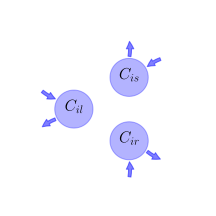
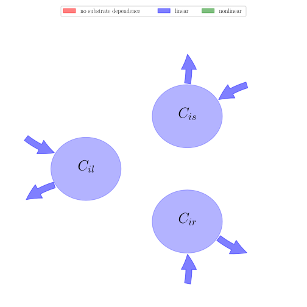

# General Overview

 

This report is the result of the use of the Python 3.4 package Sympy (for symbolic mathematics), as means to translate published models to a common language. It was created by Verónika Ceballos-Núñez (Orcid ID: 0000-0002-0046-1160) on 26/1/2016, and was last modified on _lm_.

## About the model
The model depicted in this document considers carbon allocation with a process based approach. It was originally described by @Foley1996GlobalBiogeochemicalCycles.  

### Abstract
Here we present a new terrestrial biosphere model (the Integrate BIosphere Simulator - IBIS) which demonstrates how land surface biophysics, terrestrial carson fluxes, and global vegetation dynamics can be represented in a single, physically consistent modeling framework. In order to integreate a wide range of biophysical, physiological, and ecological processes, the model is designed around a hierachical, modular structure and uses a common state description throughout. First a coupled simulation of the surface water, energy, and carbon fluxes is performed on hourly timesteps and is integrated over the year to estimate the annual water and carbon balance. Next, the annual carbon balance is used to predict changes in the leaf area index and biomass for each of nine plant functional types, which compete for light and water using different ecological strategies. The resulting patterns of annual evapotranspiration, runoff and net primary productivity are in good agreement with obeservations. I naddition, the model simulates patterns of vegetation dynamics that qualitatively agree with features of te natural processes of secondary succession. Comparison of the model's inferred near-equilibrium vegetation categories with a potential natural vegetation map shows a fair degree of agreement. This integrated modeling framework provides a means simulating both rapid biophysical processes and long-term ecosystem dynamics that can be directly incroporated within atmospheric models.

### Space Scale
global

### Available parameter values

Abbreviation|Source
:-----|:-----
Tropical evergreen trees|@Foley1996GlobalBiogeochemicalCycles

Table:  Information on given parameter sets

# State Variables
The following table contains the available information regarding this section:

Name|Description
:-----:|:-----
$C_{il}$|Carbon in leaves of plant functional type (PFT) i
$C_{is}$|Carbon in transport tissue (mainly stems) of PFT$_{i}$
$C_{ir}$|Carbon in fine roots of PFT$_{i}$

Table: Information on State Variables

# Photosynthesis And Respiration
The following table contains the available information regarding this section:

Name|Description|Expressions|Type|Units|Values    Tropical evergreen trees
:-----:|:-----|:-----:|:-----:|:-----:|:-----:
$t$|-|-|-|$s?$|-
$Q_{p}$|Flux density of photosynthetically acive radiation absorbed by the leaf|-|-|$Einstein\cdot m^{-2}\cdot s^{-1}$|-
$\alpha_{3}$|Intrinsic quantum efficiency for CO_2 uptake in C_3 plants|-|-|$mol CO_2\cdot Einstein^{-1}$|-
$\alpha_{4}$|-|-|-|-|-
$O_{2}$|Atmospheric [O_2] (value: 0.209)|-|-|$mol\cdot mol^{-1}$|-
$\tau$|Ratio of kinetic parameters decribing the partitioning of enzyme activity to carboxylase or oxygenase function|-|-|-|-
$\Gamma$|Gamma^* is the compensation point for gross photosynthesis|$\Gamma=\frac{O_{2}}{2\cdot \tau}$|-|$mol\cdot mol^{-1}$|-
$C_{i}$|[CO_2] in the intercellular air spaces of the leaf|-|-|$mol\cdot mol^{-1}$|-
$J_{e}$|Light-limited rate of photoynthesis|$J_{e}=\alpha_{3}\cdot Q_{p}\cdot \frac{C_{i}-\Gamma}{C_{i}+2\cdot \Gamma}$|-|-|-
$J_{e4}$|Rubisco-limited rate of photosynthesis (C4 plants)|$J_{e4}=V_{m}$|-|-|-
$V_{m}$|Maximum capacity of Rubisco to perform the carboxylase fuction|-|-|$mol CO_2\cdot m^{-2}\cdot s^{-1}$|-
$K_{c}$|Michaelis-Menten coefficient for CO_2|-|-|$mol\cdot mol^{-1}$|-
$K_{o}$|Michaelis-Menten coefficient for O_2|-|-|$mol\cdot mol^{-1}$|-
$J_{c}$|Rubisco-limited rate of photosynthesis|$J_{c}=\frac{V_{m}\cdot \left(C_{i}-\Gamma\right)}{C_{i}+K_{c}\cdot \left(1+\frac{O_{2}}{K_{o}}\right)}$|-|-|-
$k$|-|-|-|-|-
$J_{c4}$|CO_2-limited rate of photosynthesis at low [CO_2] (C4 plants)|$J_{c4}=k\cdot C_{i}$|-|-|-
$T$|Rate of triose phosphate utilization|$T=\frac{V_{m}}{8.2}$|-|-|-
$J_{p}$|see section 6a|-|-|-|-
$J_{s}$|Triose phosphate-limited rate of photosynthesis|$J_{s}=3\cdot T\cdot \left(1-\frac{\Gamma}{C_{i}}\right)+\frac{J_{p}\cdot \Gamma}{C_{i}}$|-|-|-
$J_{i}$|Light-limited rate of photosynthesis (C4 plants)|$J_{i}=\alpha_{4}\cdot Q_{p}$|-|-|-
$A_{g}$|Gross photosynthesis rate per unit of area|$A_{g}=\operatorname{Min}\left(J_{e}, J_{c}, J_{s}\right)$|-|$mol CO_2\cdot m^{-2}\cdot s^{-2}$|-
$\gamma$|Leaf respiration cost of Rubisco acivity|-|-|-|-
$B_{stem}$|Maintenance respiration coefficient defined at 15°C|-|-|-|-
$B_{root}$|Maintenance respiration coefficient defined at 15°C|-|-|-|-
$\lambda_{sapwood}$|Sapwood fraction of the total stem biomass (estimated from an assumed sap velocity and the maximum rate of transpiration experienced during the previous year)|-|-|-|-
$E_{0}$|Temperature sensitivity factor|-|-|-|-
$T_{0}$|Set to absolute zero (-273.16 °C)|-|-|-|-
$T_{stem}$|Stem temperature|-|-|$°C$|-
$T_{soil}$|Temperature of the soil in the rooting zone|-|-|$°C$|-
$fT_{stem}$|f(T) is the Arrenhius temperature function|$fT_{stem}=\operatorname{exp}\left(E_{0}\cdot \left(\frac{1}{15-T_{0}}-\frac{1}{T_{stem}-T_{0}}\right)\right)$|-|-|-
$fT_{soil}$|f(T) is the Arrenhius temperature function|$fT_{soil}=\operatorname{exp}\left(E_{0}\cdot \left(\frac{1}{15-T_{0}}-\frac{1}{T_{soil}-T_{0}}\right)\right)$|-|-|-
$R_{leaf}$|Leaf maintenance respiration|$R_{leaf}=\gamma\cdot V_{m}$|-|$mol CO_2\cdot m^{-2}\cdot s^{-1}$|-
$R_{stem}$|Stem maintenance respiration|$R_{stem}=B_{stem}\cdot \lambda_{sapwood}\cdot C_{is}\cdot fT_{stem}$|-|-|-
$R_{root}$|Root maintenance respiration|$R_{root}=B_{root}\cdot C_{ir}\cdot fT_{soil}$|-|-|-
$A_{n}$|Net leaf assimilation rate|$A_{n}=A_{g}-R_{leaf}$|-|$mol CO_2\cdot m^{-2}\cdot s^{-1}$|-
$GPP - i$|Gross primary productivity|$GPP_{i}=\operatorname{integrate}\left(A_{g}, t\right)$|-|-|-
$\eta$|Fraction of carbon lost in the construction of net plant material because of growth respiration (value 0.33)|-|-|-|-
$NPP_{i}$|Net Primary Production for PFT$_{i}$|$NPP_{i}=\left(1-\eta\right)\cdot \operatorname{integrate}\left(A_{g}-R_{leaf}-R_{stem}-R_{root}, t\right)$|variable|-|-

Table: Information on Photosynthesis And Respiration

# Allocation Coefficients
The following table contains the available information regarding this section:

Name|Description|Type|Values    Tropical evergreen trees
:-----:|:-----|:-----:|:-----:
$a_{il}$|Fraction of annual NPP allocated to leaves for PFT$_{i}$|parameter|$0.25$
$a_{is}$|Fraction of annual NPP allocated to stem for PFT$_{i}$|parameter|$0.5$
$a_{ir}$|Fraction of annual NPP allocated to roots for PFT$_{i}$|parameter|$0.25$

Table: Information on Allocation Coefficients

# Cycling Rates
The following table contains the available information regarding this section:

Name|Description|Type|Values    Tropical evergreen trees
:-----:|:-----|:-----:|:-----:
$\tau_{il}$|Residence time of carbon in leaves for PFT$_{i}$|parameter|-
$\tau_{is}$|Residence time of carbon in stem for PFT$_{i}$|parameter|-
$\tau_{ir}$|Residence time of carbon in roots for PFT$_{i}$|parameter|-

Table: Information on Cycling Rates

# Components
The following table contains the available information regarding this section:

Name|Description|Expressions
:-----:|:-----|:-----:
$x$|vector of states for vegetation|$x=\left[\begin{matrix}C_{il}\\C_{is}\\C_{ir}\end{matrix}\right]$
$u$|scalar function of photosynthetic inputs|$u=NPP_{i}$
$b$|vector of partitioning coefficients of photosynthetically fixed carbon|$b=\left[\begin{matrix}a_{il}\\a_{is}\\a_{ir}\end{matrix}\right]$
$A$|matrix of turnover (cycling) rates|$A=\left[\begin{matrix}-\frac{1}{\tau_{il}} & 0 & 0\\0 & -\frac{1}{\tau_{is}} & 0\\0 & 0 & -\frac{1}{\tau_{ir}}\end{matrix}\right]$
$f_{v}$|the righthandside of the ode|$f_{v}=u\cdot b+A\cdot x$

Table: Information on Components

## Pool model representation
<table><thead><tr><th></th><th>Flux description</th></tr></thead><tbody><tr><td align=center, style='vertical-align: middle'>
 

 **Figure 1:** *Pool model representation* 

</td><td align=left style='vertical-align: middle'>
#### Input fluxes
$C_{il}: a_{il}\cdot t\cdot\left(-\eta + 1\right)\cdot\left(- B_{root}\cdot C_{ir}\cdot e^{E_{0}\cdot\left(-\frac{1}{- T_{0} + T_{soil}} +\frac{1}{- T_{0} + 15}\right)} - B_{stem}\cdot C_{is}\cdot\lambda_{sapwood}\cdot e^{E_{0}\cdot\left(-\frac{1}{- T_{0} + T_{stem}} +\frac{1}{- T_{0} + 15}\right)} - V_{m}\cdot\gamma +\min\left(\frac{V_{m}\cdot\left(C_{i} -\frac{O_{2}}{2\cdot\tau}\right)}{C_{i} + K_{c}\cdot\left(1 +\frac{O_{2}}{K_{o}}\right)},\frac{Q_{p}\cdot\alpha_{3}}{C_{i} +\frac{O_{2}}{\tau}}\cdot\left(C_{i} -\frac{O_{2}}{2\cdot\tau}\right), 0.365853658536585\cdot V_{m}\cdot\left(1 -\frac{O_{2}}{2\cdot C_{i}\cdot\tau}\right) +\frac{J_{p}\cdot O_{2}}{2\cdot C_{i}\cdot\tau}\right)\right)$  $C_{is}: a_{is}\cdot t\cdot\left(-\eta + 1\right)\cdot\left(- B_{root}\cdot C_{ir}\cdot e^{E_{0}\cdot\left(-\frac{1}{- T_{0} + T_{soil}} +\frac{1}{- T_{0} + 15}\right)} - B_{stem}\cdot C_{is}\cdot\lambda_{sapwood}\cdot e^{E_{0}\cdot\left(-\frac{1}{- T_{0} + T_{stem}} +\frac{1}{- T_{0} + 15}\right)} - V_{m}\cdot\gamma +\min\left(\frac{V_{m}\cdot\left(C_{i} -\frac{O_{2}}{2\cdot\tau}\right)}{C_{i} + K_{c}\cdot\left(1 +\frac{O_{2}}{K_{o}}\right)},\frac{Q_{p}\cdot\alpha_{3}}{C_{i} +\frac{O_{2}}{\tau}}\cdot\left(C_{i} -\frac{O_{2}}{2\cdot\tau}\right), 0.365853658536585\cdot V_{m}\cdot\left(1 -\frac{O_{2}}{2\cdot C_{i}\cdot\tau}\right) +\frac{J_{p}\cdot O_{2}}{2\cdot C_{i}\cdot\tau}\right)\right)$  $C_{ir}: a_{ir}\cdot t\cdot\left(-\eta + 1\right)\cdot\left(- B_{root}\cdot C_{ir}\cdot e^{E_{0}\cdot\left(-\frac{1}{- T_{0} + T_{soil}} +\frac{1}{- T_{0} + 15}\right)} - B_{stem}\cdot C_{is}\cdot\lambda_{sapwood}\cdot e^{E_{0}\cdot\left(-\frac{1}{- T_{0} + T_{stem}} +\frac{1}{- T_{0} + 15}\right)} - V_{m}\cdot\gamma +\min\left(\frac{V_{m}\cdot\left(C_{i} -\frac{O_{2}}{2\cdot\tau}\right)}{C_{i} + K_{c}\cdot\left(1 +\frac{O_{2}}{K_{o}}\right)},\frac{Q_{p}\cdot\alpha_{3}}{C_{i} +\frac{O_{2}}{\tau}}\cdot\left(C_{i} -\frac{O_{2}}{2\cdot\tau}\right), 0.365853658536585\cdot V_{m}\cdot\left(1 -\frac{O_{2}}{2\cdot C_{i}\cdot\tau}\right) +\frac{J_{p}\cdot O_{2}}{2\cdot C_{i}\cdot\tau}\right)\right)$  

#### Output fluxes
$C_{il}: \frac{C_{il}}{\tau_{il}}$  $C_{is}: \frac{C_{is}}{\tau_{is}}$  $C_{ir}: \frac{C_{ir}}{\tau_{ir}}$  </td></tr></tbody></table>
## The right hand side of the ODE
$\left[\begin{matrix}-\frac{C_{il}}{\tau_{il}} + a_{il}\cdot t\cdot\left(-\eta + 1\right)\cdot\left(- B_{root}\cdot C_{ir}\cdot e^{E_{0}\cdot\left(-\frac{1}{- T_{0} + T_{soil}} +\frac{1}{- T_{0} + 15}\right)} - B_{stem}\cdot C_{is}\cdot\lambda_{sapwood}\cdot e^{E_{0}\cdot\left(-\frac{1}{- T_{0} + T_{stem}} +\frac{1}{- T_{0} + 15}\right)} - V_{m}\cdot\gamma +\min\left(\frac{V_{m}\cdot\left(C_{i} -\frac{O_{2}}{2\cdot\tau}\right)}{C_{i} + K_{c}\cdot\left(1 +\frac{O_{2}}{K_{o}}\right)},\frac{Q_{p}\cdot\alpha_{3}}{C_{i} +\frac{O_{2}}{\tau}}\cdot\left(C_{i} -\frac{O_{2}}{2\cdot\tau}\right), 0.365853658536585\cdot V_{m}\cdot\left(1 -\frac{O_{2}}{2\cdot C_{i}\cdot\tau}\right) +\frac{J_{p}\cdot O_{2}}{2\cdot C_{i}\cdot\tau}\right)\right)\\-\frac{C_{is}}{\tau_{is}} + a_{is}\cdot t\cdot\left(-\eta + 1\right)\cdot\left(- B_{root}\cdot C_{ir}\cdot e^{E_{0}\cdot\left(-\frac{1}{- T_{0} + T_{soil}} +\frac{1}{- T_{0} + 15}\right)} - B_{stem}\cdot C_{is}\cdot\lambda_{sapwood}\cdot e^{E_{0}\cdot\left(-\frac{1}{- T_{0} + T_{stem}} +\frac{1}{- T_{0} + 15}\right)} - V_{m}\cdot\gamma +\min\left(\frac{V_{m}\cdot\left(C_{i} -\frac{O_{2}}{2\cdot\tau}\right)}{C_{i} + K_{c}\cdot\left(1 +\frac{O_{2}}{K_{o}}\right)},\frac{Q_{p}\cdot\alpha_{3}}{C_{i} +\frac{O_{2}}{\tau}}\cdot\left(C_{i} -\frac{O_{2}}{2\cdot\tau}\right), 0.365853658536585\cdot V_{m}\cdot\left(1 -\frac{O_{2}}{2\cdot C_{i}\cdot\tau}\right) +\frac{J_{p}\cdot O_{2}}{2\cdot C_{i}\cdot\tau}\right)\right)\\-\frac{C_{ir}}{\tau_{ir}} + a_{ir}\cdot t\cdot\left(-\eta + 1\right)\cdot\left(- B_{root}\cdot C_{ir}\cdot e^{E_{0}\cdot\left(-\frac{1}{- T_{0} + T_{soil}} +\frac{1}{- T_{0} + 15}\right)} - B_{stem}\cdot C_{is}\cdot\lambda_{sapwood}\cdot e^{E_{0}\cdot\left(-\frac{1}{- T_{0} + T_{stem}} +\frac{1}{- T_{0} + 15}\right)} - V_{m}\cdot\gamma +\min\left(\frac{V_{m}\cdot\left(C_{i} -\frac{O_{2}}{2\cdot\tau}\right)}{C_{i} + K_{c}\cdot\left(1 +\frac{O_{2}}{K_{o}}\right)},\frac{Q_{p}\cdot\alpha_{3}}{C_{i} +\frac{O_{2}}{\tau}}\cdot\left(C_{i} -\frac{O_{2}}{2\cdot\tau}\right), 0.365853658536585\cdot V_{m}\cdot\left(1 -\frac{O_{2}}{2\cdot C_{i}\cdot\tau}\right) +\frac{J_{p}\cdot O_{2}}{2\cdot C_{i}\cdot\tau}\right)\right)\end{matrix}\right]$

## The Jacobian (derivative of the ODE w.r.t. state variables)
$\left[\begin{matrix}-\frac{1}{\tau_{il}} & - B_{stem}\cdot a_{il}\cdot\lambda_{sapwood}\cdot t\cdot\left(-\eta + 1\right)\cdot e^{E_{0}\cdot\left(-\frac{1}{- T_{0} + T_{stem}} +\frac{1}{- T_{0} + 15}\right)} & - B_{root}\cdot a_{il}\cdot t\cdot\left(-\eta + 1\right)\cdot e^{E_{0}\cdot\left(-\frac{1}{- T_{0} + T_{soil}} +\frac{1}{- T_{0} + 15}\right)}\\0 & - B_{stem}\cdot a_{is}\cdot\lambda_{sapwood}\cdot t\cdot\left(-\eta + 1\right)\cdot e^{E_{0}\cdot\left(-\frac{1}{- T_{0} + T_{stem}} +\frac{1}{- T_{0} + 15}\right)} -\frac{1}{\tau_{is}} & - B_{root}\cdot a_{is}\cdot t\cdot\left(-\eta + 1\right)\cdot e^{E_{0}\cdot\left(-\frac{1}{- T_{0} + T_{soil}} +\frac{1}{- T_{0} + 15}\right)}\\0 & - B_{stem}\cdot a_{ir}\cdot\lambda_{sapwood}\cdot t\cdot\left(-\eta + 1\right)\cdot e^{E_{0}\cdot\left(-\frac{1}{- T_{0} + T_{stem}} +\frac{1}{- T_{0} + 15}\right)} & - B_{root}\cdot a_{ir}\cdot t\cdot\left(-\eta + 1\right)\cdot e^{E_{0}\cdot\left(-\frac{1}{- T_{0} + T_{soil}} +\frac{1}{- T_{0} + 15}\right)} -\frac{1}{\tau_{ir}}\end{matrix}\right]$

# References
