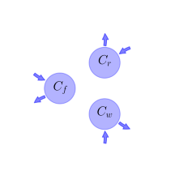
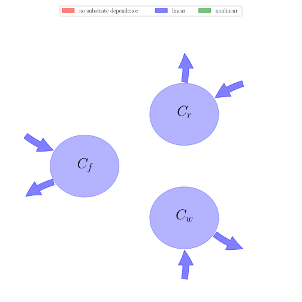

# General Overview

 

This report is the result of the use of the Python 3.4 package Sympy (for symbolic mathematics), as means to translate published models to a common language. It was created by Verónika Ceballos-Núñez (Orcid ID: 0000-0002-0046-1160) on 17/7/2015, and was last modified on _lm_.

## About the model
The model depicted in this document considers carbon allocation with a process based approach. It was originally described by @Potter1993GlobalBiogeochemicalCycles.  

### Abstract
This paper presents a modeling approach aimed at seasonal resolution of global climatic and edaphic controls on patterns of terrestrial ecosystem production and soil microbial respiration. We use satellite imagery (Advanced Very High Resolution Radiometer and International Satellite Cloud Climatology Project solar radiation), along with historical climate (monthly temperature and precipitation) and soil attributes (texture, C and N contents) from global (1-degrees) data sets as model inputs. The Carnegie-Ames-Stanford approach (CASA) Biosphere model runs on a monthly time interval to simulate seasonal patterns in net plant carbon fixation, biomass and nutrient allocation, litterfall, soil nitrogen mineralization, and microbial CO$_{2}$ production. The model estimate of global terrestrial net primary production is 48 Pg C yr$^{-1}$ with a maximum light use efficiency of 0.39 g C MJ$^{-1}$ PAR. Over 70% of terrestrial net production takes place between 30-degrees-N and 30-degrees-S latitude. Steady state pools of standing litter represent global storage of around 174 Pg C (94 and 80 Pg C in nonwoody and woody pools, respectively), whereas the pool of soil C in the top 0.3 m that is turning over on decadal time scales comprises 300 Pg C. Seasonal variations in atmospheric CO$_{2}$ concentrations from three stations in the Geophysical Monitoring for Climate Change Flask Sampling Network correlate significantly with estimated net ecosystem production values averaged over 50-degrees-80-degrees-N, 10-degrees-30-degrees-N, and 0-degrees-10-degrees-N.

### Space Scale
global

### Available parameter values

Abbreviation|Source
:-----|:-----
Original dataset of the publication|@Potter1993GlobalBiogeochemicalCycles
Tundra|@Potter1999BioScience
High-latitude forest|@Potter1999BioScience
Boreal coniferous forest|@Potter1999BioScience
Temperate grassland|@Potter1999BioScience
Mixed coniferous forest|@Potter1999BioScience
Temperate deciduous forest|@Potter1999BioScience
Desert and bare ground|@Potter1999BioScience
Semi-arid shrubland|@Potter1999BioScience
Savanna and woody grassland|@Potter1999BioScience
Tropical evergreen rain forest|@Potter1999BioScience

Table:  Information on given parameter sets

# State Variables
The following table contains the available information regarding this section:

Name|Description
:-----:|:-----
$C_{f}$|Carbon in foliage
$C_{r}$|Carbon in roots
$C_{w}$|Carbon in woody tissue

Table: Information on State Variables

# Photosynthetic Parameters
The following table contains the available information regarding this section:

Name|Description|Expressions|Type|Values    Original dataset of the publication|    Tundra|    High-latitude forest|    Boreal coniferous forest|    Temperate grassland|    Mixed coniferous forest|    Temperate deciduous forest|    Desert and bare ground|    Semi-arid shrubland|    Savanna and woody grassland|    Tropical evergreen rain forest
:-----:|:-----|:-----:|:-----:|:-----:|:-----:|:-----:|:-----:|:-----:|:-----:|:-----:|:-----:|:-----:|:-----:|:-----:
$SOL$|Total solar radiation (SOL(x,t))|-|variable|-|-|-|-|-|-|-|-|-|-|-
$FPAR$|Fraction of incoming PAR intercerpted by green vegetation (FPAR(x,t))|-|variable|-|-|-|-|-|-|-|-|-|-|-
$IPAR$|Intercepted photosynthetically active radiation(IPAR(x,t)). The factor of 0.5 accounts for the fact that approx. half of SOL is in PAR waveband (0.4-0.7 $\mu$m)|$IPAR=0.5\cdot SOL\cdot FPAR$|variable|-|-|-|-|-|-|-|-|-|-|-
$\epsilon$|PAR use efficiency ($\epsilon(x,t)$). Function that depends on effects of temperature and water stress|-|variable|-|-|-|-|-|-|-|-|-|-|-
$NPP$|New production of plant biomass (NPP(x,t)) at a grid cell ($x$) in month $t$|$NPP=IPAR\cdot \epsilon$|variable|-|-|-|-|-|-|-|-|-|-|-

Table: Information on Photosynthetic Parameters

# Allocation Coefficients
The following table contains the available information regarding this section:

Name|Description|Type|Values    Original dataset of the publication|    Tundra|    High-latitude forest|    Boreal coniferous forest|    Temperate grassland|    Mixed coniferous forest|    Temperate deciduous forest|    Desert and bare ground|    Semi-arid shrubland|    Savanna and woody grassland|    Tropical evergreen rain forest
:-----:|:-----|:-----:|:-----:|:-----:|:-----:|:-----:|:-----:|:-----:|:-----:|:-----:|:-----:|:-----:|:-----:
$\alpha_{f}$|Proportional allocation constant of available carbon allocated to foliage|parameter|$\frac{1}{3}$|$0.25$|$0.3$|$0.25$|$0.45$|$0.25$|$0.3$|$0.25$|$0.25$|$0.3$|$0.25$
$\alpha_{r}$|Proportional allocation constant of available carbon allocated to roots|parameter|$\frac{1}{3}$|$0.25$|$0.25$|$0.25$|$0.55$|$0.25$|$0.25$|$0.25$|$0.25$|$0.25$|$0.25$
$\alpha_{w}$|Proportional allocation constant of available carbon allocated to wood|parameter|$\frac{1}{3}$|$0.5$|$0.45$|$0.5$|-|$0.5$|$0.45$|$0.5$|$0.5$|$0.45$|$0.5$

Table: Information on Allocation Coefficients

# Cycling Rates
The following table contains the available information regarding this section:

Name|Description|Type|Units|Values    Original dataset of the publication|    Tundra|    High-latitude forest|    Boreal coniferous forest|    Temperate grassland|    Mixed coniferous forest|    Temperate deciduous forest|    Desert and bare ground|    Semi-arid shrubland|    Savanna and woody grassland|    Tropical evergreen rain forest
:-----:|:-----|:-----:|:-----:|:-----:|:-----:|:-----:|:-----:|:-----:|:-----:|:-----:|:-----:|:-----:|:-----:|:-----:
$\tau_{f}$|Residence time of carbon in foliage|parameter|$years$|-|$1.5$|$1$|$2.5$|$1.5$|$1.5$|$1$|$1.5$|$1.5$|$1$|$1.5$
$\tau_{r}$|Residence time of carbon in roots|parameter|$years$|-|$3$|$3$|$3$|$5$|$3$|$3$|$3$|$3$|$5$|$2$
$\tau_{w}$|Residence time of carbon in wood|parameter|$years$|-|$50$|$50$|$50$|-|$40$|$40$|$50$|$50$|$25$|$25$

Table: Information on Cycling Rates

# Components
The following table contains the available information regarding this section:

Name|Description|Expressions
:-----:|:-----|:-----:
$x$|vector of states for vegetation|$x=\left[\begin{matrix}C_{f}\\C_{r}\\C_{w}\end{matrix}\right]$
$u$|scalar function of photosynthetic inputs|$u=NPP$
$b$|vector of partitioning coefficients of photosynthetically fixed carbon|$b=\left[\begin{matrix}\alpha_{f}\\\alpha_{r}\\\alpha_{w}\end{matrix}\right]$
$A$|matrix of turnover (cycling) rates|$A=\left[\begin{matrix}-\tau_{f} & 0 & 0\\0 & -\tau_{r} & 0\\0 & 0 & -\tau_{w}\end{matrix}\right]$
$f_{v}$|the righthandside of the ode|$f_{v}=u\cdot b+A\cdot x$

Table: Information on Components

## Pool model representation
<table><thead><tr><th></th><th>Flux description</th></tr></thead><tbody><tr><td align=center, style='vertical-align: middle'>
 

 **Figure 1:** *Pool model representation* 

</td><td align=left style='vertical-align: middle'>
#### Input fluxes
$C_{f}: 0.5\cdot FPAR\cdot SOL\cdot\alpha_{f}\cdot\epsilon$  $C_{r}: 0.5\cdot FPAR\cdot SOL\cdot\alpha_{r}\cdot\epsilon$  $C_{w}: 0.5\cdot FPAR\cdot SOL\cdot\alpha_{w}\cdot\epsilon$  

#### Output fluxes
$C_{f}: C_{f}\cdot\tau_{f}$  $C_{r}: C_{r}\cdot\tau_{r}$  $C_{w}: C_{w}\cdot\tau_{w}$  </td></tr></tbody></table>
## The right hand side of the ODE
$\left[\begin{matrix}- C_{f}\cdot\tau_{f} + 0.5\cdot FPAR\cdot SOL\cdot\alpha_{f}\cdot\epsilon\\- C_{r}\cdot\tau_{r} + 0.5\cdot FPAR\cdot SOL\cdot\alpha_{r}\cdot\epsilon\\- C_{w}\cdot\tau_{w} + 0.5\cdot FPAR\cdot SOL\cdot\alpha_{w}\cdot\epsilon\end{matrix}\right]$

## The Jacobian (derivative of the ODE w.r.t. state variables)
$\left[\begin{matrix}-\tau_{f} & 0 & 0\\0 & -\tau_{r} & 0\\0 & 0 & -\tau_{w}\end{matrix}\right]$

## Steady state formulas
$C_{f} = \frac{0.5}{\tau_{f}}\cdot FPAR\cdot SOL\cdot\alpha_{f}\cdot\epsilon$  $C_{r} = \frac{0.5}{\tau_{r}}\cdot FPAR\cdot SOL\cdot\alpha_{r}\cdot\epsilon$  $C_{w} = \frac{0.5}{\tau_{w}}\cdot FPAR\cdot SOL\cdot\alpha_{w}\cdot\epsilon$    

## Steady states (potentially incomplete), according jacobian eigenvalues, damping ratio

### Parameter set: Original dataset of the publication
$C_f: \frac{0.166666666666667}{\tau_{f}}\cdot FPAR\cdot SOL\cdot\epsilon$, $C_r: \frac{0.166666666666667}{\tau_{r}}\cdot FPAR\cdot SOL\cdot\epsilon$, $C_w: \frac{0.166666666666667}{\tau_{w}}\cdot FPAR\cdot SOL\cdot\epsilon$    $\lambda_{1}: -\tau_{f}$  $\lambda_{2}: -\tau_{w}$  $\lambda_{3}: -\tau_{r}$  

### Parameter set: Tundra
$C_f: 0.0833333333333333\cdot FPAR\cdot SOL\cdot\epsilon$, $C_r: 0.0416666666666667\cdot FPAR\cdot SOL\cdot\epsilon$, $C_w: 0.005\cdot FPAR\cdot SOL\cdot\epsilon$    $\lambda_{1}: -1.500$  $\lambda_{2}: -3.000$  $\lambda_{3}: -50.000$  

### Parameter set: High-latitude forest
$C_f: 0.15\cdot FPAR\cdot SOL\cdot\epsilon$, $C_r: 0.0416666666666667\cdot FPAR\cdot SOL\cdot\epsilon$, $C_w: 0.0045\cdot FPAR\cdot SOL\cdot\epsilon$    $\lambda_{1}: -50.000$  $\lambda_{2}: -3.000$  $\lambda_{3}: -1.000$  

### Parameter set: Boreal coniferous forest
$C_f: 0.05\cdot FPAR\cdot SOL\cdot\epsilon$, $C_r: 0.0416666666666667\cdot FPAR\cdot SOL\cdot\epsilon$, $C_w: 0.005\cdot FPAR\cdot SOL\cdot\epsilon$    $\lambda_{1}: -2.500$  $\lambda_{2}: -3.000$  $\lambda_{3}: -50.000$  

### Parameter set: Temperate grassland
$C_f: 0.15\cdot FPAR\cdot SOL\cdot\epsilon$, $C_r: 0.055\cdot FPAR\cdot SOL\cdot\epsilon$, $C_w: \frac{0.5}{\tau_{w}}\cdot FPAR\cdot SOL\cdot\alpha_{w}\cdot\epsilon$    $\lambda_{1}: -1.5$  $\lambda_{2}: -\tau_{w}$  $\lambda_{3}: -5.0$  

### Parameter set: Mixed coniferous forest
$C_f: 0.0833333333333333\cdot FPAR\cdot SOL\cdot\epsilon$, $C_r: 0.0416666666666667\cdot FPAR\cdot SOL\cdot\epsilon$, $C_w: 0.00625\cdot FPAR\cdot SOL\cdot\epsilon$    $\lambda_{1}: -40.000$  $\lambda_{2}: -1.500$  $\lambda_{3}: -3.000$  

### Parameter set: Temperate deciduous forest
$C_f: 0.15\cdot FPAR\cdot SOL\cdot\epsilon$, $C_r: 0.0416666666666667\cdot FPAR\cdot SOL\cdot\epsilon$, $C_w: 0.005625\cdot FPAR\cdot SOL\cdot\epsilon$    $\lambda_{1}: -40.000$  $\lambda_{2}: -3.000$  $\lambda_{3}: -1.000$  

### Parameter set: Desert and bare ground
$C_f: 0.0833333333333333\cdot FPAR\cdot SOL\cdot\epsilon$, $C_r: 0.0416666666666667\cdot FPAR\cdot SOL\cdot\epsilon$, $C_w: 0.005\cdot FPAR\cdot SOL\cdot\epsilon$    $\lambda_{1}: -1.500$  $\lambda_{2}: -3.000$  $\lambda_{3}: -50.000$  

### Parameter set: Semi-arid shrubland
$C_f: 0.0833333333333333\cdot FPAR\cdot SOL\cdot\epsilon$, $C_r: 0.0416666666666667\cdot FPAR\cdot SOL\cdot\epsilon$, $C_w: 0.005\cdot FPAR\cdot SOL\cdot\epsilon$    $\lambda_{1}: -1.500$  $\lambda_{2}: -3.000$  $\lambda_{3}: -50.000$  

### Parameter set: Savanna and woody grassland
$C_f: 0.15\cdot FPAR\cdot SOL\cdot\epsilon$, $C_r: 0.025\cdot FPAR\cdot SOL\cdot\epsilon$, $C_w: 0.009\cdot FPAR\cdot SOL\cdot\epsilon$    $\lambda_{1}: -5.000$  $\lambda_{2}: -1.000$  $\lambda_{3}: -25.000$  

### Parameter set: Tropical evergreen rain forest
$C_f: 0.0833333333333333\cdot FPAR\cdot SOL\cdot\epsilon$, $C_r: 0.0625\cdot FPAR\cdot SOL\cdot\epsilon$, $C_w: 0.01\cdot FPAR\cdot SOL\cdot\epsilon$    $\lambda_{1}: -1.500$  $\lambda_{2}: -2.000$  $\lambda_{3}: -25.000$  

# References
