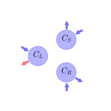
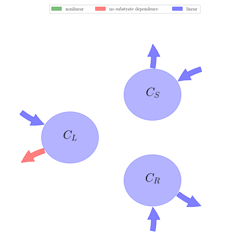

# General Overview

 

This report is the result of the use of the Python 3.4 package Sympy (for symbolic mathematics), as means to translate published models to a common language. It was created by Verónika Ceballos-Núñez (Orcid ID: 0000-0002-0046-1160) on 21/1/2016, and was last modified on _lm_.

## About the model
The model depicted in this document considers carbon allocation with a process based approach. It was originally described by @Arora2005GlobalChangeBiology.  

### Abstract
Leaf phenology remains one of the most difficult processes to parameterize in terrestrial ecosystem models because our understanding of the physical processes that initiate leaf onset and senescence is incomplete. While progress has been made at the molecular level, for example by identifying genes that are associated with senescence and flowering for selected plant species, a picture of the processes controlling leaf phenology is only beginning to emerge. A variety of empirical formulations have been used with varying degrees of success in terrestrial ecosystem models for both extratropical and tropical biomes. For instance, the use of growing degree-days (GDDs) to initiate leaf onset has received considerable recognition and this approach is used in a number of models. There are, however, limitations when using GDDs and other empirically based formulations in global transient climate change simulations. The phenology scheme developed for the Canadian Terrestrial Ecosystem Model (CTEM), designed for inclusion in the Canadian Centre for Climate Modelling and Analysis coupled general circulation model, is described. The representation of leaf phenology is general enough to be applied over the globe and sufficiently robust for use in transient climate change simulations. Leaf phenology is functionally related to the (possibly changing) climate state and to atmospheric composition rather than to geographical boundaries or controls implicitly based on current climate. In this approach, phenology is controlled by environmental conditions as they affect the carbon balance. A carbon-gain-based scheme initiates leaf onset when it is beneficial for the plant, in carbon terms, to produce new leaves. Leaf offset is initiated by unfavourable environmental conditions that incur carbon losses and these include shorter day length, cooler temperatures, and dry soil moisture conditions. The comparison of simulated leaf onset and offset times with observation-based estimates for temperate and boreal deciduous, tropical evergreen, and tropical deciduous plant functional types at selected locations indicates that the phenology scheme performs satisfactorily. Model simulated leaf area index and stem and root biomass are also compared with observational estimates to illustrate the performance of CTEM.

### Space Scale
global

### Available parameter values

Abbreviation|Description|Source
:-----|:-----|:-----
Original dataset of the publication|Eastern US and Germany, cold broadleaf deciduous|@Arora2005GlobalChangeBiology

Table:  Information on given parameter sets

# State Variables
The following table contains the available information regarding this section:

Name|Description|Units
:-----:|:-----|:-----:
$C_{L}$|Amount of carbon for the leaf|$kgC\cdot m^{-2}$
$C_{S}$|Amount of carbon for the stem|$kgC\cdot m^{-2}$
$C_{R}$|Amount of carbon for the root|$kgC\cdot m^{-2}$

Table: Information on State Variables

# Respiration Fluxes
The following table contains the available information regarding this section:

Name|Description|Type|Values    Original dataset of the publication
:-----:|:-----|:-----:|:-----:
$R_{gL}$|Growth respiration flux for the leaves|parameter|-
$R_{mL}$|Maintenance respiration flux for the leaves|parameter|-
$R_{gS}$|Growth respiration flux for the stem|parameter|-
$R_{mS}$|Maintenance respiration flux for the stem|parameter|-
$R_{gR}$|Growth respiration flux for the root|parameter|-
$R_{mR}$|Maintenance respiration flux for the root|parameter|-
$R_{hD}$|Heterotrophic respiration from litter (debris)|parameter|-
$R_{hH}$|Heterotrophic respiration from soil carbon (humus)|parameter|-

Table: Information on Respiration Fluxes

# Photosynthetic Parameters
The following table contains the available information regarding this section:

Name|Description|Expressions|Type|Values    Original dataset of the publication
:-----:|:-----|:-----:|:-----:|:-----:
$G$|Carbon gain via photosynthesis (Gross Primary Productivity, GPP)|-|variable|-
$N$|Net primary Productivity (NPP)|$N=G-\left(R_{gL}+R_{gS}+R_{gR}\right)-\left(R_{mL}+R_{mS}+R_{mR}\right)$|variable|-
$LAI$|Leaf Area Index|-|parameter|-
$k_{n}$|PFT-dependent light extinction coefficient|-|parameter|$0.5$
$L$|Light availability (scalar index between 0 and 1)|$L=\operatorname{exp}\left(- k_{n}\cdot LAI\right)$|variable|-

Table: Information on Photosynthetic Parameters

# Water Availability
The following table contains the available information regarding this section:

Name|Description|Expressions|Type|Values    Original dataset of the publication
:-----:|:-----|:-----:|:-----:|:-----:
$\theta_{i}$|Volumetric soil moisture content|-|variable|-
$\theta_{field}$|Field capacity|-|parameter|-
$\theta_{wilt}$|Wilting point|-|parameter|-
$W_{i}$|Availability of water in soil layer i. Weighted by the fraction of roots present in each soil layer|$W_{i}=\operatorname{Max}\left(0, \operatorname{Min}\left(1, \frac{\theta_{i}-\theta_{wilt}}{\theta_{field}-\theta_{wilt}}\right)\right)$|variable|-
$W$|Averaged soil water availability index|-|variable|-

Table: Information on Water Availability

# Allocation Fractions
The following table contains the available information regarding this section:

Name|Description|Expressions|Type|Values    Original dataset of the publication
:-----:|:-----|:-----:|:-----:|:-----:
$\epsilon_{L}$|PFT-dependent parameter for leaf|-|parameter|$0.35$
$\epsilon_{S}$|PFT-dependent parameter for stem|-|parameter|$0.1$
$\epsilon_{R}$|PFT-dependent parameter for root|$\epsilon_{R}=1-\epsilon_{L}-\epsilon_{S}$|parameter|$0.55$
$\omega$|PFT-dependent parameter|-|parameter|$0.8$
$a_{S}$|Stem allocation fraction|$a_{S}=\frac{\epsilon_{S}+\omega\cdot \left(1-L\right)}{1+\omega\cdot \left(2-L-W\right)}$|variable|-
$a_{R}$|Root allocation fration|$a_{R}=\frac{\epsilon_{R}+\omega\cdot \left(1-W\right)}{1+\omega\cdot \left(2-L-W\right)}$|variable|-
$a_{L}$|Leaf allocation fraction|$a_{L}=1-a_{S}-a_{R}$|variable|-

Table: Information on Allocation Fractions

# Allocation Coefficients
The following table contains the available information regarding this section:

Name|Description|Expressions|Type|Values    Original dataset of the publication
:-----:|:-----|:-----:|:-----:|:-----:
$A_{S}$|Amount of carbon allocated to the stem|$A_{S}=a_{S}\cdot G$|variable|-
$A_{R}$|Amount of carbon allocated to the root|$A_{R}=a_{R}\cdot G$|variable|-

Table: Information on Allocation Coefficients

# Temperature
The following table contains the available information regarding this section:

Name|Description|Expressions|Type|Units|Values    Original dataset of the publication
:-----:|:-----|:-----:|:-----:|:-----:|:-----:
$T_{air}$|Temperature of the air|-|variable|$°C$|-
$T_{cold}$|Cold temperature threshold for a PFT below which leaf loss begins to occur|-|parameter|$°C$|-
$b_{T}$|Parameter that describes sensitivity of leaf loss to temp. below the T$_{cold}$|-|parameter|-|-
$\beta_{T}$|Temperature measure (varies between 0 and 1)|$\beta_{T}=\begin{cases} 1 &\text{for}\: T_{air}{\geq} T_{cold}\\\begin{cases}\frac{T_{air}}{5} -\frac{T_{cold}}{5} - 1 &\text{for}\: T_{air} > T_{cold} - 5\\0 &\text{for}\: T_{air}{\leq} T_{cold} - 5\end{cases} &\text{for}\: T_{cold} > T_{air}\end{cases}$|variable|-|-

Table: Information on Temperature

# Cycling Rates
The following table contains the available information regarding this section:

Name|Description|Expressions|Type|Units|Values    Original dataset of the publication
:-----:|:-----|:-----:|:-----:|:-----:|:-----:
$\gamma_{N}$|Loss rate (normal turnover)|-|parameter|$day^{-1}$|-
$\gamma_{W}$|Loss rate under drought stress|-|parameter|$day^{-1}$|-
$\gamma_{Tmax}$|Maximum loss rate of specified PFT|-|parameter|-|-
$\gamma_{T}$|Loss rate under cold stress|$\gamma_{T}=\gamma_{Tmax}\cdot \left(1-\beta_{T}\right)^{b_{T}}$|variable|$day^{-1}$|-
$\gamma_{S}$|Stem turnover rate|-|parameter|$years$|-
$\gamma_{R}$|Root turnover rate|-|parameter|$years$|-

Table: Information on Cycling Rates

# Litter Fluxes
The following table contains the available information regarding this section:

Name|Description|Expressions|Type|Values    Original dataset of the publication
:-----:|:-----|:-----:|:-----:|:-----:
$D_{L}$|Litter loss from the leaves|$D_{L}=\left(\gamma_{N}+\gamma_{W}+\gamma_{T}\right)\cdot C_{L}$|variable|-
$D_{S}$|Litter loss from the stem|-|variable|-
$D_{R}$|Litter loss from the root|-|variable|-

Table: Information on Litter Fluxes

# Components
The following table contains the available information regarding this section:

Name|Description|Expressions
:-----:|:-----|:-----:
$x$|vector of states for vegetation|$x=\left[\begin{matrix}C_{L}\\C_{S}\\C_{R}\end{matrix}\right]$
$u$|scalar function of photosynthetic inputs|$u=G$
$b$|vector of partitioning coefficients of photosynthetically fixed carbon|$b=\left[\begin{matrix}1\\a_{S}\\a_{R}\end{matrix}\right]$
$A$|matrix of cycling rates|$A=\left[\begin{matrix}-\gamma_{N} -\gamma_{T} -\gamma_{W} +\frac{1}{C_{L}}\cdot\left(- A_{R} - A_{S} - R_{gL} - R_{mL}\right) & 0 & 0\\0 & - D_{S} - R_{gS} - R_{mS} & 0\\0 & 0 & - D_{R} - R_{gR} - R_{mR}\end{matrix}\right]$
$f_{v}$|the righthandside of the ode, for N < 0|$f_{v}=u\cdot b+A\cdot x$

Table: Information on Components

## Pool model representation
<table><thead><tr><th></th><th>Flux description</th></tr></thead><tbody><tr><td align=center, style='vertical-align: middle'>
 

 **Figure 1:** *Pool model representation* 

</td><td align=left style='vertical-align: middle'>
#### Input fluxes
$C_{L}: G$  $C_{S}: \frac{G\cdot\left(\epsilon_{S} +\omega\cdot\left(1 - e^{- LAI\cdot k_{n}}\right)\right)}{\omega\cdot\left(- W + 2 - e^{- LAI\cdot k_{n}}\right) + 1}$  $C_{R}: \frac{G\cdot\left(-\epsilon_{L} -\epsilon_{S} +\omega\cdot\left(- W + 1\right) + 1\right)}{\omega\cdot\left(- W + 2 - e^{- LAI\cdot k_{n}}\right) + 1}$  

#### Output fluxes
$C_{L}: C_{L}\cdot\left(\gamma_{N} +\gamma_{Tmax}\cdot\left(-\begin{cases} 1 &\text{for}\: T_{air}{\geq} T_{cold}\\\begin{cases}\frac{T_{air}}{5} -\frac{T_{cold}}{5} - 1 &\text{for}\: T_{air} > T_{cold} - 5\\0 &\text{for}\: T_{air}{\leq} T_{cold} - 5\end{cases} &\text{for}\: T_{cold} > T_{air}\end{cases} + 1\right)^{b_{T}} +\gamma_{W} +\frac{1}{C_{L}}\cdot\left(\frac{G\cdot\left(\epsilon_{S} +\omega\cdot\left(1 - e^{- LAI\cdot k_{n}}\right)\right)}{-\omega\cdot\left(W - 2 + e^{- LAI\cdot k_{n}}\right) + 1} -\frac{G\cdot\left(\epsilon_{L} +\epsilon_{S} -\omega\cdot\left(- W + 1\right) - 1\right)}{-\omega\cdot\left(W - 2 + e^{- LAI\cdot k_{n}}\right) + 1} + R_{gL} + R_{mL}\right)\right)$  $C_{S}: C_{S}\cdot\left(D_{S} + R_{gS} + R_{mS}\right)$  $C_{R}: C_{R}\cdot\left(D_{R} + R_{gR} + R_{mR}\right)$  </td></tr></tbody></table>
## The right hand side of the ODE
$\left[\begin{matrix}C_{L}\cdot\left(-\gamma_{N} -\gamma_{Tmax}\cdot\left(-\begin{cases} 1 &\text{for}\: T_{air}{\geq} T_{cold}\\\begin{cases}\frac{T_{air}}{5} -\frac{T_{cold}}{5} - 1 &\text{for}\: T_{air} > T_{cold} - 5\\0 &\text{for}\: T_{air}{\leq} T_{cold} - 5\end{cases} &\text{for}\: T_{cold} > T_{air}\end{cases} + 1\right)^{b_{T}} -\gamma_{W} +\frac{1}{C_{L}}\cdot\left(-\frac{G\cdot\left(\epsilon_{S} +\omega\cdot\left(1 - e^{- LAI\cdot k_{n}}\right)\right)}{\omega\cdot\left(- W + 2 - e^{- LAI\cdot k_{n}}\right) + 1} -\frac{G\cdot\left(-\epsilon_{L} -\epsilon_{S} +\omega\cdot\left(- W + 1\right) + 1\right)}{\omega\cdot\left(- W + 2 - e^{- LAI\cdot k_{n}}\right) + 1} - R_{gL} - R_{mL}\right)\right) + G\\C_{S}\cdot\left(- D_{S} - R_{gS} - R_{mS}\right) +\frac{G\cdot\left(\epsilon_{S} +\omega\cdot\left(1 - e^{- LAI\cdot k_{n}}\right)\right)}{\omega\cdot\left(- W + 2 - e^{- LAI\cdot k_{n}}\right) + 1}\\C_{R}\cdot\left(- D_{R} - R_{gR} - R_{mR}\right) +\frac{G\cdot\left(-\epsilon_{L} -\epsilon_{S} +\omega\cdot\left(- W + 1\right) + 1\right)}{\omega\cdot\left(- W + 2 - e^{- LAI\cdot k_{n}}\right) + 1}\end{matrix}\right]$

## The Jacobian (derivative of the ODE w.r.t. state variables)
$\left[\begin{matrix}-\gamma_{N} -\gamma_{Tmax}\cdot\left(-\begin{cases} 1 &\text{for}\: T_{air}{\geq} T_{cold}\\\begin{cases}\frac{T_{air}}{5} -\frac{T_{cold}}{5} - 1 &\text{for}\: T_{air} > T_{cold} - 5\\0 &\text{for}\: T_{air}{\leq} T_{cold} - 5\end{cases} &\text{for}\: T_{cold} > T_{air}\end{cases} + 1\right)^{b_{T}} -\gamma_{W} & 0 & 0\\0 & - D_{S} - R_{gS} - R_{mS} & 0\\0 & 0 & - D_{R} - R_{gR} - R_{mR}\end{matrix}\right]$

# References
