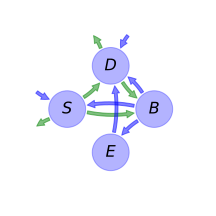
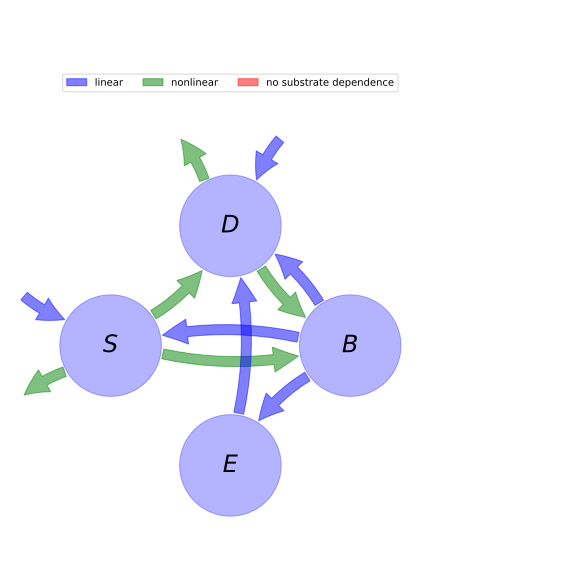

  
  
---
title: 'Report of the model: AWB, version: 1'
---
  
  
# General Overview  
  

 

This report presents a general overview of the model AWB , which is part of the Biogeochemistry Model Database BGC-MD.  The underlying yaml file entry that contains all the information of the model was created by Holger Metzler (Orcid ID: 0000-0002-8239-1601) on 17/03/2016. The entry was processed by the python package bgc-md to produce symbolic output.  
  
The model was originally described by @Allison2010NatureGeoscience.  
  
  
  
# Model description  
  
  
  
## State variables  
  
  
  
Name|Description|Unit  
:-----|:-----|:-----  
$S$|soil organic carbon pool|$mgC cm^{-3}$  
$D$|dissolved organic carbon pool|$mgC cm^{-3}$  
$B$|microbial biomass pool|$mgC cm^{-3}$  
$E$|enzyme pool|$mgC cm^{-3}$  
  Table: state_variables  
  
  
## Components of the compartmental system  
  
  
  
Name|Description|Expression  
:-----|:-----|:-----:  
$C$|carbon content|$C=\left[\begin{matrix}S\\D\\B\\E\end{matrix}\right]$  
$I$|input vector|$I=\left[\begin{matrix}I_{S}\\I_{D}\\0\\0\end{matrix}\right]$  
$T_{M}$|transition operator|$T_{M}=\left[\begin{matrix}-1 & 0 &\frac{a_{BS}\cdot r_{B}}{r_{B} + r_{E}} & 0\\1 & -1 &\frac{r_{B}\cdot\left(- a_{BS} + 1\right)}{r_{B} + r_{E}} & 1\\1 & E_{C} & -1 & 0\\0 & 0 &\frac{r_{E}}{r_{B} + r_{E}} & -1\end{matrix}\right]$  
$N$|decomposition operator|$N=\left[\begin{matrix}\frac{E\cdot V}{K + S} & 0 & 0 & 0\\0 &\frac{B\cdot V_{U}}{D + K_{U}} & 0 & 0\\0 & 0 & r_{B} + r_{E} & 0\\0 & 0 & 0 & r_{L}\end{matrix}\right]$  
$f_{s}$|the right hand side of the ode|$f_{s}=T_{M} N C + I$  
  Table: components  
  
  
## Pool model representation  
  

 

 **Figure 1:** *Pool model representation* 

  
  
#### Input fluxes  
  
$S: I_{S}$  
$D: I_{D}$  

  
  
#### Output fluxes  
  
$S: -\frac{E\cdot S\cdot V_{max}\cdot e^{-\frac{E_{a}}{0.008314\cdot T + 2.269722}}}{K_{0} + K_{s}\cdot T + S}$  
$D: -\frac{B\cdot D\cdot V_{Umax}\cdot e^{-\frac{E_{aU}}{0.008314\cdot T + 2.269722}}}{D + K_{U0} + K_{Us}\cdot T}\cdot\left(T\cdot\epsilon_{s} +\epsilon_{0} - 1\right)$  

  
  
#### Internal fluxes  
  
$S \rightarrow D: \frac{E\cdot S\cdot V_{max}\cdot e^{-\frac{E_{a}}{0.008314\cdot T + 2.269722}}}{K_{0} + K_{s}\cdot T + S}$  
$S \rightarrow B: \frac{E\cdot S\cdot V_{max}\cdot e^{-\frac{E_{a}}{0.008314\cdot T + 2.269722}}}{K_{0} + K_{s}\cdot T + S}$  
$D \rightarrow B: \frac{B\cdot D\cdot V_{Umax}\cdot e^{-\frac{E_{aU}}{0.008314\cdot T + 2.269722}}}{D + K_{U0} + K_{Us}\cdot T}\cdot\left(T\cdot\epsilon_{s} +\epsilon_{0}\right)$  
$B \rightarrow S: B\cdot a_{BS}\cdot r_{B}$  
$B \rightarrow D: B\cdot r_{B}\cdot\left(- a_{BS} + 1\right)$  
$B \rightarrow E: B\cdot r_{E}$  
$E \rightarrow D: E\cdot r_{L}$  
  
  
# References  
  
