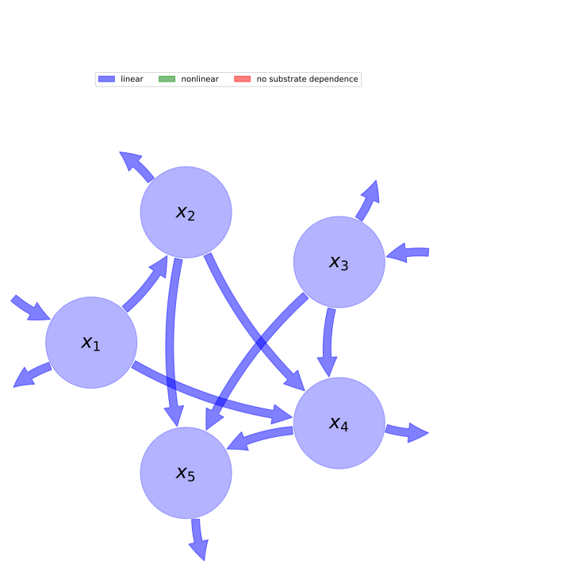

  
  
---
title: 'Report of the model: Emanuel1981, version: 1'
---
  
  
# General Overview  
  

 

This report presents a general overview of the model Emanuel1981 , which is part of the Biogeochemistry Model Database BGC-MD.  The underlying yaml file entry that contains all the information of the model was created by Carlos A. Sierra (Orcid ID: 0000-0003-0009-4169) on 12/9/2016. The entry was processed by the python package bgc-md to produce symbolic output.  
  
The model was originally described by @Emanuel1981.  
  
  
  
# Model description  
  
  
  
## State variables  
  
  
  
Name|Description  
:-----|:-----  
$x_{1}$|Non-woody tree parts  
$x_{2}$|Woody tree parts  
$x_{3}$|Ground vegetation  
$x_{4}$|Detritus/Decomposers  
$x_{5}$|Active soil carbon  
  Table: state_variables  
  
  
## Components of the compartmental system  
  
  
  
Name|Description|Expression  
:-----|:-----|:-----:  
$x$|vector of state variables|$x=\left[\begin{matrix}x_{1}\\x_{2}\\x_{3}\\x_{4}\\x_{5}\end{matrix}\right]$  
$u$|vector of photosynthetically fixed carbon|$u=\left[\begin{matrix}I_{1}\\0\\I_{3}\\0\\0\end{matrix}\right]$  
$B$|matrix of cycling rates|$B=\left[\begin{matrix}- F_{1} & 0 & 0 & 0 & 0\\F_{21} & - F_{2} & 0 & 0 & 0\\0 & 0 & - F_{3} & 0 & 0\\F_{41} & F_{42} & F_{43} & - F_{4} & 0\\0 & F_{52} & F_{53} & F_{54} & - F_{5}\end{matrix}\right]$  
$f_{v}$|the righthandside of the ode|$f_{v}=B x + u$  
  Table: components  
  
  
## Pool model representation  
  

 

 **Figure 1:** *Pool model representation* 

  
  
#### Input fluxes  
  
$x_{1}: I_{1}$  
$x_{3}: I_{3}$  

  
  
#### Output fluxes  
  
$x_{1}: x_{1}\cdot\left(F_{1} - F_{21} - F_{41}\right)$  
$x_{2}: x_{2}\cdot\left(F_{2} - F_{42} - F_{52}\right)$  
$x_{3}: x_{3}\cdot\left(F_{3} - F_{43} - F_{53}\right)$  
$x_{4}: x_{4}\cdot\left(F_{4} - F_{54}\right)$  
$x_{5}: F_{5}\cdot x_{5}$  

  
  
#### Internal fluxes  
  
$x_{1} \rightarrow x_{2}: F_{21}\cdot x_{1}$  
$x_{1} \rightarrow x_{4}: F_{41}\cdot x_{1}$  
$x_{2} \rightarrow x_{4}: F_{42}\cdot x_{2}$  
$x_{2} \rightarrow x_{5}: F_{52}\cdot x_{2}$  
$x_{3} \rightarrow x_{4}: F_{43}\cdot x_{3}$  
$x_{3} \rightarrow x_{5}: F_{53}\cdot x_{3}$  
$x_{4} \rightarrow x_{5}: F_{54}\cdot x_{4}$  
  
  
## Steady state formulas  
  
$x_1 = \frac{I_{1}}{F_{1}}$  
  
  
  
$x_2 = \frac{F_{21}\cdot I_{1}}{F_{1}\cdot F_{2}}$  
  
  
  
$x_3 = \frac{I_{3}}{F_{3}}$  
  
  
  
$x_4 = \frac{1}{F_{1}\cdot F_{2}\cdot F_{3}\cdot F_{4}}\cdot\left(F_{1}\cdot F_{2}\cdot F_{43}\cdot I_{3} + F_{3}\cdot I_{1}\cdot\left(F_{2}\cdot F_{41} + F_{21}\cdot F_{42}\right)\right)$  
  
  
  
$x_5 = \frac{1}{F_{1}\cdot F_{2}\cdot F_{3}\cdot F_{4}\cdot F_{5}}\cdot\left(F_{1}\cdot F_{2}\cdot I_{3}\cdot\left(F_{4}\cdot F_{53} + F_{43}\cdot F_{54}\right) + F_{3}\cdot I_{1}\cdot\left(F_{2}\cdot F_{41}\cdot F_{54} + F_{21}\cdot F_{4}\cdot F_{52} + F_{21}\cdot F_{42}\cdot F_{54}\right)\right)$  
  
  
  
  
  
# References  
  
