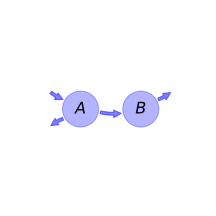
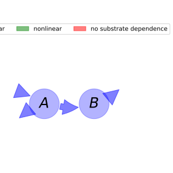

  
  
---
title: 'Report of the model: Henin and Dupois, version: 1'
---
  
  
# General Overview  
  

 

This report presents a general overview of the model Henin and Dupois , which is part of the Biogeochemistry Model Database BGC-MD.  The underlying yaml file entry that contains all the information of the model was created by Holger Metzler (Orcid ID: 0000-0002-8239-1601) on 09/03/2016. The entry was processed by the python package bgc-md to produce symbolic output.  
  
The model was originally described by @Henin1945Annalesagronomiques.  
  
  
  
# Model description  
  
  
  
## State variables  
  
  
  
Name|Description|Unit  
:-----|:-----|:-----  
$A$|labile pool|$MgC\cdot ha^{-1}$  
$B$|stable pool|$MgC\cdot ha^{-1}$  
  Table: state_variables  
  
  
## Components of the compartmental system  
  
  
  
Name|Description|Expression  
:-----|:-----|:-----:  
$C$|carbon content|$C=\left[\begin{matrix}A\\B\end{matrix}\right]$  
$I$|input vector|$I=\left[\begin{matrix}m\\0\end{matrix}\right]$  
$A_{GeM}$|decomposition operator|$A_{GeM}=\left[\begin{matrix}-\alpha & 0\\K\cdot\alpha & -\beta\end{matrix}\right]$  
$f_{s}$|the right hand side of the ode|$f_{s}=A_{GeM} C + I$  
  Table: components  
  
  
## Pool model representation  
  

 

 **Figure 1:** *Pool model representation* 

  
  
#### Input fluxes  
  
$A: m$  

  
  
#### Output fluxes  
  
$A: A\cdot\alpha\cdot\left(- K + 1\right)$  
$B: B\cdot\beta$  

  
  
#### Internal fluxes  
  
$A \rightarrow B: A\cdot K\cdot\alpha$  
  
  
## Steady state formulas  
  
$A = \frac{m}{\alpha}$  
  
  
  
$B = \frac{K}{\beta}\cdot m$  
  
  
  
  
  
# References  
  
