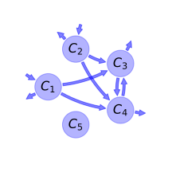
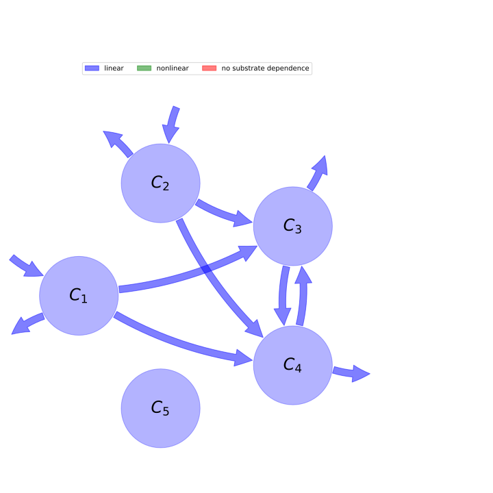

  
  
---
title: 'Report of the model: RothC-26.3, version: 1'
---
  
  
# General Overview  
  

 

This report presents a general overview of the model RothC-26.3 , which is part of the Biogeochemistry Model Database BGC-MD.  The underlying yaml file entry that contains all the information of the model was created by Holger Metzler (Orcid ID: 0000-0002-8239-1601) on 10/03/2016. The entry was processed by the python package bgc-md to produce symbolic output.  
  
The model was originally described by @Jenkinson1977SoilScience.  
  
  
  
### Space Scale  
  
plot, field, catchment, regional, national, global
  
  
# Model description  
  
  
  
## State variables  
  
  
  
Name|Description|Unit  
:-----|:-----|:-----  
$C_{1}$|decomposable plant material pool (DPM)|$t C\cdot ha^{-1}$  
$C_{2}$|resistant plant material pool (RPM)|$t C\cdot ha^{-1}$  
$C_{3}$|microbial biomass pool (BIO)|$t C\cdot ha^{-1}$  
$C_{4}$|humified organic matter pool (HUM)|$t C\cdot ha^{-1}$  
$C_{5}$|inert organic matter pool (IOM)|$t C\cdot ha^{-1}$  
  Table: state_variables  
  
  
## Components of the compartmental system  
  
  
  
Name|Description|Expression  
:-----|:-----|:-----:  
$C$|carbon content|$C=\left[\begin{matrix}C_{1}\\C_{2}\\C_{3}\\C_{4}\\C_{5}\end{matrix}\right]$  
$I$|input vector|$I=\left[\begin{matrix}J\cdot\gamma\\J\cdot\left(-\gamma + 1\right)\\0\\0\\0\end{matrix}\right]$  
$\xi$|environmental effects multiplier|$\xi=f_{T}\cdot f_{W}$  
$A$|decomposition operator|$A=\left[\begin{matrix}- k_{1} & 0 & 0 & 0 & 0\\0 & - k_{2} & 0 & 0 & 0\\a\cdot k_{1} & a\cdot k_{2} & a\cdot k_{3} - k_{3} & a\cdot k_{4} & 0\\b\cdot k_{1} & b\cdot k_{2} & b\cdot k_{3} & b\cdot k_{4} - k_{4} & 0\\0 & 0 & 0 & 0 & 0\end{matrix}\right]$  
$f_{s}$|the right hand side of the ode|$f_{s}=\xi A C + I$  
  Table: components  
  
  
## Pool model representation  
  

 

 **Figure 1:** *Pool model representation* 

  
  
#### Input fluxes  
  
$C_{1}: \frac{DR\cdot J}{DR + 1}$  
$C_{2}: J\cdot\left(-\frac{DR}{DR + 1} + 1\right)$  

  
  
#### Output fluxes  
  
$C_{1}: \frac{C_{1}\cdot f_{T}\cdot f_{W}\cdot k_{1}}{4.0895\cdot e^{0.0786\cdot pClay} + 2.672}\cdot\left(3.0895\cdot e^{0.0786\cdot pClay} + 2.672\right)$  
$C_{2}: \frac{C_{2}\cdot f_{T}\cdot f_{W}\cdot k_{2}}{4.0895\cdot e^{0.0786\cdot pClay} + 2.672}\cdot\left(3.0895\cdot e^{0.0786\cdot pClay} + 2.672\right)$  
$C_{3}: \frac{1.0\cdot C_{3}\cdot f_{T}\cdot f_{W}\cdot k_{3}}{4.0895\cdot e^{0.0786\cdot pClay} + 2.672}\cdot\left(3.0895\cdot e^{0.0786\cdot pClay} + 2.672\right)$  
$C_{4}: \frac{1.0\cdot C_{4}\cdot f_{T}\cdot f_{W}\cdot k_{4}}{4.0895\cdot e^{0.0786\cdot pClay} + 2.672}\cdot\left(3.0895\cdot e^{0.0786\cdot pClay} + 2.672\right)$  

  
  
#### Internal fluxes  
  
$C_{1} \rightarrow C_{3}: \frac{0.46\cdot C_{1}\cdot f_{T}\cdot f_{W}\cdot k_{1}\cdot e^{0.0786\cdot pClay}}{4.0895\cdot e^{0.0786\cdot pClay} + 2.672}$  
$C_{1} \rightarrow C_{4}: \frac{0.54\cdot C_{1}\cdot f_{T}\cdot f_{W}\cdot k_{1}\cdot e^{0.0786\cdot pClay}}{4.0895\cdot e^{0.0786\cdot pClay} + 2.672}$  
$C_{2} \rightarrow C_{3}: \frac{0.46\cdot C_{2}\cdot f_{T}\cdot f_{W}\cdot k_{2}\cdot e^{0.0786\cdot pClay}}{4.0895\cdot e^{0.0786\cdot pClay} + 2.672}$  
$C_{2} \rightarrow C_{4}: \frac{0.54\cdot C_{2}\cdot f_{T}\cdot f_{W}\cdot k_{2}\cdot e^{0.0786\cdot pClay}}{4.0895\cdot e^{0.0786\cdot pClay} + 2.672}$  
$C_{3} \rightarrow C_{4}: \frac{0.54\cdot C_{3}\cdot f_{T}\cdot f_{W}\cdot k_{3}\cdot e^{0.0786\cdot pClay}}{4.0895\cdot e^{0.0786\cdot pClay} + 2.672}$  
$C_{4} \rightarrow C_{3}: \frac{0.46\cdot C_{4}\cdot f_{T}\cdot f_{W}\cdot k_{4}\cdot e^{0.0786\cdot pClay}}{4.0895\cdot e^{0.0786\cdot pClay} + 2.672}$  
  
  
# References  
  
