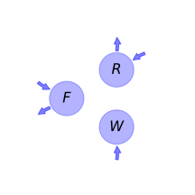
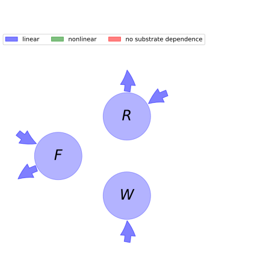

  
  
---
title: 'Report of the model: King1993TreePhysiol, version: 1'
---
  
  
# General Overview  
  

 

This report is the result of the use of the python package bgc_md, as means to translate published models to a common language.  The underlying yaml file was created by Verónika Ceballos-Núñez (Orcid ID: 0000-0002-0046-1160) on 29/7/2015.  
  
  
  
## About the model  
  
The model depicted in this document considers carbon allocation with a process based approach. It was originally described by @King1993TreePhysiology.  
  
  
  
### Space Scale  
  
forest
  
  
### Available parameter values  
  
  
  
Abbreviation|Source  
:-----|:-----  
Chosen based on the performance of Pinus radiata at Puruki, New Zeland|@King1993TreePhysiology  
  Table:  Information on given parameter sets  
  
  
Name|Description|Unit  
:-----|:-----|:-----  
$F$|Foliage dry mass|$kgC\cdot m^{-2}$  
$R$|Fine roots dry mass|$kgC\cdot m^{-2}$  
$W$|Woody tissue dry mass|$kgC\cdot m^{-2}$  
  Table: state_variables  
The model section in the yaml file has no subsection: additional_variables.  
  
Name|Description|Expression  
:-----|:-----|:-----:  
$x$|vector of states for vegetation|$x=\left[\begin{matrix}F\\R\\W\end{matrix}\right]$  
$u$|scalar function of photosynthetic inputs|$u=G$  
$b$|vector of partitioning coefficients of photosynthetically fixed carbon|$b=\left[\begin{matrix}\eta_{f}\\\eta_{r}\\\eta_{w}\end{matrix}\right]$  
$A$|matrix of turnover (cycling) rates|$A=\left[\begin{matrix}-\gamma_{f} & 0 & 0\\0 & -\gamma_{r} & 0\\0 & 0 & 0\end{matrix}\right]$  
$f_{v}$|the righthandside of the ode|$f_{v}=u b + A x$  
  Table: components  
  
  
## Pool model representation  
  

 

 **Figure 1:** *Pool model representation* 

  
  
#### Input fluxes  
  
$F: \Phi_{0}\cdot\epsilon\cdot\eta_{f}\cdot\left(1 - e^{- F\cdot k\cdot\omega}\right)$  
$R: \Phi_{0}\cdot\epsilon\cdot\eta_{r}\cdot\left(1 - e^{- F\cdot k\cdot\omega}\right)$  
$W: \Phi_{0}\cdot\epsilon\cdot\left(1 - e^{- F\cdot k\cdot\omega}\right)\cdot\left(-\eta_{f} -\eta_{r} + 1\right)$  

  
  
#### Output fluxes  
  
$F: F\cdot\gamma_{f}$  
$R: R\cdot\gamma_{r}$  
  
  
  
  
## Model simulations  
  
  
  
  
  
## Phaseplane plots  
  
  
  
  
  
## Fluxes  
  
  
  
## Steady state formulas  
  
$F = 0$  
  
  
  
$R = 0$  
  
  
  
$W = W$  
  
  
  
  
  
  
  
## Mean ages  
  
To compute the moments we need a start_age distribution.  This distribution can be chosen arbitrarily by the user or contributor of the yaml file and should in this case be defined in the model run data.  If the model run data do not contain age distributions, we can compute some distributions for special situations  
  
### Zero age for the whole initial mass  
  
We assume that the contents of all pools (as described by the start values of a model run combination are zero  
  
### Steady state start age distribution   
  
In the general non autonomous case The model can be frozen at a time t_0. The resulting model is in general autonomous but nonlinear and might have fixed points. If fixedpoints can be found we can compute the age distribution that would have developed if the system had stayed in this equilibrium for infinite time. Note that any startvalues given in the model run data section will not influence this start distribution since it will use the equilibrium values if such can be found.  
  
  
  
## Age Density Evolution  
  

    To compute the moments we need a start_age distribution.  
    This distribution can be chosen arbitrarily by the user.
    At the moment the yaml files do not contain startdistributions.
    The package CompartmentalSystems has a module "start_age_densities"  which contains functions to compute some distributions for special situations.
    In this template we use only the simplest ones.  
  
### Zero age for the whole initial mass  
  
We assume that the contents of all pools (as described by the start values of a model run combination are zero  
  
## References  
  
