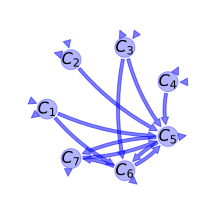
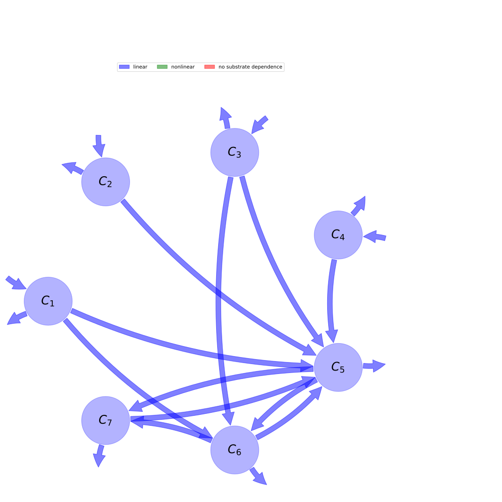

  
  
---
title: 'Report of the model: Century, version: 1'
---
  
  
# General Overview  
  

 

This report presents a general overview of the model Century , which is part of the Biogeochemistry Model Database BGC-MD.  The underlying yaml file entry that contains all the information of the model was created by Holger Metzler (Orcid ID: 0000-0002-8239-1601) on 10/03/2016. The entry was processed by the python package bgc-md to produce symbolic output.  
  
The model was originally described by @Parton1987SoilSciSocAmJ.  
  
  
  
# Model description  
  
  
  
## State variables  
  
  
  
Name|Description  
:-----|:-----  
$C_{1}$|structural soil surface litter pool  
$C_{2}$|metabolic soil surface litter pool  
$C_{3}$|structural soil litter pool  
$C_{4}$|metabolic soil litter pool  
$C_{5}$|active soil organic matter pool  
$C_{6}$|slow soil organic matter pool  
$C_{7}$|passive soil organic matter pool  
  Table: state_variables  
  
  
## Components of the compartmental system  
  
  
  
Name|Description|Expression  
:-----|:-----|:-----:  
$C$|carbon content|$C=\left[\begin{matrix}C_{1}\\C_{2}\\C_{3}\\C_{4}\\C_{5}\\C_{6}\\C_{7}\end{matrix}\right]$  
$I$|input vector|$I=\left[\begin{matrix}F_{s}\cdot J_{1}\\F_{m}\cdot J_{1}\\F_{s}\cdot J_{2}\\F_{m}\cdot J_{2}\\0\\0\\0\end{matrix}\right]$  
$\xi$|environmental effects multiplier (DEFAG)|$\xi=f_{T}\cdot f_{W}$  
$A$|decomposition operator|$A=\left[\begin{matrix}- k_{1} & 0 & 0 & 0 & 0 & 0 & 0\\0 & - K_{2} & 0 & 0 & 0 & 0 & 0\\0 & 0 & - k_{3} & 0 & 0 & 0 & 0\\0 & 0 & 0 & - K_{4} & 0 & 0 & 0\\\alpha_{51}\cdot k_{1} & 0.45\cdot K_{2} &\alpha_{53}\cdot k_{3} & 0.45\cdot K_{4} & - k_{5} & 0.42\cdot K_{6} & 0.45\cdot K_{7}\\\alpha_{61}\cdot k_{1} & 0 &\alpha_{63}\cdot k_{3} & 0 &\alpha_{65}\cdot k_{5} & - K_{6} & 0\\0 & 0 & 0 & 0 & 0.004\cdot k_{5} & 0.03\cdot K_{6} & - K_{7}\end{matrix}\right]$  
$f_{s}$|the right hand side of the ode|$f_{s}=\xi A C + I$  
  Table: components  
  
  
## Pool model representation  
  

 

 **Figure 1:** *Pool model representation* 

  
  
#### Input fluxes  
  
$C_{1}: J_{1}\cdot\left(0.018\cdot LN + 0.15\right)$  
$C_{2}: J_{1}\cdot\left(- 0.018\cdot LN + 0.85\right)$  
$C_{3}: J_{2}\cdot\left(0.018\cdot LN + 0.15\right)$  
$C_{4}: J_{2}\cdot\left(- 0.018\cdot LN + 0.85\right)$  

  
  
#### Output fluxes  
  
$C_{1}: - C_{1}\cdot K_{1}\cdot f_{T}\cdot f_{W}\cdot\left(0.15\cdot A_{l} - 0.45\right)\cdot e^{- 3\cdot Ls}$  
$C_{2}: 0.55\cdot C_{2}\cdot K_{2}\cdot f_{T}\cdot f_{W}$  
$C_{3}: - C_{3}\cdot K_{3}\cdot f_{T}\cdot f_{W}\cdot\left(0.25\cdot A_{l} - 0.55\right)\cdot e^{- 3\cdot Ls}$  
$C_{4}: 0.55\cdot C_{4}\cdot K_{4}\cdot f_{T}\cdot f_{W}$  
$C_{5}: C_{5}\cdot K_{5}\cdot f_{T}\cdot f_{W}\cdot\left(0.51\cdot Tx^{2} - 1.3175\cdot Tx + 0.85\right)$  
$C_{6}: 0.55\cdot C_{6}\cdot K_{6}\cdot f_{T}\cdot f_{W}$  
$C_{7}: 0.55\cdot C_{7}\cdot K_{7}\cdot f_{T}\cdot f_{W}$  

  
  
#### Internal fluxes  
  
$C_{1} \rightarrow C_{5}: - 0.55\cdot C_{1}\cdot K_{1}\cdot f_{T}\cdot f_{W}\cdot\left(A_{l} - 1\right)\cdot e^{- 3\cdot Ls}$  
$C_{1} \rightarrow C_{6}: 0.7\cdot A_{l}\cdot C_{1}\cdot K_{1}\cdot f_{T}\cdot f_{W}\cdot e^{- 3\cdot Ls}$  
$C_{2} \rightarrow C_{5}: 0.45\cdot C_{2}\cdot K_{2}\cdot f_{T}\cdot f_{W}$  
$C_{3} \rightarrow C_{5}: - 0.45\cdot C_{3}\cdot K_{3}\cdot f_{T}\cdot f_{W}\cdot\left(A_{l} - 1\right)\cdot e^{- 3\cdot Ls}$  
$C_{3} \rightarrow C_{6}: 0.7\cdot A_{l}\cdot C_{3}\cdot K_{3}\cdot f_{T}\cdot f_{W}\cdot e^{- 3\cdot Ls}$  
$C_{4} \rightarrow C_{5}: 0.45\cdot C_{4}\cdot K_{4}\cdot f_{T}\cdot f_{W}$  
$C_{5} \rightarrow C_{6}: C_{5}\cdot K_{5}\cdot f_{T}\cdot f_{W}\cdot\left(- 0.51\cdot Tx^{2} + 0.5705\cdot Tx + 0.146\right)$  
$C_{5} \rightarrow C_{7}: C_{5}\cdot K_{5}\cdot f_{T}\cdot f_{W}\cdot\left(- 0.003\cdot Tx + 0.004\right)$  
$C_{6} \rightarrow C_{5}: 0.42\cdot C_{6}\cdot K_{6}\cdot f_{T}\cdot f_{W}$  
$C_{6} \rightarrow C_{7}: 0.03\cdot C_{6}\cdot K_{6}\cdot f_{T}\cdot f_{W}$  
$C_{7} \rightarrow C_{5}: 0.45\cdot C_{7}\cdot K_{7}\cdot f_{T}\cdot f_{W}$  
  
  
## Steady state formulas  
  
$C_1 = \frac{0.006\cdot J_{1}\cdot e^{3.0\cdot Ls}}{K_{1}\cdot f_{T}\cdot f_{W}}\cdot\left(3.0\cdot LN + 25.0\right)$  
  
  
  
$C_2 = -\frac{0.002\cdot J_{1}\cdot\left(9.0\cdot LN - 425.0\right)}{K_{2}\cdot f_{T}\cdot f_{W}}$  
  
  
  
$C_3 = \frac{0.006\cdot J_{2}\cdot e^{3.0\cdot Ls}}{K_{3}\cdot f_{T}\cdot f_{W}}\cdot\left(3.0\cdot LN + 25.0\right)$  
  
  
  
$C_4 = -\frac{0.002\cdot J_{2}\cdot\left(9.0\cdot LN - 425.0\right)}{K_{4}\cdot f_{T}\cdot f_{W}}$  
  
  
  
$C_5 = \frac{1}{K_{5}\cdot f_{T}\cdot f_{W}\cdot\left(884340.0\cdot Tx^{2} - 3983847.0\cdot Tx + 3739636.0\right)}\cdot\left(- 17751.6\cdot A_{l}\cdot J_{1}\cdot LN - 147930.0\cdot A_{l}\cdot J_{1} - 10551.6\cdot A_{l}\cdot J_{2}\cdot LN - 87930.0\cdot A_{l}\cdot J_{2} + 7200.0\cdot J_{1}\cdot LN + 1860000.0\cdot J_{1} + 1800000.0\cdot J_{2}\right)$  
  
  
  
$C_6 = \frac{1}{K_{6}\cdot f_{T}\cdot f_{W}\cdot\left(294780.0\cdot Tx - 934909.0\right)}\cdot\left(6732.0\cdot A_{l}\cdot J_{1}\cdot LN\cdot Tx - 11131.92\cdot A_{l}\cdot J_{1}\cdot LN + 56100.0\cdot A_{l}\cdot J_{1}\cdot Tx - 92766.0\cdot A_{l}\cdot J_{1} + 5508.0\cdot A_{l}\cdot J_{2}\cdot LN\cdot Tx - 11394.72\cdot A_{l}\cdot J_{2}\cdot LN + 45900.0\cdot A_{l}\cdot J_{2}\cdot Tx - 94956.0\cdot A_{l}\cdot J_{2} - 1224.0\cdot J_{1}\cdot LN\cdot Tx - 262.8\cdot J_{1}\cdot LN - 316200.0\cdot J_{1}\cdot Tx - 67890.0\cdot J_{1} - 306000.0\cdot J_{2}\cdot Tx - 65700.0\cdot J_{2}\right)$  
  
  
  
$C_7 = \frac{1}{K_{7}\cdot f_{T}\cdot f_{W}\cdot\left(294780.0\cdot Tx - 934909.0\right)}\cdot\left(201.96\cdot A_{l}\cdot J_{1}\cdot LN\cdot Tx - 316.206\cdot A_{l}\cdot J_{1}\cdot LN + 1683.0\cdot A_{l}\cdot J_{1}\cdot Tx - 2635.05\cdot A_{l}\cdot J_{1} + 165.24\cdot A_{l}\cdot J_{2}\cdot LN\cdot Tx - 331.29\cdot A_{l}\cdot J_{2}\cdot LN + 1377.0\cdot A_{l}\cdot J_{2}\cdot Tx - 2760.75\cdot A_{l}\cdot J_{2} - 36.72\cdot J_{1}\cdot LN\cdot Tx - 15.084\cdot J_{1}\cdot LN - 9486.0\cdot J_{1}\cdot Tx - 3896.7\cdot J_{1} - 9180.0\cdot J_{2}\cdot Tx - 3771.0\cdot J_{2}\right)$  
  
  
  
  
  
# References  
  
