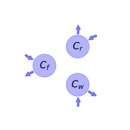
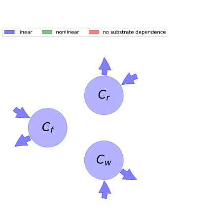

  
  
---
title: 'Report of the model: Carnegie-Ames-Stanford approach (CASA), version: 1'
---
  
  
# General Overview  
  

 

This report is the result of the use of the python package bgc_md, as means to translate published models to a common language.  The underlying yaml file was created by Verónika Ceballos-Núñez (Orcid ID: 0000-0002-0046-1160) on 17/7/2015.  
  
  
  
## About the model  
  
The model depicted in this document considers carbon allocation with a process based approach. It was originally described by @Potter1993GlobalBiogeochemicalCycles.  
  
  
  
### Space Scale  
  
global
  
  
### Available parameter values  
  
  
  
Abbreviation|Source  
:-----|:-----  
Original dataset of the publication|@Potter1993GlobalBiogeochemicalCycles  
Tundra|@Potter1999BioScience  
High-latitude forest|@Potter1999BioScience  
Boreal coniferous forest|@Potter1999BioScience  
Temperate grassland|@Potter1999BioScience  
Mixed coniferous forest|@Potter1999BioScience  
Temperate deciduous forest|@Potter1999BioScience  
Desert and bare ground|@Potter1999BioScience  
Semi-arid shrubland|@Potter1999BioScience  
Savanna and woody grassland|@Potter1999BioScience  
Tropical evergreen rain forest|@Potter1999BioScience  
  Table:  Information on given parameter sets  
  
  
Name|Description|Unit  
:-----|:-----|:-----  
$t$|time step|$year$  
$C_{f}$|Carbon in foliage|-  
$C_{r}$|Carbon in roots|-  
$C_{w}$|Carbon in woody tissue|-  
  Table: state_variables  
The model section in the yaml file has no subsection: additional_variables.  
  
Name|Description|Expression  
:-----|:-----|:-----:  
$x$|vector of states for vegetation|$x=\left[\begin{matrix}C_{f}\\C_{r}\\C_{w}\end{matrix}\right]$  
$u$|scalar function of photosynthetic inputs|$u=NPP$  
$b$|vector of partitioning coefficients of photosynthetically fixed carbon|$b=\left[\begin{matrix}\alpha_{f}\\\alpha_{r}\\\alpha_{w}\end{matrix}\right]$  
$A$|matrix of turnover (cycling) rates|$A=\left[\begin{matrix}-\tau_{f} & 0 & 0\\0 & -\tau_{r} & 0\\0 & 0 & -\tau_{w}\end{matrix}\right]$  
$f_{v}$|the righthandside of the ode|$f_{v}=u b + A x$  
  Table: components  
  
  
## Pool model representation  
  

 

 **Figure 1:** *Pool model representation* 

  
  
#### Input fluxes  
  
$C_{f}: 0.5\cdot FPAR\cdot SOL\cdot\alpha_{f}\cdot\epsilon$  
$C_{r}: 0.5\cdot FPAR\cdot SOL\cdot\alpha_{r}\cdot\epsilon$  
$C_{w}: 0.5\cdot FPAR\cdot SOL\cdot\alpha_{w}\cdot\epsilon$  

  
  
#### Output fluxes  
  
$C_{f}: C_{f}\cdot\tau_{f}$  
$C_{r}: C_{r}\cdot\tau_{r}$  
$C_{w}: C_{w}\cdot\tau_{w}$  
  
  
  
  
## Model simulations  
  
  
  
  
  
## Phaseplane plots  
  
  
  
  
  
## Fluxes  
  
  
  
## Steady state formulas  
  
$C_f = \frac{0.5}{\tau_{f}}\cdot FPAR\cdot SOL\cdot\alpha_{f}\cdot\epsilon$  
  
  
  
$C_r = \frac{0.5}{\tau_{r}}\cdot FPAR\cdot SOL\cdot\alpha_{r}\cdot\epsilon$  
  
  
  
$C_w = \frac{0.5}{\tau_{w}}\cdot FPAR\cdot SOL\cdot\alpha_{w}\cdot\epsilon$  
  
  
  
  
  
  
  
## Mean ages  
  
To compute the moments we need a start_age distribution.  This distribution can be chosen arbitrarily by the user or contributor of the yaml file and should in this case be defined in the model run data.  If the model run data do not contain age distributions, we can compute some distributions for special situations  
  
### Zero age for the whole initial mass  
  
We assume that the contents of all pools (as described by the start values of a model run combination are zero  
  
### Steady state start age distribution   
  
In the general non autonomous case The model can be frozen at a time t_0. The resulting model is in general autonomous but nonlinear and might have fixed points. If fixedpoints can be found we can compute the age distribution that would have developed if the system had stayed in this equilibrium for infinite time. Note that any startvalues given in the model run data section will not influence this start distribution since it will use the equilibrium values if such can be found.  
  
  
  
## Age Density Evolution  
  

    To compute the moments we need a start_age distribution.  
    This distribution can be chosen arbitrarily by the user.
    At the moment the yaml files do not contain startdistributions.
    The package CompartmentalSystems has a module "start_age_densities"  which contains functions to compute some distributions for special situations.
    In this template we use only the simplest ones.  
  
### Zero age for the whole initial mass  
  
We assume that the contents of all pools (as described by the start values of a model run combination are zero  
  
## References  
  
