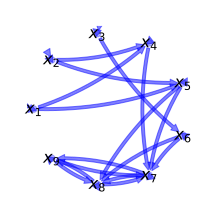
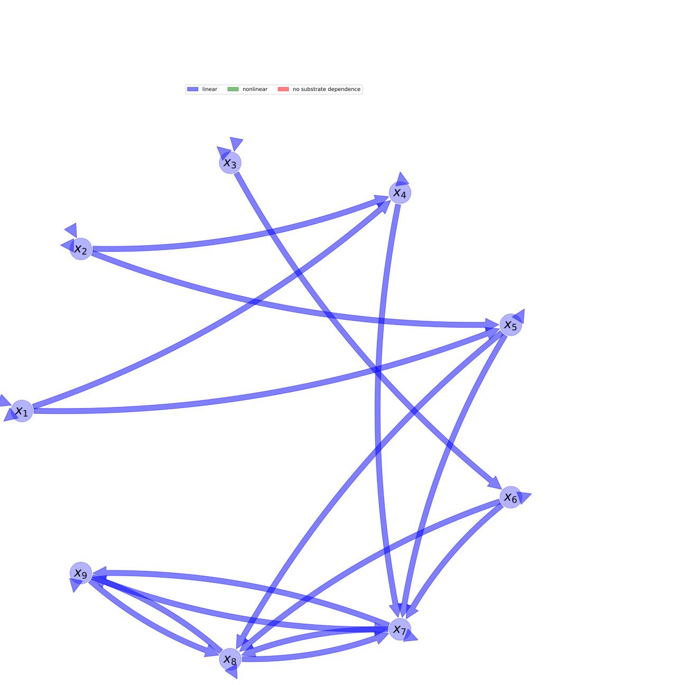

  
  
---
title: 'Report of the model: CASA (9 pools), version: 2016'
---
  
  
# General Overview  
  

 

This report presents a general overview of the model CASA (9 pools) , which is part of the Biogeochemistry Model Database BGC-MD.  The underlying yaml file entry that contains all the information of the model was created by Holger Metzler (Orcid ID: 0000-0002-8239-1601) on 18/01/2018. The entry was processed by the python package bgc-md to produce symbolic output.  
  
The model was originally described by @Rasmussen2016JMB.  
  
  
  
# Model description  
  
  
  
## State variables  
  
  
  
Name|Description|Unit  
:-----|:-----|:-----  
$x_{1}$|Leaves|$Pg C$  
$x_{2}$|Roots|$Pg C$  
$x_{3}$|Wood|$Pg C$  
$x_{4}$|Litter 1|$Pg C$  
$x_{5}$|Litter 2|$Pg C$  
$x_{6}$|Litter 3|$Pg C$  
$x_{7}$|Soil 1|$Pg C$  
$x_{8}$|Soil 2|$Pg C$  
$x_{9}$|Soil 3|$Pg C$  
  Table: state_variables  
  
  
## Components of the compartmental system  
  
  
  
Name|Description|Expression  
:-----|:-----|:-----:  
$C$|carbon content|$C=\left[\begin{matrix}x_{1}\\x_{2}\\x_{3}\\x_{4}\\x_{5}\\x_{6}\\x_{7}\\x_{8}\\x_{9}\end{matrix}\right]$  
$s$|input vector|$s=\left[\begin{matrix}s_{1}\\s_{2}\\s_{3}\\0\\0\\0\\0\\0\\0\end{matrix}\right]$  
$\xi$|environmental effects multiplier, not for all pools|$\xi=\xi_{b}^{0.1\cdot T_{s} - 1.5}$  
$B$|Matrix of cycling and transfer rates|$B=\left[\begin{matrix}- b_{11} & 0 & 0 & 0 & 0 & 0 & 0 & 0 & 0\\0 & - b_{22} & 0 & 0 & 0 & 0 & 0 & 0 & 0\\0 & 0 & - b_{33} & 0 & 0 & 0 & 0 & 0 & 0\\b_{41} & b_{42} & 0 & - b_{44}\cdot\xi & 0 & 0 & 0 & 0 & 0\\b_{51} & b_{52} & 0 & 0 & - b_{55}\cdot\xi & 0 & 0 & 0 & 0\\0 & 0 & b_{63} & 0 & 0 & - b_{66}\cdot\xi & 0 & 0 & 0\\0 & 0 & 0 & b_{74}\cdot\xi & b_{75}\cdot\xi & b_{76}\cdot\xi & - b_{77}\cdot\xi & b_{78}\cdot\xi & b_{79}\cdot\xi\\0 & 0 & 0 & 0 & b_{85}\cdot\xi & b_{86}\cdot\xi & b_{87}\cdot\xi & - b_{88}\cdot\xi & b_{89}\cdot\xi\\0 & 0 & 0 & 0 & 0 & 0 & b_{97}\cdot\xi & b_{98}\cdot\xi & - b_{99}\cdot\xi\end{matrix}\right]$  
$f_{s}$|the right hand side of the ode|$f_{s}=B C + s$  
  Table: components  
  
  
## Pool model representation  
  

 

 **Figure 1:** *Pool model representation* 

  
  
#### Input fluxes  
  
$x_{1}: \alpha\cdot f_{i}\cdot s_{0}\cdot\left(\frac{7.5\cdot\rho\cdot\left(284 +\frac{1715\cdot e^{0.0305\cdot t}}{e^{0.0305\cdot t} + 1714}\right)\cdot\left(1.68\cdot T_{s0} +\frac{1.68\cdot\sigma}{\log{\left (2\right )}}\cdot\log{\left (\frac{284}{285} +\frac{343\cdot e^{0.0305\cdot t}}{57\cdot e^{0.0305\cdot t} + 97698}\right )} + 0.012\cdot\left(T_{s0} +\frac{\sigma}{\log{\left (2\right )}}\cdot\log{\left (\frac{284}{285} +\frac{343\cdot e^{0.0305\cdot t}}{57\cdot e^{0.0305\cdot t} + 97698}\right )} - 25\right)^{2} + 0.700000000000003\right)\cdot\log{\left (\frac{284}{285} +\frac{343\cdot e^{0.0305\cdot t}}{57\cdot e^{0.0305\cdot t} + 97698}\right )}}{\left(- 1.68\cdot T_{s0} +\rho\cdot\left(284 +\frac{1715\cdot e^{0.0305\cdot t}}{e^{0.0305\cdot t} + 1714}\right) -\frac{1.68\cdot\sigma}{\log{\left (2\right )}}\cdot\log{\left (\frac{284}{285} +\frac{343\cdot e^{0.0305\cdot t}}{57\cdot e^{0.0305\cdot t} + 97698}\right )} - 0.012\cdot\left(T_{s0} +\frac{\sigma}{\log{\left (2\right )}}\cdot\log{\left (\frac{284}{285} +\frac{343\cdot e^{0.0305\cdot t}}{57\cdot e^{0.0305\cdot t} + 97698}\right )} - 25\right)^{2} - 0.700000000000003\right)\cdot\left(3.36\cdot T_{s0} +\rho\cdot\left(284 +\frac{1715\cdot e^{0.0305\cdot t}}{e^{0.0305\cdot t} + 1714}\right) +\frac{3.36\cdot\sigma}{\log{\left (2\right )}}\cdot\log{\left (\frac{284}{285} +\frac{343\cdot e^{0.0305\cdot t}}{57\cdot e^{0.0305\cdot t} + 97698}\right )} + 0.024\cdot\left(T_{s0} +\frac{\sigma}{\log{\left (2\right )}}\cdot\log{\left (\frac{284}{285} +\frac{343\cdot e^{0.0305\cdot t}}{57\cdot e^{0.0305\cdot t} + 97698}\right )} - 25\right)^{2} + 1.40000000000001\right)} + 1\right)$  
$x_{2}: \alpha\cdot f_{i}\cdot s_{0}\cdot\left(\frac{7.5\cdot\rho\cdot\left(284 +\frac{1715\cdot e^{0.0305\cdot t}}{e^{0.0305\cdot t} + 1714}\right)\cdot\left(1.68\cdot T_{s0} +\frac{1.68\cdot\sigma}{\log{\left (2\right )}}\cdot\log{\left (\frac{284}{285} +\frac{343\cdot e^{0.0305\cdot t}}{57\cdot e^{0.0305\cdot t} + 97698}\right )} + 0.012\cdot\left(T_{s0} +\frac{\sigma}{\log{\left (2\right )}}\cdot\log{\left (\frac{284}{285} +\frac{343\cdot e^{0.0305\cdot t}}{57\cdot e^{0.0305\cdot t} + 97698}\right )} - 25\right)^{2} + 0.700000000000003\right)\cdot\log{\left (\frac{284}{285} +\frac{343\cdot e^{0.0305\cdot t}}{57\cdot e^{0.0305\cdot t} + 97698}\right )}}{\left(- 1.68\cdot T_{s0} +\rho\cdot\left(284 +\frac{1715\cdot e^{0.0305\cdot t}}{e^{0.0305\cdot t} + 1714}\right) -\frac{1.68\cdot\sigma}{\log{\left (2\right )}}\cdot\log{\left (\frac{284}{285} +\frac{343\cdot e^{0.0305\cdot t}}{57\cdot e^{0.0305\cdot t} + 97698}\right )} - 0.012\cdot\left(T_{s0} +\frac{\sigma}{\log{\left (2\right )}}\cdot\log{\left (\frac{284}{285} +\frac{343\cdot e^{0.0305\cdot t}}{57\cdot e^{0.0305\cdot t} + 97698}\right )} - 25\right)^{2} - 0.700000000000003\right)\cdot\left(3.36\cdot T_{s0} +\rho\cdot\left(284 +\frac{1715\cdot e^{0.0305\cdot t}}{e^{0.0305\cdot t} + 1714}\right) +\frac{3.36\cdot\sigma}{\log{\left (2\right )}}\cdot\log{\left (\frac{284}{285} +\frac{343\cdot e^{0.0305\cdot t}}{57\cdot e^{0.0305\cdot t} + 97698}\right )} + 0.024\cdot\left(T_{s0} +\frac{\sigma}{\log{\left (2\right )}}\cdot\log{\left (\frac{284}{285} +\frac{343\cdot e^{0.0305\cdot t}}{57\cdot e^{0.0305\cdot t} + 97698}\right )} - 25\right)^{2} + 1.40000000000001\right)} + 1\right)$  
$x_{3}: \alpha\cdot f_{i}\cdot s_{0}\cdot\left(\frac{7.5\cdot\rho\cdot\left(284 +\frac{1715\cdot e^{0.0305\cdot t}}{e^{0.0305\cdot t} + 1714}\right)\cdot\left(1.68\cdot T_{s0} +\frac{1.68\cdot\sigma}{\log{\left (2\right )}}\cdot\log{\left (\frac{284}{285} +\frac{343\cdot e^{0.0305\cdot t}}{57\cdot e^{0.0305\cdot t} + 97698}\right )} + 0.012\cdot\left(T_{s0} +\frac{\sigma}{\log{\left (2\right )}}\cdot\log{\left (\frac{284}{285} +\frac{343\cdot e^{0.0305\cdot t}}{57\cdot e^{0.0305\cdot t} + 97698}\right )} - 25\right)^{2} + 0.700000000000003\right)\cdot\log{\left (\frac{284}{285} +\frac{343\cdot e^{0.0305\cdot t}}{57\cdot e^{0.0305\cdot t} + 97698}\right )}}{\left(- 1.68\cdot T_{s0} +\rho\cdot\left(284 +\frac{1715\cdot e^{0.0305\cdot t}}{e^{0.0305\cdot t} + 1714}\right) -\frac{1.68\cdot\sigma}{\log{\left (2\right )}}\cdot\log{\left (\frac{284}{285} +\frac{343\cdot e^{0.0305\cdot t}}{57\cdot e^{0.0305\cdot t} + 97698}\right )} - 0.012\cdot\left(T_{s0} +\frac{\sigma}{\log{\left (2\right )}}\cdot\log{\left (\frac{284}{285} +\frac{343\cdot e^{0.0305\cdot t}}{57\cdot e^{0.0305\cdot t} + 97698}\right )} - 25\right)^{2} - 0.700000000000003\right)\cdot\left(3.36\cdot T_{s0} +\rho\cdot\left(284 +\frac{1715\cdot e^{0.0305\cdot t}}{e^{0.0305\cdot t} + 1714}\right) +\frac{3.36\cdot\sigma}{\log{\left (2\right )}}\cdot\log{\left (\frac{284}{285} +\frac{343\cdot e^{0.0305\cdot t}}{57\cdot e^{0.0305\cdot t} + 97698}\right )} + 0.024\cdot\left(T_{s0} +\frac{\sigma}{\log{\left (2\right )}}\cdot\log{\left (\frac{284}{285} +\frac{343\cdot e^{0.0305\cdot t}}{57\cdot e^{0.0305\cdot t} + 97698}\right )} - 25\right)^{2} + 1.40000000000001\right)} + 1\right)$  

  
  
#### Output fluxes  
  
$x_{1}: x_{1}\cdot\left(b_{11} - b_{41} - b_{51}\right)$  
$x_{2}: x_{2}\cdot\left(b_{22} - b_{42} - b_{52}\right)$  
$x_{3}: x_{3}\cdot\left(b_{33} - b_{63}\right)$  
$x_{4}: x_{4}\cdot\xi_{b}^{\frac{1}{\log{\left (2\right )}}\cdot\left(0.1\cdot\sigma\cdot\log{\left (\frac{1999\cdot e^{0.0305\cdot t} + 486776}{285\cdot e^{0.0305\cdot t} + 488490}\right )} +\left(0.1\cdot T_{s0} - 1.5\right)\cdot\log{\left (2\right )}\right)}\cdot\left(b_{44} - b_{74}\right)$  
$x_{5}: - x_{5}\cdot\xi_{b}^{\frac{1}{\log{\left (2\right )}}\cdot\left(0.1\cdot\sigma\cdot\log{\left (\frac{1999\cdot e^{0.0305\cdot t} + 486776}{285\cdot e^{0.0305\cdot t} + 488490}\right )} +\left(0.1\cdot T_{s0} - 1.5\right)\cdot\log{\left (2\right )}\right)}\cdot\left(- b_{55} + b_{75} + b_{85}\right)$  
$x_{6}: - x_{6}\cdot\xi_{b}^{\frac{1}{\log{\left (2\right )}}\cdot\left(0.1\cdot\sigma\cdot\log{\left (\frac{1999\cdot e^{0.0305\cdot t} + 486776}{285\cdot e^{0.0305\cdot t} + 488490}\right )} +\left(0.1\cdot T_{s0} - 1.5\right)\cdot\log{\left (2\right )}\right)}\cdot\left(- b_{66} + b_{76} + b_{86}\right)$  
$x_{7}: - x_{7}\cdot\xi_{b}^{\frac{1}{\log{\left (2\right )}}\cdot\left(0.1\cdot\sigma\cdot\log{\left (\frac{1999\cdot e^{0.0305\cdot t} + 486776}{285\cdot e^{0.0305\cdot t} + 488490}\right )} +\left(0.1\cdot T_{s0} - 1.5\right)\cdot\log{\left (2\right )}\right)}\cdot\left(- b_{77} + b_{87} + b_{97}\right)$  
$x_{8}: - x_{8}\cdot\xi_{b}^{\frac{1}{\log{\left (2\right )}}\cdot\left(0.1\cdot\sigma\cdot\log{\left (\frac{1999\cdot e^{0.0305\cdot t} + 486776}{285\cdot e^{0.0305\cdot t} + 488490}\right )} +\left(0.1\cdot T_{s0} - 1.5\right)\cdot\log{\left (2\right )}\right)}\cdot\left(b_{78} - b_{88} + b_{98}\right)$  
$x_{9}: - x_{9}\cdot\xi_{b}^{\frac{1}{\log{\left (2\right )}}\cdot\left(0.1\cdot\sigma\cdot\log{\left (\frac{1999\cdot e^{0.0305\cdot t} + 486776}{285\cdot e^{0.0305\cdot t} + 488490}\right )} +\left(0.1\cdot T_{s0} - 1.5\right)\cdot\log{\left (2\right )}\right)}\cdot\left(b_{79} + b_{89} - b_{99}\right)$  

  
  
#### Internal fluxes  
  
$x_{1} \rightarrow x_{4}: b_{41}\cdot x_{1}$  
$x_{1} \rightarrow x_{5}: b_{51}\cdot x_{1}$  
$x_{2} \rightarrow x_{4}: b_{42}\cdot x_{2}$  
$x_{2} \rightarrow x_{5}: b_{52}\cdot x_{2}$  
$x_{3} \rightarrow x_{6}: b_{63}\cdot x_{3}$  
$x_{4} \rightarrow x_{7}: b_{74}\cdot x_{4}\cdot\xi_{b}^{\frac{1}{\log{\left (2\right )}}\cdot\left(0.1\cdot\sigma\cdot\log{\left (\frac{1999\cdot e^{0.0305\cdot t} + 486776}{285\cdot e^{0.0305\cdot t} + 488490}\right )} +\left(0.1\cdot T_{s0} - 1.5\right)\cdot\log{\left (2\right )}\right)}$  
$x_{5} \rightarrow x_{7}: b_{75}\cdot x_{5}\cdot\xi_{b}^{\frac{1}{\log{\left (2\right )}}\cdot\left(0.1\cdot\sigma\cdot\log{\left (\frac{1999\cdot e^{0.0305\cdot t} + 486776}{285\cdot e^{0.0305\cdot t} + 488490}\right )} +\left(0.1\cdot T_{s0} - 1.5\right)\cdot\log{\left (2\right )}\right)}$  
$x_{5} \rightarrow x_{8}: b_{85}\cdot x_{5}\cdot\xi_{b}^{\frac{1}{\log{\left (2\right )}}\cdot\left(0.1\cdot\sigma\cdot\log{\left (\frac{1999\cdot e^{0.0305\cdot t} + 486776}{285\cdot e^{0.0305\cdot t} + 488490}\right )} +\left(0.1\cdot T_{s0} - 1.5\right)\cdot\log{\left (2\right )}\right)}$  
$x_{6} \rightarrow x_{7}: b_{76}\cdot x_{6}\cdot\xi_{b}^{\frac{1}{\log{\left (2\right )}}\cdot\left(0.1\cdot\sigma\cdot\log{\left (\frac{1999\cdot e^{0.0305\cdot t} + 486776}{285\cdot e^{0.0305\cdot t} + 488490}\right )} +\left(0.1\cdot T_{s0} - 1.5\right)\cdot\log{\left (2\right )}\right)}$  
$x_{6} \rightarrow x_{8}: b_{86}\cdot x_{6}\cdot\xi_{b}^{\frac{1}{\log{\left (2\right )}}\cdot\left(0.1\cdot\sigma\cdot\log{\left (\frac{1999\cdot e^{0.0305\cdot t} + 486776}{285\cdot e^{0.0305\cdot t} + 488490}\right )} +\left(0.1\cdot T_{s0} - 1.5\right)\cdot\log{\left (2\right )}\right)}$  
$x_{7} \rightarrow x_{8}: b_{87}\cdot x_{7}\cdot\xi_{b}^{\frac{1}{\log{\left (2\right )}}\cdot\left(0.1\cdot\sigma\cdot\log{\left (\frac{1999\cdot e^{0.0305\cdot t} + 486776}{285\cdot e^{0.0305\cdot t} + 488490}\right )} +\left(0.1\cdot T_{s0} - 1.5\right)\cdot\log{\left (2\right )}\right)}$  
$x_{7} \rightarrow x_{9}: b_{97}\cdot x_{7}\cdot\xi_{b}^{\frac{1}{\log{\left (2\right )}}\cdot\left(0.1\cdot\sigma\cdot\log{\left (\frac{1999\cdot e^{0.0305\cdot t} + 486776}{285\cdot e^{0.0305\cdot t} + 488490}\right )} +\left(0.1\cdot T_{s0} - 1.5\right)\cdot\log{\left (2\right )}\right)}$  
$x_{8} \rightarrow x_{7}: b_{78}\cdot x_{8}\cdot\xi_{b}^{\frac{1}{\log{\left (2\right )}}\cdot\left(0.1\cdot\sigma\cdot\log{\left (\frac{1999\cdot e^{0.0305\cdot t} + 486776}{285\cdot e^{0.0305\cdot t} + 488490}\right )} +\left(0.1\cdot T_{s0} - 1.5\right)\cdot\log{\left (2\right )}\right)}$  
$x_{8} \rightarrow x_{9}: b_{98}\cdot x_{8}\cdot\xi_{b}^{\frac{1}{\log{\left (2\right )}}\cdot\left(0.1\cdot\sigma\cdot\log{\left (\frac{1999\cdot e^{0.0305\cdot t} + 486776}{285\cdot e^{0.0305\cdot t} + 488490}\right )} +\left(0.1\cdot T_{s0} - 1.5\right)\cdot\log{\left (2\right )}\right)}$  
$x_{9} \rightarrow x_{7}: b_{79}\cdot x_{9}\cdot\xi_{b}^{\frac{1}{\log{\left (2\right )}}\cdot\left(0.1\cdot\sigma\cdot\log{\left (\frac{1999\cdot e^{0.0305\cdot t} + 486776}{285\cdot e^{0.0305\cdot t} + 488490}\right )} +\left(0.1\cdot T_{s0} - 1.5\right)\cdot\log{\left (2\right )}\right)}$  
$x_{9} \rightarrow x_{8}: b_{89}\cdot x_{9}\cdot\xi_{b}^{\frac{1}{\log{\left (2\right )}}\cdot\left(0.1\cdot\sigma\cdot\log{\left (\frac{1999\cdot e^{0.0305\cdot t} + 486776}{285\cdot e^{0.0305\cdot t} + 488490}\right )} +\left(0.1\cdot T_{s0} - 1.5\right)\cdot\log{\left (2\right )}\right)}$  
  
  
# References  
  
