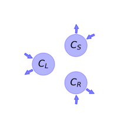
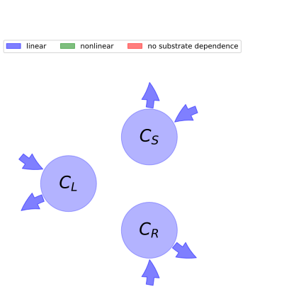

  
  
# General Overview  
  

 

This report is the result of the use of the python package bgc_md, as means to translate published models to a common language.  The underlying yaml file was created by Verónika Ceballos-Núñez (Orcid ID: 0000-0002-0046-1160) on 21/1/2016.  
  
  
  
## About the model  
  
The model depicted in this document considers carbon allocation with a process based approach. It was originally described by @Arora2005GlobalChangeBiology.  
  
  
  
### Space Scale  
  
global
  
  
### Available parameter values  
  
  
  
Abbreviation|Description|Source  
:-----|:-----|:-----  
Original dataset of the publication|Eastern US and Germany, cold broadleaf deciduous|@Arora2005GlobalChangeBiology  
  Table:  Information on given parameter sets  
  
  
Name|Description|Unit  
:-----|:-----|:-----  
$C_{L}$|Amount of carbon for the leaf|$kgC\cdot m^{-2}$  
$C_{S}$|Amount of carbon for the stem|$kgC\cdot m^{-2}$  
$C_{R}$|Amount of carbon for the root|$kgC\cdot m^{-2}$  
  Table: state_variables  
  
  
Name|Description|Expression  
:-----|:-----|:-----:  
$G$|Carbon gain via photosynthesis (Gross Primary Productivity, GPP)|-  
$N$|Net primary Productivity (NPP)|$N=G - R_{gL} - R_{gR} - R_{gS} - R_{mL} - R_{mR} - R_{mS}$  
$LAI$|Leaf Area Index|-  
$k_{n}$|PFT-dependent light extinction coefficient|-  
$L$|Light availability (scalar index between 0 and 1)|$L=e^{- LAI\cdot k_{n}}$  
  Table: photosynthetic_parameters  
  
  
Name|Description|Expression  
:-----|:-----|:-----:  
$\theta_{i}$|Volumetric soil moisture content|-  
$\theta_{field}$|Field capacity|-  
$\theta_{wilt}$|Wilting point|-  
$W_{i}$|Availability of water in soil layer i. Weighted by the fraction of roots present in each soil layer|$W_{i}=\max\left(0,\min\left(1,\frac{\theta_{i} -\theta_{wilt}}{\theta_{field} -\theta_{wilt}}\right)\right)$  
$W$|Averaged soil water availability index|-  
  Table: water_availability  
  
  
Name|Description|Unit  
:-----|:-----|:-----  
$t$|time step|$year$  
$R_{gL}$|Growth respiration flux for the leaves|-  
$R_{mL}$|Maintenance respiration flux for the leaves|-  
$R_{gS}$|Growth respiration flux for the stem|-  
$R_{mS}$|Maintenance respiration flux for the stem|-  
$R_{gR}$|Growth respiration flux for the root|-  
$R_{mR}$|Maintenance respiration flux for the root|-  
$R_{hD}$|Heterotrophic respiration from litter (debris)|-  
$R_{hH}$|Heterotrophic respiration from soil carbon (humus)|-  
  Table: respiration_fluxes  
  
  
Name|Description|Expression  
:-----|:-----|:-----:  
$\epsilon_{L}$|PFT-dependent parameter for leaf|-  
$\epsilon_{S}$|PFT-dependent parameter for stem|-  
$\epsilon_{R}$|PFT-dependent parameter for root|$\epsilon_{R}=-\epsilon_{L} -\epsilon_{S} + 1$  
$\omega$|PFT-dependent parameter|-  
$a_{S}$|Stem allocation fraction|$a_{S}=\frac{\epsilon_{S} +\omega\cdot\left(1 - L\right)}{\omega\cdot\left(- L - W + 2\right) + 1}$  
$a_{R}$|Root allocation fration|$a_{R}=\frac{\epsilon_{R} +\omega\cdot\left(1 - W\right)}{\omega\cdot\left(- L - W + 2\right) + 1}$  
$a_{L}$|Leaf allocation fraction|$a_{L}=- a_{R} - a_{S} + 1$  
  Table: allocation_fractions  
  
  
Name|Description|Expression  
:-----|:-----|:-----:  
$A_{S}$|Amount of carbon allocated to the stem|$A_{S}=\begin{cases} G\cdot a_{S} &\text{for}\: N < 0\\N\cdot a_{S} + R_{gS} + R_{mS} &\text{for}\: N > 0\end{cases}$  
$A_{R}$|Amount of carbon allocated to the root|$A_{R}=\begin{cases} G\cdot a_{R} &\text{for}\: N < 0\\N\cdot a_{R} + R_{gR} + R_{mR} &\text{otherwise}\end{cases}$  
  Table: allocation_coefficients  
  
  
Name|Description|Unit  
:-----|:-----|:-----  
$T_{air}$|Temperature of the air|$°C$  
$T_{cold}$|Cold temperature threshold for a PFT below which leaf loss begins to occur|$°C$  
$b_{T}$|Parameter that describes sensitivity of leaf loss to temp. below the T$_{cold}$|-  
$\beta_{T}$|Temperature measure (varies between 0 and 1)|-  
  Table: temperature  
  
  
Name|Description|Expression  
:-----|:-----|:-----:  
$D_{L}$|Litter loss from the leaves|$D_{L}=C_{L}\cdot\left(\gamma_{N} +\gamma_{T} +\gamma_{W}\right)$  
$D_{S}$|Litter loss from the stem|$D_{S}=C_{S}\cdot\gamma_{S}$  
$D_{R}$|Litter loss from the root|$D_{R}=C_{R}\cdot\gamma_{R}$  
  Table: litter_fluxes  
  
  
Name|Description|Expression  
:-----|:-----|:-----:  
$x$|vector of states for vegetation|$x=\left[\begin{matrix}C_{L}\\C_{S}\\C_{R}\end{matrix}\right]$  
$u$|Vector of functions of photosynthetic inputs|$u=\left[\begin{matrix}G - R_{mL}\\a_{S}\\a_{R}\end{matrix}\right]$  
$A$|matrix of cycling rates|$A=\left[\begin{matrix}-\gamma_{N} -\gamma_{T} -\gamma_{W} & 0 & 0\\0 & - R_{gS} - R_{mS} -\gamma_{S} & 0\\0 & 0 & - R_{gR} - R_{mR} -\gamma_{R}\end{matrix}\right]$  
$f_{v}$|the righthandside of the ode|$f_{v}=A x + u$  
  Table: components  
  
  
## Pool model representation  
  

 

 **Figure 1:** *Pool model representation* 

  
  
#### Input fluxes  
  
$C_{L}: G - R_{mL}$  
$C_{S}: \frac{\epsilon_{S} +\omega\cdot\left(1 - e^{- LAI\cdot k_{n}}\right)}{\omega\cdot\left(- W + 2 - e^{- LAI\cdot k_{n}}\right) + 1}$  
$C_{R}: \frac{-\epsilon_{L} -\epsilon_{S} +\omega\cdot\left(1 - W\right) + 1}{\omega\cdot\left(- W + 2 - e^{- LAI\cdot k_{n}}\right) + 1}$  

  
  
#### Output fluxes  
  
$C_{L}: C_{L}\cdot\left(\gamma_{N} +\gamma_{Tmax}\cdot\left(1 -\beta_{T}\right)^{b_{T}} +\gamma_{W}\right)$  
$C_{S}: C_{S}\cdot\left(R_{gS} + R_{mS} +\gamma_{S}\right)$  
$C_{R}: C_{R}\cdot\left(R_{gR} + R_{mR} +\gamma_{R}\right)$  
  
  
## Steady state formulas  
  
$C_L = \frac{G - R_{mL}}{\gamma_{N} +\gamma_{Tmax}\cdot\left(1 -\beta_{T}\right)^{b_{T}} +\gamma_{W}}$  
  
  
  
$C_S = \frac{-\epsilon_{S}\cdot e^{LAI\cdot k_{n}} -\omega\cdot e^{LAI\cdot k_{n}} +\omega}{R_{gS}\cdot W\cdot\omega\cdot e^{LAI\cdot k_{n}} - 2\cdot R_{gS}\cdot\omega\cdot e^{LAI\cdot k_{n}} + R_{gS}\cdot\omega - R_{gS}\cdot e^{LAI\cdot k_{n}} + R_{mS}\cdot W\cdot\omega\cdot e^{LAI\cdot k_{n}} - 2\cdot R_{mS}\cdot\omega\cdot e^{LAI\cdot k_{n}} + R_{mS}\cdot\omega - R_{mS}\cdot e^{LAI\cdot k_{n}} + W\cdot\gamma_{S}\cdot\omega\cdot e^{LAI\cdot k_{n}} - 2\cdot\gamma_{S}\cdot\omega\cdot e^{LAI\cdot k_{n}} +\gamma_{S}\cdot\omega -\gamma_{S}\cdot e^{LAI\cdot k_{n}}}$  
  
  
  
$C_R = \frac{\left(W\cdot\omega +\epsilon_{L} +\epsilon_{S} -\omega - 1\right)\cdot e^{LAI\cdot k_{n}}}{R_{gR}\cdot W\cdot\omega\cdot e^{LAI\cdot k_{n}} - 2\cdot R_{gR}\cdot\omega\cdot e^{LAI\cdot k_{n}} + R_{gR}\cdot\omega - R_{gR}\cdot e^{LAI\cdot k_{n}} + R_{mR}\cdot W\cdot\omega\cdot e^{LAI\cdot k_{n}} - 2\cdot R_{mR}\cdot\omega\cdot e^{LAI\cdot k_{n}} + R_{mR}\cdot\omega - R_{mR}\cdot e^{LAI\cdot k_{n}} + W\cdot\gamma_{R}\cdot\omega\cdot e^{LAI\cdot k_{n}} - 2\cdot\gamma_{R}\cdot\omega\cdot e^{LAI\cdot k_{n}} +\gamma_{R}\cdot\omega -\gamma_{R}\cdot e^{LAI\cdot k_{n}}}$  
  
  
  
  
  
## References  
  
