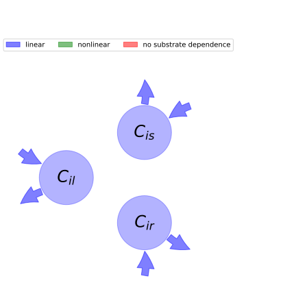

  
  
# General Overview  
  

 

This report is the result of the use of the python package bgc_md, as means to translate published models to a common language.  The underlying yaml file was created by Verónika Ceballos-Núñez (Orcid ID: 0000-0002-0046-1160) on 22/3/2016.  
  
  
  
## About the model  
  
The model depicted in this document considers carbon allocation with a process based approach. It was originally described by @Castanho2013Biogeosciences.  
  
  
  
### Space Scale  
  
Amazon region
  
  
Name|Description  
:-----|:-----  
$C_{il}$|Carbon in leaves of plant functional type (PFT) $i$  
$C_{is}$|Carbon in transport tissue (mainly stems) of PFT$_{i}$  
$C_{ir}$|Carbon in fine roots of PFT$_{i}$  
  Table: state_variables  
  
  
Name|Description|Unit  
:-----|:-----|:-----  
$S$|Percent sand in soil|$percentage$  
  Table: additional_variables  
  
  
Name|Description|Expression  
:-----|:-----|:-----:  
$x$|vector of states for vegetation|$x=\left[\begin{matrix}C_{il}\\C_{is}\\C_{ir}\end{matrix}\right]$  
$u$|scalar function of photosynthetic inputs|$u=NPP_{i}$  
$b$|vector of partitioning coefficients of photosynthetically fixed carbon|$b=\left[\begin{matrix}a_{il}\\a_{is}\\a_{ir}\end{matrix}\right]$  
$A$|matrix of turnover (cycling) rates|$A=\left[\begin{matrix}-\frac{1}{\tau_{il}} & 0 & 0\\0 & -\frac{1}{\tau_{is}} & 0\\0 & 0 & -\frac{1}{\tau_{ir}}\end{matrix}\right]$  
$f_{v}$|the righthandside of the ode|$f_{v}=u b + A x$  
  Table: components  
  
  
## Pool model representation  
  

 

 **Figure 1:** *Pool model representation* 

  
  
#### Input fluxes  
  
$C_{il}: NPP_{i}\cdot\left(0.44 - 0.0025\cdot S\right)$  
$C_{is}: NPP_{i}\cdot\left(0.423 - 0.0014\cdot S\right)$  
$C_{ir}: NPP_{i}\cdot\left(0.0039\cdot S + 0.137\right)$  

  
  
#### Output fluxes  
  
$C_{il}: \frac{C_{il}}{\tau_{il}}$  
$C_{is}: \frac{C_{is}}{\tau_{is}}$  
$C_{ir}: \frac{C_{ir}}{\tau_{ir}}$  
  
  
## Steady state formulas  
  
$C_il = NPP_{i}\cdot\tau_{il}\cdot\left(0.44 - 0.0025\cdot S\right)$  
  
  
  
$C_is = NPP_{i}\cdot\tau_{is}\cdot\left(0.423 - 0.0014\cdot S\right)$  
  
  
  
$C_ir = NPP_{i}\cdot\tau_{ir}\cdot\left(0.0039\cdot S + 0.137\right)$  
  
  
  
  
  
## References  
  
