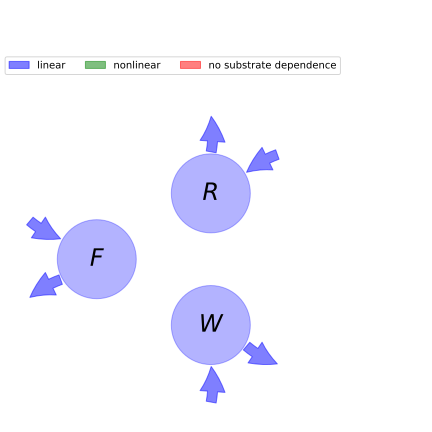

  
  
# General Overview  
  

 

This report is the result of the use of the python package bgc_md, as means to translate published models to a common language.  The underlying yaml file was created by Verónika Ceballos-Núñez (Orcid ID: 0000-0002-0046-1160) on 27/1/2016.  
  
  
  
## About the model  
  
The model depicted in this document considers carbon allocation with a process based approach. It was originally described by @Comins1993Ecological_Applications.  
  
  
  
### Space Scale  
  
global
  
  
Name|Description|Unit  
:-----|:-----|:-----  
$F$|Foliage carbon content per unit ground area at equilibrium|$Mg/ha$  
$R$|Root carbon|$Mg/ha$  
$W$|Carbon in woody tissue|$Mg/ha$  
  Table: state_variables  
The model section in the yaml file has no subsection: additional_variables.  
  
Name|Description|Expression  
:-----|:-----|:-----:  
$x$|vector of states for vegetation|$x=\left[\begin{matrix}F\\R\\W\end{matrix}\right]$  
$u$|scalar function of photosynthetic inputs|$u=G$  
$b$|vector of partitioning coefficients of photosynthetically fixed carbon|$b=\left[\begin{matrix}\eta_{f}\\\eta_{r}\\\eta_{w}\end{matrix}\right]$  
$A$|matrix of senescence (cycling) rates|$A=\left[\begin{matrix}-\gamma_{f} & 0 & 0\\0 & -\gamma_{r} & 0\\0 & 0 & -\gamma_{w}\end{matrix}\right]$  
$f_{v}$|the righthandside of the ode|$f_{v}=u b + A x$  
  Table: components  
  
  
## Pool model representation  
  

 

 **Figure 1:** *Pool model representation* 

  
  
#### Input fluxes  
  
$F: G\cdot\eta_{f}$  
$R: G\cdot\eta_{r}$  
$W: G\cdot\eta_{w}$  

  
  
#### Output fluxes  
  
$F: F\cdot\gamma_{f}$  
$R: R\cdot\gamma_{r}$  
$W: W\cdot\gamma_{w}$  
  
  
## Steady state formulas  
  
$F = \frac{G}{\gamma_{f}}\cdot\eta_{f}$  
  
  
  
$R = \frac{G}{\gamma_{r}}\cdot\eta_{r}$  
  
  
  
$W = \frac{G}{\gamma_{w}}\cdot\eta_{w}$  
  
  
  
  
  
## References  
  
