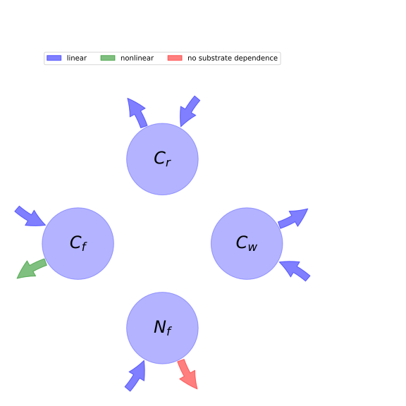

  
  
# General Overview  
  

 

This report is the result of the use of the python package bgc_md, as means to translate published models to a common language.  The underlying yaml file was created by Verónika Ceballos-Núñez (Orcid ID: 0000-0002-0046-1160) on 15/3/2016.  
  
  
  
## About the model  
  
The model depicted in this document considers carbon allocation with a process based approach. It was originally described by @DeAngelis2011TheoreticalEcology.  
  
  
  
### Space Scale  
  
global
  
  
### Available parameter values  
  
  
  
Abbreviation|Source  
:-----|:-----  
Original dataset of the publication|@DeAngelis2011TheoreticalEcology  
  Table:  Information on given parameter sets  
  
  
Name|Description|Unit  
:-----|:-----|:-----  
$C_{f}$|Foliage carbon content per unit ground area at equilibrium|$g\cdot m^{-2}$  
$C_{r}$|Fine root carbon|$g\cdot m^{-2}$  
$C_{w}$|Carbon in woody tissue|$g\cdot m^{-2}$  
$N_{f}$|Nitrogen in foliage|$g\cdot m^{-2}$  
$N_{pore}$|Soil pore water nutrient pool|$gN\cdot g^{-1}water$  
  Table: state_variables  
  
  
Name|Description|Expression|Unit  
:-----|:-----|:-----:|:-----  
$F_{i}$|Herbivore functional response|-|$gN\cdot m^{-2}\cdot day^{-1}$  
$N_{r}$|Nitrogen in roots|-|-  
$v_{f}$|N:C ratio in foliage|$v_{f}=\frac{N_{f}}{C_{f}}$|-  
$v_{r}$|N:C ratio in fine roots|$v_{r}=\frac{N_{r}}{C_{r}}$|-  
$N_{w}$|Nitrogen in wood|-|-  
$v_{w}$|N:C ratio in wood|$v_{w}=\frac{N_{w}}{C_{w}}$|-  
$v_{m}$|N:C ratio for reproductive propagules|-|-  
  Table: additional_variables  
  
  
Name|Description|Expression|Unit  
:-----|:-----|:-----:|:-----  
$G_{0}$|Maximum possible primary production, assuming all light is captured and photosynthesizing material (foliage) is operating optimally.|-|-  
$b_{f}$|Converts carbon per square meter to LAI|-|-  
$k_{f}$|Foliage light-extinction (Beer-Lambert law) coefficient|-|-  
$v_{0}$|Half-saturation constant for the effect of foliar nitrogen concentration on primary production|-|-  
$G$|Net carbon production or growth per unit time|$G=\frac{G_{0}\cdot v_{f}\cdot\left(1 - e^{- C_{f}\cdot b_{f}\cdot k_{f}}\right)}{v_{0} + v_{f}}$|$gC\cdot m^{-2}\cdot day^{-1}$  
  Table: photosynthetic_parameters  
  
  
Name|Description|Expression|Unit  
:-----|:-----|:-----:|:-----  
$g_{N}$|Maximum possible nutrient uptake rate|-|-  
$k_{N}$|Half-saturation constant for uptake of soil porewater N|-|-  
$k_{r}$|Coefficient analogous to k$_{f}$|-|-  
$b_{r}$|Coefficient of fine root length per unit C|-|-  
$U$|Nutrient uptake rate of plant available nutrient. Saturated response of uptake to soil porewater concentration is assumed|$U=\frac{N_{pore}\cdot g_{N}\cdot\left(1 - e^{- C_{r}\cdot b_{r}\cdot k_{r}}\right)}{N_{pore} + k_{N}}$|$gN\cdot m^{-2}\cdot day^{-1}$  
  Table: nutrient_uptake  
  
  
Name|Description|Expression  
:-----|:-----|:-----:  
$s_{f}$|Allocation ratio of wood to foliage|-  
$s_{r}$|Allocation ratio of wood to fine roots|-  
$\eta_{f}$|Allocation fraction to foliar biomass|-  
$\eta_{r}$|Allocation fraction to roots biomass|-  
$\eta_{w}$|Allocation fraction to wood (in stem, branches and large structurl roots) biomass|$\eta_{w}=\eta_{f}\cdot s_{f} +\eta_{r}\cdot s_{r}$  
$\eta_{m}$|Allocation fraction to reproduction|-  
$\eta_{d}$|Allocation fraction to plant defense|$\eta_{d}=-\eta_{f} -\eta_{m} -\eta_{r} -\eta_{w} + 1$  
  Table: allocation_coefficients  
  
  
Name|Description|Unit  
:-----|:-----|:-----  
$\gamma_{f}$|Foliage senescence rate|$day^{-1}$  
$\gamma_{r}$|Roots senescence rate|$day^{-1}$  
$\gamma_{w}$|Wood senescence rate|$day^{-1}$  
  Table: cycling_rates  
  
  
Name|Description|Expression  
:-----|:-----|:-----:  
$x$|vector of states for vegetation|$x=\left[\begin{matrix}C_{f}\\C_{r}\\C_{w}\\N_{f}\end{matrix}\right]$  
$u$|scalar function of photosynthetic inputs|$u=G$  
$b$|vector of partitioning coefficients of photosynthetically fixed carbon|$b=\left[\begin{matrix}\eta_{f}\\\eta_{r}\\\eta_{w}\\-\eta_{m}\cdot v_{m} -\eta_{r}\cdot v_{r} -\eta_{w}\cdot v_{w} +\frac{U}{G}\end{matrix}\right]$  
$A$|matrix of senescence (cycling) rates|$A=\left[\begin{matrix}-\frac{F_{i}}{N_{f}} -\gamma_{f} & 0 & 0 & 0\\0 & -\gamma_{r} & 0 & 0\\0 & 0 & -\gamma_{w} & 0\\0 & 0 & 0 & -\frac{F_{i}}{N_{f}} -\gamma_{f}\end{matrix}\right]$  
$f_{v}$|the righthandside of the ode|$f_{v}=u b + A x$  
  Table: components  
  
  
## Pool model representation  
  

 

 **Figure 1:** *Pool model representation* 

  
  
#### Input fluxes  
  
$C_{f}: \frac{G_{0}\cdot N_{f}\cdot\eta_{f}\cdot\left(1 - e^{- C_{f}\cdot b_{f}\cdot k_{f}}\right)}{C_{f}\cdot\left(v_{0} +\frac{N_{f}}{C_{f}}\right)}$  
$C_{r}: \frac{G_{0}\cdot N_{f}\cdot\eta_{r}\cdot\left(1 - e^{- C_{f}\cdot b_{f}\cdot k_{f}}\right)}{C_{f}\cdot\left(v_{0} +\frac{N_{f}}{C_{f}}\right)}$  
$C_{w}: \frac{G_{0}\cdot N_{f}\cdot\left(1 - e^{- C_{f}\cdot b_{f}\cdot k_{f}}\right)\cdot\left(\eta_{f}\cdot s_{f} +\eta_{r}\cdot s_{r}\right)}{C_{f}\cdot\left(v_{0} +\frac{N_{f}}{C_{f}}\right)}$  
$N_{f}: \frac{G_{0}\cdot N_{f}\cdot\left(1 - e^{- C_{f}\cdot b_{f}\cdot k_{f}}\right)\cdot\left(\frac{C_{f}\cdot N_{pore}\cdot g_{N}\cdot\left(1 - e^{- C_{r}\cdot b_{r}\cdot k_{r}}\right)\cdot\left(v_{0} +\frac{N_{f}}{C_{f}}\right)}{G_{0}\cdot N_{f}\cdot\left(1 - e^{- C_{f}\cdot b_{f}\cdot k_{f}}\right)\cdot\left(N_{pore} + k_{N}\right)} -\eta_{m}\cdot v_{m} -\frac{N_{w}\cdot\left(\eta_{f}\cdot s_{f} +\eta_{r}\cdot s_{r}\right)}{C_{w}} -\frac{N_{r}\cdot\eta_{r}}{C_{r}}\right)}{C_{f}\cdot\left(v_{0} +\frac{N_{f}}{C_{f}}\right)}$  

  
  
#### Output fluxes  
  
$C_{f}: \frac{C_{f}\cdot\left(F_{i} + N_{f}\cdot\gamma_{f}\right)}{N_{f}}$  
$C_{r}: C_{r}\cdot\gamma_{r}$  
$C_{w}: C_{w}\cdot\gamma_{w}$  
$N_{f}: F_{i} + N_{f}\cdot\gamma_{f}$  
  
  
## References  
  
