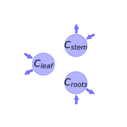

  
  
# General Overview  
  

 

This report is the result of the use of the python package bgc_md, as means to translate published models to a common language.  The underlying yaml file was created by Verónika Ceballos-Núñez (Orcid ID: 0000-0002-0046-1160) on 3/5/2018.  
  
  
  
## About the model  
  
The model depicted in this document considers carbon allocation with a process based approach. It was originally described by @Arora2005GlobalChangeBiology.  
  
  
  
### Space Scale  
  
regional
  
  
Name|Description|Unit  
:-----|:-----|:-----  
$C_{leaf}$|Amount of carbon for the leaf|$kgC\cdot m^{-2}$  
$C_{stem}$|Amount of carbon for the stem|$kgC\cdot m^{-2}$  
$C_{roots}$|Amount of carbon for the root|$kgC\cdot m^{-2}$  
  Table: state_variables  
  
  
Name|Description|Unit  
:-----|:-----|:-----  
$k_{leaf}$|\text{None}|-  
$cn_{leaf}$|\text{None}|-  
$k_{stem}$|\text{None}|-  
$cn_{stem}$|\text{None}|-  
$k_{roots}$|\text{None}|-  
$cn_{roots}$|\text{None}|-  
$gt$|Function of Q_10 and temperature|-  
$teta$|\text{None}|-  
  Table: additional_variables  
  
  
Name|Description|Unit  
:-----|:-----|:-----  
$t$|time step|$year$  
$GPP$|Carbon gain via photosynthesis (Gross Primary Productivity, GPP)|$KgC\cdot m^{−2}\cdot yr^{−1}$  
$NPP$|Net primary Productivity (NPP)|$KgC\cdot m^{−2}\cdot yr^{−1}$  
  Table: photosynthetic_parameters  
  
  
Name|Description|Expression  
:-----|:-----|:-----:  
$R_{leaf}$|Leaf respiration|$R_{leaf}=\frac{C_{leaf}\cdot gt\cdot k_{leaf}\cdot teta}{cn_{leaf}}$  
$R_{stem}$|Stem respiration|$R_{stem}=\frac{C_{stem}\cdot gt\cdot k_{stem}\cdot teta}{cn_{stem}}$  
$R_{roots}$|Roots respiration|$R_{roots}=\frac{C_{roots}\cdot gt\cdot k_{roots}\cdot teta}{cn_{roots}}$  
  Table: respiration  
  
  
Name|Description|Expression|Unit  
:-----|:-----|:-----:|:-----  
$Allo_{fact stem}$|\text{None}|-|-  
$Allo_{fact roots}$|\text{None}|-|-  
$Allo_{fact leaf}$|\text{None}|$Allo_{fact leaf}=- Allo_{fact roots} - Allo_{fact stem} + 1$|-  
$a_{L}$|Parameter introduced by the author of this entry in order to summarize equations on the paper.|$a_{L}=\begin{cases} Allo_{fact leaf}\cdot GPP - R_{leaf} &\text{for}\: NPP < 0\\Allo_{fact leaf}\cdot NPP &\text{for}\: NPP > 0\end{cases}$|-  
$a_{S}$|Parameter introduced by the author of this entry in order to summarize equations on the paper.|$a_{S}=\begin{cases} Allo_{fact stem}\cdot GPP - R_{stem} &\text{for}\: NPP < 0\\Allo_{fact stem}\cdot NPP &\text{for}\: NPP > 0\end{cases}$|-  
$a_{R}$|Parameter introduced by the author of this entry in order to summarize equations on the paper.|$a_{R}=\begin{cases} Allo_{fact roots}\cdot GPP - R_{roots} &\text{for}\: NPP < 0\\Allo_{fact roots}\cdot NPP &\text{for}\: NPP > 0\end{cases}$|-  
  Table: partitioning  
  
  
Name|Description|Unit  
:-----|:-----|:-----  
$Y_{leaf}$|Litter production|$year$  
$Y_{stem}$|Litter production|$year$  
$Y_{roots}$|Litter production|$year$  
  Table: litter  
  
  
Name|Description|Expression  
:-----|:-----|:-----:  
$x$|vector of states for vegetation|$x=\left[\begin{matrix}C_{leaf}\\C_{stem}\\C_{roots}\end{matrix}\right]$  
$u$|Vector of functions of photosynthetic inputs|$u=\left[\begin{matrix}a_{L}\\a_{S}\\a_{R}\end{matrix}\right]$  
$A$|matrix of cycling rates|$A=\left[\begin{matrix}-\frac{1}{Y_{leaf}} & 0 & 0\\0 & -\frac{1}{Y_{stem}} & 0\\0 & 0 & -\frac{1}{Y_{roots}}\end{matrix}\right]$  
$f_{v}$|the righthandside of the ode|$f_{v}=A x + u$  
  Table: components  
  
  
## Pool model representation  
  

 

 **Figure 1:** *Pool model representation* 

  
  
#### Input fluxes  
  
$C_{leaf}: \begin{cases} -\frac{C_{leaf}\cdot gt\cdot k_{leaf}\cdot teta}{cn_{leaf}} + GPP\cdot\left(- Allo_{fact roots} - Allo_{fact stem} + 1\right) &\text{for}\: NPP < 0\\NPP\cdot\left(- Allo_{fact roots} - Allo_{fact stem} + 1\right) &\text{for}\: NPP > 0\end{cases}$  
$C_{stem}: \begin{cases} Allo_{fact stem}\cdot GPP -\frac{C_{stem}\cdot gt\cdot k_{stem}\cdot teta}{cn_{stem}} &\text{for}\: NPP < 0\\Allo_{fact stem}\cdot NPP &\text{for}\: NPP > 0\end{cases}$  
$C_{roots}: \begin{cases} Allo_{fact roots}\cdot GPP -\frac{C_{roots}\cdot gt\cdot k_{roots}\cdot teta}{cn_{roots}} &\text{for}\: NPP < 0\\Allo_{fact roots}\cdot NPP &\text{for}\: NPP > 0\end{cases}$  

  
  
#### Output fluxes  
  
$C_{leaf}: \frac{C_{leaf}}{Y_{leaf}}$  
$C_{stem}: \frac{C_{stem}}{Y_{stem}}$  
$C_{roots}: \frac{C_{roots}}{Y_{roots}}$  
  
  
## References  
  
