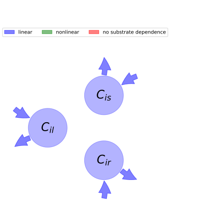

  
  
# General Overview  
  

 

This report is the result of the use of the python package bgc_md, as means to translate published models to a common language.  The underlying yaml file was created by Verónika Ceballos-Núñez (Orcid ID: 0000-0002-0046-1160) on 26/1/2016.  
  
  
  
## About the model  
  
The model depicted in this document considers carbon allocation with a process based approach. It was originally described by @Foley1996GlobalBiogeochemicalCycles.  
  
  
  
### Space Scale  
  
global
  
  
### Available parameter values  
  
  
  
Abbreviation|Source  
:-----|:-----  
Tropical evergreen trees|@Foley1996GlobalBiogeochemicalCycles  
  Table:  Information on given parameter sets  
  
  
Name|Description  
:-----|:-----  
$C_{il}$|Carbon in leaves of plant functional type (PFT) i  
$C_{is}$|Carbon in transport tissue (mainly stems) of PFT$_{i}$  
$C_{ir}$|Carbon in fine roots of PFT$_{i}$  
  Table: state_variables  
The model section in the yaml file has no subsection: additional_variables.  
  
Name|Description|Expression  
:-----|:-----|:-----:  
$x$|vector of states for vegetation|$x=\left[\begin{matrix}C_{il}\\C_{is}\\C_{ir}\end{matrix}\right]$  
$u$|scalar function of photosynthetic inputs|$u=NPP_{i}$  
$b$|vector of partitioning coefficients of photosynthetically fixed carbon|$b=\left[\begin{matrix}a_{il}\\a_{is}\\a_{ir}\end{matrix}\right]$  
$A$|matrix of turnover (cycling) rates|$A=\left[\begin{matrix}-\frac{1}{\tau_{il}} & 0 & 0\\0 & -\frac{1}{\tau_{is}} & 0\\0 & 0 & -\frac{1}{\tau_{ir}}\end{matrix}\right]$  
$f_{v}$|the righthandside of the ode|$f_{v}=u b + A x$  
  Table: components  
  
  
## Pool model representation  
  

 

 **Figure 1:** *Pool model representation* 

  
  
#### Input fluxes  
  
$C_{il}: a_{il}\cdot\left(1 -\eta\right)\cdot\left(\begin{cases} t\cdot\left(- B_{root}\cdot C_{ir}\cdot e^{E_{0}\cdot\left(-\frac{1}{- T_{0} + T_{soil}} +\frac{1}{15 - T_{0}}\right)} - B_{stem}\cdot C_{is}\cdot\lambda_{sapwood}\cdot e^{E_{0}\cdot\left(-\frac{1}{- T_{0} + T_{stem}} +\frac{1}{15 - T_{0}}\right)} +\frac{Q_{p}\cdot\alpha_{3}\cdot\left(C_{i} -\frac{O_{2}}{2\cdot\tau}\right)}{C_{i} +\frac{O_{2}}{\tau}} - V_{m}\cdot\gamma\right) &\text{for}\:\left(\frac{Q_{p}\cdot\alpha_{3}\cdot\left(C_{i} -\frac{O_{2}}{2\cdot\tau}\right)}{C_{i} +\frac{O_{2}}{\tau}}{\leq}\frac{V_{m}\cdot\left(C_{i} -\frac{O_{2}}{2\cdot\tau}\right)}{C_{i} + K_{c}\cdot\left(1 +\frac{O_{2}}{K_{o}}\right)}\wedge\frac{Q_{p}\cdot\alpha_{3}\cdot\left(C_{i} -\frac{O_{2}}{2\cdot\tau}\right)}{C_{i} +\frac{O_{2}}{\tau}}{\leq} 0.365853658536585\cdot V_{m}\cdot\left(1 -\frac{O_{2}}{2\cdot C_{i}\cdot\tau}\right) +\frac{J_{p}\cdot O_{2}}{2\cdot C_{i}\cdot\tau}\right)\vee\left(\frac{V_{m}\cdot\left(C_{i} -\frac{O_{2}}{2\cdot\tau}\right)}{C_{i} + K_{c}\cdot\left(1 +\frac{O_{2}}{K_{o}}\right)}{\leq} 0.365853658536585\cdot V_{m}\cdot\left(1 -\frac{O_{2}}{2\cdot C_{i}\cdot\tau}\right) +\frac{J_{p}\cdot O_{2}}{2\cdot C_{i}\cdot\tau}\wedge\frac{Q_{p}\cdot\alpha_{3}\cdot\left(C_{i} -\frac{O_{2}}{2\cdot\tau}\right)}{C_{i} +\frac{O_{2}}{\tau}}{\leq}\frac{V_{m}\cdot\left(C_{i} -\frac{O_{2}}{2\cdot\tau}\right)}{C_{i} + K_{c}\cdot\left(1 +\frac{O_{2}}{K_{o}}\right)}\wedge\frac{Q_{p}\cdot\alpha_{3}\cdot\left(C_{i} -\frac{O_{2}}{2\cdot\tau}\right)}{C_{i} +\frac{O_{2}}{\tau}}{\leq} 0.365853658536585\cdot V_{m}\cdot\left(1 -\frac{O_{2}}{2\cdot C_{i}\cdot\tau}\right) +\frac{J_{p}\cdot O_{2}}{2\cdot C_{i}\cdot\tau}\right)\\t\cdot\left(- B_{root}\cdot C_{ir}\cdot e^{E_{0}\cdot\left(-\frac{1}{- T_{0} + T_{soil}} +\frac{1}{15 - T_{0}}\right)} - B_{stem}\cdot C_{is}\cdot\lambda_{sapwood}\cdot e^{E_{0}\cdot\left(-\frac{1}{- T_{0} + T_{stem}} +\frac{1}{15 - T_{0}}\right)} - V_{m}\cdot\gamma +\frac{V_{m}\cdot\left(C_{i} -\frac{O_{2}}{2\cdot\tau}\right)}{C_{i} + K_{c}\cdot\left(1 +\frac{O_{2}}{K_{o}}\right)}\right) &\text{for}\:\left(\frac{V_{m}\cdot\left(C_{i} -\frac{O_{2}}{2\cdot\tau}\right)}{C_{i} + K_{c}\cdot\left(1 +\frac{O_{2}}{K_{o}}\right)}{\leq} 0.365853658536585\cdot V_{m}\cdot\left(1 -\frac{O_{2}}{2\cdot C_{i}\cdot\tau}\right) +\frac{J_{p}\cdot O_{2}}{2\cdot C_{i}\cdot\tau}\wedge\frac{Q_{p}\cdot\alpha_{3}\cdot\left(C_{i} -\frac{O_{2}}{2\cdot\tau}\right)}{C_{i} +\frac{O_{2}}{\tau}}{\leq}\frac{V_{m}\cdot\left(C_{i} -\frac{O_{2}}{2\cdot\tau}\right)}{C_{i} + K_{c}\cdot\left(1 +\frac{O_{2}}{K_{o}}\right)}\right)\vee\left(\frac{V_{m}\cdot\left(C_{i} -\frac{O_{2}}{2\cdot\tau}\right)}{C_{i} + K_{c}\cdot\left(1 +\frac{O_{2}}{K_{o}}\right)}{\leq} 0.365853658536585\cdot V_{m}\cdot\left(1 -\frac{O_{2}}{2\cdot C_{i}\cdot\tau}\right) +\frac{J_{p}\cdot O_{2}}{2\cdot C_{i}\cdot\tau}\wedge\frac{Q_{p}\cdot\alpha_{3}\cdot\left(C_{i} -\frac{O_{2}}{2\cdot\tau}\right)}{C_{i} +\frac{O_{2}}{\tau}}{\leq} 0.365853658536585\cdot V_{m}\cdot\left(1 -\frac{O_{2}}{2\cdot C_{i}\cdot\tau}\right) +\frac{J_{p}\cdot O_{2}}{2\cdot C_{i}\cdot\tau}\right)\vee\frac{V_{m}\cdot\left(C_{i} -\frac{O_{2}}{2\cdot\tau}\right)}{C_{i} + K_{c}\cdot\left(1 +\frac{O_{2}}{K_{o}}\right)}{\leq} 0.365853658536585\cdot V_{m}\cdot\left(1 -\frac{O_{2}}{2\cdot C_{i}\cdot\tau}\right) +\frac{J_{p}\cdot O_{2}}{2\cdot C_{i}\cdot\tau}\\t\cdot\left(- B_{root}\cdot C_{ir}\cdot e^{E_{0}\cdot\left(-\frac{1}{- T_{0} + T_{soil}} +\frac{1}{15 - T_{0}}\right)} - B_{stem}\cdot C_{is}\cdot\lambda_{sapwood}\cdot e^{E_{0}\cdot\left(-\frac{1}{- T_{0} + T_{stem}} +\frac{1}{15 - T_{0}}\right)} - V_{m}\cdot\gamma + 0.365853658536585\cdot V_{m}\cdot\left(1 -\frac{O_{2}}{2\cdot C_{i}\cdot\tau}\right) +\frac{J_{p}\cdot O_{2}}{2\cdot C_{i}\cdot\tau}\right) &\text{otherwise}\end{cases}\right)$  
$C_{is}: a_{is}\cdot\left(1 -\eta\right)\cdot\left(\begin{cases} t\cdot\left(- B_{root}\cdot C_{ir}\cdot e^{E_{0}\cdot\left(-\frac{1}{- T_{0} + T_{soil}} +\frac{1}{15 - T_{0}}\right)} - B_{stem}\cdot C_{is}\cdot\lambda_{sapwood}\cdot e^{E_{0}\cdot\left(-\frac{1}{- T_{0} + T_{stem}} +\frac{1}{15 - T_{0}}\right)} +\frac{Q_{p}\cdot\alpha_{3}\cdot\left(C_{i} -\frac{O_{2}}{2\cdot\tau}\right)}{C_{i} +\frac{O_{2}}{\tau}} - V_{m}\cdot\gamma\right) &\text{for}\:\left(\frac{Q_{p}\cdot\alpha_{3}\cdot\left(C_{i} -\frac{O_{2}}{2\cdot\tau}\right)}{C_{i} +\frac{O_{2}}{\tau}}{\leq}\frac{V_{m}\cdot\left(C_{i} -\frac{O_{2}}{2\cdot\tau}\right)}{C_{i} + K_{c}\cdot\left(1 +\frac{O_{2}}{K_{o}}\right)}\wedge\frac{Q_{p}\cdot\alpha_{3}\cdot\left(C_{i} -\frac{O_{2}}{2\cdot\tau}\right)}{C_{i} +\frac{O_{2}}{\tau}}{\leq} 0.365853658536585\cdot V_{m}\cdot\left(1 -\frac{O_{2}}{2\cdot C_{i}\cdot\tau}\right) +\frac{J_{p}\cdot O_{2}}{2\cdot C_{i}\cdot\tau}\right)\vee\left(\frac{V_{m}\cdot\left(C_{i} -\frac{O_{2}}{2\cdot\tau}\right)}{C_{i} + K_{c}\cdot\left(1 +\frac{O_{2}}{K_{o}}\right)}{\leq} 0.365853658536585\cdot V_{m}\cdot\left(1 -\frac{O_{2}}{2\cdot C_{i}\cdot\tau}\right) +\frac{J_{p}\cdot O_{2}}{2\cdot C_{i}\cdot\tau}\wedge\frac{Q_{p}\cdot\alpha_{3}\cdot\left(C_{i} -\frac{O_{2}}{2\cdot\tau}\right)}{C_{i} +\frac{O_{2}}{\tau}}{\leq}\frac{V_{m}\cdot\left(C_{i} -\frac{O_{2}}{2\cdot\tau}\right)}{C_{i} + K_{c}\cdot\left(1 +\frac{O_{2}}{K_{o}}\right)}\wedge\frac{Q_{p}\cdot\alpha_{3}\cdot\left(C_{i} -\frac{O_{2}}{2\cdot\tau}\right)}{C_{i} +\frac{O_{2}}{\tau}}{\leq} 0.365853658536585\cdot V_{m}\cdot\left(1 -\frac{O_{2}}{2\cdot C_{i}\cdot\tau}\right) +\frac{J_{p}\cdot O_{2}}{2\cdot C_{i}\cdot\tau}\right)\\t\cdot\left(- B_{root}\cdot C_{ir}\cdot e^{E_{0}\cdot\left(-\frac{1}{- T_{0} + T_{soil}} +\frac{1}{15 - T_{0}}\right)} - B_{stem}\cdot C_{is}\cdot\lambda_{sapwood}\cdot e^{E_{0}\cdot\left(-\frac{1}{- T_{0} + T_{stem}} +\frac{1}{15 - T_{0}}\right)} - V_{m}\cdot\gamma +\frac{V_{m}\cdot\left(C_{i} -\frac{O_{2}}{2\cdot\tau}\right)}{C_{i} + K_{c}\cdot\left(1 +\frac{O_{2}}{K_{o}}\right)}\right) &\text{for}\:\left(\frac{V_{m}\cdot\left(C_{i} -\frac{O_{2}}{2\cdot\tau}\right)}{C_{i} + K_{c}\cdot\left(1 +\frac{O_{2}}{K_{o}}\right)}{\leq} 0.365853658536585\cdot V_{m}\cdot\left(1 -\frac{O_{2}}{2\cdot C_{i}\cdot\tau}\right) +\frac{J_{p}\cdot O_{2}}{2\cdot C_{i}\cdot\tau}\wedge\frac{Q_{p}\cdot\alpha_{3}\cdot\left(C_{i} -\frac{O_{2}}{2\cdot\tau}\right)}{C_{i} +\frac{O_{2}}{\tau}}{\leq}\frac{V_{m}\cdot\left(C_{i} -\frac{O_{2}}{2\cdot\tau}\right)}{C_{i} + K_{c}\cdot\left(1 +\frac{O_{2}}{K_{o}}\right)}\right)\vee\left(\frac{V_{m}\cdot\left(C_{i} -\frac{O_{2}}{2\cdot\tau}\right)}{C_{i} + K_{c}\cdot\left(1 +\frac{O_{2}}{K_{o}}\right)}{\leq} 0.365853658536585\cdot V_{m}\cdot\left(1 -\frac{O_{2}}{2\cdot C_{i}\cdot\tau}\right) +\frac{J_{p}\cdot O_{2}}{2\cdot C_{i}\cdot\tau}\wedge\frac{Q_{p}\cdot\alpha_{3}\cdot\left(C_{i} -\frac{O_{2}}{2\cdot\tau}\right)}{C_{i} +\frac{O_{2}}{\tau}}{\leq} 0.365853658536585\cdot V_{m}\cdot\left(1 -\frac{O_{2}}{2\cdot C_{i}\cdot\tau}\right) +\frac{J_{p}\cdot O_{2}}{2\cdot C_{i}\cdot\tau}\right)\vee\frac{V_{m}\cdot\left(C_{i} -\frac{O_{2}}{2\cdot\tau}\right)}{C_{i} + K_{c}\cdot\left(1 +\frac{O_{2}}{K_{o}}\right)}{\leq} 0.365853658536585\cdot V_{m}\cdot\left(1 -\frac{O_{2}}{2\cdot C_{i}\cdot\tau}\right) +\frac{J_{p}\cdot O_{2}}{2\cdot C_{i}\cdot\tau}\\t\cdot\left(- B_{root}\cdot C_{ir}\cdot e^{E_{0}\cdot\left(-\frac{1}{- T_{0} + T_{soil}} +\frac{1}{15 - T_{0}}\right)} - B_{stem}\cdot C_{is}\cdot\lambda_{sapwood}\cdot e^{E_{0}\cdot\left(-\frac{1}{- T_{0} + T_{stem}} +\frac{1}{15 - T_{0}}\right)} - V_{m}\cdot\gamma + 0.365853658536585\cdot V_{m}\cdot\left(1 -\frac{O_{2}}{2\cdot C_{i}\cdot\tau}\right) +\frac{J_{p}\cdot O_{2}}{2\cdot C_{i}\cdot\tau}\right) &\text{otherwise}\end{cases}\right)$  
$C_{ir}: a_{ir}\cdot\left(1 -\eta\right)\cdot\left(\begin{cases} t\cdot\left(- B_{root}\cdot C_{ir}\cdot e^{E_{0}\cdot\left(-\frac{1}{- T_{0} + T_{soil}} +\frac{1}{15 - T_{0}}\right)} - B_{stem}\cdot C_{is}\cdot\lambda_{sapwood}\cdot e^{E_{0}\cdot\left(-\frac{1}{- T_{0} + T_{stem}} +\frac{1}{15 - T_{0}}\right)} +\frac{Q_{p}\cdot\alpha_{3}\cdot\left(C_{i} -\frac{O_{2}}{2\cdot\tau}\right)}{C_{i} +\frac{O_{2}}{\tau}} - V_{m}\cdot\gamma\right) &\text{for}\:\left(\frac{Q_{p}\cdot\alpha_{3}\cdot\left(C_{i} -\frac{O_{2}}{2\cdot\tau}\right)}{C_{i} +\frac{O_{2}}{\tau}}{\leq}\frac{V_{m}\cdot\left(C_{i} -\frac{O_{2}}{2\cdot\tau}\right)}{C_{i} + K_{c}\cdot\left(1 +\frac{O_{2}}{K_{o}}\right)}\wedge\frac{Q_{p}\cdot\alpha_{3}\cdot\left(C_{i} -\frac{O_{2}}{2\cdot\tau}\right)}{C_{i} +\frac{O_{2}}{\tau}}{\leq} 0.365853658536585\cdot V_{m}\cdot\left(1 -\frac{O_{2}}{2\cdot C_{i}\cdot\tau}\right) +\frac{J_{p}\cdot O_{2}}{2\cdot C_{i}\cdot\tau}\right)\vee\left(\frac{V_{m}\cdot\left(C_{i} -\frac{O_{2}}{2\cdot\tau}\right)}{C_{i} + K_{c}\cdot\left(1 +\frac{O_{2}}{K_{o}}\right)}{\leq} 0.365853658536585\cdot V_{m}\cdot\left(1 -\frac{O_{2}}{2\cdot C_{i}\cdot\tau}\right) +\frac{J_{p}\cdot O_{2}}{2\cdot C_{i}\cdot\tau}\wedge\frac{Q_{p}\cdot\alpha_{3}\cdot\left(C_{i} -\frac{O_{2}}{2\cdot\tau}\right)}{C_{i} +\frac{O_{2}}{\tau}}{\leq}\frac{V_{m}\cdot\left(C_{i} -\frac{O_{2}}{2\cdot\tau}\right)}{C_{i} + K_{c}\cdot\left(1 +\frac{O_{2}}{K_{o}}\right)}\wedge\frac{Q_{p}\cdot\alpha_{3}\cdot\left(C_{i} -\frac{O_{2}}{2\cdot\tau}\right)}{C_{i} +\frac{O_{2}}{\tau}}{\leq} 0.365853658536585\cdot V_{m}\cdot\left(1 -\frac{O_{2}}{2\cdot C_{i}\cdot\tau}\right) +\frac{J_{p}\cdot O_{2}}{2\cdot C_{i}\cdot\tau}\right)\\t\cdot\left(- B_{root}\cdot C_{ir}\cdot e^{E_{0}\cdot\left(-\frac{1}{- T_{0} + T_{soil}} +\frac{1}{15 - T_{0}}\right)} - B_{stem}\cdot C_{is}\cdot\lambda_{sapwood}\cdot e^{E_{0}\cdot\left(-\frac{1}{- T_{0} + T_{stem}} +\frac{1}{15 - T_{0}}\right)} - V_{m}\cdot\gamma +\frac{V_{m}\cdot\left(C_{i} -\frac{O_{2}}{2\cdot\tau}\right)}{C_{i} + K_{c}\cdot\left(1 +\frac{O_{2}}{K_{o}}\right)}\right) &\text{for}\:\left(\frac{V_{m}\cdot\left(C_{i} -\frac{O_{2}}{2\cdot\tau}\right)}{C_{i} + K_{c}\cdot\left(1 +\frac{O_{2}}{K_{o}}\right)}{\leq} 0.365853658536585\cdot V_{m}\cdot\left(1 -\frac{O_{2}}{2\cdot C_{i}\cdot\tau}\right) +\frac{J_{p}\cdot O_{2}}{2\cdot C_{i}\cdot\tau}\wedge\frac{Q_{p}\cdot\alpha_{3}\cdot\left(C_{i} -\frac{O_{2}}{2\cdot\tau}\right)}{C_{i} +\frac{O_{2}}{\tau}}{\leq}\frac{V_{m}\cdot\left(C_{i} -\frac{O_{2}}{2\cdot\tau}\right)}{C_{i} + K_{c}\cdot\left(1 +\frac{O_{2}}{K_{o}}\right)}\right)\vee\left(\frac{V_{m}\cdot\left(C_{i} -\frac{O_{2}}{2\cdot\tau}\right)}{C_{i} + K_{c}\cdot\left(1 +\frac{O_{2}}{K_{o}}\right)}{\leq} 0.365853658536585\cdot V_{m}\cdot\left(1 -\frac{O_{2}}{2\cdot C_{i}\cdot\tau}\right) +\frac{J_{p}\cdot O_{2}}{2\cdot C_{i}\cdot\tau}\wedge\frac{Q_{p}\cdot\alpha_{3}\cdot\left(C_{i} -\frac{O_{2}}{2\cdot\tau}\right)}{C_{i} +\frac{O_{2}}{\tau}}{\leq} 0.365853658536585\cdot V_{m}\cdot\left(1 -\frac{O_{2}}{2\cdot C_{i}\cdot\tau}\right) +\frac{J_{p}\cdot O_{2}}{2\cdot C_{i}\cdot\tau}\right)\vee\frac{V_{m}\cdot\left(C_{i} -\frac{O_{2}}{2\cdot\tau}\right)}{C_{i} + K_{c}\cdot\left(1 +\frac{O_{2}}{K_{o}}\right)}{\leq} 0.365853658536585\cdot V_{m}\cdot\left(1 -\frac{O_{2}}{2\cdot C_{i}\cdot\tau}\right) +\frac{J_{p}\cdot O_{2}}{2\cdot C_{i}\cdot\tau}\\t\cdot\left(- B_{root}\cdot C_{ir}\cdot e^{E_{0}\cdot\left(-\frac{1}{- T_{0} + T_{soil}} +\frac{1}{15 - T_{0}}\right)} - B_{stem}\cdot C_{is}\cdot\lambda_{sapwood}\cdot e^{E_{0}\cdot\left(-\frac{1}{- T_{0} + T_{stem}} +\frac{1}{15 - T_{0}}\right)} - V_{m}\cdot\gamma + 0.365853658536585\cdot V_{m}\cdot\left(1 -\frac{O_{2}}{2\cdot C_{i}\cdot\tau}\right) +\frac{J_{p}\cdot O_{2}}{2\cdot C_{i}\cdot\tau}\right) &\text{otherwise}\end{cases}\right)$  

  
  
#### Output fluxes  
  
$C_{il}: \frac{C_{il}}{\tau_{il}}$  
$C_{is}: \frac{C_{is}}{\tau_{is}}$  
$C_{ir}: \frac{C_{ir}}{\tau_{ir}}$  
  
  
## References  
  
