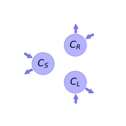

  
  
# General Overview  
  

 

This report is the result of the use of the python package bgc_md, as means to translate published models to a common language.  The underlying yaml file was created by Verónika Ceballos-Núñez (Orcid ID: 0000-0002-0046-1160) on \text{None}.  
  
  
  
## About the model  
  
The model depicted in this document considers carbon allocation with a process based approach. It was originally described by @Gu2010EcologicalComplexity.  
  
  
  
### Space Scale  
  
forest
  
  
Name|Description|Unit  
:-----|:-----|:-----  
$C_{S}$|Carbon in stem|-  
$C_{R}$|Carbon in root|-  
$C_{L}$|Carbon in leaf|-  
  Table: state_variables  
The model section in the yaml file has no subsection: additional_variables.  
  
Name|Description|Expression  
:-----|:-----|:-----:  
$x$|vector of states for vegetation|$x=\left[\begin{matrix}C_{S}\\C_{R}\\C_{L}\end{matrix}\right]$  
$u$|scalar function of photosynthetic inputs|$u=NPP$  
$b$|vector of partitioning coefficients of photosynthetically fixed carbon|$b=\left[\begin{matrix}a_{S}\\a_{R}\\a_{L}\end{matrix}\right]$  
$A$|matrix of cycling rates|$A=\left[\begin{matrix}-\gamma_{S} & 0 & 0\\0 & -\gamma_{R} & 0\\0 & 0 & -\gamma_{L}\end{matrix}\right]$  
$f_{v}$|the righthandside of the ode|$f_{v}=u b + A x$  
  Table: components  
  
  
## Pool model representation  
  

 

 **Figure 1:** *Pool model representation* 

  
  
#### Input fluxes  
  
$C_{S}: \frac{NPP\cdot\left(\Omega\cdot\left(- L - 0.5\cdot N_{ava} + 1.5\right) +\epsilon_{S}\right)}{\Omega\cdot\left(- L - N_{ava} - W + 3\right) + 1}$  
$C_{R}: \frac{NPP\cdot\left(\Omega\cdot\left(- 0.5\cdot N_{ava} - W + 1.5\right) +\epsilon_{R}\right)}{\Omega\cdot\left(- L - N_{ava} - W + 3\right) + 1}$  
$C_{L}: \frac{NPP\cdot\left(-\epsilon_{R} -\epsilon_{S} + 1\right)}{\Omega\cdot\left(- L - N_{ava} - W + 3\right) + 1}$  

  
  
#### Output fluxes  
  
$C_{S}: C_{S}\cdot\gamma_{S}$  
$C_{R}: C_{R}\cdot\gamma_{R}$  
$C_{L}: C_{L}\cdot\gamma_{L}$  
  
  
## Steady state formulas  
  
$C_S = \frac{0.5\cdot NPP\cdot\left(2.0\cdot L\cdot\Omega + N_{ava}\cdot\Omega - 3.0\cdot\Omega - 2.0\cdot\epsilon_{S}\right)}{\gamma_{S}\cdot\left(L\cdot\Omega + N_{ava}\cdot\Omega +\Omega\cdot W - 3.0\cdot\Omega - 1.0\right)}$  
  
  
  
$C_R = \frac{0.5\cdot NPP\cdot\left(N_{ava}\cdot\Omega + 2.0\cdot\Omega\cdot W - 3.0\cdot\Omega - 2.0\cdot\epsilon_{R}\right)}{\gamma_{R}\cdot\left(L\cdot\Omega + N_{ava}\cdot\Omega +\Omega\cdot W - 3.0\cdot\Omega - 1.0\right)}$  
  
  
  
$C_L = \frac{NPP\cdot\left(\epsilon_{R} +\epsilon_{S} - 1.0\right)}{\gamma_{L}\cdot\left(L\cdot\Omega + N_{ava}\cdot\Omega +\Omega\cdot W - 3.0\cdot\Omega - 1.0\right)}$  
  
  
  
  
  
## References  
  
