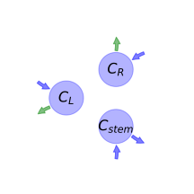
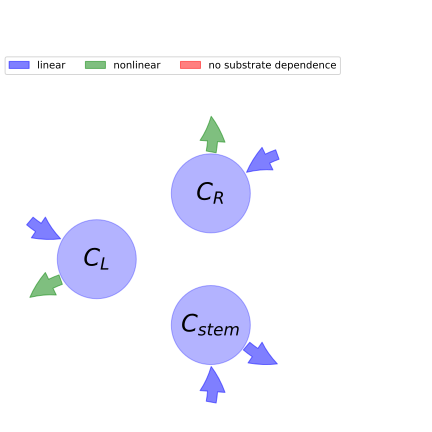

  
  
# General Overview  
  

 

This report is the result of the use of the python package bgc_md, as means to translate published models to a common language.  The underlying yaml file was created by Verónika Ceballos-Núñez (Orcid ID: 0000-0002-0046-1160) on \text{None}.  
  
  
  
## About the model  
  
The model depicted in this document considers carbon allocation with a process based approach. It was originally described by @Haverd2016Biogeosciences.  
  
  
  
Name|Description|Unit  
:-----|:-----|:-----  
$C_{L}$|Leaf biomass|$molC\cdot m^{-2}$  
$C_{R}$|Fine roots biomass|$molC\cdot m^{-2}$  
$C_{stem}$|Trunk and coarse roots|$molC\cdot m^{-2}$  
  Table: state_variables  
The model section in the yaml file has no subsection: additional_variables.  
  
Name|Description|Expression  
:-----|:-----|:-----:  
$x$|vector of states for vegetation|$x=\left[\begin{matrix}C_{L}\\C_{R}\\C_{stem}\end{matrix}\right]$  
$u$|scalar function of photosynthetic inputs|$u=F_{Cgrowth}$  
$\beta$|vector of partitioning coefficients of photosynthetically fixed carbon|$\beta=\left[\begin{matrix}\alpha_{L}\\\alpha_{R}\\\alpha_{stem}\end{matrix}\right]$  
$B$|matrix of cycling rates|$B=\left[\begin{matrix}- k_{L} -\frac{m_{stem}}{C_{stem}} & 0 & 0\\0 & - k_{R} -\frac{m_{stem}}{C_{stem}} & 0\\0 & 0 & - m_{stem}\end{matrix}\right]$  
$f_{v}$|the righthandside of the ode|$f_{v}=u\beta + B x$  
  Table: components  
  
  
## Pool model representation  
  

 

 **Figure 1:** *Pool model representation* 

  
  
#### Input fluxes  
  
$C_{L}: F_{Cgrowth}\cdot\alpha_{L}$  
$C_{R}: F_{Cgrowth}\cdot\alpha_{R}$  
$C_{stem}: F_{Cgrowth}\cdot\alpha_{stem}$  

  
  
#### Output fluxes  
  
$C_{L}: \frac{C_{L}\cdot\left(C_{stem}\cdot k_{L} + m_{stem}\right)}{C_{stem}}$  
$C_{R}: \frac{C_{R}\cdot\left(C_{stem}\cdot k_{R} + m_{stem}\right)}{C_{stem}}$  
$C_{stem}: C_{stem}\cdot m_{stem}$  
  
  
## Steady state formulas  
  
$C_L = \frac{F_{Cgrowth}^{2}\cdot\alpha_{L}\cdot\alpha_{stem}}{F_{Cgrowth}\cdot\alpha_{stem}\cdot k_{L} + m_{stem}^{2}}$  
  
  
  
$C_R = \frac{F_{Cgrowth}^{2}\cdot\alpha_{R}\cdot\alpha_{stem}}{F_{Cgrowth}\cdot\alpha_{stem}\cdot k_{R} + m_{stem}^{2}}$  
  
  
  
$C_stem = \frac{F_{Cgrowth}\cdot\alpha_{stem}}{m_{stem}}$  
  
  
  
  
  
## References  
  
